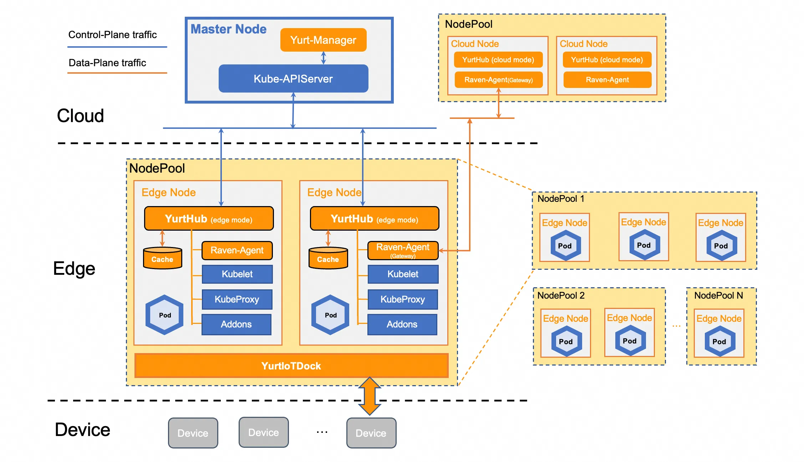

<div align="center">
  
<br/>

[](CHANGELOG.md)
[](https://www.apache.org/licenses/LICENSE-2.0.html)
[](https://goreportcard.com/report/github.com/alibaba/openyurt)
[](https://travis-ci.org/alibaba/openyurt)

</div>

| What is NEW!|
|------------------|
|May 29th, 2020. OpenYurt v0.1.0-beta.1 is **RELEASED**! Please check the [CHANGELOG](CHANGELOG.md) for details.|

OpenYurt is built based on native Kubernetes and targets to extend it to support edge computing seamlessly.
In a nutshell, OpenYurt enables users to manage applications that run in the edge infrastructure as if they were running
in the cloud infrastructure. 

OpenYurt is suitable for common edge computing use cases whose requirements include:
- Minimizing the network traffic over long distances between the devices and the workloads.
- Overcoming the network bandwidth or reliability limitations.
- Processing data remotely to reduce latency.
- Providing a better security model to handle sensitive data.

OpenYurt has the following advantages in terms of compatibility and usability.
- **Kubernetes native**. It provides full Kubernetes API compatibility. All Kubernetes workloads, services, 
  operators, CNI plugins, and CSI plugins are supported.
- **Seamless conversion**. It provides a tool to easily convert a native Kubernetes to be "edge" ready.
  The extra resource and maintenance costs of the OpenYurt components are very low.
- **Node autonomy**. It provides mechanisms to tolerate unstable or disconnected cloud-edge networking.
  The applications run in the edge nodes are not affected even if the nodes are offline. 
- **Cloud platform agnostic**. OpenYurt can be easily deployed in any public cloud Kubernetes services.

## Architecture

OpenYurt follows a classic edge application architecture design - 
a centralized Kubernetes master resides in the cloud site, which
manages multiple edge nodes reside in the edge site. Each edge node has moderate compute resources allowing
running a number of edge applications plus the Kubernetes node daemons. The edge nodes in a cluster can span
multiple physical regions. The terms `region` and `unit` are interchangeable in OpenYurt.
<div align="left">
  
</div>

\
The major OpenYurt components consist of:
- **YurtHub**: A node daemon that serves as a proxy for the outbound traffic from the 
  Kubernetes node daemons (Kubelet, Kubeproxy, CNI plugins and so on). It caches the 
  states of all the resources that the Kubernetes node daemons
  might access in the edge node's local storage. In case the edge node is offline, those daemons can
  recover the states upon node restarts.
- **Yurt controller manager**: It manages a few controllers such as 
  the node controller and the unit controller (to be released) for different edge computing use cases. For example,
  the Pods in the nodes that are in the `autonomy` mode will not be evicted from APIServer even if the 
  node heartbeats are missing.
- **Yurt tunnel server**: It connects with the `TunnelAgent` daemon running in each edge node via a
  reverse proxy to establish a secure network access between the cloud site control plane and the edge nodes 
  that are connected to the intranet (to be released).

## Getting started

OpenYurt supports Kubernetes versions up to 1.16. Using higher Kubernetes versions may cause
compatibility issues.

You can setup the OpenYurt cluster [manually](docs/tutorial/manually-setup.md), but we recommend to start
OpenYurt by using the `yurtctl` command line tool. To quickly build and install `yurtctl`,
assuming the build system has golang 1.13+ and bash installed, you can simply do the following:

```bash
$ git clone https://github.com/alibaba/openyurt.git
$ cd openyurt
$ make WHAT=cmd/yurtctl
```

The `yurtctl` binary can be found at `_output/bin`. To convert an existing Kubernetes cluster to an OpenYurt cluster,
the following simple command line can be used:

```bash
$ _output/bin/yurtctl convert --provider [minikube|ack]
```

To uninstall OpenYurt and revert back to the original Kubernetes cluster settings, you can run the following command:

```bash
$ _output/bin/yurtctl revert
```

Please check [yurtctl tutorial](./docs/tutorial/yurtctl.md) for more details.

## Usage

We provider detailed [**tutorials**](./docs/tutorial/README.md) to demonstrate how to use OpenYurt to manage edge applications.

## Roadmap

- [2020 Q3 roadmap](docs/roadmap.md)

## Contributing

If you are willing to be a contributor for OpenYurt project, please refer to our [CONTRIBUTING](CONTRIBUTING.md) document for details.
We have also prepared a developer [guide](./docs/developer-guide.md) to help the code contributors.

## Community

If you have any questions or want to contribute, you are welcome to communicate most things via GitHub issues or pull requests.
Other active communication channels:

- Mailing List: openyurt@googlegroups.com
- Dingtalk Group (钉钉讨论群)

<div align="left">
  
</div>

## License

OpenYurt is under the Apache 2.0 license. See the [LICENSE](LICENSE) file for details.
Certain implementations in OpenYurt rely on the existing code from Kubernetes and the credits go to the original Kubernetes authors.
