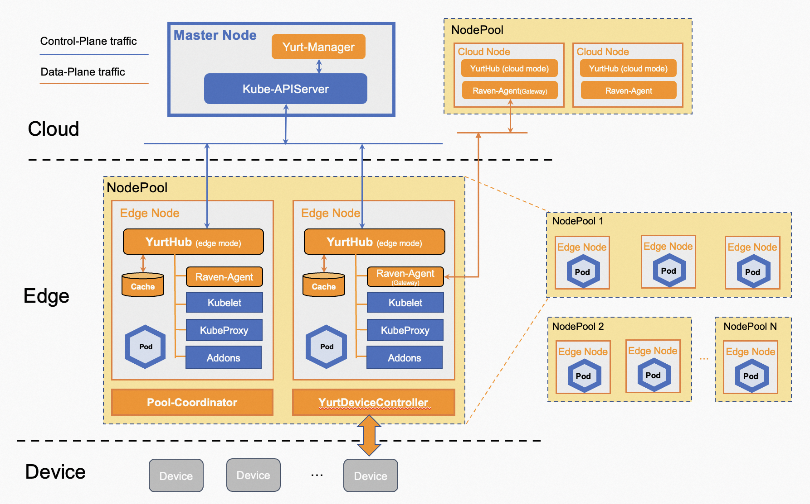

# openyurtio/openyurt

<div align="center">

<br/>

[](CHANGELOG.md)
[](https://www.apache.org/licenses/LICENSE-2.0.html)
[](https://goreportcard.com/report/github.com/openyurtio/openyurt)

</div>

English | [简体中文](./README.zh.md)

| What is NEW!|
|------------------|
|Latest Release: September 26th, 2021. OpenYurt v0.5.0. Please check the [CHANGELOG](CHANGELOG.md) for details.|
|First Release: May 29th, 2020. OpenYurt v0.1.0-beta.1 |

[OpenYurt](https://openyurt.io>) is built based on upstream Kubernetes and now hosted by the Cloud Native Computing Foundation(CNCF) as a [Sandbox Level Project](https://www.cncf.io/sandbox-projects/).

<div align="left">
  
</div>

OpenYurt has been designed to meet various DevOps requirements against typical edge infrastructures.
It provides the same user experience for managing the edge applications as if they were running in the cloud infrastructure.
It addresses specific challenges for cloud-edge orchestration in Kubernetes such as unreliable or disconnected cloud-edge networking,
edge node autonomy, edge device management, region-aware deployment and so on. OpenYurt preserves intact Kubernetes API compatibility,
is vendor agnostic, and more importantly, is **SIMPLE** to use.

## Architecture

OpenYurt follows a classic cloud-edge architecture design.
It uses a centralized Kubernetes control plane residing in the cloud site to
manage multiple edge nodes residing in the edge sites. Each edge node has moderate compute resources available in order to
run edge applications plus the required OpenYurt components. The edge nodes in a cluster can span
multiple physical regions, which are referred to as `Pools` in OpenYurt.
<div align="left">
  
</div>

\
The above figure demonstrates the core OpenYurt architecture. The major components consist of:
- **YurtHub**: A node daemon that serves as a proxy for the outbound traffic from typical
  Kubernetes node daemons such as Kubelet, Kubeproxy, CNI plugins and so on. It caches the
  states of all the API resources that they might access in the edge node's local storage.
  In case the edge node is disconnected to the cloud, YurtHub can recover the states when the node restarts.
- **Yurt controller manager**: It supplements the upstream node controller to support edge computing requirements. For example,
  Pods in the nodes that are in the `autonomy` mode will not be evicted from APIServer even if the
  node heartbeats are missing.
- **Yurt app manager**: It manages two CRD resources introduced in OpenYurt: [NodePool](docs/enhancements/20201211-nodepool_uniteddeployment.md)
  and [YurtAppSet](docs/enhancements/20201211-nodepool_uniteddeployment.md) (previous UnitedDeployment). The former provides a convenient
  management for a pool of nodes within the same region or site. The latter defines a pool based application management workload.
- **Yurt tunnel (server/agent)**: `TunnelServer` connects with the `TunnelAgent` daemon running in each edge node via a
  reverse proxy to establish a secure network access between the cloud site control plane and the edge nodes
  that are connected to the intranet.

In addition, OpenYurt also includes auxiliary controllers for integration and customization purposes.
- **Node resource manager**: It manages additional edge node resources such as LVM, QuotaPath and Persistent Memory.
  Please refer to [node-resource-manager](https://github.com/openyurtio/node-resource-manager) repo for more details.
- **Integrating EdgeX Foundry platform and uses Kubernetes CRD to manage edge devices!**
<table>
<tr style="border:none">
<td style="width:80%;border:none">OpenYurt introduces <a href="https://github.com/openyurtio/yurt-edgex-manager">Yurt-edgex-manager</a> to manage the lifecycle of the EdgeX Foundry software suite, and <a href="https://github.com/openyurtio/yurt-device-controller">Yurt-device-controller</a> to manage edge devices hosted by EdgeX Foundry via Kubernetes custom resources. Please refer to the short <b>demo</b> and the respective repos for more details.
<td style="border:none"><a href="https://youtu.be/ngpkysNzoI0"></a>
</table>

## Prerequisites

Please check the [resource and system requirements](./docs/resource-and-system-requirements.md) before installing OpenYurt.

## Getting started

OpenYurt supports Kubernetes versions up to 1.20. Using higher Kubernetes versions may cause
compatibility issues.

You can setup the OpenYurt cluster [manually](docs/tutorial/manually-setup.md), but we recommend to start
OpenYurt by using the `yurtctl` CLI tool. To quickly build and install `yurtctl`,
assuming the build system has golang 1.13+ and bash installed, you can simply do the following:

```bash
git clone https://github.com/openyurtio/openyurt.git
cd openyurt
make build WHAT=cmd/yurtctl
```

The `yurtctl` binary can be found at `_output/bin`. The commonly used CLI commands include:

```bash
yurtctl convert --provider [minikube|kubeadm|kind]  // To convert an existing Kubernetes cluster to an OpenYurt cluster
yurtctl revert                                      // To uninstall and revert back to the original cluster settings
yurtctl join                                        // To allow a new node to join OpenYurt
yurtctl reset                                       // To revert changes to the node made by the join command
```

Please check [yurtctl tutorial](./docs/tutorial/yurtctl.md) for more details.

## Tutorials

To experience the power of OpenYurt, please try the detailed [tutorials](./docs/tutorial/README.md).

## Roadmap

- [2021 roadmap](docs/roadmap.md)

## Community

### Contributing

If you are willing to be a contributor for the OpenYurt project, please refer to our [CONTRIBUTING](CONTRIBUTING.md) document for details.
We have also prepared a developer [guide](./docs/developer-guide.md) to help the code contributors.

### Meeting

| Item        | Value  |
|---------------------|---|
| APAC Friendly Community meeting | [Bi-weekly APAC (Starting Sep 2, 2020), Wednesday 11:00AM GMT+8](https://calendar.google.com/calendar/u/0?cid=c3VudDRtODc2Y2c3Ymk3anN0ZDdkbHViZzRAZ3JvdXAuY2FsZW5kYXIuZ29vZ2xlLmNvbQ) |
| Meeting link APAC Friendly meeting | https://us02web.zoom.us/j/82828315928?pwd=SVVxek01T2Z0SVYraktCcDV4RmZlUT09 |
| Meeting notes| [Notes and agenda](https://shimo.im/docs/rGK3cXYWYkPrvWp8) |
| Meeting recordings| [OpenYurt bilibili Channel](https://space.bilibili.com/484245424/video) |

### Contact

If you have any questions or want to contribute, you are welcome to communicate most things via GitHub issues or pull requests.
Other active communication channels:

- Mailing List: https://groups.google.com/g/openyurt/
- Slack: [channel](https://join.slack.com/t/openyurt/shared_invite/zt-rc5ecz4h-sEWU1vYx5gzc3_zx3En0jg)
- Dingtalk Group (钉钉讨论群)

<div align="left">
  
</div>

## License

OpenYurt is under the Apache 2.0 license. See the [LICENSE](LICENSE) file for details.
Certain implementations in OpenYurt rely on the existing code from Kubernetes and the credits go to the original Kubernetes authors.
