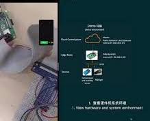

# openyurtio/openyurt

 

English | [简体中文](./README.zh.md)

| What is NEW!|
|------------------|
|Latest Release: Jan 19th, 2023. OpenYurt v1.2.0. Please check the [CHANGELOG](CHANGELOG.md) for details.|
|First Release: May 29th, 2020. OpenYurt v0.1.0-beta.1 |

[OpenYurt](https://openyurt.io) is built based on upstream Kubernetes and now hosted by the Cloud Native Computing Foundation(CNCF) as a [Sandbox Level Project](https://www.cncf.io/sandbox-projects/).

  

OpenYurt has been designed to meet various DevOps requirements against typical edge infrastructures.
It provides the same user experience for managing the edge applications as if they were running in the cloud infrastructure.
It addresses specific challenges for cloud-edge orchestration in Kubernetes such as unreliable or disconnected cloud-edge networking,
edge node autonomy, edge device management, region-aware deployment and so on. OpenYurt preserves intact Kubernetes API compatibility,
is vendor agnostic, and more importantly, is **SIMPLE** to use.

## Architecture

OpenYurt follows a classic cloud-edge architecture design.
It uses a centralized Kubernetes control plane residing in the cloud site to
manage multiple edge nodes residing in the edge sites. Each edge node has moderate compute resources available in order to
run edge applications plus the required OpenYurt components. The edge nodes in a cluster can span
multiple physical regions, which are referred to as `Pools` in OpenYurt.

  

\
The above figure demonstrates the core OpenYurt architecture. The major components consist of:
- **[YurtHub](https://openyurt.io/docs/next/core-concepts/yurthub)**: YurtHub runs on worker nodes as static pod and serve as a node sidecar to handle requests that comes from components(like Kubelet, Kubeproxy and so on) on worker nodes to kube-apiserver.
- **[Yurt Controller Manager](https://openyurt.io/docs/next/core-concepts/yurt-controller-manager)**: It includes several controllers for edge control loops.
  `yurtcsrapprover` controller is used for handling CSRs from OpenYurt components.
  `daemonpodupdater` controller is used for providing OTA and Auto upgrade model for DaemonSet workload.
  `servicetopologycontroller` is used for reconciling endpoints/endpointslices when service or nodepool happen to change.
  `poolcoordinator` controller mainly works with the Pool-Coordinator component to provide users with the ability of edge autonomy (including two modes of node autonomy and node pool autonomy).
- **[Yurt App Manager](https://openyurt.io/docs/next/core-concepts/yurt-app-manager)**: It manages several CRD resources introduced in OpenYurt: [NodePool](docs/enhancements/20201211-nodepool_uniteddeployment.md),
  [YurtAppSet](docs/enhancements/20201211-nodepool_uniteddeployment.md), [YurtAppDaemon](docs/enhancements/20210729-yurtappdaemon.md)
  and [YurtIngress](docs/proposals/20210628-nodepool-ingress-support.md).
  `NodePool` provides a convenient management for a pool of nodes within the same region or site.
  `YurtAppSet` defines a new edge application management methodology of using per NodePool workload.
  `YurtAppDaemon` enables to deploy workload for every matching NodePool.
  `YurtIngress` orchestrates the deployment of multiple ingress controllers to the respective NodePools.
- **[Raven/Raven Controller Manager](https://openyurt.io/docs/next/core-concepts/raven)**: It is focused on edge-edge and edge-cloud communication in OpenYurt. and provide layer 3 network connectivity among pods in different physical regions, as there are in one vanilla Kubernetes cluster.
- **Pool-Coordinator**: One instance of Pool-Coordinator is deployed in every edge NodePool, and in conjunction with YurtHub to provide heartbeat delegation, cloud-edge traffic multiplexing abilities, etc.

In addition, OpenYurt also includes auxiliary controllers for integration and customization purposes.
- **[Node resource manager](https://openyurt.io/docs/next/core-concepts/node-resource-manager)**: It manages additional edge node resources such as LVM, QuotaPath and Persistent Memory.
  Please refer to [node-resource-manager](https://github.com/openyurtio/node-resource-manager) repo for more details.
- **[Integrating EdgeX Foundry platform and uses Kubernetes CRD to manage edge devices!](https://openyurt.io/docs/next/core-concepts/yurt-device-controller/)**
<table>
<tr style="border:none">
<td style="width:80%;border:none">OpenYurt introduces <a href="https://github.com/openyurtio/yurt-edgex-manager">Yurt-edgex-manager</a> to manage the lifecycle of the EdgeX Foundry software suite, and <a href="https://github.com/openyurtio/yurt-device-controller">Yurt-device-controller</a> to manage edge devices hosted by EdgeX Foundry via Kubernetes custom resources. Please refer to the short <b>demo</b> and the respective repos for more details.
<td style="border:none">
</table>

## Prerequisites

Please check the [resource and system requirements](https://github.com/openyurtio/openyurt.io/blob/master/docs/usage-conditions/resource-and-system-requirements.md) before installing OpenYurt.

## Getting started

OpenYurt supports Kubernetes versions up to 1.23. Using higher Kubernetes versions may cause
compatibility issues. OpenYurt installation is divided into two parts:
- [Install OpenYurt Control Plane Components](https://openyurt.io/docs/installation/summary#part-1-install-control-plane-components)
- [Join Nodes](https://openyurt.io/docs/installation/summary#part-2-join-nodes)

## Tutorials

To experience the power of OpenYurt, please try the detailed [tutorials](https://openyurt.io/docs/next/).

## Roadmap

- [OpenYurt Roadmap](docs/roadmap.md)

## Community

### Contributing

If you are willing to be a contributor for the OpenYurt project, please refer to our [CONTRIBUTING](CONTRIBUTING.md) document for details.
We have also prepared a developer [guide](https://openyurt.io/docs/developer-manuals/how-to-contribute) to help the code contributors.

### Meeting

| Item        | Value  |
|---------------------|---|
| APAC Friendly Community meeting | [Adjust to weekly APAC (Starting May 11, 2022), Wednesday 11:00AM GMT+8](https://calendar.google.com/calendar/u/0?cid=c3VudDRtODc2Y2c3Ymk3anN0ZDdkbHViZzRAZ3JvdXAuY2FsZW5kYXIuZ29vZ2xlLmNvbQ) |
| Meeting link APAC Friendly meeting | https://us02web.zoom.us/j/82828315928?pwd=SVVxek01T2Z0SVYraktCcDV4RmZlUT09 |
| Meeting notes| [Notes and agenda](https://shimo.im/docs/rGK3cXYWYkPrvWp8) |
| Meeting recordings| [OpenYurt bilibili Channel](https://space.bilibili.com/484245424/video) |

### Contact

If you have any questions or want to contribute, you are welcome to communicate most things via GitHub issues or pull requests.
Other active communication channels:

- Mailing List: https://groups.google.com/g/openyurt/
- Slack: [channel](https://join.slack.com/t/openyurt/shared_invite/zt-1na15xup2-kCl_AzzsU256RlNJroKtMA)
- DingTalk: Now no slots in Community Group1(GroupID 31993519), please join Community Group2  (Chinese)

  

## License

OpenYurt is under the Apache 2.0 license. See the [LICENSE](LICENSE) file for details.
Certain implementations in OpenYurt rely on the existing code from Kubernetes and the credits go to the original Kubernetes authors.
