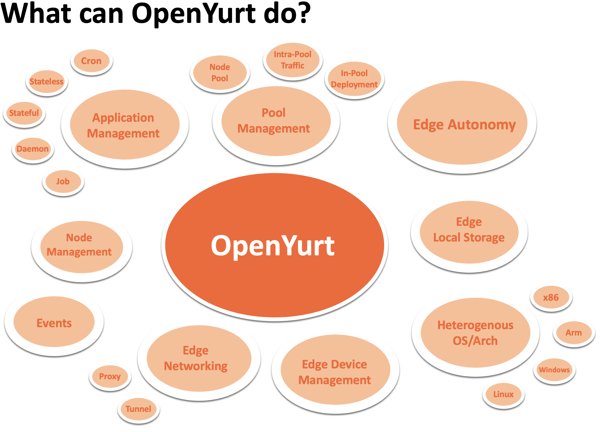

# openyurtio/openyurt

 

[English](./README.md) | 简体中文

|  What is NEW!            |
|--------------------------------------------------------------------------|
| 最新发布：2023-11-08 OpenYurt v1.4.0 请查看 [CHANGELOG](CHANGELOG.md) 来获得更多更新细节. |
| 第一个发布：2020-05-29 OpenYurt v0.1.0-beta.1                                  |

OpenYurt (官网: https://openyurt.io) 是基于 Upstream Kubernetes 构建的，现在是托管在云原生基金会(CNCF) 下的 [沙箱项目](https://www.cncf.io/sandbox-projects/).

  

OpenYurt 是为满足典型边缘基础设施的各种 DevOps 需求而设计的。
通过 OpenYurt 来管理边缘应用程序，用户可以获得与中心式云计算应用管理一致的用户体验。
它解决了 Kubernetes 在云边一体化场景下的诸多挑战，如不可靠或断开的云边缘网络、边缘节点自治、边缘设备管理、跨地域业务部署等。
OpenYurt 保持了完整的 Kubernetes API 兼容性，无厂商绑定，更重要的是，它使用简单。

## 架构

OpenYurt 遵循经典的云边一体化架构。
集群的 Kubernetes 管控面部署在云端(或者中心机房中)，而由集群管理的边缘节点位于靠近数据源的边缘站点中。
每个边缘节点都具有适量的计算资源，从而可以运行边缘应用以及 OpenYurt 系统组件。集群中的边缘节点可以分布在多个物理区域，这些物理区域在 OpenYurt 中称为 Pools。
集群中的边缘节点可以分处于在多个物理区域中（region）。

  

上图展示了 OpenYurt 的核心架构。OpenYurt 的主要组件包括：

- **[YurtHub](https://openyurt.io/zh/docs/next/core-concepts/yurthub/)**：YurtHub 以静态 pod 模式在工作节点上运行，它作为节点的 Sidecar 处理所有来自工作节点上的组件(如 Kubelet, Kubeproxy 等)到 kube-apiserver 的请求。
- **[Yurt-Manager](https://github.com/openyurtio/openyurt/tree/master/cmd/yurt-manager)**：包括所有云边协同场景下的Controllers和Webhooks。
- **[Raven-Agent](https://openyurt.io/docs/next/core-concepts/raven)**: 它用于处理 OpenYurt 中的云边，边边间的跨公网通信。 主要在不同物理区域的 pod 之间提供第 3 层网络连接，就像在一个 vanilla Kubernetes 集群中一样。
- **Yurt-Coordinator(Optional)**：该组件安装会在每个边缘 NodePool 中会自动部署一个 Yurt-Coordinator 实例，它联合 YurtHub 为节点池提供心跳代理、云边缘流量复用等能力。
- **[YurtIoTDock(Optional)](https://openyurt.io/docs/next/core-concepts/yurt-iot-dock)**: 用户通过创建PlatformAdmin资源在指定节点池中安装YurtIoTDock, 它将连接EdgeX Foundry系统为用户提供云原生的边缘设备管理能力。

此外，OpenYurt 还包括用于集成和定制的辅助控制器。

- **[Node resource manager](https://openyurt.io/zh/docs/next/core-concepts/node-resource-manager)**: 统一管理 OpenYurt 集群的本地节点资源。 目前支持管理 LVM、QuotaPath 和 Pmem 内存。
  详情请参考[node-resource-manager](https://github.com/openyurtio/node-resource-manager)。

## 开始使用

OpenYurt 支持最高版本为 1.23 的 Kubernetes 。使用更高版本的 Kubernetes 可能会导致兼容性问题。

OpenYurt 集群安装分成 2 个部分，分别为安装 OpenYurt 管控组件和节点接入。

- [安装 OpenYurt 管控组件](https://openyurt.io/zh/docs/installation/summary/#part-1-%E5%AE%89%E8%A3%85openyurt%E7%AE%A1%E6%8E%A7%E7%BB%84%E4%BB%B6)
- [节点接入](https://openyurt.io/zh/docs/installation/summary/#part-2-%E8%8A%82%E7%82%B9%E6%8E%A5%E5%85%A5)

## 发展规划

[OpenYurt 发展规划](https://github.com/openyurtio/community/blob/main/roadmap.md)

## 社区

### 贡献

如果您愿意为 OpenYurt 项目做贡献，请参阅我们的 [CONTRIBUTING](CONTRIBUTING.md) 文档以获取详细信息。我们还准备了[开发人员指南](https://openyurt.io/docs/developer-manuals/how-to-contribute)来帮助代码贡献者。

### 周会

| Item     | Value                                                                                                                                                                                          |
| -------- | ---------------------------------------------------------------------------------------------------------------------------------------------------------------------------------------------- |
| 社区会议 | [从 2022.5.11 开始从双周会调整为周会，周三上午 11:00 ～ 12：00(北京时间)](https://calendar.google.com/calendar/u/0?cid=c3VudDRtODc2Y2c3Ymk3anN0ZDdkbHViZzRAZ3JvdXAuY2FsZW5kYXIuZ29vZ2xlLmNvbQ) |
| 会议链接 | https://us02web.zoom.us/j/82828315928?pwd=SVVxek01T2Z0SVYraktCcDV4RmZlUT09                                                                                                                     |
| 会议纪要 | [会议议程及纪要](https://www.yuque.com/rambohech/intck9/yolxrybw2rofcab7)                                                                                                                                       |
| 会议视频 | [B 站 OpenYurt](https://space.bilibili.com/484245424/video)                                                                                                                                    |

### 联络方式

如果您对本项目有任何疑问或想做出贡献，欢迎通过 github issue 或 pull request 来沟通相关问题，其他有效的沟通渠道如下所示：

- 邮件组: https://groups.google.com/g/openyurt/
- Slack: [OpenYurt channel](https://join.slack.com/t/openyurt/shared_invite/zt-25tm2q1dz-Jn6y4r7W4JigWc0Sx2jDzg) (_English_)
- DingTalk: 搜索群 ID `12640034121` (_Chinese_)

  

## 许可证

OpenYurt 遵循 Apache 2.0 许可证。有关详细信息请参见 [LICENSE](LICENSE) 文件。 OpenYurt 中的某些特定实现是基于 Kubernetes 的现有代码，这些实现都应归功于 Kubernetes 相关代码的原作者。
