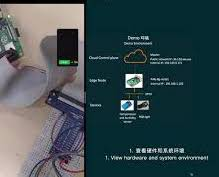

# openyurtio/openyurt

 

[English](./README.md) | 简体中文

| What is NEW!|
|------------------|
| 最新发布：2023-01-19  OpenYurt v1.2.0 请查看 [CHANGELOG](CHANGELOG.md) 来获得更多更新细节.|
| 第一个发布：2020-05-29 OpenYurt v0.1.0-beta.1 |

OpenYurt (官网: https://openyurt.io) 是基于Upstream Kubernetes构建的，现在是托管在云原生基金会(CNCF) 下的 [沙箱项目](https://www.cncf.io/sandbox-projects/).

  

OpenYurt是为满足典型边缘基础设施的各种DevOps需求而设计的。
通过OpenYurt来管理边缘应用程序，用户可以获得与中心式云计算应用管理一致的用户体验。
它解决了Kubernetes在云边一体化场景下的诸多挑战，如不可靠或断开的云边缘网络、边缘节点自治、边缘设备管理、跨地域业务部署等。
OpenYurt保持了完整的Kubernetes API兼容性，无厂商绑定，更重要的是，它使用简单。

## 架构

OpenYurt 遵循经典的云边一体化架构。
集群的Kubernetes管控面部署在云端(或者中心机房中)，而由集群管理的边缘节点位于靠近数据源的边缘站点中。
每个边缘节点都具有适量的计算资源，从而可以运行边缘应用以及OpenYurt系统组件。集群中的边缘节点可以分布在多个物理区域，这些物理区域在OpenYurt中称为Pools。
集群中的边缘节点可以分处于在多个物理区域中（region）。

  

上图展示了OpenYurt的核心架构。OpenYurt 的主要组件包括：
- **[YurtHub](https://openyurt.io/zh/docs/next/core-concepts/yurthub/)**：YurtHub以静态pod模式在工作节点上运行，它作为节点的Sidecar处理所有来自工作节点上的组件(如Kubelet, Kubeproxy等)到kube-apiserver的请求。
- **[Yurt Controller Manager](https://openyurt.io/zh/docs/next/core-concepts/yurt-controller-manager)**：目前包括如下控制器。
  `yurtcsrapprover` 控制器用于处理来自OpenYurt组件的TLS证书申请
  `daemonpodupdater` 控制器主要为DaemonSet工作负载提供OTA和Auto两种新型升级模型
  `servicetopologycontroller` 控制器主要用于配合Yurthub中的服务拓扑流量路由功能，实时响应Service和NodePool的变化
  `poolcoordinator` 控制器主要配合Pool-Coordinator组件一起工作，为用户提供边缘自治(包括节点自治和节点池自治两种模式)的能力.
- **[Yurt App Manager](https://openyurt.io/zh/docs/next/core-concepts/yurt-app-manager)**：它管理OpenYurt中引入的四个CRD资源:[NodePool](docs/enhancements/20201211-nodepool_uniteddeployment.md)，[YurtAppSet](docs/enhancements/20201211-nodepool_uniteddeployment.md)(以前的UnitedDeployment)，[YurtAppDaemon](docs/enhancements/20210729-yurtappdaemon.md)， [YurtIngress](docs/proposals/20210628-nodepool-ingress-support.md)。
`NodePool`为同一区域或站点内的节点资源提供了方便的管理。`YurtAppSet`定义了一个基于节点池维度的工作负载管理模型。`YurtAppDaemon`从节点池维度提供一种类似K8s DaemonSet的工作负载管理模型。`YurtIngress`负责将Ingress Controller部署到用户指定的节点池。
- **[Raven/Raven Controller Manager](https://openyurt.io/docs/next/core-concepts/raven)**: 它用于处理OpenYurt中的云边，边边间的跨公网通信。 主要在不同物理区域的pod之间提供第3层网络连接，就像在一个vanilla Kubernetes集群中一样。
- **Pool-Coordinator**：每个边缘NodePool中会自动部署一个Pool-Coordinator实例，它联合YurtHub为节点池提供心跳代理、云边缘流量复用等能力。

此外，OpenYurt还包括用于集成和定制的辅助控制器。

- **[Node resource manager](https://openyurt.io/zh/docs/next/core-concepts/node-resource-manager)**: 统一管理OpenYurt集群的本地节点资源。 目前支持管理LVM、QuotaPath和Pmem内存。
  详情请参考[node-resource-manager](https://github.com/openyurtio/node-resource-manager)。
- **[集成EdgeX Foundry平台，使用Kubernetes CRD管理边缘设备!](https://openyurt.io/zh/docs/next/core-concepts/yurt-device-controller)**
<table>
<tr style="border:none">
<td style="width:80%;border:none">OpenYurt 引入了 <a href="https://github.com/openyurtio/yurt-edgex-manager">Yurt-edgex-manager</a> 来管理EdgeX Foundry软件套件的生命周期，并通过Kubernetes自定义资源引入 <a href="https://github.com/openyurtio/yurt-device-controller">Yurt-device-controller</a> 来管理EdgeX Foundry托管的边缘设备。详情请参阅简短的 <b>demo</b> 演示和有关组件的repo。
<td style="border:none">
</table>

## 开始之前

安装OpenYurt前，请检查[资源和系统要求](https://github.com/openyurtio/openyurt.io/blob/master/i18n/zh/docusaurus-plugin-content-docs/current/usage-conditions/resource-and-system-requirements.md)

## 开始使用
OpenYurt 支持最高版本为1.23的 Kubernetes 。使用更高版本的 Kubernetes 可能会导致兼容性问题。

OpenYurt集群安装分成2个部分，分别为安装OpenYurt管控组件和节点接入。
- [安装OpenYurt管控组件](https://openyurt.io/zh/docs/installation/summary/#part-1-%E5%AE%89%E8%A3%85openyurt%E7%AE%A1%E6%8E%A7%E7%BB%84%E4%BB%B6)
- [节点接入](https://openyurt.io/zh/docs/installation/summary/#part-2-%E8%8A%82%E7%82%B9%E6%8E%A5%E5%85%A5)

## 使用方法
OpenYurt官网提供详细的[教程](https://openyurt.io/docs/next/)来演示如何使用 OpenYurt。

## 发展规划
[OpenYurt 发展规划](docs/roadmap.md)

## 社区
### 贡献
如果您愿意为 OpenYurt 项目做贡献，请参阅我们的 [CONTRIBUTING](CONTRIBUTING.md) 文档以获取详细信息。我们还准备了[开发人员指南](https://openyurt.io/docs/developer-manuals/how-to-contribute)来帮助代码贡献者。

### 周会

| Item        | Value  |
|---------------------|---|
| 社区会议 | [从2022.5.11开始从双周会调整为周会，周三上午11:00～12：00(北京时间)](https://calendar.google.com/calendar/u/0?cid=c3VudDRtODc2Y2c3Ymk3anN0ZDdkbHViZzRAZ3JvdXAuY2FsZW5kYXIuZ29vZ2xlLmNvbQ) |
| 会议链接 | https://us02web.zoom.us/j/82828315928?pwd=SVVxek01T2Z0SVYraktCcDV4RmZlUT09 |
| 会议纪要| [会议议程及纪要](https://shimo.im/docs/rGK3cXYWYkPrvWp8) |
| 会议视频| [B站 OpenYurt](https://space.bilibili.com/484245424/video) |

### 联络方式
如果您对本项目有任何疑问或想做出贡献，欢迎通过 github issue 或 pull request 来沟通相关问题，其他有效的沟通渠道如下所示：

- 邮件组: https://groups.google.com/g/openyurt/
- Slack: [channel](https://join.slack.com/t/openyurt/shared_invite/zt-1na15xup2-kCl_AzzsU256RlNJroKtMA)
- DingTalk: 社区1群(ID 31993519)已满，请加入2群 (Chinese)

  

## 许可证
OpenYurt 遵循 Apache 2.0许可证。有关详细信息请参见 [LICENSE](LICENSE) 文件。 OpenYurt 中的某些特定实现是基于 Kubernetes 的现有代码，这些实现都应归功于Kubernetes相关代码的原作者。
