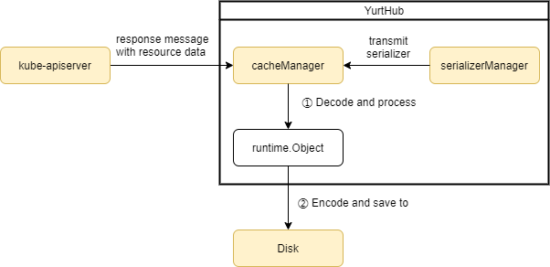
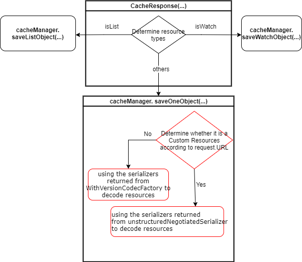
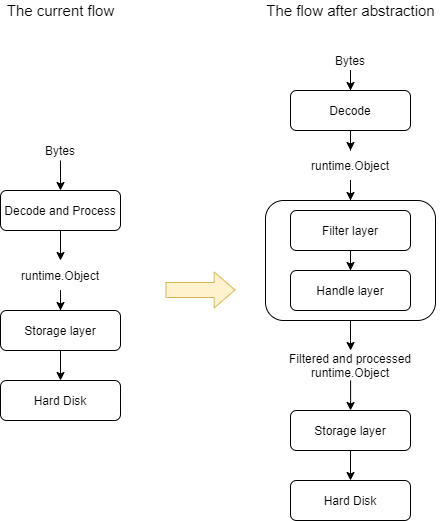

# Proposal to enhance the caching ability of YurtHub

## Table of Contents

- [Title](#title)
  - [Table of Contents](#table-of-contents)
  - [Summary](#summary)
  - [Motivation](#motivation)
    - [Goals](#goals)
  - [Description of Yurthub's existing cache ability](#description-of-Yurthub's-existing-cache-ability)
    - [serializerManager](#serializerManager)
      - [Problem One](#problem-one)
    - [cacheManager](#cacheManager)
      - [Problem Two](#problem-two)
      - [Problem Three](#problem-three)
  - [Proposal](#proposal)
    - [1. Delete resourceToKindMap and resourceToListKindMap](#1-delete-resourceToKindMap-and-resourceToListKindMap)
      - [1.1 Design detail](#1.1-design-detail)
    - [2. Decode the unregistered Custom Resources into Unstructured structure](#2-decode-the-unregistered-Custom-Resources-into-Unstructured-structure)
      - [2.1 Design detail](#2.1-design-detail)
        - [Add unstructuredNegotiatedSerializer](#add-unstructuredNegotiatedSerializer)
        - [Determine the resource type based on request.URL and select the appropriate serializer](#determine-the-resource-type-based-on-request.URL-and-select-the-appropriate-serializer)
    - [3. Abstract the logic of processing objects into a separate processing layer](#3-Abstract-the-logic-of-processing-objects-into-a-separate-processing-layer)
      - [3.1 Design detail](#3.1-design-detail)
  - [Implementation History](#implementation-history)

## Summary

YurtHub can currently only cache resources defined in  [resourceToKindMap](https://github.com/openyurtio/openyurt/blob/4d7463a40801c29d09c4f7d10ba46b73cb019915/pkg/yurthub/cachemanager/cache_manager.go#L46) and [resourceToListKindMap](https://github.com/openyurtio/openyurt/blob/4d7463a40801c29d09c4f7d10ba46b73cb019915/pkg/yurthub/cachemanager/cache_manager.go#L62). This proposal mainly tries to put forward and realize a set of scheme, so that YurtHub is no longer limited by resource types, and Custom Resources can be cached.

## Motivation

When network between cloud and edge disconnected, if any pod(eg: calico) on the edge node that used some resources(like crd) not in the above map want to run continuously, that is to say, the pod can not restarted successfully because resources(like crd) are not cached by yurt-hub.

### Goals

- To remove the restriction that yurthub can only cache certain resources;
- To support decoding Custom Resources that are not registered in the scheme as `Unstructured` structures;
- To improve the scalability  of YurtHub by abstracting the logic of processing objects into a separate processing layer;

## Description of Yurthub's existing cache ability

This section briefly describes how Yurthub receives and caches response with resources from Kube-apiserver, mainly involving the CacheManager and SerializerManager modules. Yurthub caches resources, which roughly requires two steps:



**Step 1:** Decode the byte stream contained in `Response.Body` into `Runtime.Object` type in memory, so that YurtHub can operate the Object;

**Step 2:** Encode the runtime.Object type into the corresponding byte stream and save it to the hard disk.

The limitations of the existing caching ability in YurtHub are mainly in the first step: One is the limitation of [resourceToKindMap](https://github.com/openyurtio/openyurt/blob/4d7463a40801c29d09c4f7d10ba46b73cb019915/pkg/yurthub/cachemanager/cache_manager.go#L46) and [resourceToListKindMap](https://github.com/openyurtio/openyurt/blob/4d7463a40801c29d09c4f7d10ba46b73cb019915/pkg/yurthub/cachemanager/cache_manager.go#L62); The second is the lack of a serializer to decode and encode Custom Resources.

### serializerManager

SerializerManager is used to manage the serializers that decode and encode K8S resources. When SerializerManager is initialized, the structure of the built-in resources in the Client-Go library is registered in the scheme, such as the Pod structure example:

```go
type Pod struct {
   metav1.TypeMeta `json:",inline"`
   metav1.ObjectMeta `json:"metadata,omitempty" protobuf:"bytes,1,opt,name=metadata"`
   Spec PodSpec `json:"spec,omitempty" protobuf:"bytes,2,opt,name=spec"`
   Status PodStatus `json:"status,omitempty" protobuf:"bytes,3,opt,name=status"`
}
```

Currently Yurthub can only encode and decode resources under [these paths](https://github.com/kubernetes/client-go/blob/master/kubernetes/scheme/register.go):

```go
admissionregistrationv1 "k8s.io/api/admissionregistration/v1"
admissionregistrationv1beta1 "k8s.io/api/admissionregistration/v1beta1"
appsv1 "k8s.io/api/apps/v1"
appsv1beta1 "k8s.io/api/apps/v1beta1"
appsv1beta2 "k8s.io/api/apps/v1beta2"
auditregistrationv1alpha1 "k8s.io/api/auditregistration/v1alpha1"
authenticationv1 "k8s.io/api/authentication/v1"
authenticationv1beta1 "k8s.io/api/authentication/v1beta1"
authorizationv1 "k8s.io/api/authorization/v1"
authorizationv1beta1 "k8s.io/api/authorization/v1beta1"
autoscalingv1 "k8s.io/api/autoscaling/v1"
autoscalingv2beta1 "k8s.io/api/autoscaling/v2beta1"
autoscalingv2beta2 "k8s.io/api/autoscaling/v2beta2"
batchv1 "k8s.io/api/batch/v1"
batchv1beta1 "k8s.io/api/batch/v1beta1"
batchv2alpha1 "k8s.io/api/batch/v2alpha1"
certificatesv1beta1 "k8s.io/api/certificates/v1beta1"
coordinationv1 "k8s.io/api/coordination/v1"
coordinationv1beta1 "k8s.io/api/coordination/v1beta1"
corev1 "k8s.io/api/core/v1"
discoveryv1alpha1 "k8s.io/api/discovery/v1alpha1"
eventsv1beta1 "k8s.io/api/events/v1beta1"
extensionsv1beta1 "k8s.io/api/extensions/v1beta1"
networkingv1 "k8s.io/api/networking/v1"
networkingv1beta1 "k8s.io/api/networking/v1beta1"
nodev1alpha1 "k8s.io/api/node/v1alpha1"
nodev1beta1 "k8s.io/api/node/v1beta1"
policyv1beta1 "k8s.io/api/policy/v1beta1"
rbacv1 "k8s.io/api/rbac/v1"
rbacv1alpha1 "k8s.io/api/rbac/v1alpha1"
rbacv1beta1 "k8s.io/api/rbac/v1beta1"
schedulingv1 "k8s.io/api/scheduling/v1"
schedulingv1alpha1 "k8s.io/api/scheduling/v1alpha1"
schedulingv1beta1 "k8s.io/api/scheduling/v1beta1"
settingsv1alpha1 "k8s.io/api/settings/v1alpha1"
storagev1 "k8s.io/api/storage/v1"
storagev1alpha1 "k8s.io/api/storage/v1alpha1"
storagev1beta1 "k8s.io/api/storage/v1beta1"
v1 "k8s.io/apimachinery/pkg/apis/meta/v1"
runtime "k8s.io/apimachinery/pkg/runtime"
schema "k8s.io/apimachinery/pkg/runtime/schema"
serializer "k8s.io/apimachinery/pkg/runtime/serializer"
utilruntime "k8s.io/apimachinery/pkg/util/runtime"
```

#### Problem One

Because scheme currently only saves the above fixed resources' structures, when YurtHub receives Custom Resources returned from kube-apiserver, it cannot find the corresponding GO type structure to decode Custom Resources.

### cacheManager

CacheManager provides methods for managing resources cached on edge nodes, which are divided into three main functions:

- Determining whether the response message needs to be cached
- The resource byte stream from Kube-apiserver is decoded into `runtime.Object` and stored in memory. When the YurtHub operation is completed, the object is converted to a byte stream and stored on the hard disk

- When cloud-edge communication is unhealthy, edge nodes use `QueryCache(...)` to find resources cached locally.

```go
// CacheManager is an adaptor to cache runtime object data into backend storage
type CacheManager interface {
	CacheResponse(req *http.Request, prc io.ReadCloser, stopCh <-chan struct{}) error
	QueryCache(req *http.Request) (runtime.Object, error)
	UpdateCacheAgents(agents []string) error
	ListCacheAgents() []string
	CanCacheFor(req *http.Request) bool
}
```

#### Problem Two

Since the serializer currently used by YurtHub will lose GVK information when decoding resource objects. So we need to [resourceToKindMap](https://github.com/openyurtio/openyurt/blob/4d7463a40801c29d09c4f7d10ba46b73cb019915/pkg/yurthub/cachemanager/cache_manager.go#L46) and [resourceToListKindMap](https://github.com/openyurtio/openyurt/blob/4d7463a40801c29d09c4f7d10ba46b73cb019915/pkg/yurthub/cachemanager/cache_manager.go#L62) to obtain the corresponding kind information according to resource name. These two maps have been used in the following three main functions:

- `CanCacheFor(req *http.Request)` function uses a resourceToKindMap to determine if the response message needs to be cached;

- `SaveOneObject(...)`, `SaveListObject(...)` and `SaveWatchObject(...)` use resourceToKindMap to obtain the kind information corresponding to the resource name, which is used to cache the response message;

  Because the resolved object does not contain GVK information. But when caching objects, GVK information needs to be set. The above two maps pre-store some resource-to-kind mappings, which can be used to cache resources and retrieve the corresponding kind based on the resource name in the request.URL .

- The `queryListObject(...)` function uses the resourceToListKindMap member to query the List object

##### Why the decoding process loses GVK information

Currently, yurthub use [serializer.WithoutConversionCodecFactory](https://github.com/alibaba/openyurt/blob/7095962687e2666a27d14e436b96ef893b228beb/pkg/yurthub/kubernetes/serializer/serializer.go#L48) as NegotiatedSerializer generated serializers for different formats of byte streams (json, yaml or protobuf). It will explicitly ignore requests to perform conversion. When decoding, it parses the group and version information from the byte stream, directly decoding the resource into its original version.

According to the source code analysis, the resource's GVK information is erased when decoded using the serializer generated by `WithoutConversionCodecFactory`. Here is the actual [decoder code](https://github.com/kubernetes/kubernetes/blob/994b5c6cc20bda188ac9bc33217f2dbc7ecf45bb/staging/src/k8s.io/apimachinery/pkg/runtime/helper.go#L256) that is invoked:

```go
// Decode does not do conversion. It removes the gvk during deserialization.
func (d WithoutVersionDecoder) Decode(data []byte, defaults *schema.GroupVersionKind, into Object) (Object, *schema.GroupVersionKind, error) {
	obj, gvk, err := d.Decoder.Decode(data, defaults, into)
	if obj != nil {
		kind := obj.GetObjectKind()
		// clearing the gvk is just a convention of a codec
		kind.SetGroupVersionKind(schema.GroupVersionKind{})
	}
	return obj, gvk, err
}
```

Due to the above limitations, Yurthub can only cache resources defined in [resourceToKindMap](https://github.com/openyurtio/openyurt/blob/4d7463a40801c29d09c4f7d10ba46b73cb019915/pkg/yurthub/cachemanager/cache_manager.go#L46) and  [resourceToListKindMap](https://github.com/openyurtio/openyurt/blob/4d7463a40801c29d09c4f7d10ba46b73cb019915/pkg/yurthub/cachemanager/cache_manager.go#L62).

#### Problem Three

Yurthub combines the byte stream decoding and object processing logic together, resulting in a high level of coupling and some code redundancy. For example, all  the `SaveOneObject (...)`, `SaveListObject(...)` and `SaveWatchObject(...)` need to set the object's GVK information:

```go
func (cm *cacheManager) saveWatchObject(ctx context.Context, info *apirequest.RequestInfo, r io.ReadCloser, stopCh <-chan struct{}) error {
	//......
    accessor.SetAPIVersion(obj, apiVersion)
	accessor.SetKind(obj, kind)
	//......
}
```

```go
func (cm *cacheManager) saveListObject(ctx context.Context, info *apirequest.RequestInfo, b []byte) error {
	//......
	accessor.SetKind(items[i], kind)
	accessor.SetAPIVersion(items[i], apiVersion)
	//......
}
```

```go
func (cm *cacheManager) saveOneObject(ctx context.Context, info *apirequest.RequestInfo, b []byte) error {
    //......
	accessor.SetKind(obj, kind)
	accessor.SetAPIVersion(obj, apiVersion)
    //......
}
```

## Proposal

### 1. Delete [resourceToKindMap](https://github.com/openyurtio/openyurt/blob/4d7463a40801c29d09c4f7d10ba46b73cb019915/pkg/yurthub/cachemanager/cache_manager.go#L46) and [resourceToListKindMap](https://github.com/openyurtio/openyurt/blob/4d7463a40801c29d09c4f7d10ba46b73cb019915/pkg/yurthub/cachemanager/cache_manager.go#L62)

Remove the restriction that only certain resources can be cached by removing [resourceToKindMap](https://github.com/openyurtio/openyurt/blob/4d7463a40801c29d09c4f7d10ba46b73cb019915/pkg/yurthub/cachemanager/cache_manager.go#L46) and [resourceToListKindMap](https://github.com/openyurtio/openyurt/blob/4d7463a40801c29d09c4f7d10ba46b73cb019915/pkg/yurthub/cachemanager/cache_manager.go#L62). Removing the above restriction requires solving the problem which is preserving the original GVK information while decoding the corresponding resources;

#### 1.1 Design detail

Define a new `WithVersionCodecFactory` replace the [serializer.WithoutConversionCodecFactory](https://github.com/alibaba/openyurt/blob/7095962687e2666a27d14e436b96ef893b228beb/pkg/yurthub/kubernetes/serializer/serializer.go#L48) as a negotiatedSerializer, which can retain GVK information while decoding resources. Here is part of the WithVersionCodecFactory code

```go
// WithVersionCodecFactory is a CodecFactory that will explicitly ignore requests to perform conversion.
// It keeps the gvk during deserialization.
// This wrapper is used while code migrates away from using conversion (such as external clients)
type WithVersionCodecFactory struct {
	serializer.CodecFactory
}

// DecoderToVersion returns an decoder that does not do conversion, and keeps the gvk information
func (f WithVersionCodecFactory) DecoderToVersion(serializer runtime.Decoder, _ runtime.GroupVersioner) runtime.Decoder {
	//return versioning.NewDefaultingCodecForScheme(s.scheme, nil, decoder, nil, gv)
	return WithVersionDecoder{
		Decoder: serializer,
	}
}

// WithVersionDecoder keeps the group version kind of a deserialized object.
type WithVersionDecoder struct {
	runtime.Decoder
}

// Decode does not do conversion. It keeps the gvk during deserialization.
func (d WithVersionDecoder) Decode(data []byte, defaults *schema.GroupVersionKind, into runtime.Object) (runtime.Object, *schema.GroupVersionKind, error) {
	obj, gvk, err := d.Decoder.Decode(data, defaults, into)
	return obj, gvk, err
}
```

### 2. Decode the unregistered Custom Resources into `Unstructured` structure

Unstructured allows objects that do not have Golang structs registered to be manipulated generically. This can be used to deal with the API objects from a plug-in.

```go
//Unstructured objects still have functioning TypeMeta features-- kind, version, etc.
type Unstructured struct {
   // Object is a JSON compatible map with string, float, int, bool, []interface{}, or
   // map[string]interface{}
   // children.
   Object map[string]interface{}
}
```

#### 2.1 Design detail

##### Add unstructuredNegotiatedSerializer

On the basis of the existing NegotiatedSerializer increase a new unstructuredNegotiatedSerializer, used to decode the structure of the unregistered Custom Resources.

```go
type unstructuredNegotiatedSerializer struct {
	scheme  *runtime.Scheme
	typer   runtime.ObjectTyper
	creator runtime.ObjectCreater
}

// SerializerManager is responsible for managing *rest.Serializers
type SerializerManager struct {
	// NegotiatedSerializer is used for obtaining encoders and decoders for multiple
	// supported media types.
	NegotiatedSerializer runtime.NegotiatedSerializer
    //TO-ADD: use to decode the CR
    unstructuredNegotiatedSerializer runtime.NegotiatedSerializer
}
```

##### Select the appropriate serializer based on GVK information

When cache resources, get the GVK information of resource based on the  GVR in `request.URL` and `RESTMapper` (which is used to check whether the GVK is in the scheme according to the GVR information). An implementation of `RESTMapper` is as follows:

```go
type DefaultRESTMapper struct {
	defaultGroupVersions []schema.GroupVersion

	resourceToKind       map[schema.GroupVersionResource]schema.GroupVersionKind
	kindToPluralResource map[schema.GroupVersionKind]schema.GroupVersionResource
	kindToScope          map[schema.GroupVersionKind]RESTScope
	singularToPlural     map[schema.GroupVersionResource]schema.GroupVersionResource
	pluralToSingular     map[schema.GroupVersionResource]schema.GroupVersionResource
}
```

If the resource's GVK has been registered, use the original serializer, otherwise use the serializer returned by `unstructuredNegotiatedSerializer` .



### 3. Abstract the logic of processing objects into a separate processing layer

The object processing logic is divided into two layers: filtering layer and processing layer. For each GVR, the corresponding filtering, adding, updating and deleting logic is set and managed.

#### 3.1 Design detail

The following is a flowchart for decoding, processing, and saving runtime.Object locally:



In the cacheManager, add `handlerLayer` to process object:

```go
type cacheManager struct {
    sync.RWMutex
	storage           StorageWrapper
	serializerManager *serializer.SerializerManager
    //add handlerLayer to process object
	handlerLayer      *HandlerLayer
	cacheAgents       map[string]bool
}
```

Following is the definition of `HandlerLayer` struct. One GVK can have multiple handlers (ordered) and only have one selector.

```go
type HandlerLayer struct {
	sync.Mutex
	handlers map[schema.GroupVersionKind][]Handler
	selectors map[schema.GroupVersionKind]*storage.SelectionPredicate
}
```

Followings are the function definitions for how to register and get handlers and selectors.

```go
//RegisterHandler is used to register the handlers of gvk, one gvk can have multiple handlers
func (hl *HandlerLayer) RegisterHandler(gvk schema.GroupVersionKind, handler Handler) error {
	hl.Lock()
	defer hl.Unlock()
	if _, ok := hl.handlers[gvk]; !ok {
		hl.handlers[gvk] = make([]Handler, 1)
	}
	hl.handlers[gvk] = append(hl.handlers[gvk], handler)
	return nil
}

//GetHandlers return the handlers according to the gvk information
func (hl *HandlerLayer) GetHandlers(gvk schema.GroupVersionKind) []Handler {
	if _, ok := hl.handlers[gvk]; ok {
		return hl.handlers[gvk]
	} else {
		return nil
	}
}

//RegisterSelectors is used to register the selectors of gvk, one gvk can only have one selector
func (hl *HandlerLayer) RegisterSelectors(gvk schema.GroupVersionKind, labelSelector, fieldSelector string, parseFunc storage.AttrFunc) error {
	hl.Lock()
	defer hl.Unlock()
	if _, ok := hl.selectors[gvk]; !ok {
		parsedLabel, err := labels.Parse(labelSelector)
		if err != nil {
			klog.Errorf("failed to parse labels, %v", err)
			return err
		}
		parsedField, err := fields.ParseSelector(fieldSelector)
		if err != nil {
			klog.Errorf("failed to parse fields, %v", err)
			return err
		}
		hl.selectors[gvk] = &storage.SelectionPredicate{
			Label: parsedLabel,
			Field: parsedField,
			GetAttrs: parseFunc,
		}
	} else {
		klog.Errorf("the selector of %s is already exists", gvk.String())
	}
	return nil
}

//GetSelector return the selectors according to the gvk information
func (hl *HandlerLayer) GetSelector(gvk schema.GroupVersionKind) *storage.SelectionPredicate {
	if _, ok := hl.selectors[gvk]; ok {
		return hl.selectors[gvk]
	} else {
		return nil
	}
}
```

The followings are the function definitions for object handling using selectors and handlers.

```go
//Process uses the registered handlers to process the objects. The obj passed into function shoud not be changed.
func (hl *HandlerLayer) Process(obj runtime.Object) (runtime.Object, error) {
	gvk := obj.GetObjectKind().GroupVersionKind()
	handlers := hl.GetHandlers(gvk)
	if handlers != nil {
		var newobj runtime.Object
		newobj = obj
		for _, handler := range handlers{
			tmp, err := handler.ServeObject(newobj)
			if err != nil {
				klog.Errorf("failed to process the obj, %v", err)
				return nil, err
			}
			newobj = tmp
		}
		return newobj, nil
	}
	return obj, nil
}

//SelectAndProcess determines whether an object meets the filter criteria and processes it if it does
func (hl *HandlerLayer) SelectAndProcess(obj runtime.Object) (runtime.Object, bool, error) {
	gvk := obj.GetObjectKind().GroupVersionKind()
	selector := hl.GetSelector(gvk)
	if selector != nil {
		if ok, _ := selector.Matches(obj); !ok {
			return nil, false, nil
		}
	}
	newobj, err := hl.Process(obj)
	return newobj, true, err
}
```

## Implementation History

- [ ] 03/01/2021: Proposed idea.
- [ ] 03/01/2021: Commit the PR about delete [resourceToKindMap](https://github.com/openyurtio/openyurt/blob/4d7463a40801c29d09c4f7d10ba46b73cb019915/pkg/yurthub/cachemanager/cache_manager.go#L46) and [resourceToListKindMap](https://github.com/openyurtio/openyurt/blob/4d7463a40801c29d09c4f7d10ba46b73cb019915/pkg/yurthub/cachemanager/cache_manager.go#L62)  (https://github.com/openyurtio/openyurt/pull/225)
- [ ] 03/28/2021: Update this proposal
