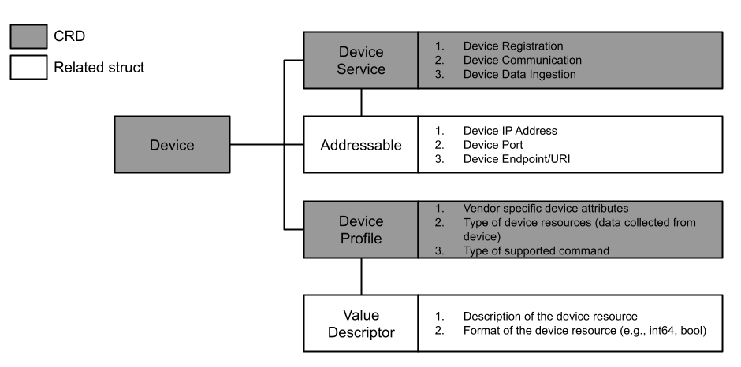
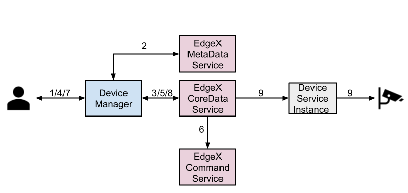
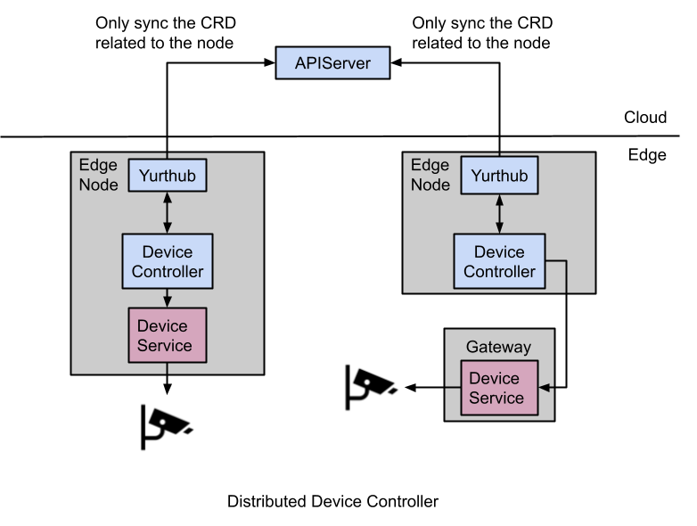

# Managing Edge Devices using EdgeX Foundry

## Table of Contents

- [Managing Edge Devices using EdgeX Foundry](#managing-edge-devices-using-edgex-foundry)
  - [Table of Contents](#table-of-contents)
  - [Glossary](#glossary)
  - [Summary](#summary)
  - [Motivation](#motivation)
    - [Goals](#goals)
    - [Non-Goals/Future Work](#non-goalsfuture-work)
  - [Proposal](#proposal)
    - [User Stories](#user-stories)
    - [Components](#components)
      - [1. DeviceProfile](#1-deviceprofile)
      - [2. Device](#2-device)
      - [3. DeviceService](#3-deviceservice)
    - [Using EdgeX Foundry as the Edge Platform](#using-edgex-foundry-as-the-edge-platform)
      - [1. Setting up EdgeX Foundry](#1-setting-up-edgex-foundry)
      - [2. CRUD objects on EdgeX Foundry](#2-crud-objects-on-edgex-foundry)
      - [3. Controlling the device declaratively](#3-controlling-the-device-declaratively)
    - [System Architecture](#system-architecture)
  - [Upgrade Strategy](#upgrade-strategy)
  - [Implementation History](#implementation-history)

## Glossary

Refer to the [OpenYurt Glossary](https://github.com/openyurtio/openyurt/blob/master/docs/proposals/00_openyurt-glossary.md) and the [EdgeX Foundry Glossary](https://docs.edgexfoundry.org/1.3/general/Definitions/).

## Summary

This proposal introduces an approach leverages existing edge computing platforms, like EdgeX Foundry, and uses Kubernetes custom resources to abstract edge devices. When adapting Kubernetes to the edge computing environments, existing solutions either change the system architecture (k3s wrap together the controlplane and the kubelet) or modify core components (Kubelet in KubeEdge) significantly. However, inspiring by the Unix philosophy, "Do one thing and do it well", we believe that Kubernetes should focus on managing computing resources while edge devices management can be done by adopting existing edge computing platforms. Therefore, we define several generic custom resource definitions(CRD) that act as the mediator between OpenYurt and the edge platform. Any existing edge platforms can be integrated into the OpenYurt by implementing custom controllers for these CRDs. In addition, these CRDs allow users to manage edge devices in a declarative way, which provides users with a Kubernetes-native experience.

## Motivation

Extending the Kubernetes to the edge is not a new topic. However, to support all varieties of edge devices, existing Kubernetes-based edge frameworks have to develop dedicated adaptors for each category of the device from scratch and change the original Kubernetes architecture significantly, which entails great development efforts with the loss of some upstream K8S features. Instead, we are inspired by the Unix philosophy, i.e., “Do one thing, and do it well,” and believe that a mature edge IoT platform should do the device management. To that end, we integrate EdgeX into the OpenYurt, which supports a full spectrum of devices and supports all upstream K8S features.

### Goals

- To design a new custom resource definition(CRD), DeviceProfile, to represent different categories of devices
- To design a new CRD, Device, that represents physical edge devices
- To design a new CRD, DeviceService, that defines the way of how to connect to a specific device
- Using EdgeX Foundry as an example platform, implement controllers that support device management using DeviceProfile, Device, DeviceService and EdgeX Foundry
- To support automatically setting up of the EdgeX Foundry on the OpenYurt
- To support declarative device state modification, i.e., modifying the device's properties by changing fields of the device CRs

### Non-Goals/Future Work

Non-goals are limited to the scope of this proposal. These features may evolve in the future.

- To implement a EdgeX Foundry DeviceService for any specific protocol
- To support data transmission between edge devices and external services
- To support edge data processing

## Proposal

### User Stories

1. As a vendor, I would like to connect a category of devices into OpenYurt.
2. As an end-user, I would like to define how to connect a device, which belongs to a supported DeviceProfile, into the OpenYurt.
3. As an end-user, I would like to connect a new device, which belongs to a supported DeviceProfile, to the OpenYurt.
4. As an end-user, I would like to modify the states of devices by changing the values of device properties defined in corresponding Device CRs.
5. As an end-user, I would like to disconnect a device by deleting the corresponding Device CR.

### Components

We define three new custom resource definitions(CRD) to manage devices on the edge. They are [DeviceProfile](#1-deviceprofile), [Device](#3-device), and [DeviceService](#3-deviceservice). The `DeviceProfile` defines a type of devices using same kind of protocol, which includes some generic information like the manufacturer's name, the device description, and the device model. DeviceProfile also defines what kind of resources (e.g., temperature, humidity) this type of device provided and how to read/write these resources. The `DeviceService` defines the way of how to connect a device to the OpenYurt, like the URL of the device. The `DeviceService` can not exist alone. Every `DeviceService` must associate with a `DeviceProfile`. The `Device` gives the detailed definition of a specific device, like which `DeviceProfile` it belongs to and which `DeviceService` it used to connect to the system.



#### 1. DeviceProfile

Followings are definitions of `DeviceProfile` CRD and its related Golang structs. This CRD will be defined by vendors, and the corresponding CRs will be created by device controller when it detected a new device service created.

```go
type DeviceProfile struct {
    metav1.TypeMeta   `json:",inline"`
    metav1.ObjectMeta `json:"metadata,omitempty"`

    Spec   DeviceProfileSpec   `json:"spec,omitempty"`
    Status DeviceProfileStatus `json:"status,omitempty"`
}

// DeviceProfileSpec defines the desired state of DeviceProfile
type DeviceProfileSpec struct {
    // Description of the Device
    Description string `json:"description,omitempty"`
    // Manufacturer of the device
    Manufacturer string `json:"manufacturer,omitempty"`
    // Model of the device
    Model string `json:"model,omitempty"`
    // Available DeviceResources of the profile
    DeviceResources []DeviceResource `json:"deviceResources,omitempty"`
    // Available CoreCommands of the profile
    CoreCommands   []Command         `json:"coreCommands,omitempty"`
}

// DeviceProfileStatus defines the observed state of DeviceProfile
type DeviceProfileStatus struct {
    // ProfileId is the Id assigned by the backend platform, e.g., EdgeX Foundry
    ProfileId      string `json:"id,omitempty"`
    // Condition indicates the condition of the DeviceProfile.
    Condition DeviceProfileCondition `json:"addedToEdgeX,omitempty"`
}

type DeviceProfileCondition string

const (
    // The DeviceProfile is unavailable, i.e., has not registered on
    // the backend platform yet
    Unavailable DeviceProfileCondition = "Unavailable"
    // The DeviceProfile is available, i.e., successfully registered
    //on the backend platform
    Available   DeviceProfileCondition = "Available"
)

// DeviceResource is the resource/data that
type DeviceResource struct {
    Description string            `json:"description"`
    Name        string            `json:"name"`
    Property    ProfileProperty   `json:"property"`
}

// ProfileProperty defines the property details of the DeviceResource
type ProfileProperty struct {
    Value PropertyValue `json:"value"`
    Units string        `json:"units,omitempty"`
}

// PropertyValue defines the value format of the property
type PropertyValue struct {
    // ValueDescriptor Type of property after transformations
    Type PropertyValueType `json:"type,omitempty"`
    // Read/Write Permissions set for this property
    Mutable bool `json:"mutable,omitempty"`
    // Minimum value that can be get/set from this property
    Minimum string `json:"minimum,omitempty"`
    // Maximum value that can be get/set from this property
    Maximum string `json:"maximum,omitempty"`
    // Default value set to this property if no argument is passed
    DefaultValue string `json:"defaultValue,omitempty"`
}

type PropertyValueType string

const (
    ValueTypeBool         PropertyValueType = "Bool"
    ValueTypeString       PropertyValueType = "String"
    ValueTypeUint8        PropertyValueType = "Uint8"
    ValueTypeUint16       PropertyValueType = "Uint16"
    ValueTypeUint32       PropertyValueType = "Uint32"
    ValueTypeUint64       PropertyValueType = "Uint64"
    ValueTypeInt8         PropertyValueType = "Int8"
    ValueTypeInt16        PropertyValueType = "Int16"
    ValueTypeInt32        PropertyValueType = "Int32"
    ValueTypeInt64        PropertyValueType = "Int64"
    ValueTypeFloat32      PropertyValueType = "Float32"
    ValueTypeFloat64      PropertyValueType = "Float64"
    ValueTypeBinary       PropertyValueType = "Binary"
    ValueTypeBoolArray    PropertyValueType = "BoolArray"
    ValueTypeStringArray  PropertyValueType = "StringArray"
    ValueTypeUint8Array   PropertyValueType = "Uint8Array"
    ValueTypeUint16Array  PropertyValueType = "Uint16Array"
    ValueTypeUint32Array  PropertyValueType = "Uint32Array"
    ValueTypeUint64Array  PropertyValueType = "Uint64Array"
    ValueTypeInt8Array    PropertyValueType = "Int8Array"
    ValueTypeInt16Array   PropertyValueType = "Int16Array"
    ValueTypeInt32Array   PropertyValueType = "Int32Array"
    ValueTypeInt64Array   PropertyValueType = "Int64Array"
    ValueTypeFloat32Array PropertyValueType = "Float32Array"
    ValueTypeFloat64Array PropertyValueType = "Float64Array"
)

// Command defines the available commands for end users to control the devices
// NOTE: a Command usually corresponding to a DeviceCommand and a DeviceResource
type Command struct {
    // Command name (unique on the profile)
    Name string `json:"name,omitempty"`
    // Get Command
    Get Get `json:"get,omitempty"`
    // Put Command
    Put Put `json:"put,omitempty"`
}

// Put defines the details of the Put operation
type Put struct {
    Path string `json:"path,omitempty"`
    ParameterNames []string `json:"parameterNames,omitempty"`
}

// Get defines the details of the Get operation
type Get struct {
    Path string `json:"path,omitempty"`
}
```

#### 2. Device

Followings are the definition of the `Device` CRD and its related Golang structs. This CRD will be defined by vendors, while the corresponding CRs will be created by users:

```go
// Device is the Schema for the devices API
type Device struct {
    metav1.TypeMeta   `json:",inline"`
    metav1.ObjectMeta `json:"metadata,omitempty"`

    Spec   DeviceSpec   `json:"spec,omitempty"`
    Status DeviceStatus `json:"status,omitempty"`
}

// DeviceSpec defines the desired state of Device
type DeviceSpec struct {
    // Device service specific location
    Location string `json:"location,omitempty"`
    // Associated Device Service - One per device
    Service string `json:"service"`
    // Associated Device Profile - Describes the device
    Profile string `json:"profile"`
    // DeviceProperties defines the desired states of device properties
    DeviceProperties map[string]DeviceProperty `json:"deviceProperties,omitempty"`
}

// DeviceStatus defines the observed state of Device
type DeviceStatus struct {
    DeviceId string `json:"deviceId,omitempty"`
    // Registered indicates whether the object has been successfully
    // created on the backend platform, e.g., EdgeX Foundry
    Condition DeviceCondition `json:"condition,omitempty"`
    // Time (milliseconds) that the device last provided any feedback or
    // responded to any request
    LastConnected metav1.Time `json:"lastConnected,omitempty"`
    // Time (milliseconds) that the device reported data to the core
    // microservice
    LastReported metav1.Time `json:"lastReported,omitempty"`
    // DeviceProperties contains the observed stats of device properties
    DeviceProperties map[string]DeviceProperty `json:"deviceProperties,omitempty"`
}

type DeviceCondition string

const (
    Unavailable DeviceCondition = "Unavailable"
    Available   DeviceCondition = "Available"
    Error 	    DeviceCondition = "Error"
)

type DeviceProperty struct {
    Name  string `json:"name"`
    Value string `json:"value"`
}
```

#### 3. DeviceService

Followings are definitions of `DeviceService` CRD and related Golang structs. This CRD will be defined by vendors, and the corresponding CRs will be created by device controller when it detected a new device service created.

```go
// DeviceService is the Schema for the deviceservices API
type DeviceService struct {
    metav1.TypeMeta   `json:",inline"`
    metav1.ObjectMeta `json:"metadata,omitempty"`

    Spec   DeviceServiceSpec   `json:"spec,omitempty"`
    Status DeviceServiceStatus `json:"status,omitempty"`
}

// DeviceServiceSpec defines the desired state of DeviceService
type DeviceServiceSpec struct {
    Description string `json:"description,omitempty"`
    // address (MQTT topic, HTTP address, serial bus, etc.) for reaching the service
    Addressable Addressable `json:"addressable,omitempty"`
}

// DeviceServiceStatus defines the observed state of DeviceService
type DeviceServiceStatus struct {
    // ServiceId is the Id assigned by the EdgeX foundry
    ServiceId string `json:"id,omitempty"`
    // The condition of the service
    Condition DeviceServiceCondition `json:"condition,omitempty"`
}

type DeviceServiceCondition string

const (
    Unavailable DeviceServiceCondition = "Unavailable"
    Available DeviceServiceCondition = "Availale"
)

type Addressable struct {
    // ID is a unique identifier for the Addressable, such as a UUID
    Id string `json:"id,omitempty"`
    // Name is a unique name given to the Addressable
    Name string `json:"name,omitempty"`
    // Protocol for the address (HTTP/TCP)
    Protocol string `json:"protocol,omitempty"`
    // Address of the addressable
    Address string `json:"address,omitempty"`
    // Port for the address
    Port int `json:"port,omitempty"`
    // Path for callbacks
    Path string `json:"path,omitempty"`
    // For message bus protocols
    Publisher string `json:"publisher,omitempty"`
    // Topic for message bus addressables
    Topic string `json:"topic,omitempty"`
}
```

### Using EdgeX Foundry as the Edge Platform

In the next release version, we will reveal the new component, DeviceManager, which will help us to manage edge devices through EdgeX Foundry. In this section, we will show how we interact with the EdgeX Foundry with DeviceManager. Though the first version of DeviceManager can only work with the EdgeX Foundry, other edge platforms should be able to integrated into OpenYurt in a very similar way.

#### 1. Setting up EdgeX Foundry

The deployment strategy for EdgeX Foundry may vary based on the cluster topology. We will define a CRD, which will be discussed in another proposal, to control the way of deploying EdgeX services on OpenYurt. Also, we will allow users to choose if they want to set up the EdgeX Foundry automatically when converting the Kubernetes cluster to the OpenYurt cluster using the `yurtctl` command-line tool.

#### 2. CRUD objects on EdgeX Foundry

The DeviceManager includes three controllers, i.e., DeviceProfile Controller, DeviceService Controller, and the Device Controller, which act as mediators between the OpenYurt and the EdgeX Foundry and are responsible for reconciling the states of the device-related custom resources with the states of the corresponding objects on the EdgeX Foundry.

Following is the process of connecting a new device to the OpenYurt through EdgeX Foundry.



1. The vendor applies the DeviceProfile CR.
2. The DeviceManager creates the related ValueDescriptor on the EdgeX MetaData Service.
3. The DeviceManager create the DeviceProfile on the EdgeX Metadata Service.
4. The end-user applies the Device CR.
5. During the runtime, command service will read available commands from the Metadata Service, translate commands and execute them.
6. The end-user applies the DeviceService CR.
7. The DeviceManager creates the DeviceService object on the EdgeX Metadata Service.
8. The DeviceManager creates the Device object on the EdgeX Metadata Service.
9. The Physical Device is connected to the OpenYurt through the device service instance (The actual microservice that talks to the physical devices depend on what protocol the device uses, the device service instance may be deployed as a pod on edge nodes or be deployed outside of the OpenYurt cluster).

#### 3. Controlling the device declaratively

The declarative model is one of the core concepts of Kubernetes. This model allows users to declare the desired states of resources/workloads, and the corresponding controllers/operators will reconcile the actual states with the desired states. We will add a new field, `DeviceProperties`, to the `Device` CRD, which will hold the device properties that can be modified declaratively. The general idea behind the `DeviceProperties` is that the vendor (or anyone who defines the `Device` CRD) will decide which `DeviceResource` can be changed declaratively and create a matching entry in the `DeviceProperties`. After the `Device` CR is applied to the cluster, the device controller will query the EdgeX Foundry command service, fetch the rest endpoint, and update the `DeviceProperties` entries.

For example, following is a `DeviceProfile` CR represents a type of sensor devices

```yaml
apiVersion: device.openyurt.io/v1alpha1
kind: DeviceProfile
metadata:
  name: color-sensor
spec:
  ...
  deviceResources:
    - name: lightcolor
      description: "JSON message"
      properties:
        value:
          { type: "String", readWrite: "W" , mediaType : "application/json" }
        units:
          { type: "String", readWrite: "R" }
  ...
  coreCommands:
    - name: lightcolor
      get:
        path: "/api/v1/device/{deviceId}/color"
        responses:
        -
          code: "200"
          description: "get current light color"
          expectedValues: ["color"]
        -
          code: "503"
          description: "service unavailable"
          expectedValues: []
      put:
        path: "/api/v1/device/{deviceId}/changeColor"
        responses:
        -
          code: "201"
          description: "set the light color"
        -
          code: "503"
          description: "service unavailable"
          expectedValues: []
```

The `DeviceProfile` contains one `deviceResources`, i.e., `lightcolor`, which supports both "read" and "write" operations. The profile also defines a corresponding `coreCommand`, which contains the REST API of the `lightcolor`. After this `DeviceProfile` is applied to the cluster, the following core command will be created on the EdgeX Foundry,

```json
{
  ...
  "commands": [
    {
      "created": <created-timestamp>,
      "modified": <modifed-timestamp>,
      "id": "<command-id>",
      "name": "lightcolor",
      "get": {
        "path": "/api/v1/device/{deviceId}/color",
        "responses": [
          {
            "code": "200",
            "description": "get current light color",
            "expectedValues": [
              "color"
            ]
          },
          {
            "code": "503",
            "description": "service unavailable"
          }
        ],
        "url": "http://edgex-core-command:48082/api/v1/device/<device-id>/command/<set-command-id>"
      },
      "put": {
        "path": "/api/v1/device/{deviceId}/changeColor",
        "responses": [
          {
            "code": "201",
            "description": "set the light color"
          },
          {
            "code": "503",
            "description": "service unavailable"
          }
        ],
        "url": "http://edgex-core-command:48082/api/v1/device/<device-id>/command/<put-command-id>"
      }
    }
  ]
}
```

Then we can create a `Device` associated to the `DeviceProfile` as following,

```yaml
apiVersion: device.openyurt.io/v1alpha1
kind: Device
metadata:
  name: testsensor
spec:
  ...
  profile: color-sensor
  deviceProperties:
    lightcolor:
      name: lightcolor
      desiredValue: green
```

Assume that the initial light color is blue, then after applying the `Device`, the device controller will try to fetch the corresponding get/put URLs from the core command service, update the `testsensor.Spec.DeviceProperties[lightcolor]` `testsensor.Status.DeviceProperties[lightcolor]`, and then set the light color to green, the updated `Device` will look like the following,
```yaml
apiVersion: device.openyurt.io/v1alpha1
kind: Device
metadata:
  name: testsensor
spec:
  ...
  profile: color-sensor
  deviceProperties:
    lightcolor:
      name: lightcolor
      setURL: http://edgex-core-command:48082/api/v1/device/<device-id>/command/<put-command-id>
      desiredValue: green
status:
  deviceProperties:
    lightcolor:
      name: lightcolor
      getURL: http://edgex-core-command:48082/api/v1/device/<device-id>/command/<set-command-id>
      desiredValue: green
```

### System Architecture

Edge devices are usually located in the network regions that are unreachable from the cloud, while `DeviceService` needs to talk to edge devices directly. Therefore, we need to deploy the `DeviceService` on the edge node that connects to edge devices. On the other hand, when modifying the device properties, the device controller will need to send a request to the `DeviceService`. Hence, we will deploy a replica of the device controller in each network region. Specifically, the device controller will connect to the YurtHub, and the YurtHub will only pull the device CRDs related to connected edge devices. The system architecture is shown below,



## Upgrade Strategy

In the first implementation, we will support the EdgeX Foundry [Hanoi](https://www.edgexfoundry.org/software/releases/), and would not support upgrading/downgrading to other versions.k

## Implementation History

- [x] 03/15/2021: Proposed idea in an issue or [community meeting](https://us02web.zoom.us/j/82828315928?pwd=SVVxek01T2Z0SVYraktCcDV4RmZlUT09).
- [x] 03/16/2021: Present proposal at a [community meeting](https://us02web.zoom.us/j/82828315928?pwd=SVVxek01T2Z0SVYraktCcDV4RmZlUT09) and collect feedbacks.
- [x] 04/13/2021: Present the revised proposal at a [community meeting](https://us02web.zoom.us/j/82828315928?pwd=SVVxek01T2Z0SVYraktCcDV4RmZlUT09) and collect feedbacks.
- [x] 04/14/2021: Finalize the proposal.
