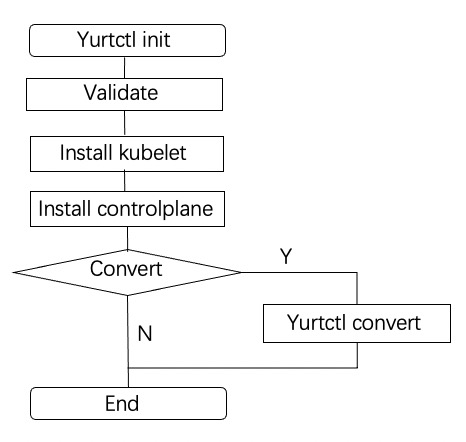
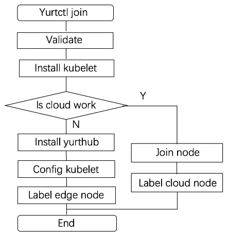

# Adding subcommands `init` `join` and `reset` for yurtctl

## Table of Contents

- [Adding subcommands init, join and reset subcommands for yurtctl](#Adding-subcommands-init-join-and-reset-for-yurtctl)
  - [Table of Contents](#table-of-contents)
  - [Glossary](#glossary)
  - [Summary](#summary)
  - [Motivation](#motivation)
    - [Goals](#goals)
  - [Proposal](#proposal)
    - [User Stories](#user-stories)
    - [Creating OpenYurt cluster with yurtctl](#creating-OpenYurt-cluster-with-yurtctl)
      - [Parameters for yurtctl init](#parameters-for-yurtctl-init)
    - [Joining node to OpenYurt cluster](#joining-node-to-OpenYurt-cluster)
      - [Parameters for yurtctl join](#parameters-for-yurtctl-join)
    - [Resetting node](#resetting-node)
  - [Implementation History](#implementation-history)

## Glossary

Refer to the [OpenYurt Glossary](https://github.com/openyurtio/openyurt/blob/master/docs/proposals/00_openyurt-glossary.md).

## Summary
This proposal add three subcommands `init`, `join` and `reset` for yurtctl. The subcommand `init` can create an all-in-one kubernetes cluster, simultaneously convert the kuberntes cluster to an OpenYurt cluster. The subcommand `join` is used to add a new node to an OpenYurt cluster, including cloud nodes and edge nodes. The subcommand `reset` can restore the node to the state before joining OpenYurt cluster.

## Motivation

OpenYurt as a cloud-native edge computing project，a large number of users from the edge computing field are not familiar with cloud native knowledge. In order to enable users to use OpenYurt clusters quickly and reduce the cost of users learning OpenYurt, yurtctl has provided the subcommands `convert` and `revert`, to realize the conversion between OpenYurt cluster and Kubernetes cluster. However, It still has some shortcomings: (1) No support for new nodes to join the cluster directly; (2) Users are required to pre-built a kubernetes cluster, and then do conversion, which has a relatively high learning cost for beginners. So, we need to add subcommands `init`, `join`, `reset` for yurtctl.

### Goals

- To create an OpenYurt cluster quickly to meet users development and testing needs
- To support new nodes to join an OpenYurt cluster

## Proposal

### User Stories

1. As a devdeloper in the field of edge computing, I would like to create an OpenYurt cluster for development and testing quickly.
2. As an end-user, I would like to try OpenYurt features.
3. As an end-user, I would like to join new nodes to OpenYurt cluster directly.

### Creating OpenYurt cluster with yurtctl
In yurtctl, we provide the subcommand `init` to create an OpenYurt cluster. This command first creates an all-in-one kubernetes cluster, then convert the cluster to OpenYurt cluster. On the one hand, it reduces the complexity of cluster creation; On the other hand, it helps users understand the relationship between native Kubernertes and OpenYurt. In addition, the all-in-one kubernetes cluster can be replaced by kubernetes hosting services provided by cloud vendors, such as [ACK](https://www.alibabacloud.com/product/kubernetes).

<div align="center">

</div>

#### Parameters for yurtctl init

```go
const (
	// APIServerAdvertiseAddress flag sets the IP address the API Server will advertise it's listening on. Specify '0.0.0.0' to use the address of the default network interface.
	APIServerAdvertiseAddress = "apiserver-advertise-address"

	// APIServerBindPort flag sets the port for the API Server to bind to.
	APIServerBindPort = "apiserver-bind-port"

	// IgnorePreflightErrors sets the path a list of checks whose errors will be shown as warnings. Example: 'IsPrivilegedUser,Swap'. Value 'all' ignores errors from all checks.
	IgnorePreflightErrors = "ignore-preflight-errors"

	// ImageRepository sets the container registry to pull control plane images from.
	ImageRepository = "image-repository"

	// KubernetesVersion flag sets the Kubernetes version for the control plane.
	KubernetesVersion = "kubernetes-version"

	// NetworkingServiceSubnet flag sets the range of IP address for service VIPs.
	NetworkingServiceSubnet = "service-cidr"

	// NetworkingPodSubnet flag sets the range of IP addresses for the pod network. If set, the control plane will automatically allocate CIDRs for every node.
	NetworkingPodSubnet = "pod-network-cidr"

	// IsConvertOpenYurtCluster flag, if set, will convert standalone cluster to openyurt cluster.
	IsConvertOpenYurtCluster = "is-convert-openyurt"
)
```

### Joining node to OpenYurt cluster

In yurtctl, we provide the subcommand `join` to add a new node to OpenYurt cluster. This command support to add cloud nodes and edge nodes.
<div align="center">

</div>

#### Parameters for yurtctl join

```go
const (
	// TokenDiscoverySkipCAHash flag instruct yurtctl to skip CA hash verification (for token-based discovery)
	TokenDiscoverySkipCAHash = "discovery-token-unsafe-skip-ca-verification"

	// TokenDiscoveryCAHash flag instruct yurtctl to validate that the root CA public key matches this hash (for token-based discovery)
	TokenDiscoveryCAHash = "discovery-token-ca-cert-hash"

	// NodeCRISocket flag sets the CRI socket to connect to.
	NodeCRISocket = "cri-socket"

	// TokenStr flags sets both the discovery-token and the tls-bootstrap-token when those values are not provided
	TokenStr = "token"

	// NodeName flag sets the node name.
	NodeName = "node-name"

	// IgnorePreflightErrors sets the path a list of checks whose errors will be shown as warnings. Example: 'IsPrivilegedUser,Swap'. Value 'all' ignores errors from all checks.
	IgnorePreflightErrors = "ignore-preflight-errors"

	// NodeType sets the node is "edge" node or "cloud" node
	NodeType = "node-type"
)
```

### Resetting node
In yurtctl, we provide the subcommand `reset` to offline the nodes than have been added to the OpenYurt cluster. It only clean up kubernetes and openyurt related components and directories, don't clean up the runtime.

## Implementation History

- [x] 06/07/2021: Proposed idea in an issue.