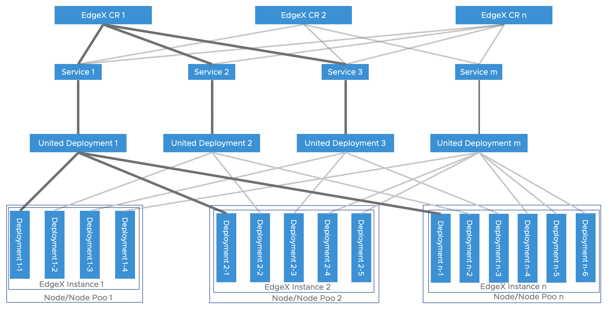
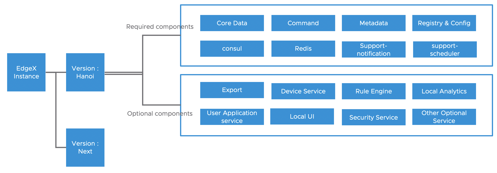

# EdgeX integration with OpenYurt

## Table of Contents

- [EdgeX integration with OpenYurt](#edgex-integration-with-openyurt)
  - [Table of Contents](#table-of-contents)
  - [Glossary](#glossary)
  - [Summary](#summary)
    - [Goals](#goals)
    - [Non-Goals/Future Work](#non-goalsfuture-work)
  - [Proposal](#proposal)
    - [User Stories](#user-stories)
    - [Overview](#overview)
      - [1. EdgeX Customer Resource Definition](#1-edgex-customer-resource-definition)
      - [2. EdgeX Controller](#2-edgex-controller)
        - [EdgeX CR creation](#edgex-cr-creation)
        - [EdgeX CR status update](#edgex-cr-status-update)
        - [EdgeX CR deletion](#edgex-cr-deletion)
  - [Update/Upgrade](#updateupgrade)
  - [Implementation History](#implementation-history)

## Glossary

Refer to the [OpenYurt Glossary](https://github.com/openyurtio/openyurt/blob/master/docs/proposals/00_openyurt-glossary.md) and the [EdgeX Foundry Glossary](https://docs.edgexfoundry.org/1.3/general/Definitions/).

## Summary

In previous proposal [edge-device-management](20210310-edge-device-management.md) we define the object mappings between EdgeX Foundry and OpenYurt. In this proposal we will cover the EdgeX Foundry management part.
EdgeX Foundry itself is a loosely coupled, micro-services based framework. The deployment topology can be pretty flexible base on the usage scenarios. The plugin based design enable user easily create their own micro-services and connected to EdgeX Foundry to meet their specific requirements. In this proposal we want make it easy to run EdgeX on Edge side and meanwhile keep the capability of run any customized components user specified together with EdgeX Foundry.

### Goals

- Design a new CRD EdgeX to represent the EdgeX instance.
- To support EdgeX services auto deployment when a new EdgeX CR(Customer Resource) created.
- Implement a new EdgeX controller to manage EdgeX CR and mapping to United Deployment. Leverage the United Deployment's ability of deploy EdgeX on node pool/cross sites scenario.
- To support run user defined components together with EdgeX.

### Non-Goals/Future Work

Non-goals are limited to the scope of this proposal. These features may evolve in the future.

- Compatible check for the optional/user defined components. For the optional components provided by EdgeX community it will works as it designed since those components have past the compatible test. For any user created components, user should be responsible for the compatibility testing.

## Proposal

### User Stories

1. As an end-user, I would like to deploy EdgeX to the Edge node
2. As an end-user, I would like to deploy my container based application to the Edge node and connect to the EdgeX I deployed.
3. As an end-user, I would like to update the EdgeX (add/remove one or more optional components).

### Overview

We define a new CR EdgeX to represent the EdgeX instance running on the Edge side, the relation between the EdgeX CR and EdgeX instance is 1:1. When we have multiple EdgeX instances running on the Edge side, the same number of EdgeX CRs will be created. For each EdgeX instance it may contains different micro-service components, each of the components will be live in the form of a Kubernetes deployment. For the deployments that compose a EdgeX instance it can basically grouped into two categories:
- Required deployments : For the deployments in this group are mandatory and will be deployed with each EdgeX instance.
- Optional deployments: For deployments in this group is optional can user can specify which deployments they want to deploy.

Consider it is quite common to have multiple EdgeX instance in a single Kubernetes Cluster, With traditional service+deployment solutions, for the components in each EdgeX instance it require a unique name. When the EdgeX instance number increased the name management will be a critical issue need to address. In this proposal we leverage the United Deployment feature of OpenYurt. In that way all the EdgeX Instance share the same service name which can avoid the service name explosion.



As the deployment topology diagram shows.  Each components in the EdgeX instance will have a corresponding service mapping to it. The service will mapping to a United Deployment instance(In the backend it is actually mapping to all the deployments inside the united deployment) On the edge side a deployment with a unique name will be created and registered in the service's endpoints. Service topology policy will be automatically applied by United Deployment controller to make sure the traffic will be limited to Edge/Node Pool level.From one side we can make the management easier and on the other side we can still keep the EdgeX instance isolation.
#### 1. EdgeX Customer Resource Definition

Following is the definition of `EdgeX` CRD definition. The CRD will be created when the EdgeX controller is up and running.

```go
// DeploymentTemplateSpec defines the pool template of Deployment.
type DeploymentTemplateSpec struct {
	metav1.ObjectMeta `json:"metadata,omitempty"`
	Spec              appsv1.DeploymentSpec `json:"spec"`
}

// DeploymentTemplateSpec defines the pool template of Deployment.
type ServiceTemplateSpec struct {
	metav1.ObjectMeta `json:"metadata,omitempty"`
	Spec              corev1.ServiceSpec `json:"spec"`
}

// EdgeXSpec defines the desired state of EdgeX
type EdgeXSpec struct {
	Version string `json:"version,omitempty"`

	ImageRegistry string `json:"imageRegistry,omitempty"`

	PoolName string `json:"poolName,omitempty"`

	ServiceType corev1.ServiceType `json:"serviceType,omitempty"`
	// +optional
	AdditionalService []ServiceTemplateSpec `json:"additionalServices,omitempty"`
	// +optional
	AdditionalDeployment []DeploymentTemplateSpec `json:"additionalDeployments,omitempty"`
}

// EdgeXStatus defines the observed state of EdgeX
type EdgeXStatus struct {
    // +optional
    Ready bool `json:"ready,omitempty"`
    // +optional
    Initialized bool `json:"initialized,omitempty"`
    // +optional
    ServiceReplicas int32 `json:"serviceReplicas,omitempty"`
    // +optional
    ServiceReadyReplicas int32 `json:"serviceReadyReplicas,omitempty"`
    // +optional
    DeploymentReplicas int32 `json:"deploymentReplicas,omitempty"`
    // +optional
    DeploymentReadyReplicas int32 `json:"deploymentReadyReplicas,omitempty"`

    // Current Edgex state
    // +optional
    Conditions clusterv1.Conditions `json:"conditions,omitempty"`
}

//+kubebuilder:object:root=true
//+kubebuilder:subresource:status
//+kubebuilder:resource:path=edgexes
//+kubebuilder:resource:shortName=edgex
//+kubebuilder:printcolumn:name="READY",type="boolean",JSONPath=".status.ready",description="The edgex ready status"
//+kubebuilder:printcolumn:name="Service",type="integer",JSONPath=".status.servicereplicas",description="The Service Replica."
//+kubebuilder:printcolumn:name="ReadyService",type="integer",JSONPath=".status.servicereadyreplicas",description="The Ready Service Replica."
//+kubebuilder:printcolumn:name="Deployment",type="integer",JSONPath=".status.deploymentreplicas",description="The Deployment Replica."
//+kubebuilder:printcolumn:name="ReadyDeployment",type="integer",JSONPath=".status.deploymentreadyreplicas",description="The Ready Deployment Replica."

// EdgeX is the Schema for the edgexes API
type EdgeX struct {
	metav1.TypeMeta   `json:",inline"`
	metav1.ObjectMeta `json:"metadata,omitempty"`

	Spec   EdgeXSpec   `json:"spec,omitempty"`
	Status EdgeXStatus `json:"status,omitempty"`
}

//+kubebuilder:object:root=true

// EdgeXList contains a list of EdgeX
type EdgeXList struct {
	metav1.TypeMeta `json:",inline"`
	metav1.ListMeta `json:"metadata,omitempty"`
	Items           []EdgeX `json:"items"`
}
```
When user create an EdgeX CR, the EdgeX version field is required. For each specific version, the required components section are fixed and will be created automatically by the EdgeX controller. If user want run any optional components or components created by themselves, those components must be declared explicitly in the optionalComponents section.


As the EdgeX instance diagram shows, the following 8 Components are required for EdgeX Hanoi version
- Core Data service: The core data micro service provides centralized persistence for data collected by devices.
- Command service: The command service enables the issuance of commands or actions to devices on behalf of other micro services/applications/external systems that need to modify the settings of a collection of devices.
- Metadata service: The metadata service has the knowledge about the devices and sensors and how to communicate with them used by the other services.
- Registry & Config service: It provides other EdgeX Foundry micro services with information about associated services within the system and micro services configuration properties
- Consul: EdgeX Foundry's reference implementation configuration and registry service.
- Redis: EdgeX Foundry's reference implementation database (for sensor data, metadata and all things that need to be persisted in a database) is Redis
- Support-notification: When another system or a person needs to know that something occurred in EdgeX, the alerts and notifications micro service sends that notification.
- support-scheduler: Scheduler micro service provide an internal EdgeX “clock” that can kick off operations in any EdgeX service.

All other components are optional include user created components.

#### 2. EdgeX Controller

EdgeX controller is responsible for the EdgeX CR lifecycle management.
##### EdgeX CR creation
- User create EdgeX CR
- EdgeX controller check the EdgeX version specified in the EdgeX CR
- For each required components, If the related united deployment instance does not exist create a new united deployment. Add a new pool section in the united deployment。Use the predefined service name to check the service, if not exist, create one.
- For each optional components, The controller will do the similar jobs like the required components. If the user define a service for the optional component then the controller will create a service with the name specified by the user. If the service name already exist, it will use the existing service.

##### EdgeX CR status update
- EdgeX controller will periodically check the Deployments belong to the EdgeX CR and update the CR status. Please note in this version we only deploy EdgeX controller in the cloud. So when the network during the network outage , the status will not updated.

##### EdgeX CR deletion
When EdgeX CR is deleted the follow actions will performed by the controller.
- For each components(both required and optional), the mapping deployments will be deleted from the Edge pool/Edge node by update the united deployment.
- Check the service, if this is the last deployment in the service, then the service should also deleted.
- Check the united deployment, if the united deployment don't have any pool object, then delete the united deployment(TO be discussed)

## Update/Upgrade
Follow the Kubernetes application update strategy. User can update/upgrade the EdgeX CR by apply yaml file update. But please note that the compatibility between different EdgeX version id defined in the EdgeX release document. Please read the release note before take any upgrade actions.

## Implementation History

