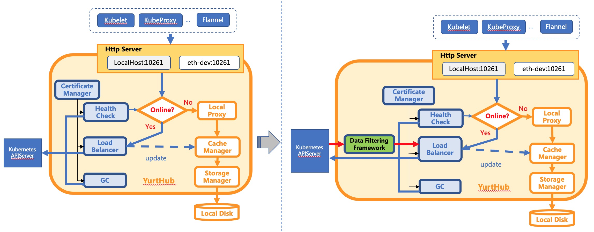
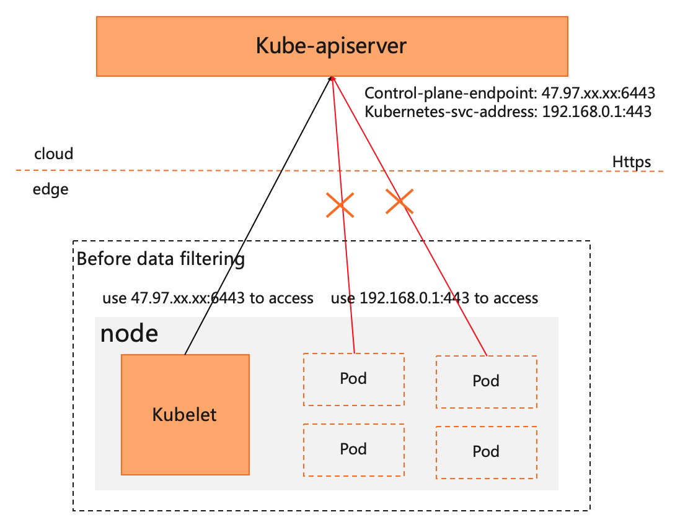
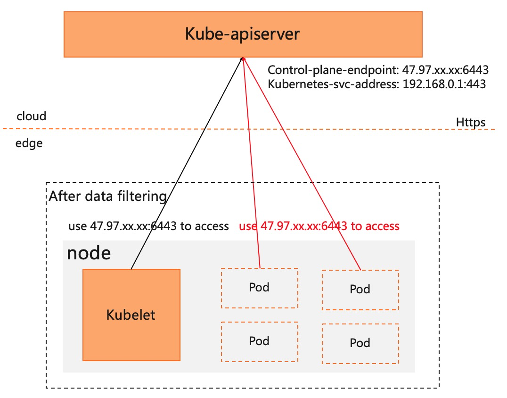
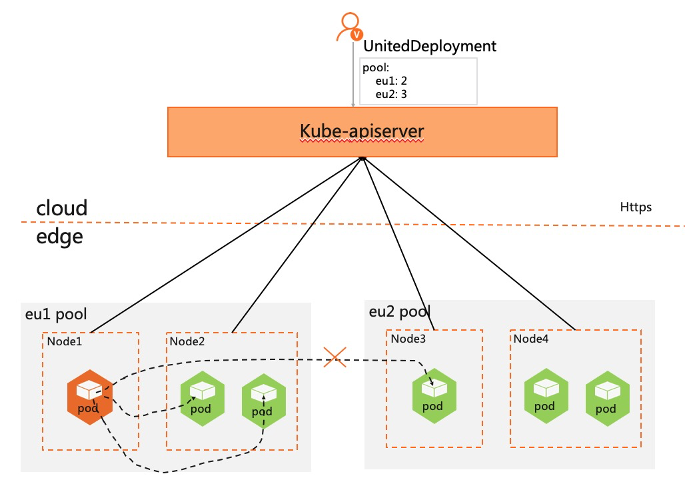

# data filtering framework on the edge

## Table of Contents

[TOC]

## Glossary

Refer to the [OpenYurt Glossary](https://github.com/openyurtio/openyurt/blob/master/docs/proposals/00_openyurt-glossary.md).

## Summary
In the cloud-edge scene, In response to requests from edge components (such as kube-proxy) or user pods to the cloud, it is hoped that some customized processing can be performed on the data returned by the cloud, so as to better meet the specific needs of edge scenarios. For example, when kubelet gets the `default/kubernetes service`, kubelet expects the accessible kube-apiserver address instead of the native `service ClusterIP` address. Therefore, we consider providing a `data filtering framework` in the `yurthub` component, which can customize the data returned from the cloud without being aware of the edge components and user pods, so as to meet business needs simply and conveniently.

## Motivation
Through yurthub's data filtering framework, it is convenient to customize and modify the cloud return data of edge components and user pods, and the edge components and user pods are unaware of changes in the returned data. At the same time, based on a general data filtering framework, the edge capabilities can be easily expanded and the complexity of edge business management can be greatly reduced.。

### Goals
1. Supports a general edge data filtering framework
2. Based on the data filtering framework, provides the specific implementation of 2 filtering handlers. The filter handlers are as follows:
	- `masterservice` address switching handler:
	Modify the `kubernetes service` address obtained by kubelet to the edge-accessible kube-apiserver address, so pod's `KUBERNETES_SERVICE_HOST` and `KUBERNETES_SERVICE_PORT` env are configured as edge-accessible addresses, in order to ensure that pod can seamlessly use `InClusterConfig`

	- Service topology awareness handler:
	According to the topology configuration in service.Annotations, modify the `Endpoints` data in the `EndpointSlice` of the kube-proxy component list/watch to ensure that the returned `Endpoints` meet the service topology requirements. For example, only the Endpoints in this NodePool are returned.

### Non-Goals/Future Work
- The data filtering framework does not process the requests initiated by the edge, but only processes the data returned from the cloud
- In the future, consider supporting extended data filtering handler in the form of webhooks

## Proposal

### Data Filtering Framework
The initial design of yurthub is to take over the communication between all edge components and the cloud, while caching all the data returned by the cloud locally. It can also be said that yurthub is a sidecar of the node dimension. Therefore, the node-dimensional data filtering framework is integrated into the yurthub component, which is a natural design. The location of the `data filtering framework` in yurthub is as follows:



Considering from the code interface, it is mainly to filter the data in `response.Body`. At the same time, the filtered data needs to continue to be passed to the subsequent modules in the original form, which means that the input of the data filtering framework is `ReadCloser (response.Body)`, and the output must also be `ReadCloser`. The Filter interface is defined as follows:
```
// Interface of data filtering framework
type Interface interface {
	// Approve is used to determine whether the data returned
	// from the cloud needs to enter the filtering framework for processing
	Approve(comp, resource, verb string) bool

	// Filter is used for filtering data returned from the cloud.
	// input parameters:
	// req: request data from edge side.
	// rc: response.Body of data from cloud side.
	// stopCh: an channel for stopping filter
	// return values:
	// int: The length of the data after the filtering process is completed,
	// used to update Header["content-length"], the return value is 0 when
	// the watch request is made
	// io.ReadCloser: used to read the filtered data and overwrite the original response.Body
	// error: error info
	Filter(req *http.Request, rc io.ReadCloser, stopCh <-chan struct{}) (int, io.ReadCloser, error)
}
```

In the data filtering framework, many specific filtering handlers(like `masterservice handler` and `servicetopology handler`) are integrated. Each handler mainly performs customized processing of data. At the same time, data is mainly divided into two types:

- Object data: data returned by list/get request
- Streaming data: The data returned by the watch request will be continuously pushed to the edge by the cloud

Therefore, for different data types, define the following interfaces for filter handler:
```
// Customized data filtering processing interface for each Handler
type Handler interface {
	// Filtering processing of streaming data
	// rc: used to read the returned data from the cloud
	// ch: filtered data is encapsulated as watch.Event and then returned through the channel
	// error: error info
	StreamResponseFilter(rc io.ReadCloser, ch chan watch.Event) error

	// Filtering processing of object data
	// b: bytes data from the cloud
	// []byte: bytes data after filtered
	// error: error info
	ObjectResponseFilter(b []byte) ([]byte, error)
}
```

### `masterservice` address switching handler
The kubelet obtains the service information of the cluster through the list/watch request. When the service is default/kubernetes, the ClusterIP and https corresponding ports are modified to the accessible kube-apiserver address, and the filtering process is as follows:

```
	// mutate master service
	for i := range serviceList.Items {
		if serviceList.Items[i].Namespace == "default" && serviceList.Items[i].Name == "kubernetes" {
			serviceList.Items[i].Spec.ClusterIP = {kube-apiserver host}
			for j := range serviceList.Items[i].Spec.Ports {
				if serviceList.Items[i].Spec.Ports[j].Name == "https" {
					serviceList.Items[i].Spec.Ports[j].Port = {kube-apiserver port}
					break
				}
			}
			break
		}
	}
```

### service topology awareness
Define the geographic topology of the service through service.Annotations["openyurt.io/topologyKeys"], supporting two dimensions of node and node pool. Among them, `kubernetes.io/hostname` represents the dimension of the node, and `openyurt.io/nodepool` or `kubernetes.io/zone` represents the dimension of the node pool. The filtering process is as follows:

```
	if serviceTopologyType == "kubernetes.io/hostname"  {
		for i := range endpointSlice.Endpoints {
			if endpointSlice.Endpoints[i].Topology[v1.LabelHostname] == fh.nodeName {
				newEps = append(newEps, endpointSlice.Endpoints[i])
			}
		}
		endpointSlice.Endpoints = newEps
	} else if serviceScopeType == "openyurt.io/nodepool" || serviceScopeType == "kubernetes.io/zone" {
		currentNode, err := fh.nodeGetter()
		if err != nil {
			return endpointSlice
		}
		if nodePoolName, ok := currentNode.Labels[nodepoolv1alpha1.LabelCurrentNodePool]; ok {
			nodePool, err := fh.nodePoolLister.Get(nodePoolName)
			if err != nil {
				return endpointSlice
			}
			for i := range endpointSlice.Endpoints {
				if inSameNodePool(endpointSlice.Endpoints[i].Topology[v1.LabelHostname], nodePool.Status.Nodes) {
					newEps = append(newEps, endpointSlice.Endpoints[i])
				}
			}
			endpointSlice.Endpoints = newEps
		}
	}
```

### User Stories
- User story1: the user pods on the edge node can directly use InClusterConfig to access kube-apiserver

When a pod uses InClusterConfig to access kube-apiserver, the native K8s will use the kubernetes service address to access kube-apiserver. In the cloud-side scenario, the edge pod cannot access the kube-apiserver in the cloud through the kubernetes service address. As shown below:



After processing by the `masterservice data filtering handler` of the data filtering framework, the pod's InClusterConfig will directly use the public network address to access the kube-apiserver, thereby solving the need for edge pods to directly access the cloud. As shown below:



- service supports closed-loop traffic in two dimensions of node and node pool, reducing Service management costs

Users often use OpenYurt clusters to manage cross-regional resources and pods, and use UnitedDeployment to deploy and manage pods. At the same time, due to the independence of regional resources, Service access traffic is required to only circulate in the same region (OpenYurt called NodePool), and cross-regional access will not occur. but native k8s service may access cross-regional endpoints. Through the `servicetopolgy data filtering handler`, it can be ensured that when kube-proxy obtains endpoints, only the endpoints in the NodePool are returned, thereby ensuring that the traffic is closed in the NodePool. As shown below:



## Upgrade Strategy
- The `masterservice address switching` capability has nothing to do with the kubernetes version and can be used freely
- `Service topology awareness` requires the use of kubernetes v1.18 or above (endpointslice resources need to be supported), and at the same time ensure that the NodePool corresponding component yurt-app-manager is deployed in the cluster.

## Implementation History
 07/21/2021: Present proposal at a community meeting and collect feedbacks.
 07/29/2021: Finalize the proposal.

