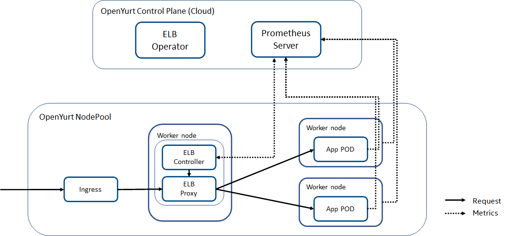

# An edge load balancer for OpenYurt nodepool

## Table of Contents

[Tools for generating](https://github.com/ekalinin/github-markdown-toc) a table of contents from markdown are available.

- [Title](#title)
  - [Table of Contents](#table-of-contents)
  - [Glossary](#glossary)
  - [Summary](#summary)
  - [Motivation](#motivation)
    - [Goals](#goals)
    - [Non-Goals/Future Work](#non-goalsfuture-work)
  - [Proposal](#proposal)
    - [User Stories](#user-stories)
      - [Story 1](#story-1)
      - [Story 2](#story-2)
      - [Story 3](#story-3)
      - [Story 4](#story-4)
    - [Requirements (Optional)](#requirements-optional)
      - [Functional Requirements](#functional-requirements)
        - [FR1](#fr1)
        - [FR2](#fr2)
        - [FR3](#fr3)
        - [FR4](#fr4)
      - [Non-Functional Requirements](#non-functional-requirements)
        - [NFR1](#nfr1)
        - [NFR2](#nfr2)
    - [Implementation Details/Notes/Constraints](#implementation-detailsnotesconstraints)
    - [Risks and Mitigations](#risks-and-mitigations)
  - [Alternatives](#alternatives)
  - [Upgrade Strategy](#upgrade-strategy)
  - [Additional Details](#additional-details)
    - [Test Plan [optional]](#test-plan-optional)
  - [Implementation History](#implementation-history)

## Glossary

Refer to the [Cluster API Book Glossary](https://cluster-api.sigs.k8s.io/reference/glossary.html).

## Summary

Edge Load Balancer (ELB) is a key feature of cloud/edge native cluster. Requsets, after dispatched by edge ingress, should be further routed to the most appropriate PODs based on various criteria:
1) nodes/PODs with specific devices such as GPU or other accelerators for AI inference;
2) current available resources of PODs including CPU, memory, GPU, etc.
3) other considerations such as debugging, testing, fault injection, rate limiting, etc.

## Motivation

There are kinds of workloads whose requests are not just simple networking based, instead would incur sustaining resource consumption of CPU, memory and GPU, etc., such as video analytics and cloud gaming typically. These workloads especially fit edge environment deployment and need traffic management involving current available resources of the backend PODs and nodes. A dynamic edge load balancer, after ingress and before workload PODs, should be inserted to do the traffic mangement for optimal performance of the edge cluster.

### Goals

- Allow users to specify requests routing policies;
- Collect system metrics through metrics monitoring services such as Prometheus;
- Analyze and verify the requests and match them with cluster's system capabilities;
- Route requests to proper PODs according to user specified devices priority and policies.

### Non-Goals/Future Work

- Metrics services for OpenYurt is not part of this proposal.

## Proposal

Edge Load Balancer (ELB) CRD definition lists below:

```go

// Policy defines how to distribute workloads among different PODs/nodes.
//      balance: schedule workload to the POD/node with the most compute resource which is specified by Device field;
//      round-robin: schedule workload to the PODs/nodes in round-robin mode, the threshold (ex., FPS) should be taken into consideration as well;
//                   If the threshold runs lower than a watermark, the next candidate will be evaluated;
//      squeeze: schedule workloads to the PODs/nodes as less as possible, inadequate threshold indicates to invoking a new node;
//      random: simply schedule request accorduing to a generated random number.

// ELBSpec defines the desired state of ELB
type ELBSpec struct {
	Usecase     string    `json:"usecase"`
	Devices     []string  `json:"devices,omitempty"` // device priority list
	Policy      string    `json:"policy,omitempty"`  // balance(default), round-robin, squeeze, random
	Performance int32     `json:"performance,omitempty"` // fps
}

// ELBStatus defines the observed state of ELB
type ELBStatus struct {
	Usecase     string    `json:"usecase"`
	Endpoints   []string  `json:"endpoints,omitempty"` // endpoints available
}

type ELB struct {
	metav1.TypeMeta   `json:",inline"`
	metav1.ObjectMeta `json:"metadata,omitempty"`

	Spec   ELBSpec   `json:"spec,omitempty"`
	Status ELBStatus `json:"status,omitempty"`
}

```

Development plan: hopefully this feature can be implementated and merged into OpenYurt Release 1.0.

### User Stories

#### Story 1

Requests of workloads should be routed to proper PODs according to specific load balance policies.
In one shopping mall scenario, many cameras have been deployed for doing crowd statistics. The streams would feed to backend compute servers to do in field video analysis. Operator of the systems want the workloads be evenly distributed among the compute resources.

#### Story 2

Users want to be able to customize request routing rules.
In the afore-mentioned shopping mall case, users may want prioritize between various compute devices, such as CPU, GPU, VPU, FPGA, etc.

#### Story 3

Users want to be able to decide the target device for their workloads. Users man want specify a concrete device to do computation.

#### Story 4

Users want to run workloads with optimal performance expectation. For example, users may specify concrete performance target such as fps, ELB would try to fulfill this goal by routing request to the most capable POD.

### Requirements (Optional)

#### Functional Requirements

##### FR1

ELB controller reconciles ELB CRs including use case name, user defined policy, etc., and collects compute resouces metrics push them to ELB proxy.

##### FR2

ELB proxy receives requests from YurtIngress, then analyzes and verifies the requests and matches them with the nodepool's system capabilities.

##### FR3

Based on the metrics data and the specified policy, ELB proxy routes the requests to the proper PODs.

#### Non-Functional Requirements

##### NFR1

We suppose metrics service is working correctly in OpenYurt nodepool environment, so Metrics services for OpenYurt is not part of this proposal.

##### NFR2

We suppose that the required xPU device plugins are available, for ex., those for Intel's discrete GPU.

### Implementation Details/Notes/Constraints

The ELB is located after Ingress, and it runs at the nodepool level as ingress. So same as ingress, we also need an operator to handle ELB's deploy, delete, upgrade for nodepools.

The ELB consists of two parts, a controller and a proxy (worker). For the part of porxy, we can reuse off the shelf proxy solutions such as Envoy (https://github.com/envoyproxy/envoy) proxy or linkerd2-proxy (https://github.com/linkerd/linkerd2-proxy). The reason is that essentially the ELB worker is a proxy for traffic management and the core function overlaps with the mentioned products. Given that they implement HTTP/gRPC or L4 traffic management, and they are born to do the networking transparently and elegantly, by sidecar for instance, so we can augment them with metrics based traffic management and corresponding configuration information ingestion. This is the data plane.

The controller which runs in control plane will do metrics collection, workload backend collection, configuration management. It will push the configuration and metrics data updates to the proxy.



### Risks and Mitigations

- What are the risks of this proposal and how do we mitigate? Think broadly.
  If we reuse the off the shelf product, we need to do augmentation elegantly, for easy development and maintenance.
- How will UX be reviewed and by whom?
  ELB shoulde be best used by an End-to-End deployment opetrator for automatic CR injection.
- How will security be reviewed and by whom?
  Security is solved by reusing proxy products.
- Consider including folks that also work outside the SIG or subproject.

## Alternatives

The `Alternatives` section is used to highlight and record other possible approaches to delivering the value proposed by a proposal.

## Upgrade Strategy

If applicable, how will the component be upgraded? Make sure this is in the test plan.

Consider the following in developing an upgrade strategy for this enhancement:
- What changes (in invocations, configurations, API use, etc.) is an existing cluster required to make on upgrade in order to keep previous behavior?
- What changes (in invocations, configurations, API use, etc.) is an existing cluster required to make on upgrade in order to make use of the enhancement?
  If the hardware updates, especially new CPU/GPU is engaged, or new inference algorithm is involved for example, we may need to upgrade the software, since the ELB algorithm is depending on the above mentioned.

## Additional Details

### Test Plan [optional]

## Implementation History

- [x] 06/25/2022: Revision
- [ ] MM/DD/YYYY: Compile a Google Doc following the CAEP template (link here)
- [ ] MM/DD/YYYY: First round of feedback from community
- [ ] MM/DD/YYYY: Present proposal at a [community meeting]
- [ ] MM/DD/YYYY: Open proposal PR

