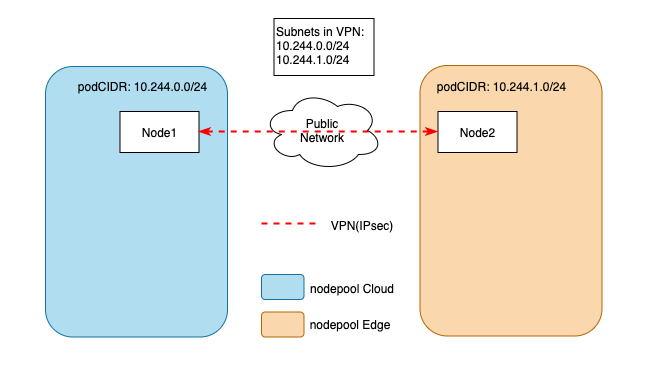
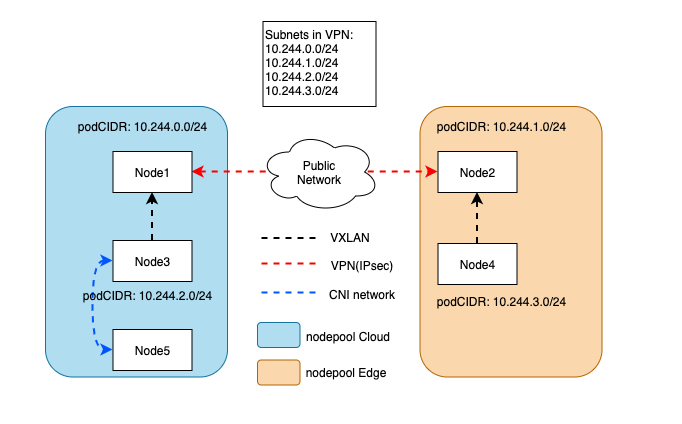
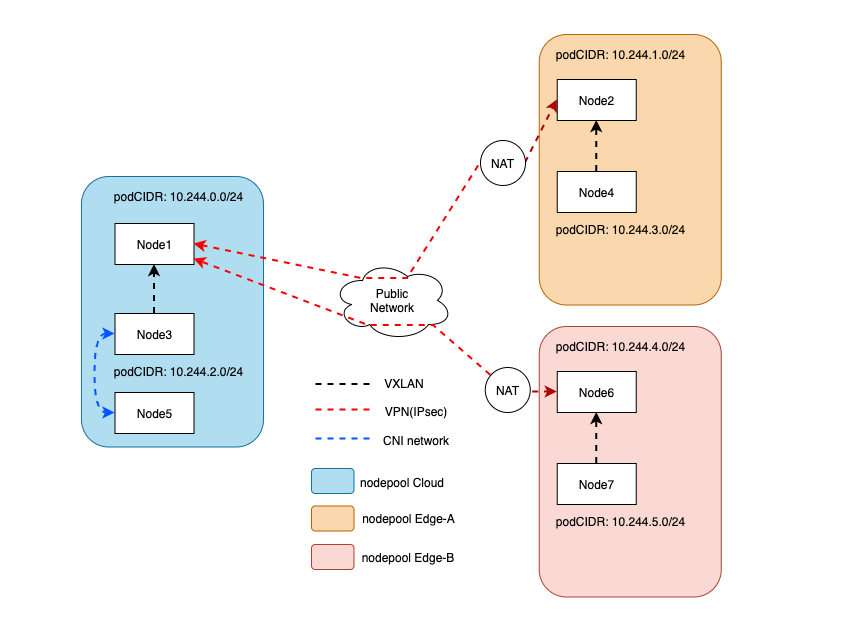

# Proposal to enhance the capabilities of cluster networking

## Table of Contents
- [Proposal to enhance the capabilities of cluster networking.](#proposal-to-enhance-the-capabilities-of-cluster-networking)
  - [Table of Contents](#table-of-contents)
  - [Glossary](#glossary)
  - [Summary](#summary)
  - [Motivation](#motivation)
    - [Goals](#goals)
  - [Proposal](#proposal)
    - [Use IPsec as the VPN implementation](#use-ipsec-as-the-vpn-implementation)
    - [Routing Rules Setting](#routing-rules-setting)
      - [Get the Cross-Nodepool Pod CIDRs](#get-the-cross-nodepool-pod-cidrs)
      - [Use Vxlan for Inner-Nodepool Communications](#use-vxlan-for-inner-nodepool-communications)
    - [Gateway Node Also Act as a Router to Connect Multiple VPNs](#gateway-node-also-act-as-a-router-to-connect-multiple-vpns)
    - [New CRDs](#new-crds)
      - [RavenGateway or RavenEndpoint](#ravengateway-or-ravenendpoint)
      - [RavenMeshTopology](#ravenmeshtopology)
    - [New Components](#new-components)
      - [RavenAgent](#ravenagent)
    - [Network Path Across Nodepool](#network-path-across-nodepool)
      - [Pod on Gateway Node to Pod on Gateway Node](#pod-on-gateway-node-to-pod-on-gateway-node)
      - [Pod on Non-gateway Node to Pod on Gateway Node](#pod-on-non-gateway-node-to-pod-on-gateway-node)
    - [Network Path within the Nodepool](#network-path-within-the-nodepool)
    - [Test Plan](#test-plan)
    - [User Stories](#user-stories)
      - [Story 1](#story-1)
      - [Story 2](#story-2)
    - [Other Problems](#other-problems)
      - [H/A Consideration](#ha-consideration)
      - [Node Autonomy Consideration](#node-autonomy-consideration)
      - [Host Network Restriction](#host-network-restriction)
  - [Implementation History](#implementation-history)

## Glossary

Refer to the [Cluster API Book Glossary](https://cluster-api.sigs.k8s.io/reference/glossary.html).

## Summary

In this proposal, we will introduce a network solution for OpenYurt to enhance cluster networking capabilities.
This enhancement is focused on edge-edge and edge-cloud communication in OpenYurt.
In short, this solution will provide layer 3 network connectivity among pods in different physical regions,
as there are in one vanilla Kubernetes cluster.

This proposal is inspired by [submariner](https://github.com/submariner-io/submariner), which is capable to connect multiple Kubernetes clusters.
Compared to multi-cluster architecture, OpenYurt follows single cluster architecture design, which reduces the complexity.

According to the community voting result ([#663](https://github.com/openyurtio/openyurt/issues/663)), the name of our
new networking project will be Raven.

## Motivation

Edge-edge and edge-cloud communication is a common issue in edge computing scenarios.
In OpenYurt, we have introduced YurtTunnel to cope with the challenges of O&M and monitoring in edge-cloud collaboration.

YurtTunnel provides the capabilities to execute kubectl exec/logs to edge nodes and scrap metrics from edge nodes.

However, the problem that YurtTunnel solved is just a subset of edge-cloud communication, and currently there is no solution in OpenYurt for edge-edge communication.

In some scenarios, pods in different physical regions in OpenYurt cluster may need to talk to others using pod IP,
service IP, or service domain name, as those pods are in a vanilla Kubernetes cluster.

This proposal aims to make it possible.

### Goals

- Design a network model of OpenYurt to achieve cross-nodepool communication.
- Provide layer 3 network connectivity among pods across different nodepools, which means
  pods in different nodepools can talk to each other by using pod IP, service IP and service domain name, as there
  are in one vanilla Kubernetes cluster.
- Replace the YurtTunnel.

## Proposal

The basic idea is simple, build a layer 3 VPN tunnel between two nodes in different node pools so that
the traffic between pods in different node pools can go through the VPN tunnel. The VPN tunnel should be a
bi-directional site-to-site VPN, which means it:
* provides bi-directional connectivity;
* is able to connect multiple networks rather than just connect two nodes that setting up the VPN tunnel.

The nodes in each node pool that are responsible for setting up the VPN tunnel are called **gateway node**.
Pods in local gateway can communicate with pods in remote gateway through the VPN tunnel directly.
Meanwhile, the nodes other than gateway node will need helps of the gateway nodes:
* When sending an IP packet to the remote node pool from a non-gateway node, the packet should be routed to the local
gateway first and then go through the VPN tunnel.
* When receiving an IP packet for other nodes, the gateway node should forward the packet to the specified node.

To summarize, we have 3 main problems to solve:
1. Set up layer 3 bi-directional site-to-site VPN tunnel between two nodes in different node pools.
2. Set up routing rules in node pools.
3. Design some CRDs to describe all required information about how to do 1 and 2 programmatically.

### Use IPsec as the VPN implementation

Our first problem is to set up layer 3 bi-directional site-to-site VPN tunnel between two nodes in different node
pools. In edge scenarios, it is common that the edge nodes are sitting behind NAT devices that are out of the user control,
which means they don't have public IPs and can not be accessed from public network. The VPN tunnel is expected to work in
such cases, on the other words, it should support NAT-T(NAT traversal).

More generally, the VPN implementation should support the flowing network topologies:
* Nodes are sitting behind a load balancer or a NAT gateway, which is controlled by the user;
* Nodes are sitting behind a NAT device, which is out of users control.
* Nodes have public IP on the network interface;
* Nodes are using elastic IP or floating IP which is not visible on the network interface;

Base on these requirements, [IPsec](https://en.wikipedia.org/wiki/IPsec) and [WireGuard](https://www.wireguard.com/)
are two options. I suggest that we select IPsec in our first implementation, as it is widely used. We may support
WireGuard and other VPN implementations in the future.

For IPsec, we can use [libreswan](https://github.com/libreswan/libreswan) as the IKE daemon to help with the tunnel
setup.

Once the VPN has been set up, the pods in gateway nodes would be able to communicate through the VPN tunnel:



### Routing Rules Setting

As mentioned above, some routing rules are required when sending/receiving packets to/from the remote node pool.

- For outgoing packets, non-gateway nodes should set the local gateway node as the next hop for cross-nodepool
  communications.
- For incoming packets, the routing rules are managed by the CNI plugin.

Usually, the CNI plugin in the cluster (flannel/calico) has already set up some routing rules for their purpose.
To prevent from affecting those rules, we had to create a new routing table for cross-nodepool packet routing.
We name the new routing table as **cross_edge_table**. In order to bypass the routing rules set up by the CNI plugin,
**cross_edge_table** must have higher priority than the main routing table when forwarding cross-nodepool packets.

For example, in an OpenYurt cluster using flannel, the main routing table of one node may look like:
```bash
$ ip r
default via 10.0.20.1 dev eth0
10.0.20.0/22 dev eth0 proto kernel scope link src 10.0.20.13
10.244.1.0/24 dev cni0 proto kernel scope link src 10.244.1.1
10.244.0.0/24 via 10.244.0.0 dev flannel.1 onlink
10.244.2.0/24 via 10.244.2.0 dev flannel.1 onlink
10.244.3.0/24 via 10.244.3.0 dev flannel.1 onlink
169.254.0.0/16 dev eth0 scope link metric 1002
172.17.0.0/16 dev docker0 proto kernel scope link src 172.17.0.1
```
We assume that `10.244.0.0/24` and `10.244.1.0/24` belong to `nodepoolA`, `10.244.2.0/24` and `10.244.3.0/24`
belong to `nodepoolB`. The node holding `10.244.0.0/24` and `10.244.2.0/24` are the gateway nodes. Then the
**cross_edge_table** on node `10.244.0.0/24` may look like:
```bash
$ ip rule
0:	from all lookup local
# Set up route policy for pod CIDR of nodepoolB to use cross_edge_table.
32764:	from all to 10.244.2.0/24 lookup cross_edge_table
32765:	from all to 10.244.3.0/24 lookup cross_edge_table
32766:	from all lookup main
32767:	from all lookup default
$ ip r list table cross_edge_table
# 10.0.20.13 is the private IP of the local gateway node.
# We need to set a smaller MTU for IPsec traffic, the concrete number is yet to be determined.
default via 10.0.20.13 dev eth0 mtu 1400
```

#### Get the Cross-Nodepool Pod CIDRs
Kubernetes will assign `podCIDR` for all nodes. In most cases, the CNI plugin (e.g: flannel) will respect `podCIDR`
value when assigning pod IP. However, some CNI plugins (e.g: calico) may have their own IPAM plugin which may not
follow the `podCIDR`. I suggest that we should support `podCIDR` first, and then maybe support other IPAM plugins in
the future.

With `podCIDR`, we can list/watch node resource to group node's podCIDR by their node pools and put cross-nodepool
podCIDRs into new routing tables.

#### Use Vxlan for Inner-Nodepool Communications
As we will set the gateway node as the next hop of non-gateway nodes for cross-nodepool communications. It requires
layer 2 connectivity among nodes within the node pool. But from the perspective of node pool, it only requires layer
3 connectivity among nodes. To fill up the gap, we can use vxlan to virtualize a layer 2 network between gateway nodes
and non-gateway nodes.



If the user can make sure that the nodes within the node pool will be in the same layer 2 network, then vxlan is not
necessary. We will provide options for users to choose the backend. It is similar to `host-gw` mode and `vxlan`
mode in flannel.

### Gateway Node Also Act as a Router to Connect Multiple VPNs
When establishing IPsec VPN tunnel, the gateways of each side must have at least one-way connectivity to each other on
their public or private IP address. If both `nodepoolA` and `nodepoolB` are sitting behind NAT devices and
both can not be accessed from public network, there is no way to set up a VPN tunnel between them. Under such
circumstances, we can leverage the third node pool, which both `nodepoolA` and `nodepoolB` can connect to and establish VPN
tunnels, to route packets between `nodepoolA` and `nodepoolB`. In most cases, the cloud node pool will be the "third
node pool".



### New CRDs

#### RavenGateway or RavenEndpoint
`RavenGateway` or `RavenEndpoint` CRD is used to describe how to set up the VPN tunnel. It contains all information
about how to set up the VPN tunnel.

(The CRD details is to be determined)

#### RavenMeshTopology
`RavenMeshTopology` is used to define the network topology, which controls where the VPN tunnel show be set up
and whether to route packets across multiple VPNs. By default, raven will set up VPN tunnel between cloud node
pool and all edge node pools, which achieves cloud-edge communications. If we want to achieve edge-edge
communications, we can use `RavenMeshTopology` CRDs.

Before applying `RavenMeshTopology` CRDs, we should label the relevant nodes to join them into the topology.
As one node may participate in multiple topologies, we can use `topology.raven.openyurt.io/{mesh_name}="""` to
specify which topology the node is participating.

For examples, if the node is participating in `full-mesh` and `region-a` topologies, then the node label should look
like:
* topology.raven.openyurt.io/full-mesh=""
* topology.raven.openyurt.io/region-a=""

When `raven-agent` ups, it will get the topology names from node labels, and then list/watch relevant
`RavenMeshTopology` resources to learn the topologies and get all information about how to set up the VPN tunnel
and routing rules.

When a `RavenMeshTopology` resource is applied, the controller will generate the `RavenMeshTopologyStatus` based on
`RavenGateway` or `RavenEndpoint` which provide information for `raven-agent` to set up the VPN tunnel and routing
rules.

(The CRD details is to be determined.)
```golang
type RavenMeshTopology struct {
  metav1.TypeMeta   `json:",inline"`
  metav1.ObjectMeta `json:"metadata,omitempty"`

  Spec   RavenMeshTopologySpec   `json:"spec,omitempty"`
  Status RavenMeshTopologyStatus `json:"status,omitempty"`
}
type RavenMeshTopologySpec struct {
	// NodePoolSelector selects all nodepools that are participating in this topology.
	NodePoolSelector metav1.LabelSelector
}
type RavenMeshTopologyStatus struct {
	// to be determined.
}
```

### New Components

#### RavenAgent
A new component that is responsible for the VPN setup/teardown and routing rule configuration. `rave-agent`
should be deployed as a daemonset on every node. Because of the "Host Network Restriction", the layer 4 tunnel
provided by YurtTunnel is still needed. To avoid adding new component on the edge side,
we can integrate `yurt-tunnel-agent` into `raven-agent`.

### Network Path Across Nodepool

#### Pod on Gateway Node to Pod on Gateway Node
Gateway to Gateway communication is straightforward, they talk to each other through the VPN tunnel.

#### Pod on Non-gateway Node to Pod on Gateway Node
The traffic from the non-gateway node to the remote gateway is routed to the local gateway first.
Then transit through the VPN tunnel to the remote gateway node. Relevant routing rules are set up by the RavenAgent.

### Network Path within the Nodepool
The VPN tunnel and the routing rules will take no effect on the traffic within nodepool. The traffic within nodepool is managed by the CNI plugin.

### Test Plan
The compatibility with various CNI plugins needs to be tested.

### User Stories

#### Story 1
As a user, I want to connect two or more nodepool, so that pods in those nodepools can communicate with each other by pod ip.
#### Story 2
As a user, I want to connect pod on the edge via pod IP from cloud nodes and vice versa.

### Other Problems
This section contains some problems that need more community discussions.
#### H/A Consideration
Instances of the RavenAgent in a nodepool can be more than one for fault tolerance.
They perform a leader election process to determine the active instance and the others await in standby mode
ready to take over should the active instance fail.

#### Node Autonomy Consideration
Yurthub should cache apiserver response for RavenAgent.
When the edge-cloud connection gets blocked, RavenAgent can not get the real-time status of each other via
list/watch mechanism.
Thus, RavenAgent is not aware of failover of the other side, and when failover occurs, the VPN tunnel is broken.

To fix that:
1. RavenAgent should be able to detect the VPN status. Once it detects failover on the other side, it will try to connect the other backup.
2. RavenAgent should be able to get the current active gateway without the help of apiserver. Once it detects
   failover on the local side, it should adjust the routing table to route traffic to the newly active gateway.

#### Host Network Restriction
As the nodes in OpenYurt are allowed to have the same node IP, cross-nodepool host network connectivity is not always possible.
For instance, the user wants to connect two nodepools in different VPC but have the same subnet 192.168.0.1/24,
because of the subnet conflict, the VPN can not connect the host network between these two nodepools.

## Implementation History

- [x] 10/20/2021: Proposed idea in an issue [#527](https://github.com/openyurtio/openyurt/issues/527)
- [x] 11/29/2021: Open proposal PR


