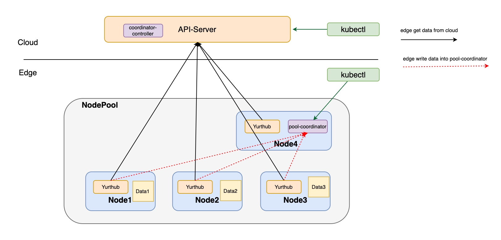
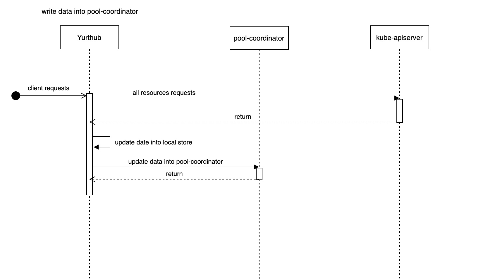
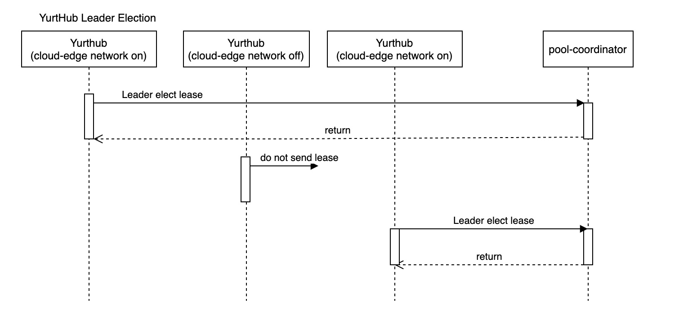
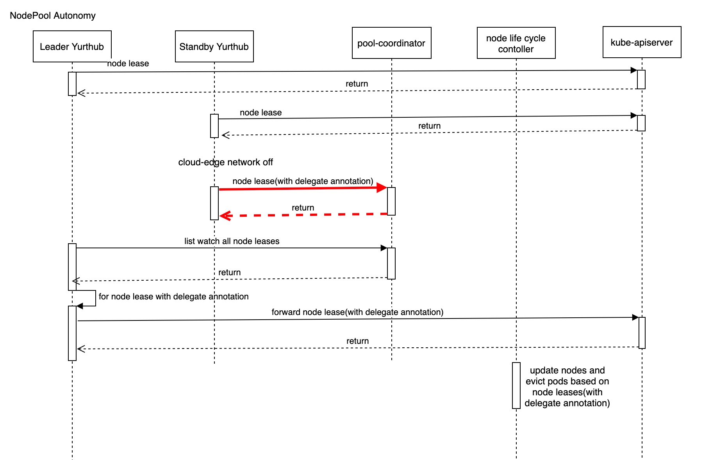

# Proposal to add the governance capability of NodePool
## Table of Contents

- [Proposal to add the governance capability of NodePool](#Proposal to add the governance capability of NodePool)
  - [Table of Contents](#table-of-contents)
  - [Glossary](#glossary)
  - [Summary](#summary)
  - [Motivation](#motivation)
    - [Goals](#goals)
    - [Non-Goals/Future Work](#non-goalsfuture-work)
  - [Proposal](#proposal)
    - [Principles](#principles)
    - [Architecture](#architecture)
    - [Implementation Details](#implementation-details)
      - [Coordinator-Controller](#coordinator-controller)
      - [Pool-Coordinator](#pool-coordinator)
      - [Operations and Maintenance in NodePool](#operations-and-maintenance-in-nodepool)
        - [Write Resources to pool-coordinator](#write-resources-to-pool-coordinator)
        - [Kubeconfig for users to access pool-coordinator](#kubeconfig-for-users-to-access-pool-coordinator)
      - [NodePool Autonomy](#nodepool-autonomy)
    - [User Stories](#user-stories)
    - [Other Problems](#other-problems)
      - [H/A Consideration](#ha-consideration)

## Glossary
Refer to the [Cluster API Book Glossary](https://cluster-api.sigs.k8s.io/reference/glossary.html).

## Summary

In order to better manage edge nodes, OpenYurt introduces the concept of NodePool.
Due to the features of node pool, such as network stability between nodes, management convenience
 (workload: YurtAppSet, YurtAppDaemon), more users will do things around the node pool.
 Meanwhile we want to use the feature of node pool to solve the problems caused by the network in the cloud-edge scenario.

Therefore, in this proposal, we will introduce `NodePool governance capability`.
By deploying coordinator Pod(kube-apiserver and etcd in one pod) in a node pool and designing the cooperation mechanism between YurtHubs,
OpenYurt can support users to operate and maintain in the node pool scope, and solve the problems caused by the cloud-edge network.

## Motivation

In native Kubernetes, if master does not receive the heartbeat of the node, the node status is marked as Notready.
Then kube-controller-manager will evict the pods on the NotReady node.

In edge scenario, not only node failures but also network disconnection can cause the master to fail to receive node heartbeats.
If the pods are evicted and rebuilt due to the disconnection of the cloud-edge network, it will bring challenges to the business.
So there needs to be a more precise way of distinguishing between the two cases.

OpenYurt provides CRDs such as NodePool, YurtAppSet, and YurtAppDaemon for regional management of resources and workloads.
As the scale of the cluster increases, in order to obtain the resources of the same NodePool, users need to filter a large amount of data,
which greatly affects the efficiency and easily causes errors.

This proposal makes it possible to solve the above problems through `NodePool governance capability`.

### Goals

- NodePool can provide some Non Resource API processing capabilities, such as /version, /api-resources requests.
- The master can distinguish whether the node NotReady is caused by node failure or network disconnection
when the NodePool is not completely disconnected from the cloud (at least one node can be connected to the cloud).
If it is a node failure, the pod will be evicted, and if it is a network disconnection, it will not be evicted.
- Provide NodePool operation and maintenance capabilities. Users can obtain resource in the node pool (kubectl get nodes/pods),
as well as the logs of the nodes in the node pool (such as kubectl logs/exec/cp/top/port-forward/attach, etc.)

### Non-Goals/Future Work

- `NodePool governance capability` provides basic operation and maintenance capabilities,
but does not support the CRUD capabilities of resources (such as creating, upgrading, deleting pods, etc.).
- When the node pool is completely disconnected from the cloud, the cloud cannot distinguish
whether the node NotReady is caused by node failure or network disconnection.
Therefore, if the edge node fails at this time, the cloud will not evict and rebuild pods.
That is to say, the high availability of services in the node pool is not involved in this solution.

## Proposal

### Principles

- No modification to k8s, keeping it non-invasive.
- The `NodePool governance capability` has no impact on the OpenYurt, and can be free to go online and offline.
- The cloud center is the source of truth to ensure the consistency of cloud and edge data.
- The design is simple, reliable and stable.

### Architecture

To provide `NodePool governance capability`, we add a component `pool-coordinator` to the NodePool.
pool-coordinator should not replace the kube-apiserver on the cloud, but only provide governance capabilities in NodePool scope.
Its structure is as follows:



- The `coordinator-controller` deployed in the cloud manages the pool-coordinator through YurtAppSet.
When NodePool enables the NodePool governance capability, pool-coordinator will be automatically deployed by coordinator-controller in NodePool.
- When pool-coordinator  starts, all YurtHubs in NodePool upload the node scope resources cached on their nodes to pool-coordinator,
including pod, configmap, secrets, service, node, lease, serviceaccount, etc.
- When the edge node can connect to the master, YurtHub directly accesses the kube-apiserver,
caches the data returned by the cloud locally, and updates the data to pool-coordinator in time.
This ensures that users can obtain the latest resources when operating in the node pool (such as kubectl get).
- When the node can connect to the cloud, YurtHub sends node lease to the cloud. However,
when the node is disconnected from the cloud, YurtHub adds an agent forwarding Annotation to the node lease and
sends it to pool-coordinator, then leader YurtHub forwards it to the cloud in real time.
- When NodePool disables the NodePool governance capability, coordinator-controller will clean up the pool-coordinator belonging to this NodePool.

### Implementation Details

#### Coordinator-Controller

coordinator-controller is used to manage the life cycle of the pool-coordinator in each NodePool and deployed as deployment.

coordinator-controller can be described as:

- Initialize work at startup:
1. coordinator-controller will block until the YurtAppSet CRDs are ready.
2. coordinator-controller prepares the client certificate to access the kubelet for pool-coordinator,
saves the certificate in secret and mounts it to pool-coordinator.
Note that all pool-coordinators can share this client certificate.
3. coordinator-controller prepares the client certificate for forwarding node lease to cloud by yurthub,
saves the client certificate in secret and will be used by leader yurthub.
4. coordinator-controller creates service for pool-coordinator.
5. coordinator-controller generates a YurtAppSet Object for managing pool-coordinator, and set field 'pool' to empty.

- Reconcile:
1. coordinator-controller will list/watch PoolCoordinator CR. When user creates a PoolCoordinator CR, coordinator-controller adds the NodePool information
to YurtAppSet, so that a pool-coordinator instance will be deployed in the NodePool. Note that the coordinator-controller refuses to
deploy the pool-coordinator when the number of nodes in the NodePool is less than 3, or if a pool-coordinator has been deployed in the NodePool.
2. When pool-coordinator is scheduled, coordinator-controller prepares the tls server certificate for pool-coordinator,
saves the certificate in secret and mounts it to pool-coordinator. Note that the tls server certificate for each pool-coordinator is different
because certificate includes the pool-coordinator service clusterIP and the node IP.
3. coordinator-controller generates kubeconfig for users to access pool-coordinator. The server address in kubeconfig is set to
https://{nodeIP}:10270. In addition, the client certificate authority in kubeconfig should be restricted. For details,
please refer to the [kubeconfig of pool-coordinator](#kubeconfig-for-users-to-access-pool-coordinator).
4. When the pool-coordinator is rebuilt, coordinator-controller will clean up and rebuild the tls server certificate.
5. When PoolCoordinator CR is deleted, coordinator-controller will delete the NodePool information in YurtAppSet. It also cleans up
the certificates of pool-coordinator(tls server certificate and kubeconfig).

Since node autonomy already supported by OpenYurt and [NodePool Autonomy](#nodepool-autonomy) are applicable to
different scenarios, both abilities cannot be enabled at the same time. We do it through admission webhook.

#### Pool-Coordinator

pool-coordinator will store various resources in the node pool, including node, pod, service, endpoints, endpointslices, etc.
pool-coordinator is managed by YurtAppSet and deploys kube-apiserver and etcd in one pod. Here resources in etcd will be stored in memory instead of disk.

```go
// PoolCoordinator CRD
type PoolCoordinator Struct {
	metav1.TypeMeta
	metav1.ObjectMeta
	Spec PoolCoordinatorSpec
	Status PoolCoordinatorStatus
}

type PoolCoordinatorSpec struct {
  	// Version of pool-coordinator, which corresponding to the Kubernetes version
  	Version string
  	// The NodePool managed by pool-coordinator.
	NodePool string
}

type PoolCoordinatorStatus struct {
  	// The node where pool-coordinator is located.
  	NodeName string
 	// Conditions represent the status of pool-coordinator, which is filled by the coordinator-controller.
  	Conditions []PoolCoordinatorCondition
  	// DelegatedNodes are the nodes in the node pool that are disconnected from the cloud.
  	DelegatedNodes []string
  	// OutsidePoolNodes are nodes in the node pool that cannot connect to pool-coordinator.
  	OutsidePoolNodes []string
}

type PoolCoordinatorCondition struct {
	Type PoolCoordinatorConditionType
  	Status ConditionStatus
  	LastProbeTime metav1.Time
  	LastTransitionTime metav1.Time
	Reason string
	Message string
}

type PoolCoordinatorConditionType string

const (
	// PoolCoordinatorPending indicates that the deployment of pool-coordinator is blocked.
	//This happens, for example, if the number of nodes in the node pool is less than 3.
	PoolCoordinatorPending PoolCoordinatorConditionType = "Pending"
	// PoolCoordinatorCertsReady indicates that the certificate used by pool-coordinator is ready.
	PoolCoordinatorCertsReady PoolCoordinatorConditionType = "CertsReady"
  	// PoolCoordinatorReady indicates that pool-coordinator is ready.
  	PoolCoordinatorReady PoolCoordinatorConditionType = "Ready"
)

type ConditionStatus string

const (
	ConditionTrue    ConditionStatus = "True"
	ConditionFalse   ConditionStatus = "False"
	ConditionUnknown ConditionStatus = "Unknown"
)
```

- Https Server Certificate

coordinator-controller prepares the tls server certificate for kube-apiserer in pool-coordinator and mounts it into the pod through
a secret by using the patch feature of YurtAppSet. pool-coordinator runs in HostNetWork mode,
and the https server listening address is: https://{nodeIP}:10270.

- Service Discovery

pool-coordinator provides services by ClusterIP Service in Kubernetes, and all pool-coordinators share the service IP.

In order to ensure that pool-coordinator only serves nodes in the same node pool, the annotation of service topology needs to be added to the pool-coordinator service.

#### Operations and Maintenance in NodePool

In terms of operation and maintenance, pool-coordinator supports two types of requests:

- GET requests for resources in NodePool, such as nodes, pods, etc.
- Native kubernetes operation and maintenance requests for pods in NodePool, such as kubectl logs/exec/cp/attach, etc.

To support the above capabilities, the following problems need to be solved:

##### Write Resources to pool-coordinator

In OpenYurt, the data flow between cloud and edge is: kube-apiserver --> yurthub --> kubelet (and other clients).
In order to ensure data consistency and efficiency, pool-coordinator reuses the current data flow of OpenYurt.
The data flow of pool-coordinator is: kube-apiserver --> yurthub --> pool-coordinator. Data in pool-coordinator is written by each YurtHub.

YurtHub updates data to pool-coordinator, so it requires Create/Update permissions for resources. After the pool-coordinator starts,
we need to prepare the CRD NodePool, clusterrolebinding associated with `system:nodes` group and admin clusterrole in the kube-apiserver.
This ensures that YurtHub can successfully write to etcd using node client certificate.



##### Kubeconfig for users to access pool-coordinator

Kubeconfig is generated by coordinator-controller, and the organization configuration of client certificate is: `openyurt:coordinators`.

In addition, add the get permission of the resource and the operation and maintenance permissions(logs/exec) for the
group `openyurt:coordinators` to kube-apiserver of pool-coordinator.

#### NodePool Autonomy

In order to know whether the failure to receive a node lease is caused by node failure or network disconnection,
we design `node-lease proxy mechanism`.

In the same node pool, when the node is disconnected from the cloud,the leader YurtHub connected to the cloud forwards
the node lease to the cloud. It can be described as:


**Note:** If the lease of pool-coordinator  node is also need to be forwarded, the leader YurtHub will give priority to forwarding Node leases of its node.

The policy of the cloud controller is as follows:

|        | get node lease                               | get node lease with delegate annotation        | don't get node lease                       |
| ------ | -------------------------------------------- | ---------------------------------------------- | ------------------------------------------ |
| Policy | Node: Ready;<br>Pod: Maintain;<br> Endpoints: Maintain | Node: NotReady;<br>Pod: Maintain;<br>Endpoints: Maintain | Node: NotReady;<br>Pod: Evited;<br>Endponits: Update |

### User Stories

1. As a user, I can operate and maintain in the NodePool dimension, and can directly get the resources in the NodePool.
2. As a user, I want node pods not to be evicted when the node is disconnected from the cloud and want to reconstruct pod
in normal nodes when node downtime.

### Other Problems

#### H/A Consideration

Consider that when the pool-coordinator fails, each component can be fully rolled back.
Therefore, in order to save resources, only one pool-coordinator instance is deployed in each NodePool.