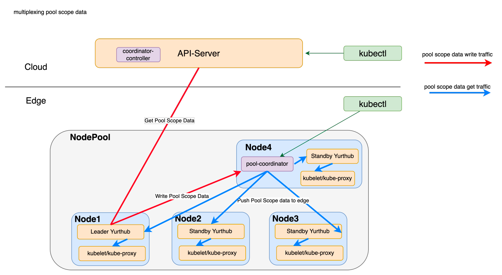
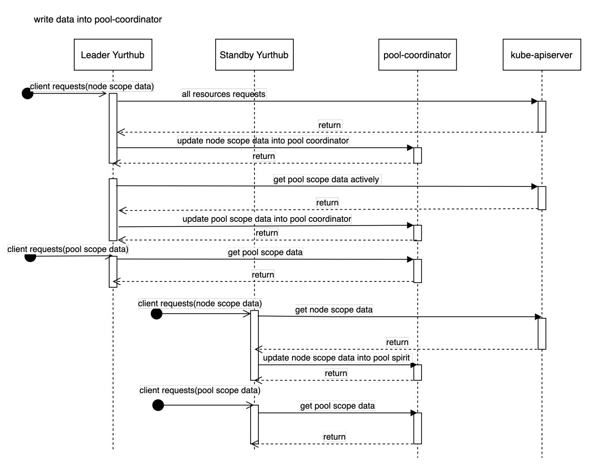

# Proposal to multiplexing cloud-edge traffic

## Glossary
Refer to the [OpenYurt Glossary](https://github.com/openyurtio/openyurt/blob/master/docs/proposals/00_openyurt-glossary.md).

## Summary
In OpenYurt cluster, the traffic between cloud and edge should go through public network. so it is very valuable to reduce the traffic between cloud and edge. In the proposal [#772]([https://github.com/openyurtio/openyurt/pull/772](https://github.com/openyurtio/openyurt/pull/772)), yurt-coordinator pod will be deployed in each node pool for storing metadata as a kv storage. In this proposal, we will approach a way to reduce cloud-edge traffic based on `yurt-coordinator`and ensure the consistency of edge side metadata.

## Motivation
In a large-scale OpenYurt cluster (eg: node > 1k, pod > 20k, service > 1k), since  coredns/kube-proxy on the edge nodes lists and watches all endpoints/endpointslices, the cloud-edge traffic will increase rapidly if pods are deleted and rebuilt due to business upgrade.  In addition, frequent node state switching(Ready/NotReady) will cause NodePool updates, which will also lead to a huge increase in cloud-edge traffic.
Based on the traffic statistics of Yurthub metrics(http://127.0.0.1:10267/metrics), the top traffic consuming requests on the edge nodes are as following:
- flannel list/watch nodes
- coredns/kube-proxy list/watch endpoints/endpointslices
- yurthub list/watch nodepools
- kubelet get node

This proposal makes it possible to solve the above problems through `multiplexing cloud-edge traffic`ability.

### Goals
In NodePool, for pool scope data (such as endpoints/endpointslices), there is only one copy of data traffic between cloud and edge. Each node in NodePool reuses nodepool scope data to reduce cloud edge traffic.

### Non-Goals/Future Work
node scope data will not be involved in this solution, every node in NodePool need to keep the original way to get node scope data.

## Proposal
### Definition

- pool scope data
  - The metadata from cloud of each node in the NodePool is the same, such as list/watch endpoints/endpointslices response by coredns and kube-proxy components.
- node scope data
  - The data of each node in the NodePool is unique, such as pods, secrets, configmaps, etc.

### Architecture
pool scope data(endpoints, endpointslices) is written to the yurt-coordinator by the leader YurtHub.
It is ensured that the pool scope data in the yurt-coordinator is the latest version, so list/watch requests for pool scope data from standby yurthub can be obtained from the yurt-coordinator and no longer obtained from the cloud, which can greatly reduce cloud-edge traffic.

The process can be described as:

- **Step1**: At the beginning, All YurtHubs send list/watch requests of pool scope data to the cloud.
- **Step2**: When the yurt-coordinator is started and the leader YurtHub is elected, the leader YurtHub creates new list/watch requests of pool scope data and writes the response data to the yurt-coordinator. Leader Yurthub will write a completion flag(a configmap) into yurt-coordinator for specifying pool scope data has synced and all yurthub will be notified that it's the time to list/watch pool scope data from yurt-coordinator. At this time, each YurtHub still sends list/watch requests to the cloud.
- **Step3**: After leader YurtHub finishes writing pool scope data, each YurtHub stops sending list/watch requests of pool scope data to the cloud and redirect list/watch requests to yurt-coordinator. At this time, only the leader YurtHub still maintains list/watch requests with the cloud and keeps writing data to the yurt-coordinator.
- **Step4**: If the yurt-coordinator goes offline, that is, NodePool governance capabilities is disabled, YurtHub redirect the List/Watch requests of pool scope data to the cloud again.

The following special cases may occur:

**Condition1**: If the leader YurtHub changes, the new leader will take over all the work: send list/watch requests of pool scope data to the cloud, and write data to yurt-coordinator. the former leader Yurthub stop the list/watch requests to the cloud.

**Condition2**: If the yurt-coordinator restarts/rebuilds, during the restart of the yurt-coordinator, YurtHub will still try to connect with the yurt-coordinator for a certain period of time. After yurt-coordinator starts,Step2-3 will be executed.

### Write Metadata into yurt-coordinator
Pool scope data and node scope data are stored in yurt-coordinator. Node scope data is written by each YurtHub, while pool scope data is written by only leader YurtHub.
Leader YurtHub is elected by all YurtHubs in node pool(like kube-controller-manager). Because it needs to ensure that the leader YurtHub can get the real-time pool scope data from kube-apiserver, the leader YurtHub and the cloud must be connected. When the leader is disconnected from the cloud, other YurtHubs connected to the cloud become the leader.

### User Stories

1. As a user, I would like to reduce traffic between cloud and edge as much as possible to reduce costs.

### Other tech points
#### Data Traffic Conclusion
|  | node scope data | pool scope data |
| --- | --- | --- |
| cloud-edge network on | cloud kube-apiserver --> yurthub --> kubelet/kube-proxy | cloud kube-apiserver --> leader yurthub --> yurt-coordinator --> every yurthub --> kubelet/kube-proxy |
| cloud-edge network off | edge node local storage --> yurthub --> kubelet/kube-proxy | 1. a completion flag exists in yurt-coordinator:  yurt-coordinator--> yurthub --> kubelet/kube-proxy  2. a completion flag does not exist in yurt-coordinator: edge node local storage --> yurthub --> kubelet/kube-proxy |

#### Pool Scope Data Protection
If resources for Endpoints/EndpointSlices of an empty list are returned from yurt-coordinator for some unknown reason, yurthub directly hacks the return of the list request to prevent data cleanup on edge nodes and return error to the clients.

#### Service Topology Notification
Through the traffic reuse of Pool Scope Data, some nodes in NodePool are disconnected from the cloud network. However, the nodes that are disconnected can also obtain the latest Endpoints/Endpointslices data (because they belong to pool Scope data) through yurt-coordinator, so the service topology changes in NodePool can also be notified when the network is disconnected.

## Implementation History
- [ ] 04/14/2022: Present proposal at a community meeting and collect feedbacks.
- [ ] xx/xx/2022: Finalize the proposal.