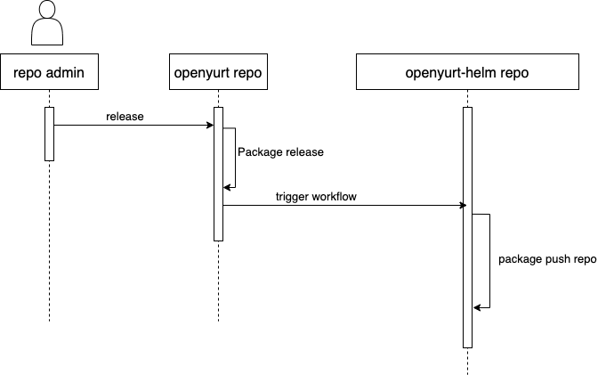

# Install openyurt components using helm

## Table of Contents
- [Proposal for open-yurt helm package](#title)
  - [Table of Contents](#table-of-contents)
  - [Glossary](#glossary)
  - [Summary](#summary)
  - [Motivation](#motivation)
    - [Goals](#goals)
  - [Proposal](#proposal)
    - [User Stories](#user-stories)
    - [Implementation Details](#implementation-details)
    - [Sequence Diagram](#sequence-diagram)

## Glossary

Refer to the [Helm Glossary](https://helm.sh/docs/glossary/).

## Summary
In order to deploy and use OpenYurt, OpenYurt provides users with 5 deployment methods. From a beginner's point of view, there are too many installation methods, which can easily confuse end users. Maybe we need to reduce some installation methods, and we need to define specific scenarios for each installation method.
In order to simplify the installation process, in this proposal, we would like to provide a way of helm installation. We will write OpenYurt's chart package, which can enable OpenYurt to support installation using helm, and use the OpenYurt-helm repository to manage the chart package. In addition, we will design Github-action to synchronize the released chart package with the gh-pages branch. The entire release process is fully automated and requires no human intervention.

## Motivation
In order to deploy and use OpenYurt, OpenYurt provides users with a total of 5 deployment methods. There are too many installation methods, which can easily confuse users. In addition, using OpenYurt may often have to copy yaml files between different projects, which is cumbersome. This proposal seeks to address the above issues.

### Goals
- Provide the chart package of openyurt and openyurt components, and provide the way of helm installation.
- Automate the chart package publishing process without manual intervention.

## Proposal

### User Stories
1. As a developer of edge computing, I want to install openyurt-related components when deploying a k8s cluster for rapid development and testing.
2. As an end user, I would like to try out the features of OpenYurt.

### Implementation Details
- Which components need to organize the chart package:
  - yurt-controller-manager
  - yurt-app-manager
  - yurt-tunnel-server/agent
  - yurt-edgex-manager
  - yurt-dashboard

- Take the openyurt repo as an example:
  - Add a new chart package to the openyurt repository, and write the related chart package implementation.
  - Introduce openyurt-helm as an aggregate repo (existing), which references the chart package path just now.
  - Provide support for helm repo in openyurt-helm, and add a reusable pipeline. When triggered, scan the path of the corresponding component to generate the corresponding chart package, and synchronize the released chart package to the gh-pages branch.
  - Optional: In the release process of each component, add a pipeline, and the pipeline of openyurt-helm will be called during release.

### Sequence Diagram

