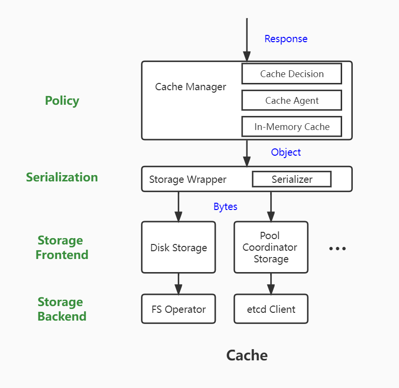

# Yurthub Cache Model Refactoring

- [Yurthub Cache Model Refactoring](#yurthub-cache-model-refactoring)
  - [1. Summary](#1-summary)
  - [2. Motivation](#2-motivation)
  - [3. Problems of Current Cache Structure](#3-problems-of-current-cache-structure)
    - [3.1 Coupling between Cache Policy and Storage Implementation](#31-coupling-between-cache-policy-and-storage-implementation)
      - [3.1.1 update object in the Store but compare rv in the CacheManager](#311-update-object-in-the-store-but-compare-rv-in-the-cachemanager)
      - [3.1.2 key of object depends on the DiskStorage implementation](#312-key-of-object-depends-on-the-diskstorage-implementation)
      - [3.1.3 storage recycling when deleting cache-agent depends on the DiskStorage implementation](#313-storage-recycling-when-deleting-cache-agent-depends-on-the-diskstorage-implementation)
      - [3.1.4 the implementation of saving list objects depends on the DiskStorage implementation](#314-the-implementation-of-saving-list-objects-depends-on-the-diskstorage-implementation)
    - [3.2 Definition of Store Interface is not explicit](#32-definition-of-store-interface-is-not-explicit)
      - [3.2.1 Operations of Create and Update are mixed](#321-operations-of-create-and-update-are-mixed)
      - [3.2.2 Definition of DeleteCollection is not explicit](#322-definition-of-deletecollection-is-not-explicit)
    - [3.3 Responsibility of each cache-related component is not explicit](#33-responsibility-of-each-cache-related-component-is-not-explicit)
      - [3.3.1 StorageWrapper should not care about in-memory cache](#331-storagewrapper-should-not-care-about-in-memory-cache)
      - [3.3.2 CacheManager should not care about the key format](#332-cachemanager-should-not-care-about-the-key-format)
    - [3.4 Non-cache Related Components Should not Use Storage](#34-non-cache-related-components-should-not-use-storage)
  - [4. Cache Ability Enhancement](#4-cache-ability-enhancement)
    - [4.1 Enable Yurthub to Distinguish resources with same name but different versions and groups](#41-enable-yurthub-to-distinguish-resources-with-same-name-but-different-versions-and-groups)
    - [4.2 Avoid Watch Request Flood When Yurthub offline](#42-avoid-watch-request-flood-when-yurthub-offline)
    - [4.3 Added New Interfaces for Storage to Handle ClusterInfo Requests](#43-added-new-interfaces-for-storage-to-handle-clusterinfo-requests)
  - [5. Yurthub Cache Model Proposal](#5-yurthub-cache-model-proposal)
    - [5.1 Description of Cache Model](#51-description-of-cache-model)
    - [5.2 Process of Cache](#52-process-of-cache)
  - [6. Implementation Details](#6-implementation-details)
    - [6.1 Definition of Store Interface](#61-definition-of-store-interface)
    - [6.2 Implementation of FS Operator](#62-implementation-of-fs-operator)
  - [7. How to solve the above problems](#7-how-to-solve-the-above-problems)

## 1. Summary

Refactoring cache-related components in Yurthub. Decouple cache policy with specific storage to make the responsibility of each component in the yurthub cache model more clear, and get good expensibility. After this refactoring, other storage can be added more conveniently and the CacheManager do not need to care about what the storage it uses is file system, etcd or, possibly be added later, sqlite.

## 2. Motivation

When implementing the feature of nodepool-governance-capability based on Yurt-Coordinator, it's found that CacheManager is coupled with DiskStorage, depending deeply on features of file system. Thus, it's difficult to add a new storage of Yurt-Coordinator. In addition, the responsibility of each cache-related component is not clear, making it difficult to maintain the code. For example, when querying cache for nodelease object, it will use the in-memory cache to speed up the query. However, the in-memory cache is implemented in the StorageWrapper, rather than in the CacheManager which should manage the cache policy.

## 3. Problems of Current Cache Structure

### 3.1 Coupling between Cache Policy and Storage Implementation

#### 3.1.1 update object in the Store but compare rv in the CacheManager

In the current implementation, when updating the object in the storage, CacheManager will compare rv of the object in `saveOneObjectWithValidation` and then notify the storage to do the actual updation. Dividing rv comparison and storage updation in different components makes them difficult to be in one atomic operation, which may result in the following error:

1. goroutine1 compares the rv of object in response with rv of object in the storage, called rv1 and rv0 respectively, satisfying `rv1 > rv0`. It decides to update the storage.
2. goroutine2 compares the rv of object in response with rv of object in the storage, called rv2 and rv0 respectively, satisfying `rv2 > rv0`. It decides to update the storage as well.
3. goroutine2 firstly completed the updation, and then the rv of object in the storage is rv2.
4. goroutine1 then completed the updation, and the rv of object in the storage is rv1. If `rv2 > rv1`, an error occurs replacing fresher object with staler object.

#### 3.1.2 key of object depends on the DiskStorage implementation

Currently, the key of object used in CacheManager is generated through `util.KeyFunc`, in the format of `component/resources/namesapce/name` which can only be recognized by DiskStorage. In Yurt-Coordinator, the key format should be `/registry/resources/namespace/name`, otherwise it cannot be recognized by the APIServer. It's obvious that `util.KeyFunc` is not generic for all storages.

#### 3.1.3 storage recycling when deleting cache-agent depends on the DiskStorage implementation

When deleting a cache-agent, CacheManager should recycle the cache used by this cache-agent. Currently, the CacheManager directly deletes the `component` directory and all the sub-directories from the file system. This recycling logic requires that the key format should be `component/resources/namespace/name`. As described above, not all storages use this key format.

#### 3.1.4 the implementation of saving list objects depends on the DiskStorage implementation

As described in [#265](https://github.com/openyurtio/openyurt/pull/265), each cache-agent can only have the cache of one type of list for one resource. Considering that if we update cache using items in list object one by one, it will result in some cache objects not being deleted. Thus, in `saveListObject`, it will replace all objects under the resource directory with the items in the response of the list request. It works well when the CacheManager uses DiskStorage, because cache for different components are stored at different directory, for example, service cache for kubelet is under `/etc/kubernetes/cache/kubelet/services`, service cache for kube-proxy is under `/etc/kubernetes/cache/kube-proxy/services`. Replacing the serivce cache of kubelet has no influence on service cache of kube-proxy. But when using Yurt-Coordinator storage, services for all components are cached under `/registry/services`, if replacing all the entries under `/registry/services` with items in the response of list request from kubelet, the service cache for kube-proxy will be overwritten.

### 3.2 Definition of Store Interface is not explicit

#### 3.2.1 Operations of Create and Update are mixed

In the implementation of Update of DiskStorage, it will also create the key if it does not exist, which is the logic of Create. So when we want to create an object in the storage, both Create and Update can be used, making the usage confusing.

#### 3.2.2 Definition of DeleteCollection is not explicit

Currently, the implementation of DeleteCollection in DiskStorage is just delete the passed-in rootKey as a directory . The DeleteCollection function is used only when recycling cache of cache-agent. If the DeleteCollection is used to delete all keys with the prefix of rootKey, it cannot successfully recycling the cache of the cache-agent in the Yurt-Coordinator storage, because the key is not has the component name as its prefix. If the DeleteCollection is used to recycling the cache of cache-agent, its parameter should not be rootKey. Only DiskStorage can recognize it as rootKey.

### 3.3 Responsibility of each cache-related component is not explicit

#### 3.3.1 StorageWrapper should not care about in-memory cache

Under the circumstance of edge autonomy, YurtHub will use the in-memory cache to speed up the process of specific requests from edge components, for example nodes request and leases request from kubelet. The implementation of this optimization is in StorageWrapper. Thus the StorageWrapper should know which component the request from. Considering that CacheManager only pass the key value as argument to StorageWrapper and not all key value has the information of component(such as key of Yurt-Coordinator), the CacheManager should additionally expose the component details to the StorageWrapper, which will result in the coupling of CacheManager and StorageWrapper, and make both two components have the logic of cache policy.

#### 3.3.2 CacheManager should not care about the key format

As described in 3.1, CacheManager depends on the key format at many places. Considering that different storage will have different key format, thus the implementation of CacheManager should not depends on the key format. It's the responsibility of storage that determine how to generate the key.

### 3.4 Non-cache Related Components Should not Use Storage

Some non-cache related components also use DiskStorage to read/write file from/to the file system, such as CertManager. But Storages is defined for cache objects, and should not be used in other way.

## 4. Cache Ability Enhancement

### 4.1 Enable Yurthub to Distinguish resources with same name but different versions and groups

Currently, disk storage in yurthub uses the key format `component/resource/namespace/name`, and support caching resources for components kubelet, kube-proxy, coredns, flannel and yurthub. Users can manually set the cache agent as `*` in configmap `yurt-hub-cfg` to extend the capability to other components. There comes the problem that yurthub currently cannot distinguish resources with same name but in different versions and groups, such as `NetworkPolicy` in `networking.k8s.io` and in `crd.projectcalico.org` which are both used by calico and their keys have the same prefix `go-http-client/networkpolicies`. When calico starts to list/watch NetworkPolicy in `networking.k8s.io`, it may replace the cache of NetworkPolicy in `crd.projectcalico.org` which cause errors.

Thus, we should enable yurthub, to be specific, disk storage, to distinguish resources with same name but different versions and groups. We can change the key format of disk storage as `component/resource.version.group/namespace/name` to solve the problem. And we should only make disk storage to use this key format without influence on the implementation of other storages, such as etcd for yurt-coordinator.

### 4.2 Avoid Watch Request Flood When Yurthub offline

Currently, when offline, Yurthub will hold the connection of watch request util timeout or the cloud is healthy. If the watch request does not contain timeout parameter, it will immediately stop handling. It will result in flood of watch request, if the client also immediately sends a new watch request to yurthub, which will cause the high usage of CPU.

Thus, we should set a default timeout for request without timeout parameter to avoid the flood of watch request.

### 4.3 Added New Interfaces for Storage to Handle ClusterInfo Requests

Currently, Yurthub will use the `Update` interface to update the ClusterInfo cache for requests like `/version` and `/apis/discovery.k8s.io/v1`. However, updating cluster info is different from updating resource objects which has the resourceVersion while the former dose not. So we should provide new interfaces for manipulating the cache of ClusterInfo instead of using `Update`.

## 5. Yurthub Cache Model Proposal



### 5.1 Description of Cache Model

The cache model has 4 layers: Policy, Serialization, Storage Frontend and Storage Backend.

The **Policy layer** takes the responsibility of cache policy, including determining if the object need to be cached(Cache Decision), if the response of this component need to be cached(Cache Agent), if the object should be cached in memory as well. Currently, the component in this layer is CacheManager.

The **Serialization layer** takes the responsibility of serialization/unserialization of cached objects. The logic in this layer is related to Kubernetes APIMachinery. The byte formats it needs to concern include json, yaml and protobuf. The types of objects it needs to concern include kubernetes native resources and CRDs. Currently, the component in this layer is StorageWrapper.

The **Storage Frontend** layer serves like a shim between the Serialization layer and Stroage Backend layer. It should provide interface to cache objects shielding the differences among different storages for the upper-layer. It also takes the responsibility of implementation of KeyFunc. Currently, the component in this layer is DiskStorage. We can add more storage in this layer later, such as Yurt-Coordinator Storage.

The **Storage Backend layer** is the entity that interacts with the storage to complete the actual storage operation. It can be implemented by ourselves, such as FS Operator, or be provided by third-party, such as clientv3 pkg of etcd.

### 5.2 Process of Cache

The input of CacheManager is the HTTP response with its request.

1. CacheManager reads the object in the response.
2. CacheManager determines the cache policy to apply to this object, according to the RequestInfo and Object metadata.
3. CacheManager uses KeyFunc exposed by the Storage Frontend to generate the key for the object.
4. CacheManager passes the key and the object to StorageWrapper.
5. StorageWrapper serializes the object into bytes, and passes the bytes and the key to Storage Frontend.
6. Storage Frontend uses the Storage Backend to cache the object into storage.

## 6. Implementation Details

### 6.1 Definition of Store Interface

```go

type Key interface {
	Key() string
}

type KeyBuildInfo struct {
	Component string
	Namespace string
	Name      string
	Resources string
	Group     string
	Version   string
}

// Store is an interface for caching data into store
type Store interface {
	// Name will return the name of this store.
	Name() string
	clusterInfoHandler
	objectHandler
	componentHandler
}

// clusterInfoHandler contains functions for manipulating cluster info cache in the storage.
type clusterInfoHandler interface {
	// SaveClusterInfo will save content of cluster info into storage.
	// If the content has already existed in the storage, it will be overwritten with content.
	SaveClusterInfo(key ClusterInfoKey, content []byte) error
	// GetClusterInfo will get the cluster info of clusterInfoType from storage.
	// If the cluster info is not found in the storage, return ErrStorageNotFound.
	GetClusterInfo(key ClusterInfoKey) ([]byte, error)
}

// objectHandler contains functions for manipulating resource objects in the format of key-value
// in the storage.
// Note:
// The description for each function in this interface only contains
// the interface-related error, which means other errors are also possibly returned,
// such as errors when reading/opening files.
type objectHandler interface {
	// Create will create content of key in the store.
	// The key must indicate a specific resource.
	// If key is empty, ErrKeyIsEmpty will be returned.
	// If this key has already existed in this store, ErrKeyExists will be returned.
	Create(key Key, content []byte) error

	// Delete will delete the content of key in the store.
	// The key must indicate a specific resource.
	// If key is empty, ErrKeyIsEmpty will be returned.
	Delete(key Key) error

	// Get will get the content of key from the store.
	// The key must indicate a specific resource.
	// If key is empty, ErrKeyIsEmpty will be returned.
	// If this key does not exist in this store, ErrStorageNotFound will be returned.
	Get(key Key) ([]byte, error)

	// List will retrieve all contents whose keys have the prefix of rootKey.
	// If key is empty, ErrKeyIsEmpty will be returned.
	// If the key does not exist in the store, ErrStorageNotFound will be returned.
	// If the key exists in the store but no other keys has it as prefix, an empty slice
	// of content will be returned.
	List(key Key) ([][]byte, error)

	// Update will try to update key in store with passed-in contents. Only when
	// the rv of passed-in contents is fresher than what is in the store, the Update will happen.
	// The content of key after Update is completed will be returned.
	// The key must indicate a specific resource.
	// If key is empty, ErrKeyIsEmpty will be returned.
	// If the key does not exist in the store, ErrStorageNotFound will be returned.
	// If force is not set and the rv is staler than what is in the store, ErrUpdateConflict will be returned.
	Update(key Key, contents []byte, rv uint64) ([]byte, error)

	// KeyFunc will generate the key used by this store.
	// info contains necessary info to generate the key for the object. How to use this info
	// to generate the key depends on the implementation of storage.
	KeyFunc(info KeyBuildInfo) (Key, error)
}

// componentHandler contains functions for manipulating objects in the storage based on the component,
// such as getting keys of all objects cached for some component. The difference between it and objectHandler is
// it doesn't need object key and only provide limited function for special usage, such as gc.
type componentHandler interface {
	// ListResourceKeysOfComponent will get all keys of gvr of component.
	// If component is Empty, ErrEmptyComponent will be returned.
	// If gvr is Empty, ErrEmptyResource will be returned.
	// If the cache of component can not be found or the gvr has not been cached, return ErrStorageNotFound.
	ListResourceKeysOfComponent(component string, gvr schema.GroupVersionResource) ([]Key, error)

	// ReplaceComponentList will replace all cached objs of resource associated with the component with the passed-in contents.
	// If the cached objs does not exist, it will use contents to build the cache. This function is used by CacheManager to
	// save list objects. It works like using the new list objects which are passed in as contents arguments to replace
	// relative old ones.
	// If namespace is provided, only objs in this namespace will be replaced.
	// If namespace is not provided, objs of all namespaces will be replaced with provided contents.
	// If component is empty, ErrEmptyComponent will be returned.
	// If gvr is empty, ErrEmptyResource will be returned.
	// If contents is empty, only the base dir of them will be created. Refer to #258.
	// If some contents are not the specified the gvr, ErrInvalidContent will be returned.
	// If the specified gvr does not exist in the store, it will be created with passed-in contents.
	ReplaceComponentList(component string, gvr schema.GroupVersionResource, namespace string, contents map[Key][]byte) error

	// DeleteComponentResources will delete all resources associated with the component.
	// If component is Empty, ErrEmptyComponent will be returned.
	DeleteComponentResources(component string) error
}
```

| Function                    | Modification | Description                                                                                                    |
| --------------------------- | ------------ | -------------------------------------------------------------------------------------------------------------- |
| Name                        | Added        | Used to distinguish different storages                                                                         |
| Create                      | Revised      | Can only create the object that does not exist                                                                 |
| Update                      | Revised      | Can only update the object that exists, and need rv                                                            |
| ListResourceKeysOfComponent | Revised      | Originally ListKeys, make it explicit that it is used to list keys of cached resources of a specific component |
| ReplaceComponentList        | Revised      | Originally Replace, make it explicit that it is used to replace the list of a component                        |
| DeleteComponentResources    | Revised      | Originally DeleteCollection, make it explicit that it is used to delete the cache of a component               |
| KeyFunc                     | Added        | Exposed to other components to generate the key of the object                                                  |
| SaveClusterInfo             | Added        | Used to save ClusterInfo to cache                                                                              |
| GetClusterInfo              | Added        | Used to get ClusterInfo from cache                                                                             |

### 6.2 Implementation of FS Operator

FS Operator is used to interact with the local file system. We need this because some components, such as CertManager, need to store files at local file system. They used to use DiskStorage, but as described above DiskStorage should only be used for caching objects instead of regular files.

```go
// Read will read the file at path.
// If the provided path does not exist, ErrNotExists will be returned.
// If the provided path is not a regular file, ErrIsNotFile will be returned.
func (fs *FileSystemOperator) Read(path string) ([]byte, error)

// Write will write the content at path.
// If the path does not exist, return ErrNotExists.
// If the path is not a regular file, return ErrIsNotFile.
func (fs *FileSystemOperator) Write(path string, content []byte) error

// list will list names of entries under the path. It's not recursive.
// There're three modes:
// "dirs" returns names of all directories.
// "files" returns names of all regular files.
// "all" returns names of all entries.
//
// If the path does not exist, return ErrNotExists.
// If the path is not a directory, return ErrIsNotDir.
func (fs *FileSystemOperator) List(path string, mode ListMode) ([]string, error)

// DeleteFile will delete file at path.
// If the path does not exist, do nothing.
// If the path exists but is not a regular file, return ErrIsNotFile.
func (fs *FileSystemOperator) DeleteFile(path string) error

// DeleteDir will delete directory at path. All files and subdirs will be deleted.
// If the path does not exist, do nothing.
// If the path does not a directory, return ErrIsNotDir.
func (fs *FileSystemOperator) DeleteDir(path string) error

// CreateFile will create the file at path with content.
// If the path has already existed and is not regular file, return ErrIsNotFile.
// If the path has already existed and is regular file, return ErrExists.
func (fs *FileSystemOperator) CreateFile(path string, content []byte) error

// CreateDir will create the dir at path.
// If the path has already existed and is not dir, return ErrIsNotDir.
// If the path has already existed and is a dir, return ErrExists.
func (fs *FileSystemOperator) CreateDir(path string) error

// Rename will rename file(or directory) at oldPath as newPath.
// If file of newPath has already existed, it will be replaced.
// If path does not exists, return ErrNotExists.
// If oldPath and newPath does not under the same parent dir, return ErrInvalidPath.
func (fs *FileSystemOperator) Rename(oldPath string, newPath string) error
```

## 7. How to solve the above problems

| Problem | Solution                                                                                                                                                                                   |
| ------- | ------------------------------------------------------------------------------------------------------------------------------------------------------------------------------------------ |
| 3.1.1   | add rv parameter to Update func in Store interface, the storage will take the responsibility to compare the rv and update the cache, which makes it easy to implement tht atomic operation |
| 3.1.2   |                                                                                                 |
| 3.1.3   | use DeleteComponentResources instead of DeleteCollection, and pass the component name as argument rather than rootKey                                                                      |
| 3.1.4   | use ReplaceComponentList instead of Replace, and pass component, resource, namespace as arguments rather than rootKey                                                                      |
| 3.2.1   | distinguish the responsibility between Create and Update in Store interface                                                                                                                |
| 3.2.2   | same as 3.1.3, explicitly define that DeleteComponentResources is used to delete the cache of the component                                                                                |
| 3.3.1   | move the logic of in-memory cache from StorageWrapper to CacheManager                                                                                                                      |
| 3.3.2   | same as 3.1.2                                                                                                                                                                              |
| 3.4     | Other non-cache related components should use FS Opeartor instead of DiskStorage                                                                                                           |
