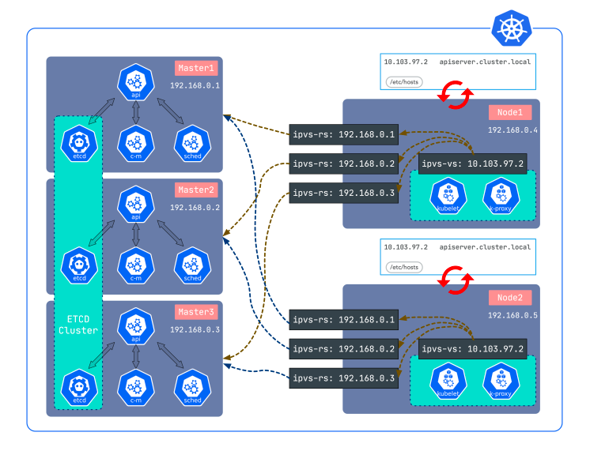

# Based on sealer to provide a solution to create high availability OpenYurt cluster

## Table of Contents

- [Based on sealer to provide a solution to create high availability OpenYurt cluster](#based-on-sealer-to-provide-a-solution-to-create-high-availability-openyurt-cluster)
  - [Table of Contents](#table-of-contents)
  - [Glossary](#glossary)
  - [Summary](#summary)
  - [Motivation](#motivation)
  - [Goals](#goals)
  - [Proposal](#proposal)
    - [OpenYurt Node Classification](#openyurt-node-classification)
    - [Deployment Forms of OpenYurt Components](#deployment-forms-of-openyurt-components)
    - [Yurtadm init](#yurtadm-init)
      - [Build Sealer ClusterImage](#build-sealer-clusterimage)
      - [Build OpenYurt Cluster](#build-openyurt-cluster)
    - [Yurtadm join](#yurtadm-join)
    - [High Availability Solution](#high-availability-solution)
    - [Reference](#reference)
      - [yurtadm init flags](#yurtadm-init-flags)
      - [yurtadm join flags](#yurtadm-join-flags)

## Glossary

Refer to the [OpenYurt Glossary](https://github.com/openyurtio/openyurt/blob/master/docs/proposals/00_openyurt-glossary.md).

## Summary

This proposal will improve `yurtadm init` and `yurtadm join` command to create high availability OpenYurt cluster by integrating sealer tool.

## Motivation

At present, the installation of OpenYurt cluster is still a little complicated, and with the continuous upgrading of OpenYurt versions, there is a lack of a unified installation way that can simply and automatically install clusters of various versions.

In addition, currently the `yurtadm` command cannot cope with scenarios that requiring high availability. Therefore, it is necessary to provide a way to create high availability OpenYurt cluster.

## Goals

Support to create high availability OpenYurt cluster and support Kubernetes v1.18 and above.

## Proposal

### OpenYurt Node Classification

Currently, the overall architecture of OpenYurt is as follows:


Nodes in OpenYurt can be classified as follows:

| Type       | Introduction                                                 | Label                             |
| ---------- | ------------------------------------------------------------ | --------------------------------- |
| Master     | The master node in Kubernetes, can also be used to deploy and run OpenYurt central control components. | openyurt.io/is-edge-worker: false |
| Cloud node | It is connected to Kubernetes Master through the Intranet and is mainly used to deploy and run the OpenYurt central control component. | openyurt.io/is-edge-worker: false |
| Edge node  | It is connected to the Kubernetes Master through the public network, and is generally close to the edge production environment. It is mainly used to deploy and run edge business containers. | openyurt.io/is-edge-worker: true  |

### Deployment Forms of OpenYurt Components

| Component               | Form       | Installation location          |
| ----------------------- | ---------- | ------------------------------ |
| yurthub                 | Static Pod | All cloud nodes and edge nodes |
| yurt-controller-manager | Deployment | master、cloud node             |
| yurt-app-manager        | Deployment | master、cloud node             |
| yurt-tunnel-server      | Deployment | master、cloud node             |
| yurt-tunnel-agent       | DaemonSet  | edge node                      |

### Yurtadm init

The bottom layer of `yurtadm init` will be implemented through sealer, use sealer to install master. Therefore, you first need to create a cluster image of OpenYurt.

#### Build Sealer ClusterImage

According to the above content, the constructed kubefile is roughly as follows:

```dockerfile
FROM kubernetes:v1.21.14-alpine

# flannel: https://github.com/sealerio/applications/tree/main/flannel
# cni has been replaced by the content in openyurt-cni-0.8.7-0.x86_64.rpm in https://github.com/openyurtio/openyurt/releases
# Reason see: https://openyurt.io/docs/user-manuals/network/edge-pod-network/#ipam-pod-ip-address-kept

COPY cni .
COPY init-kube.sh /scripts/
COPY kube-flannel.yaml.tmpl manifests/

COPY shell-plugin.yaml plugins

# openyurt
COPY yamls/* manifests
COPY install.sh .
RUN chmod 777 install.sh

CMD bind_address=${BindAddress} cluster_cidr=${ClusterCIDR} ./install.sh
```

install.sh：

```shell
#!/bin/bash

echo "[INFO] Start installing OpenYurt."

kubectl apply -f manifests/kube-flannel.yaml

## install openyurt components
kubectl apply -f manifests/yurt-controller-manager.yaml
kubectl apply -f manifests/yurt-tunnel-agent.yaml
kubectl apply -f manifests/yurt-tunnel-server.yaml
kubectl apply -f manifests/yurt-app-manager.yaml
kubectl apply -f manifests/yurthub-cfg.yaml

## configure coredns
kubectl scale --replicas=0 deployment/coredns -n kube-system
kubectl apply -f manifests/coredns.yaml
kubectl annotate svc kube-dns -n kube-system openyurt.io/topologyKeys='openyurt.io/nodepool'

## configure kube-proxy
str_patch='{"data": {"config.conf": "apiVersion: kubeproxy.config.k8s.io/v1alpha1\nbindAddress: '${bind_address}'\nfeatureGates:\n  EndpointSliceProxying: true\nbindAddressHardFail: false\nclusterCIDR: '${cluster_cidr}'\nconfigSyncPeriod: 0s\nenableProfiling: false\nipvs:\n  minSyncPeriod: 0s\n  strictARP: false\nkind: KubeProxyConfiguration\nmode: ipvs\nudpIdleTimeout: 0s\nwinkernel:\n  enableDSR: false\nkubeconfig.conf:"}}'
kubectl patch cm -n kube-system kube-proxy --patch "${str_patch}"  && kubectl delete pod --selector k8s-app=kube-proxy -n kube-system

echo "[INFO] OpenYurt is successfully installed."
```

#### Build OpenYurt Cluster

Clusterfile：

```yaml
apiVersion: sealer.cloud/v2
kind: Cluster
metadata:
  name: my-cluster
spec:
  hosts:
  - ips: [ 1.2.3.4 ]
    roles: [ master ]
  image: test:latest
  ssh:
    passwd: xxx
    pk: /root/.ssh/id_rsa
    user: root
  env:
  - PodCIDR=10.244.0.0/16
  cmd_args:
  - BindAddress=0.0.0.0
  - ClusterCIDR=10.244.0.0/16
---

## Custom configurations must specify kind, will be merged to default kubeadm configs
kind: ClusterConfiguration
networking:
  podSubnet: 10.244.0.0/16
  serviceSubnet: 10.96.0.0/12
controllerManager:
  extraArgs:
    controllers: -nodelifecycle,*,bootstrapsigner,tokencleaner
```

Build OpenYurt Cluster:

```bash
sealer apply -f Clusterfile
```

### Yurtadm join

The process of `yurtadm join` is basically the same as the original, mainly divided into the following phases:

1. PreparePhase：Mainly used for initialization related to the system environment. For example, clean the /etc/kubernetes/manifests directory, shut down selinux, check and install kubelet, etc.
2. PreflightPhase：Mainly run some kubeadm join related pre-check logic.
3. JoinNodePhase： Mainly used to join the node to the OpenYurt cluster. Here, yurthub, kubelet and other operations will be started. The kubelet started here will directly connect to yurthub instead of apiserver.
4. PostCheckPhase：Mainly do health checks of node, kubelet, yurthub, etc.

### High Availability Solution

The implementation of sealer's cluster high availability uses a lightweight load balancer lvscare. Compared with other load balancers, lvscare is very small with only a few hundred lines of code, and lvscare only protects the ipvs rules and does not do load itself, so it is very stable. It directly listens to the apiserver on the node. If it crashes, it removes the corresponding rules. After restarting, it will be automatically added back, which is equivalent to a dedicated load balancer.



The high availability of OpenYurt can be realized with the help of sealer's high availability.

The following is an example of sealer's clusterfile:

```yaml
apiVersion: sealer.cloud/v2
kind: Cluster
metadata:
  name: default-kubernetes-cluster
spec:
  image: kubernetes:v1.19.8
  ssh:
    passwd: xxx
  hosts:
    - ips: [ 192.168.152.132,192.168.152.133 ]
      roles: [ master ]
    - ips: [ 192.168.0.5 ]
      roles: [ node ]
```

Multiple master and node can be set in sealer, which has realized high availability.

Therefore, `yurtadm init` can use sealer to achieve high availability of the master.

Since the yurthub itself can point to multiple apiserver addresses, and select one of them for reverse proxy according to the load balancing algorithm, high availability has been  achieved. Therefore, the `yurtadm join` logic can be roughly unchanged, just ensure that the yurthub can be configured with multiple kube-apiserver addresses.

### Reference

#### yurtadm init flags

| Flag                                       | **Description**                                              |
| ------------------------------------------ | ------------------------------------------------------------ |
| --apiserver-advertise-address <br />string | The IP address the API Server will advertise it's listening on. |
| --cluster-cidr <br />string                | Choose a CIDR range of the pods in the cluster (default "10.244.0.0/16") |
| --image-repository <br />string            | Choose a registry to pull cluster images from (default "registry.cn-hangzhou.aliyuncs.com/openyurt") |
| --k8s-version <br />string                 | Choose a specific Kubernetes version for the control plane. (default "1.21.14") |
| --kube-proxy-bind-address <br />string     | Choose an IP address for the proxy server to serve on (default "0.0.0.0") |
| --openyurt-version <br />string            | Choose a specific OpenYurt version for the control plane. (default "v0.7.0") |
| -p, --passwd <br />string                  | Set master server ssh password                               |
| --pod-subnet <br />string                  | PodSubnet is the subnet used by Pods. (default "10.244.0.0/16") |
| --service-subnet <br />string              | ServiceSubnet is the subnet used by kubernetes Services. (default "10.96.0.0/12") |
| --yurt-tunnel-server-address<br />string   | The yurt-tunnel-server address.                              |

#### yurtadm join flags

| Flag                                          | **Description**                                              |
| --------------------------------------------- | ------------------------------------------------------------ |
| --cri-socket <br />string                     | Path to the CRI socket to connect (default "/var/run/dockershim.sock") |
| --discovery-token-ca-cert-hash <br />strings  | For token-based discovery, validate that the root CA public key matches this hash (format: "<type>:<value>"). |
| --discovery-token-unsafe-skip-ca-verification | For token-based discovery, allow joining without --discovery-token-ca-cert-hash pinning. |
| --ignore-preflight-errors<br />strings        | A list of checks whose errors will be shown as warnings. Example: 'IsPrivilegedUser,Swap'. Value 'all' ignores errors from all checks. |
| --kubernetes-resource-server<br />string      | Sets the address for downloading k8s node resources (default "dl.k8s.io") |
| --node-labels<br />string                     | Sets the labels for joining node                             |
| --node-name<br />string                       | Specify the node name. if not specified, hostname will be used. |
| --node-type<br />string                       | Sets the node is edge or cloud (default "edge")              |
| --organizations <br />string                  | Organizations that will be added into hub's client certificate |
| --pause-image<br />string                     | Sets the image version of pause container (default "registry.cn-hangzhou.aliyuncs.com/google_containers/pause:3.2") |
| --skip-phases<br />strings                    | List of phases to be skipped                                 |
| --token<br />string                           | Use this token for both discovery-token and tls-bootstrap-token when those values are not provided. |
| --yurthub-image<br />string                   | Sets the image version of yurthub component (default "registry.cn-hangzhou.aliyuncs.com/openyurt/yurthub:v0.7.0") |
