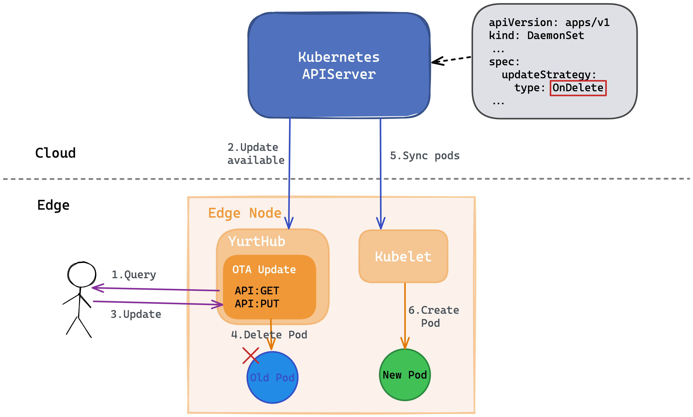
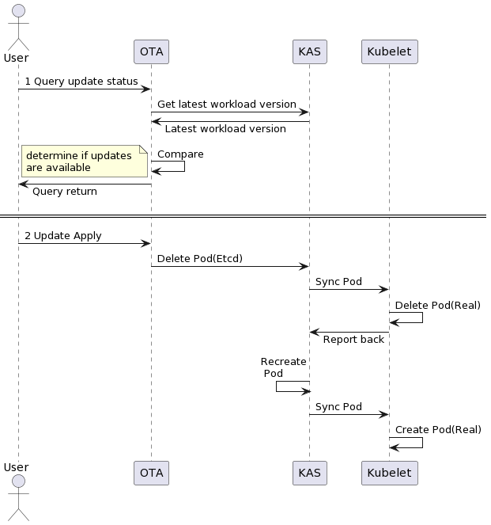
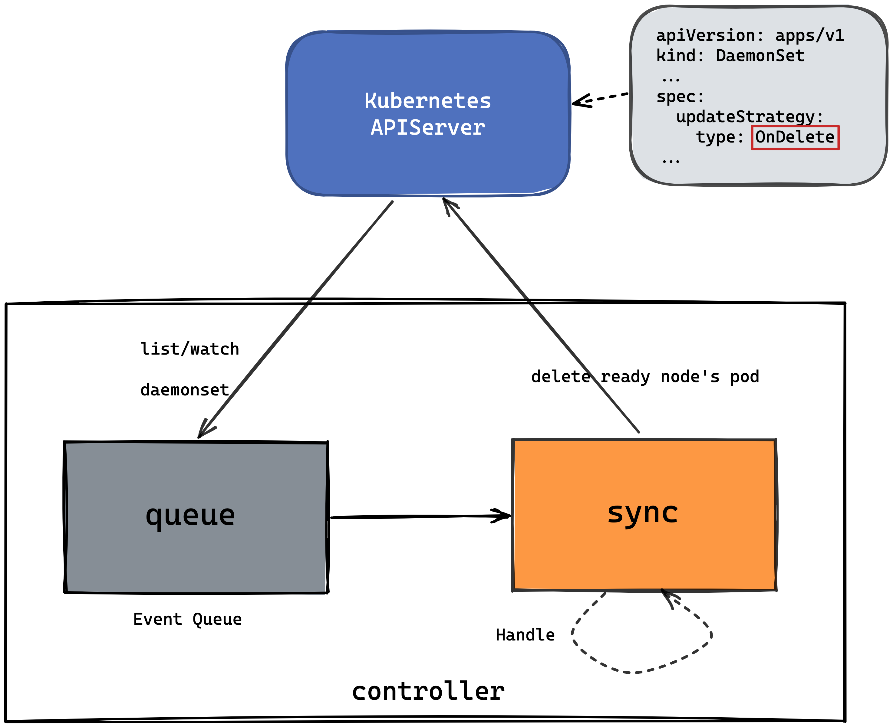

# Daemonset Update Model

## Table of Contents

A table of contents is helpful for quickly jumping to sections of a proposal and for highlighting
any additional information provided beyond the standard proposal template.
[Tools for generating](https://github.com/ekalinin/github-markdown-toc) a table of contents from markdown are available.

- [Daemonset Update Model](#daemonset-update-model)
  - [Table of Contents](#table-of-contents)
  - [Glossary](#glossary)
  - [Summary](#summary)
  - [Motivation](#motivation)
    - [Goals](#goals)
  - [Proposal](#proposal)
    - [User Stories](#user-stories)
      - [Story 1](#story-1)
      - [Story 2](#story-2)
    - [Implementation Details](#implementation-details)
      - [1 OTA-Update](#1-ota-update)
        - [OTA API](#ota-api)
      - [2 New-controller](#2-new-controller)
        - [Resources of interest](#resources-of-interest)
        - [Steps](#steps)

## Glossary

Refer to the [Cluster API Book Glossary](https://cluster-api.sigs.k8s.io/reference/glossary.html).

If this proposal adds new terms, or defines some, make the changes to the book's glossary when in PR stage.

## Summary

In this proposal，we hope to optimize the daemonset update model in cloud-edge collaboration scenarios. We consider two scenarios and propose different solutions for each of them. First, in order to optimize the user experience, we propose a way to implement [OTA(Over-the-air)](https://en.wikipedia.org/wiki/Over-the-air_programming) update. In this mode, users can control the update or not of applications autonomously through the exposed API. Besides, we use a new controller with `OnDelete` update strategy to update the application, even if the cluster has `not ready` nodes.

## Motivation

- In Openyurt, we use a native Kubernetes workload where application updates are processed in bulk by administrators. However, in some scenarios, node-level users also would like to manage application updates.
- In cloud-edge collaboration scenario, the edge is connected to the cloud through the public network, and the edge nodes may be disconnected from the cloud due to various objective or subjective factors. The update of Workloads (Deployment, DaemonSet, etc.) in the native Kubernetes relies on the connectivity of the edge nodes to the cloud master nodes. Therefore, when the cloud-edge network is disconnected, we need to explore a suitable way to update the application.

### Goals

- Provide OTA update: users can control the daemonset application updates through the API exposed on the edge nodes.
- Add a new controller: for `ready` nodes, execute the daemosnet application updates directly; for `not-ready` nodes, wait for nodes' status to turn ready before executing the update process.

## Proposal

### User Stories

#### Story 1

- In some node-independent scenarios, such as a user owning a node, for example, on a Tesla car, the owner wants to independently update his application, instead of being controlled by the cluster administrator. At this time, the user can complete the application update process through a two-step process.
  1. Check whether the latest version of the application is available.
  2. Confirm the execution of application update.

#### Story 2

- In a openyurt cluster, there are some edge nodes, and some node's status are `not-ready` due to the network, when the administrator updates the application version, the administrator expects that for the `ready` edge nodes, the application can be updated to the latest version smoothly; for the `not-ready` edge nodes, they do not block the update process of other nodes.

### Implementation Details

Note: No modification to Kubernetes, keeping it non-invasive, no modification to the native workload controllers.

#### 1 OTA-Update

<div align="center">
  
</div>

**Pre-requisites**: Set application's updateStrategy to `type: OnDelete`; add a new annotation(`apps.openyurt.io/upgrade-strategy: OTA`) for DaemonSet

1. Users query whether a newer version of the application is available via OTA module's API.
2. OTA module accesses Kubernetes APIServer through client-go library and get the current application's version.
3. If update is available, users can choose to apply update. (This is only from the user's perspective)
4. OTA module removes the selected pod from the current node.（This step is achieved by calling the Kubernetes interface）'
5. Kubelet on this node will synchronize pods information from Kubernetes APIServer.
6. Kubelet is responsible for creating the latest version of pod.

<div align="center">
  
</div>

##### OTA API

1. get all pods on edge node

```text
GET /pods HTTP/1.1
```

1. upgrade specified pod on edge node

```text
POST /openyurt.io/v1/namespaces/{ns}/pods/{podname}/upgrade  HTTP/1.1
````

#### 2 New-controller

<div align="center">
  
</div>

##### Resources of interest

- Daemonset
- Node

##### Steps

**Pre-requisites**: Set application's updateStrategy to `type: OnDelete`; add a new annotation(`apps.openyurt.io/upgrade-strategy: AdvancedRollingUpdate`) for DaemonSet

1. New controller monitor daemonset's changes.
2. When the daemonset is updated, check the status of all the nodes selected by this daemosnet and if it is ready, then delete pods.
