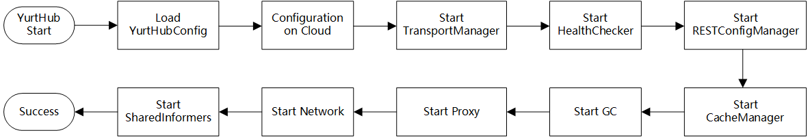

# Proposal-Optimize the pods recovery efficiency when edge nodes restart

## 1. Requirement Analysis

OpenYurt extend the cloud native ability to edge computing and IoT scenarios. The cloud nodes provide the ability to deploy the services on the edge nodes and realize the whole life-cycle management of the applications. However, edge node network is in the weak connection status.

Thereby, the frequent restart of the edge nodes involves the OS restart, Kubernetes components restart and OpenYurt components restart. The recovery of service applications costs almost 1 minute. To recover the edge nodes faster, we should optimize the pods recovery efficiency when edge nodes restart.

The specific requirements of the optimization are summarized as follows:

- The restart process will not be blocked, and all the components will be restarted successfully
- All the pods can restart successfully and satisfy the stable status of the applications
- Promote the restart efficiency and make the cost time less than 30s
- The solutions can be used in most hardwares

## 2. Question Analysis

Kubelet is the controller of the Kubernetes work node. It is responsible for the creation and management of Pods on the work node. For an OpenYurt cluster, the components are the pods deployed on the Kubernetes cluster. When the work node restarts, Kubelet will recover the pods (Openyurt components) and the service pods. Therefore, detect the time delay of the Kubelet operations should be the focus.


The operations of Kubelet component when the work node restart are shown in Figure X. After the work node restart, Kubelet will initialize first. Then, Kubelet will start the static pods, for instance, YurtHub, etc. After that, YurtHub start-up and load the local cache. In the weak connection condition of the network, the Kubelet list/watch the pods from the YurtHub cache. Lastly, the Kubelet will recover the other pods according to the cache.

According to the analysis above, YurtHub is the important component for the work node restart. The YurtHub recovery cost a period of time. Moreover, Kubelet will recover the service pods according to the local cache. The process depends on the CacheManager and StorageManager of YurtHub.



Figure X shows the YurtHub init progress. According to the investigation of YurtHub source code, the start-up process are serialized. Each component part will start one by one. The time delay can be evaluated by setting logs.

From the above, the optimization will focus on the YurtHub start-up and Kubelet recover the service pods based on YurtHub local cache .

## 3. Experiments

### 3.0 Experiment Environment

**Test Environment:**

1 master node, 1 work node

- Alibaba ECS 4C8G
- OS: CentOS 8
- K8s Version: v1.19.4

> **Instructions:**
>
> *The 10 service pods are created by nginx-latest image
>
> *The table records the **time-delay** from the time point entering `reboot` order and the unit is ms
>
> *The image pull strategy is **IfNotPresent**
>
> *First Service Pod Recovery means the time point when the first nginx pod recover.
>
> *Last Service Pod Recovery means the time point when the first nginx pod recover.

### 3.1 Native Kubernetes Start-up Time Test

#### 3.1.1 Static pods and 10 service pods

| Test Index | Entering `reboot` order | Kubelet Start | Static Pod (YurtHub) Start | First Service Pod Recovery | Last Service Pod Recovery |
| :--------: | :---------------------: | :-----------: | :------------------------: | :------------------------: | :-----------------------: |
|     1      |            0            |     20000     |           29021            |           35627            |           36401           |
|     2      |            0            |     21000     |           30922            |           37712            |           38521           |
|     3      |            0            |    24000*     |           34010            |           40109            |           40821           |
|    Avg     |            0            |     21667     |           31318            |           37816            |           38581           |
|    Diff    |            -            |     21667     |            9651            |            6498            |            765            |

*the system restart time is not stable, and the time ranges from 19s to 24s.

### 3.2 OpenYurt Start-up Time Test

#### 3.2.1 Edge Network Connected, 10 service pods

| Test Index | Entering `reboot` order | Kubelet Start | Static Pod (YurtHub) Start | First Service Pod Recovery | Last Service Pod Recovery |
| :--------: | :---------------------: | :-----------: | :------------------------: | :------------------------: | :-----------------------: |
|     1      |            0            |     26000     |           35012            |           47030            |           47890           |
|     2      |            0            |     25000     |           34921            |           48041            |           48892           |
|     3      |            0            |     25000     |           34829            |           47843            |           48602           |
|    Avg     |            0            |     25333     |           34921            |           47638            |           48461           |
|    Diff    |            -            |     25333     |            9588            |           12717            |            823            |

#### 3.2.2 Edge Network Disconnected, 10 service pods, OpenYurt Edge

| Test Index | Entering `reboot` order | Kubelet Start | Static Pod (YurtHub) Start | First Service Pod Recovery | Last Service Pod Recovery |
| :--------: | :---------------------: | :-----------: | :------------------------: | :------------------------: | :-----------------------: |
|     1      |            0            |     26000     |           35219            |           48203            |           49260           |
|     2      |            0            |     25000     |           35621            |           48721            |           49422           |
|     3      |            0            |     27000     |           37015            |           50126            |           50921           |
|    Avg     |            0            |     26000     |           35952            |           49016            |           49867           |
|    Diff    |            -            |     26000     |            9951            |           13064            |            852            |

*According to the experiment, the time between Kubelet Start to work and First Service Pod Recovery is varied.

## 4. Time Delay Comparison between OpenYurt and Native Kubernetes

In this section, the time delay comparison between the OpenYurt Cluster (Network Connected and DIsconnected) and native Kubernetes are shown in the Table below.

Four time periods re defined for comparison.

**Period 1**: From OS restart begin to Kubelet start to work.

**Period 2**: From Kubelet start to Static Pod (YurtHub) start.

**Period 3**: From Static Pod (YurtHub) start first service pod recovery.

**Period 4**: From first service pod recovery to last service pod recovery.

**Whole Recovery Period**: From OS restart begin to last service pod recovery.

|                           | Native Kubernetes | OpenYurt Cluster (Network Connected) | OpenYurt Cluster (Network Disconnected) |
| :-----------------------: | :---------------: | :----------------------------------: | :-------------------------------------: |
|       **Period 1**        |      21.67s       |                25.33s                |                 26.00s                  |
|       **Period 2**        |       9.65s       |                9.58s                 |                  9.95s                  |
|       **Period 3**        |       6.50s       |                12.71s                |                 13.06s                  |
|       **Period 4**        |       0.76s       |                0.82s                 |                  0.85s                  |
| **Whole Recovery Period** |      38.58s       |                48.46s                |                 49.86s                  |

According to the comparison table, OpenYurt Cluster spent 4-5s more than the time Native Kubernetes from OS restart begin to Kubelet start to work (Period 1). And the OS restart time to the Kubelet start time is varying. Additionally, OpenYurt Cluster spent almost 9.7s from Kubelet start to work to static pod (YurtHub) start (Period 2), which is the same as the native kubernetes cluster. In period 3, OpenYurt cluster costs 6s more than the native kubernetes cluster.

Generally, when openyurt edge node restart, the overall pods restart time are 11.28s longer than native Kubernetes node restart.

## 5. Detailed Analysis and Optimization

Based on the detailed test on openyurt edge node, the period from Kubelet start to YurtHub start and the period from YurtHub server work to first service pod recovery will be analyzed in detail.

### 5.1 Detailed analysis of the period from Kubelet start to static pod (YurtHub) Start

From Kubelet start to first static pod YurtHub start, this period costs almost 9.5s among three experiment scenarios. Kubelet start process invocation chain can be summarized in the following graph.

```
main                                                                             // cmd/kubelet/kubelet.go
 |--NewKubeletCommand                                                            // cmd/kubelet/app/server.go
   |--Run                                                                        // cmd/kubelet/app/server.go
      |--initForOS                                                               // cmd/kubelet/app/server.go
      |--run                                                                     // cmd/kubelet/app/server.go
        |--initConfigz                                                           // cmd/kubelet/app/server.go
        |--BuildAuth
        |--cm.NodeAllocatableRoot
        |--cadvisor.NewImageFsInfoProvider
        |--NewContainerManager
        |--ApplyOOMScoreAdj
        |--PreInitRuntimeService
        |--RunKubelet                                                            // cmd/kubelet/app/server.go
        | |--k = createAndInitKubelet                                            // cmd/kubelet/app/server.go
        | |  |--NewMainKubelet
        | |  |  |--watch k8s Service
        | |  |  |--watch k8s Node
        | |  |  |--klet := &Kubelet{}
        | |  |  |--init klet fields
        | |  |
        | |  |--k.BirthCry()
        | |  |--k.StartGarbageCollection()
        | |
        | |--startKubelet(k)                                                     // cmd/kubelet/app/server.go
        |    |--go k.Run()                                                       // -> pkg/kubelet/kubelet.go
        |    |  |--go cloudResourceSyncManager.Run()
        |    |  |--initializeModules
        |    |  |--go volumeManager.Run()
        |    |  |--go nodeLeaseController.Run()
        |    |  |--initNetworkUtil() // setup iptables
        |    |  |--go Until(PerformPodKillingWork, 1*time.Second, neverStop)
        |    |  |--statusManager.Start()
        |    |  |--runtimeClassManager.Start
        |    |  |--pleg.Start()
        |    |  |--syncLoop(updates, kl)                                         // pkg/kubelet/kubelet.go
        |    |
        |    |--k.ListenAndServe
        |
        |--go http.ListenAndServe(healthz)
```

According to the Kubelet running logs, from `systemd started Kubelet` to `Run()` function, it costs almost 2.5s. After that, between `Run()` to `watch k8s Service` in`NewMainKubelet()` , it costs 0.5s. From `watching API Server` to `startKubelet()` function executed finished, it costs 6.5s.

The total time cost is stable 9.5s to 10s among native Kubernetes cluster and openyurt network connected and disconnected cluster.

### 5.2 Detailed analysis of the period from YurtHub server work to first service pod recovery

After Kubelet start to work (`startKubelet()`finished and listen to 10250 port), the static pods and service pods will be start one by one.  Kubelet start pods process `syncLoop`  invocation chain can be summarized in the following graph.

```
kubelet.syncLoop	/pkg/kubelet/kubelet.go
|--kl.syncLoopIteration(updates, handler, syncTicker.C, housekeepingTicker.C, plegCh)
	|--u, open := <-configCh
	|--handler.HandlePodAdditions(u.Pods) //Kubelet.HandlePodAdditions
		|--sort.Sort(sliceutils.PodsByCreationTime(pods))
		|--kl.handleMirrorPod(pod, start)
			|--kl.dispatchWork
		|--kl.dispatchWork(pod, kubetypes.SyncPodCreate, mirrorPod, start)
			|--kl.podWorkers.UpdatePod //podWorkers.UpdatePod	/pkg/kubelet/pod_worker.go
				|--p.managePodLoop
					|--p.syncPodFn
```

In Kubelet `syncLoop()` function, `syncTicker` is assigned 1s for check the pod workers which is needed for sync. After that, `housekeepingTicker` is assigned 2s for test the pods whether need for cleaning. `plegCh` is set for test pods lifecycle.

In the `HandlePodAdditions(u.Pods)` function, the pods will be sorted by the create time stamp. The static pods will be first be executed and the other service pods will be filtered (to test whether it is terminated pods and whether it can be admit). Then, `kl.dispatchWork()` will be executed. `kl.podWorkers.UpdatePod` will **concurrently** invoke `p.managePodLoop` . `p.syncPodFn` is executed for establishing the pods.

The execution steps of `syncPod` method are summarized as follows `Kubelet.syncPod`:

```
Step 1: Record pod worker start latency if being created
Step 2: Create v1.PodStatus object
Step 3: Generate PodStatus
Step 4: Executing the admission handlers and make pods having privalage
Step 5: Create cgroups of the pod
Step 6: Make data dictionaries of the pod
Step 7: Wait for the volume attached
Step 8: Fetch the ImagePullSecrets
Step 9: Call the container runtime kl.containerRuntime.SyncPod(pod, podStatus, pullSecrets, kl.backOff)
```

The steps of creating the container runtime are summarized as follows `kubeGenericRuntimeManager.SyncPod`:

```
Step 1: Compute sandbox and container changes.
Step 2: Kill the pod if the sandbox has changed.
Step 3: kill any running containers in this pod which are not to keep.
Step 4: Create a sandbox for the pod if necessary.
Step 5: start ephemeral containers
Step 6: start the init container.
Step 7: start containers in podContainerChanges.ContainersToStart.
```

Step 4 and Step 7 will be detailed discussed as follows:

The detailed steps of Creating the sandbox for the pod can be listed as follows: `RunPodSandbox()`

```
Step 1: Pull the image for the sandbox.
Step 2: Create the sandbox container.
Step 3: Create Sandbox Checkpoint.
Step 4: Start the sandbox container.
Step 5: Setup networking for the sandbox.
```

Also, the detailed steps of starting the container are listed as follows: `startContainer()`

```
Step 1: pull the image.
Step 2: create the container.
Step 3: start the container.
Step 4: execute the post start hook.
```

On the basis of the pod start procedure by Kubelet, when the edge nodes restart and Kubelet initialized and start, YurtHub will start to work first. According to YurtHub relys on host network, it can be started without CNI start. There will be 1s between Kubelet started and YurtHub started. Also, there are 1.5s between YurtHub started and YurtHub server work. After YurtHub server work, it plays the role of apiserver  in the weak network condition.

The recovery of nginx pods are blocked in `createSandBox` because they relys on CNI, and flannel as the CNI plugin is not ready.

```
Aug 26 16:04:28 openyurt-node-02 kubelet[1193]: E0826 16:04:28.209598    1193 pod_workers.go:191] Error syncing pod 464fc7d4-2a53-4a20-abc3-c51a919f1b1a ("nginx-06-78df84cfc7-b8fc2_default(464fc7d4-2a53-4a20-abc3-c51a919f1b1a)"), skipping: failed to "CreatePodSandbox" for "nginx-06-78df84cfc7-b8fc2_default(464fc7d4-2a53-4a20-abc3-c51a919f1b1a)" with CreatePodSandboxError: "CreatePodSandbox for pod \"nginx-06-78df84cfc7-b8fc2_default(464fc7d4-2a53-4a20-abc3-c51a919f1b1a)\" failed: rpc error: code = Unknown desc = failed to set up sandbox container \"ec15044992d3d0df0185a41d00adaca0fa7895f8ac717399b00f24a68ae3fa3e\" network for pod \"nginx-06-78df84cfc7-b8fc2\": networkPlugin cni failed to set up pod \"nginx-06-78df84cfc7-b8fc2_default\" network: open /run/flannel/subnet.env: no such file or directory"
```

The time between YurtHub start to work and flannel start is 9s, however, in the native Kubernetes cluster, there only needs 3s. The openYurt cluster costs 6s more than native cluster in this period. According to the Kubelet logs, 6 seconds are blocked in the following procedure.

The time cost may because the first attempt to start flannel-cni plugin failed 3s after the YurtHub server works. The third attempt (after 9s) will be successful.

```
Aug 28 23:57:12 openyurt-node-02 kubelet[1185]: E0828 23:57:12.447073    1185 kuberuntime_manager.go:815] init container &Container{Name:install-cni-plugin,Image:docker.io/rancher/mirrored-flannelcni-flannel-cni-plugin:v1.1.0,Command:[cp],Args:[-f /flannel /opt/cni/bin/flannel],WorkingDir:,Ports:[]ContainerPort{},Env:[]EnvVar{},Resources:ResourceRequirements{Limits:ResourceList{},Requests:ResourceList{},},VolumeMounts:[]VolumeMount{VolumeMount{Name:cni-plugin,ReadOnly:false,MountPath:/opt/cni/bin,SubPath:,MountPropagation:nil,SubPathExpr:,},VolumeMount{Name:flannel-token-2m92x,ReadOnly:true,MountPath:/var/run/secrets/kubernetes.io/serviceaccount,SubPath:,MountPropagation:nil,SubPathExpr:,},},LivenessProbe:nil,ReadinessProbe:nil,Lifecycle:nil,TerminationMessagePath:/dev/termination-log,ImagePullPolicy:IfNotPresent,SecurityContext:nil,Stdin:false,StdinOnce:false,TTY:false,EnvFrom:[]EnvFromSource{},TerminationMessagePolicy:File,VolumeDevices:[]VolumeDevice{},StartupProbe:nil,} start failed in pod kube-flannel-ds-dskwd_kube-flannel(9f07d412-f6f4-40f6-a6b2-01d013004dd1): CreateContainerConfigError: services have not yet been read at least once, cannot construct envvars
```

According to the experiment, Flannel start will cost 2.5s. After that, nginx pods will restart in 1s. The whole period will cost almost 12-13s in the disconnected network of openyurt cluster.

## 6. Optimization Strategy

- Make the edge node service pods networking strategy from CNI to **Host**.
  - It will save 8-9s because the host network service pods will not wait for CNI plugin flannel ready.
- Claim the image pulling strategy to **IfNotPresent**.
  - According to the docker images have been pulled by edge node before. **IfNotPresent** strategy make the docker only find the image from local node and it will not sync from the registry again. This period may save 10s-20s.