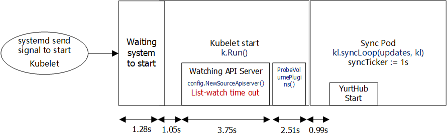

# Proposal-Optimize the pods recovery efficiency when edge nodes restart

## 1. Requirement Analysis

OpenYurt extend the cloud native ability to edge computing and IoT scenarios. The cloud nodes provide the ability to deploy the services on the edge nodes and realize the whole life-cycle management of the applications. However, edge node network is in the weak connection status.

Thereby, the frequent restart of the edge nodes involves the OS restart, Kubernetes components restart and OpenYurt components restart. The recovery of service applications costs almost 1 minute. To recover the edge nodes faster, we should optimize the pods recovery efficiency when edge nodes restart.

The specific requirements of the optimization are summarized as follows:

- The restart process will not be blocked, and all the components will be restarted successfully
- All the pods can restart successfully and satisfy the stable status of the applications
- Promote the restart efficiency and make the cost time less than 30s
- The solutions can be used in most hardwares

## 2. Question Analysis

Kubelet is the controller of the Kubernetes work node. It is responsible for the creation and management of Pods on the work node. For an OpenYurt cluster, the components are the pods deployed on the Kubernetes cluster. When the work node restarts, Kubelet will recover the pods (Openyurt components) and the service pods. Therefore, detect the time delay of the Kubelet operations should be the focus.

The operations of Kubelet component when the work node restart are shown in Figure X. After the work node restart, Kubelet will initialize first. Then, Kubelet will start the static pods, for instance, YurtHub, etc. After that, YurtHub start-up and load the local cache. In the weak connection condition of the network, the Kubelet list/watch the pods from the YurtHub cache. Lastly, the Kubelet will recover the other pods according to the cache.

According to the analysis above, YurtHub is the important component for the work node restart. The YurtHub recovery cost a period of time. Moreover, Kubelet will recover the service pods according to the local cache. The process depends on the CacheManager and StorageManager of YurtHub.

Figure X shows the YurtHub init progress. According to the investigation of YurtHub source code, the start-up process are serialized. Each component part will start one by one. The time delay can be evaluated by setting logs.

From the above, the optimization will focus on the YurtHub start-up and Kubelet recover the service pods based on YurtHub local cache .

## 3. Experiments

### 3.0 Experiment Environment

**Test Environment:**

1 master node, 1 work node

- Alibaba ECS 4C8G
- OS: CentOS 8
- K8s Version: v1.19.4

> **Instructions:**
>
> *The 10 service pods are created by nginx-latest image
>
> *The table records the **time-delay** from **OS restart** and the unit is ms
>
> *The image pull strategy is **IfNotPresent**
>
> *First Service Pod Recovery means the time point when the first nginx pod recover.
>
> *Last Service Pod Recovery means the time point when the first nginx pod recover.

### 3.1 Native Kubernetes Start-up Time Test

#### 3.1.1 Static pods and 10 service pods

| Test Index | OS Restart Begin | Kubelet Start | First Service Pod Recovery | Last Service Pod Recovery |
| :--------: | :--------------: | :-----------: | :------------------------: | :-----------------------: |
|     1      |        0         |     20000     |           32747            |           33030           |
|     2      |        0         |     21000     |           33701            |           34822           |
|     3      |        0         |     21000     |           33010            |           34112           |
|    Avg     |        0         |     20667     |           33152            |           33988           |
|    Diff    |        -         |     20667     |           12485            |            836            |

### 3.2 OpenYurt Start-up Time Test

#### 3.2.1 Edge Network Connected, 10 service pods

| Test Index | OS Restart Begin | Kubelet Start | First Service Pod Recovery | Last Service Pod Recovery |
| :--------: | :--------------: | :-----------: | :------------------------: | :-----------------------: |
|     1      |        0         |     26000     |           53890            |           54637           |
|     2      |        0         |     25000     |           53365            |           54050           |
|     3      |        0         |     25000     |           53665            |           54523           |
|    Avg     |        0         |     25333     |           53640            |           54403           |
|    Diff    |        -         |     25333     |           28307            |            763            |

#### 3.2.2 Edge Network Disconnected, 10 service pods, OpenYurt Edge

| Test Index | OS Restart Begin | Kubelet Start | First Service Pod Recovery | Last Service Pod Recovery |
| :--------: | :--------------: | :-----------: | :------------------------: | :-----------------------: |
|     1      |        0         |     26000     |           51845            |           52660           |
|     2      |        0         |     25000     |           50838            |           51622           |
|     3      |        0         |     26000     |           60179            |           60928           |
|    Avg     |        0         |     25667     |           54287            |           55070           |
|    Diff    |        -         |     25667     |           28620*           |            783            |

*According to the experiment, the time between Kubelet Start to work and First Service Pod Recovery is varied.

## 4. Time Delay Comparison between OpenYurt and Native Kubernetes

In this section, the time delay comparison between the OpenYurt Cluster (Network Connected and DIsconnected) and native Kubernetes are shown in the Table below.

Four time periods re defined for comparison.

**Period 1**: From OS restart begin to Kubelet start to work.

**Period 2**: From Kubelet start to first service pod recovery.

**Period 3**: From first service pod recovery to last service pod recovery.

**Whole Recovery Period**: From OS restart begin to last service pod recovery.

|                           | Native Kubernetes | OpenYurt Cluster (Network Connected) | OpenYurt Cluster (Network Disconnected) |
| :-----------------------: | :---------------: | :----------------------------------: | :-------------------------------------: |
|       **Period 1**        |      20.67s       |                25.33s                |                 25.67s                  |
|       **Period 2**        |      12.59s       |                28.31s                |                 28.62s                  |
|       **Period 3**        |       0.84s       |                0.76s                 |                  0.78s                  |
| **Whole Recovery Period** |      33.99s       |                54.40s                |                 55.07s                  |

According to the comparison table, OpenYurt Cluster spent 5.00s more than the time Native Kubernetes from OS restart begin to Kubelet start to work (Period 1). Additionally, OpenYurt Cluster spent 16.03s more than Native Kubernetes From Kubelet start to work to first service pod recovery (Period 2). In period 3, time between first service pod recovery to last service pod recovery are close to with the comparison.

Generally, when openyurt edge node restart, the overall pods restart time are 21.08s longer than native Kubernetes node restart.

## 5. Detailed Test on OpenYurt Edge Node

According to the experiments in Section 3, OpenYurt Cluster spent 16.03s more than Native Kubernetes From Kubelet start to work to first service pod recovery in Period 2. Due to the weak network connection in the edge node scenario, YurtHub plays a role as the local api-server and provide the cache capability for the edge node pods. The detailed test on Period 2 of openyurt edge node was conducted.

**Period 2** will be divided into three following parts, and the time delay of each parts are tested in Table:

**Part 1:** From kubelet start to YurtHub start

**Part 2:** YurtHub start to YurtHub server work

**Part 3:** YurtHub Server work to first service pod start

| Test Index | **Part 1** | **Part 2** | **Part 3** | Total  |
| :--------: | :--------: | :--------: | :--------: | :----: |
|     1      |   8.54s    |   1.46s    |   19.84s   | 29.84s |
|     2      |   10.75s   |   1.49s    |   19.74s   | 31.98s |
|     3      |   9.21s    |   1.47s    |   18.52s   | 29.20s |
|    Avg     |    9.5s    |   1.47s    |   19.37s   | 30.34s |

On the basis of the time tests of each parts, the time of Part 2, the restart of YurtHub is fast and stable in 1.5s. The time between Kubelet start to YurtHub start varies from 8.5s to 10.5s according to the experiments. Time of Part 3, YurtHub Server work to first service pod start is almost 18.5s to 20s.

## 6. Detailed Analysis and Optimization

Based on the detailed test on openyurt edge node, the period from Kubelet start to YurtHub start and the period from YurtHub server work to first service pod recovery will be analyzed in detail.

### 6.1 Detailed analysis of the period from Kubelet start to YurtHub start

Firstly, Kubelet (v1.17) start process is analyzed before the YurtHub start in the Figure below. And the time of each step is tested below.

As shown in the above figure, firstly, the systemd send a signal to start kubelet. Kubelet will wait for system to start in almost 1.28s. When Kubelet start, `k.Run()`will be executed and 1.05s will be cost for initializing. After that, `k.Run()` invokes `createAndInitKubelet()` and the `config.NewSourceApiServer()` watches API server and read the previous pods cache on the node and send List-watch request for sync. Because the YurtHub plays a role as the APIserver and the YurtHub is not successful to start. The List-Watch requests are time out and this period is almost 3.75s. After that, `ProbeVolumePlugins()` check the request of the storage providers service (AWS, GCE, etc.,), and this period will take 2.51s. After that, the Kubelet server will start and the `SyncPod` loop, the sync ticker is 1s. After 1s, YurtHub will start.

To sum up, the whole period of kubelet start to YurtHub start is 9.58s, and list-watch requests are time out and this period is almost 3.75s. The storage providers service checking time takes up 2.51s.

### 6.2 Detailed analysis of the period from YurtHub server work to first service pod recovery