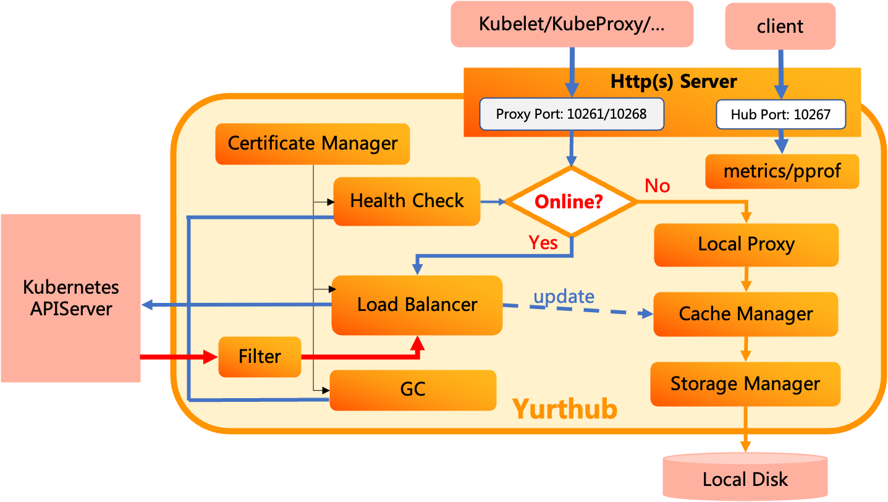

# Proposal-Optimize the pods recovery efficiency when edge nodes restart

## Requirement Analysis

OpenYurt extend the cloud native ability to edge computing and IoT scenarios. The cloud nodes provide the ability to deploy the services on the edge nodes and realize the whole life-cycle management of the applications. However, edge node network is in the weak connection status.

Thereby, the frequent restart of the edge nodes involves the OS restart, Kubernetes components restart and OpenYurt components restart. The recovery of service applications costs almost 1 minute. To recover the edge nodes faster, we should optimize the pods recovery efficiency when edge nodes restart.

The specific requirements of the optimization are summarized as follows:

- The restart process will not be blocked, and all the components will be restarted successfully
- All the pods can restart successfully and satisfy the stable status of the applications
- Promote the restart efficiency and make the cost time less than 30s
- The solutions can be used in most hardwares

## Question Analysis

Kubelet is the controller of the Kubernetes work node. It is responsible for the creation and management of Pods on the work node. For an OpenYurt cluster, the components are the pods deployed on the Kubernetes cluster. When the work node restarts, Kubelet will recover the pods (Openyurt components) and the service pods. Therefore, detect the time delay of the Kubelet operations should be the focus.

The operations of Kubelet component when the work node restart are shown in Figure X. After the work node restart, Kubelet will initialize first. Then, Kubelet will start the static pods, for instance, YurtHub, etc. After that, YurtHub start-up and load the local cache. In the weak connection condition of the network, the Kubelet list/watch the pods from the YurtHub cache. Lastly, the Kubelet will recover the other pods according to the cache.

According to the analysis above, YurtHub is the important component for the work node restart. The YurtHub recovery cost a period of time. Moreover, Kubelet will recover the service pods according to the local cache. The process depends on the CacheManager and StorageManager of YurtHub.

Figure X shows the YurtHub init progress. According to the investigation of YurtHub source code, the start-up process are serialized. Each component part will start one by one. The time delay can be evaluated by setting logs.

From the above, the optimization will focus on the YurtHub start-up and Kubelet recover the service pods based on YurtHub local cache .

## Solutions

According to the question analysis above, the solutions will focus on the YurtHub start-up optimization and YurtHub local cache strategy optimization.

### 1. YurtHub start-up optimization

- YurtHub start-up process are serialized. The detailed process are shown in Figure X. The time cost of each components can be detected. Some serialized process can be optimized to the parallel one.

### 2. YurtHub local cache strategy optimization

Kubelet will recover the service pods by load the local cache through cache manager and serialize manager on the YurtHub. The local cache strategy is the optimization orientation.

- **File IO.** How to improve cache IO efficiency is changeling. Multi-threads read/write can be applied on the cache manager.
- **Data Serialization.**  YAML is the solution to the Kubernetes resource definition.  JSON, Protobuf, etc. are also the main stream serialization solutions. The proper way to serialize the pod data can enhance the efficiency.
- **Storage.** Cache data are saved as files. Different type of database may be applied to realize the data thread safe (Lock) and high literacy rate.

The optimization of the local cache strategy can be developed as the progress of the cache structure.