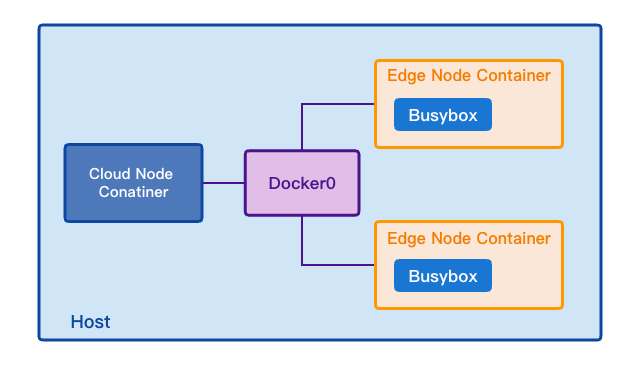
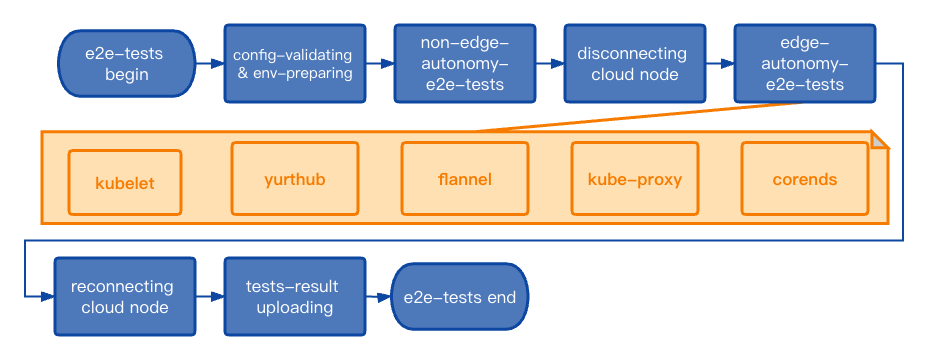

# Add edge autonomy e2e tests

## Table of Contents

- [Add edge autonomy e2e tests](#title)
  - [Table of Contents](#table-of-contents)
  - [Glossary](#glossary)
  - [Summary](#summary)
  - [Motivation](#motivation)
    - [Goals](#goals)
    - [Non-Goals](#non-goals)
  - [Proposal](#proposal)
    - [User Stories](#user-stories)
    - [Implementation Details](#implementation-details)

## Glossary

Refer to the [OpenYurt Glossary](https://github.com/openyurtio/openyurt/blob/master/docs/proposals/00_openyurt-glossary.md).

## Summary

Providing kubernetes clusters the ability of cloud-edge-ochestration, Openyurt makes it possible for edge-nodes-autonomy in offline scenarios. However, these abilities are not adequately e2e-tested. With new features merging, the defeciency of test-ability may conceal troubles and instables.
In this work, we intend to (1) Modify current e2e-test-framework, by completing e2e-test-entrance, bumping ginkgo to v2, adding e2e-autonomy labels to distinguish them with other e2e-tests, modifying essential shells to run e2e-tests in desired order. (2) Adding e2e-tests for yurthub, yurttunnel, kubelet, kube-proxy, coredns, flannel, which will be discussed in implementation details.

## Motivation

Openyurt provides edge-nodes-autonomy ability to large-scale kubernetes clusters under offline scenarios. However,  it has not been fully tested, which may cause unexpected problems. This propalsal intended to  adjust e2e-testing framework and add edge-nodes-autonomy-e2e-tests to Openyurt.

### Goals

- Adjusting testing framework. Provide testing entrance for e2e-tests packages, including yurt, yurt-tunnel, yurthub, in the directory of `/test/e2e/`, to fit e2e-tests in units of package.
- Adding e2e-tests for edge-node-autonomy related Openyurt modules, including yurthub, yurt-tunnel; vanilla kubernetes modules for offline situations, including kubelet, kube-proxy, coredns, flannel, to provide edge-autonomy-testing ability to Openyurt.
- Label ginkgo-cases with edge-autonomy label: `[edge-autonomy]`, to distinguish them with other e2e-tests, so we can run these e2e-tests separately.
- Modify e2e-test shell, to provide environment preparation and e2e-tests ochestration for modules mentioned above.
- Removing redundant `e2e.go` & `e2e_test.go` which currently locate in `/test/e2e/`.
### Non-Goals

- Basic module edge-autonomy-ability tests, which unit-tests are responsible for;
- Non-edge-autonomy scenario related tests.

## Proposal

### User Stories

#### Story 1
As a developer of Openyurt, I want to get instant e2e-test-feedback after I made changes to Openyurt modules which may affect edge-node-autonomy ability and  commit the changes.

#### Story 2
As a user of Openyurt,  I want to make it clear, when I debug, whether it's the Openyurt edge-autonomy-modules are designed with problems, or it's other problems such as something wrong with my kubeadm cluster.

### Implementation Details
- Ajusting e2e-tests framework
  The e2e-tests will be carried out in a kind cluster of one cloud node and two edge nodes, the components are organized as follows:

  

  
  

  To test flannel, kube-proxy, coredns, we need more than one edge node. We set working pod busybox in both edge nodes for busyboxes do not require cache.

  To adjust e2e-test framework, we'll make following modifications:
  - Bump ginkgo to v2 (Done,  pr [#945](https://github.com/openyurtio/openyurt/pull/945));
  - Create test-entrance in `yurt.go`, `yurt-tunnel.go`, `yurthub.go` in `/test/e2e/`;
  - Add edge-autonomy label to edge-autonomy related e2e-tests. Please refer to [ginkgo label-specs](https://onsi.github.io/ginkgo/#spec-labels).
  - Modify e2e-test shell: `/hack/make-rules/run-e2e-tests.sh`. We intend to modify e2e-test process as follows:

  

  
  

  We'll keep current config-validating and environment preparing part, and add following steps:
  1. Copy Openyurt and golang code to edge nodes, to provide essential code for e2e-tests compiling and go-testing;
  2. Call the non-edge-autonomy-e2e-tests in every e2e-test-assembly;
  3. Start the test pod: busybox as static pod on every edge node, label every busybox with `"app: busybox"` and `"kubernetes/hostname: ${nodename}"` label, make sure busyboxs work. For busybox on each node deploy a corresponding service, exposing busybox in cluster, for later kubelet, flannel, kube-proxy tests.
  4. Disconnect cloud node to the cluster by pulling its `veth pair` out of `docker0` net.
  5. These edge-autonomy tests will run in serial order: kubelet, yurthub, flannel, kube-proxy, coredns. Kubelet provides basic container management, so it should start first. Yurthub provides nodes with cache ability, which other components depend on, so it should start after kubelet and before others. flannel provides IPAM function, which coredns depends on, so coredns should start after flannel. Kube-proxy uses node ip, independent with flannel, so the starting sequence of kube-proxy and flannel does not matter.
  6. After each module edge-autonomy test complete, output something in a directory, just like yurthub do with `healthz`. Also set timeout for each module, if they run too slowly, tests should timeout and fail.

- Adding e2e-tests for modules
  - Kubelet

    - Restart kubelet;
    - Check if busybox restarted by using `docker ps`.  If running containers do not contain busybox during periodly check before timeout, we can assume that kubelet cannot restart.

  - Flannel
    - Check if flannel restarted;
    - Use `docker exec` to get in busybox pod, and ping other pod on another node with podIP, which we get before disconnection, to see if flannel works.

  - Yurthub
    - Periodically use the `curl` command on `127.0.0.1:10267/v1/healthz` to see if yurthub  successfully restarts and is in healthy running status.

  - Kube-proxy

    - Clean up kube-proxy-iptables;

    - Check if kube-proxy restarted;
    - If kube-proxy restarted, ping busybox service whose endpoints setup only on another node, to see if kube-proxy works;

  - Coredns
    - Check if cordons restarted;
    - `Dig` busybox service domain name, specifying to use the local dns server, to see if coredns works.