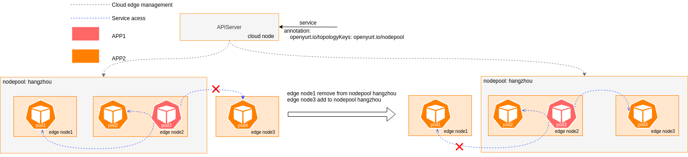
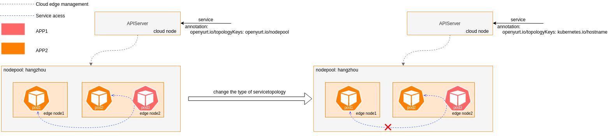
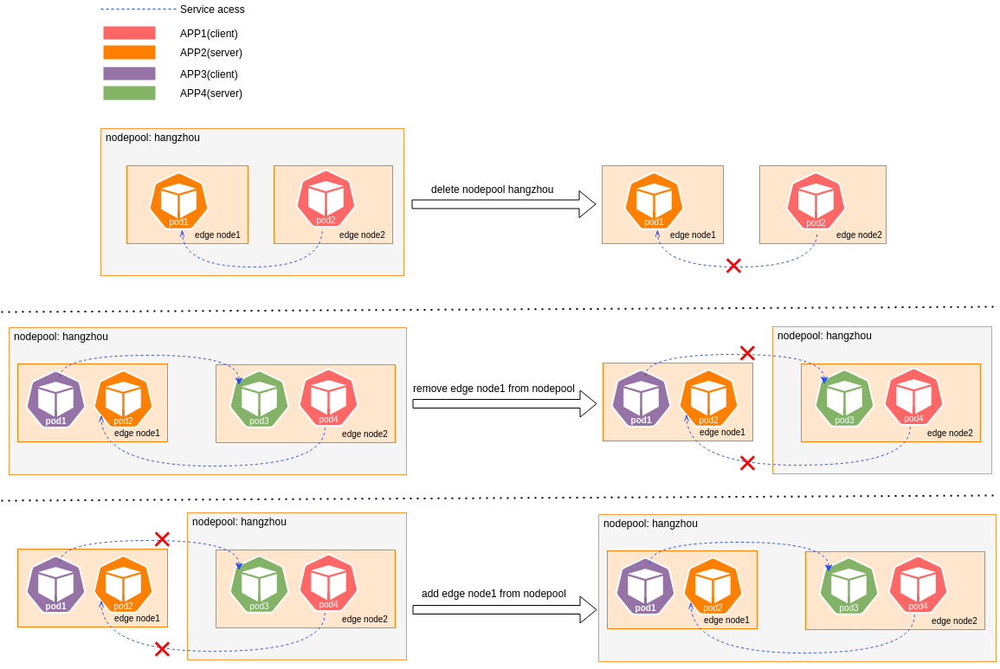

# Proposal to enhance the servicetopology ability of YurtHub

## Table of Contents
- [Title](#title)
  - [Table of Contents](#table-of-contents)
  - [Glossary](#glossary)
  - [Summary](#summary)
  - [Motivation](#motivation)
    - [Goals](#goals)
  - [Proposal](#proposal)
    - [User Stories](#user-stories)
      - [Story 1](#story-1)
      - [Story 2](#story-2)
  - [Implementation History](#implementation-history)

## Glossary

Refer to the [OpenYurt Glossary](https://github.com/openyurtio/openyurt/blob/master/docs/proposals/00_openyurt-glossary.md).

## Summary

Servicetopology filter in Yurthub can work properly when endpointslice or endpoints resource change. But servicetopology filter can't work properly when nodePool or service resource change, like updating topology annotation for service or removing node from nodePool, endpointslice or endpoints on the edge nodes will not be updated.

## Motivation
A new edge node may add to an existed nodepool, or an old edge node may remove from the nodepool. And users may modify the topology configuration in service annotations, like removing `openyurt.io/topologyKeys` or changing topology configuration from `openyurt.io/nodepool` to `kubernetes.io/hostname`.
If endpointslice or endpoints can be changed along with nodepool or service, the servicetopology filter can work properly when nodePool or service resource change. According to the latest nodepool, service access traffic can circulate to new edge nodes and not to old edge nodes. And according to the latest service, the servicetopology filter in YurtHub can change the type of servicetopology or disable servicetopology, etc.





### Goals

- Make servicetopology filter in Yurthub work properly when service change
- Make servicetopology filter in Yurthub work properly when nodepool change

## Proposal

To make servicetopology filter in Yurthub work properly when service or nodepool change, we need two controllers, one for endpoints and another for endpointslice.

### Endpoints controller
The endpoints contoller will watch the change of service and nodepool, the event handlers will enqueue the necessary endpoints to the workqueue of controller, then the controller can modify the trigger annotation `openyurt.io/updateTrigger` for the endpoints. The value of trigger annotation is a timestamp, when the annotation of endpoints is modified, then the servicetopology filter can sense the change of endpoints and will get the latest service and nodepool when filtering.

#### ·Service event handler

When the servicetopology configuration in service.Annotations is modified, the handler will enqueue the endpoints of that service.
```go
func (e *EnqueueEndpointsForService)Update(evt event.UpdateEvent,
	q workqueue.RateLimitingInterface) {
	...

	if newSvc.Annotations[AnnotationServiceTopologyKey] == oldSvc.Annotations[AnnotationServiceTopologyKey] {
		return
	}
	nsName := types.NamespacedName{Namespace: newSvc.Namespace, Name: newSvc.Name}
	q.Add(reconcile.Request{NamespacedName: nsName})
	return
}
```

#### ·Nodepool event handler
In order to reduce the traffic which is generated by the change of endpoints, nodepool event handler will only enqueue those endpoints which are affected by nodepool changes. First, the servicetopology type of endpoints must be nodepool type. Then the endpoints that need to be enqueued must met the following conditions:
- When a nodepool was deleted, the enqueued endpoints should contain any node in the nodepool.
- When old nodes were removed from the nodepool, the enqueued endpoints should contain any removed node or unchanged node.
- When new nodes were added to the nodepool, the enqueued endpoints should contain any added node or unchanged node.



```go
func (e *EnqueueEndpointsForNodePool) Delete(evt event.DeleteEvent,
	q workqueue.RateLimitingInterface) {

	...

	nodesInNp := sets.NewString(np.Status.Nodes...)
	allEps := e.getNodepoolTypeEndpoints()
	var affectedEps []corev1.Endpoints
	for i := range allEps {
		nodesInEp := e.getNodes(&allEps[i])
		if nodesInEp.Intersection(nodesInNp).Len() != 0 {
			affectedEps = append(affectedEps, allEps[i])
		}
	}
	addEndpointsToWorkQueue(affectedEps, q)
	return
}

func (e *EnqueueEndpointsForNodePool) Update(evt event.UpdateEvent,
	q workqueue.RateLimitingInterface) {

	...

	newNpNodes := sets.NewString(newNp.Status.Nodes...)
	oldNpNodes := sets.NewString(oldNp.Status.Nodes...)
	if newNpNodes.Equal(oldNpNodes) {
		return
	}

	allNodes := oldNpNodes.Union(newNpNodes)
	allEps := e.getNodepoolTypeEndpoints()
	var affectedEps []corev1.Endpoints
	for i := range allEps {
		nodesInEp := e.getNodes(&allEps[i])
		if nodesInEp.Intersection(allNodes).Len() != 0 {
			affectedEps = append(affectedEps, allEps[i])
		}
	}

	addEndpointsToWorkQueue(allEps, q)
	return
}
```
### EndpointSlice controller
The endpointslice contoller will watch the change of service and nodepool, the event handlers will enqueue the necessary endpointslices to the workqueue, then the controller can modify the trigger annotation `openyurt.io/updateTrigger` for those endpointslices.

#### ·Service event handler
When the servicetopology configuration in service.Annotations is modified, the handler will enqueue all the endpointslices of that service.
```go
func (e *EnqueueEndpointslicesForService) Update(evt event.UpdateEvent,
	q workqueue.RateLimitingInterface) {
	...

	if newSvc.Annotations[AnnotationServiceTopologyKey] == oldSvc.Annotations[AnnotationServiceTopologyKey] {
		return
	}

	epSliceSelector := labels.SelectorFromSet(
		map[string]string{
			"kubernetes.io/service-name": newSvc.Name,
		},
	)
	epSlicesList := &discovery.EndpointSliceList{}
	err := e.client.List(context.TODO(), epSlicesList, &client.ListOptions{LabelSelector: epSliceSelector.String(), Namespace: newSvc.Namespace})
	if err != nil {
		return
	}
	addEndpointslicesToWorkQueue(epSlicesList.Items, q)
	return
}
```

#### ·Nodepool event handler
Same as endpoints controller, nodepool event handler will only enqueue those affected endpointslices. First, the servicetopology type of endpointslice must be nodepool type. Then the endpointslice that need to be enqueued must met the following conditions:
- When a nodepool was deleted, the enqueued endpointslice should contain any node in the nodepool.
- When old nodes were removed from the nodepool, the enqueued endpointslice should contain any removed node or any unchanged node in the nodepool.
- When new nodes were added to the nodepool, the enqueued endpointslice should contain any added node or any unchanged node in the nodepool.

```go
func (e *EnqueueEndpointslicesForNodePool) Delete(evt event.DeleteEvent,
	q workqueue.RateLimitingInterface) {
	...

	nodesInNp := sets.NewString(np.Status.Nodes...)
	var affectedEndpointSlices []discovery.EndpointSlice
	allEpSlices := e.getNodepoolTypeEndpointslices()
	for _, epSlices := range allEpSlices {
		if e.getNodes(epSlice).Intersection(nodesInNp).Len() != 0 {
			affectedEndpointSlices = append(affectedEndpointSlices, epSlice)
		}
	}
	addEndpointslicesToWorkQueue(affectedEndpointSlices, q)
	return
}

func (e *EnqueueEndpointslicesForNodePool) Update(evt event.UpdateEvent,
	q workqueue.RateLimitingInterface) {
	...

	newNpNodes := sets.NewString(newNp.Status.Nodes...)
	oldNpNodes := sets.NewString(oldNp.Status.Nodes...)
	if newNpNodes.Equal(oldNpNodes) {
		return
	}

	allNodes := oldNpNodes.Union(newNpNodes)
	var affectedEndpointSlices []discovery.EndpointSlice
	allEpSlices := e.getNodepoolTypeEndpointslices()
	for _, epSlices := range allEpSlices {
		if e.getNodes(epSlice).Intersection(allNodes).Len() != 0 {
			affectedEndpointSlices = append(affectedEndpointSlices, epSlice)
		}
	}
	addEndpointslicesToWorkQueue(affectedEndpointSlices, q)
	return
}
```

### User Stories

#### Story 1
When user modifies the servicetopology configuration in service.Annotations, the endpoints controller and endpointslice controller will modify the update trigger annotation of endpoints/endpointslice. Then the servicetopology filter in yurthub can sense the change of endpoints/endpointslices and will get the latest service when filtering. In this way, the servicetopology filter in yurthub can work properly when service change.
#### Story 2
When nodes in nodepool were changed, the endpoints controller and endpointslice controller will modify the update trigger annotation of endpoints/endpointslice. Then the servicetopology filter in yurthub can sense the change of endpoints/endpointslices and will get the latest nodepool when filtering. In this way, the servicetopology filter in yurthub can work properly when nodepool change.

## Implementation History

- [ ] MM/DD/YYYY: Proposed idea in an issue or [community meeting]
- [ ] MM/DD/YYYY: Compile a Google Doc following the CAEP template (link here)
- [ ] MM/DD/YYYY: First round of feedback from community
- [ ] MM/DD/YYYY: Present proposal at a [community meeting]
- [ ] MM/DD/YYYY: Open proposal PR

