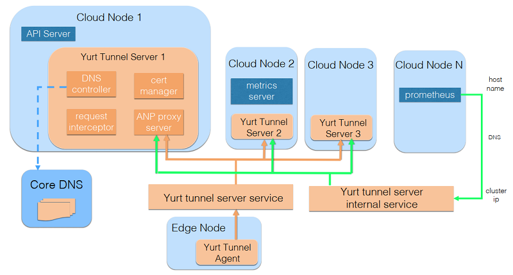
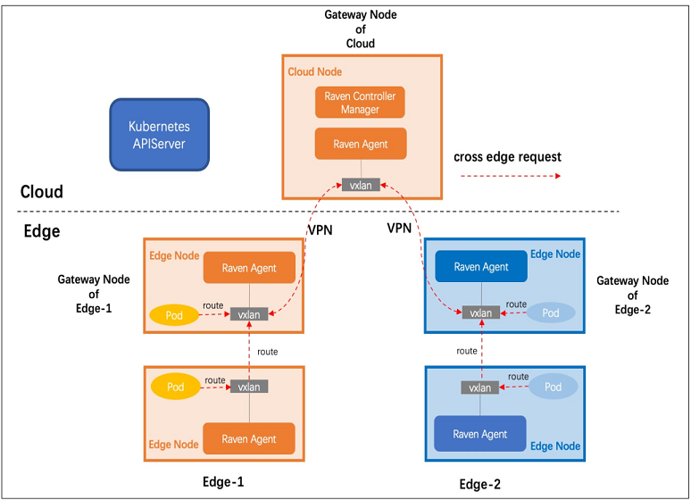
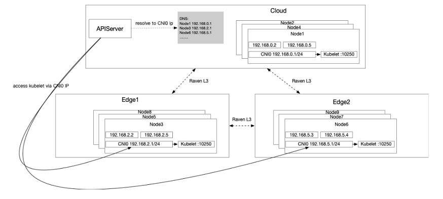
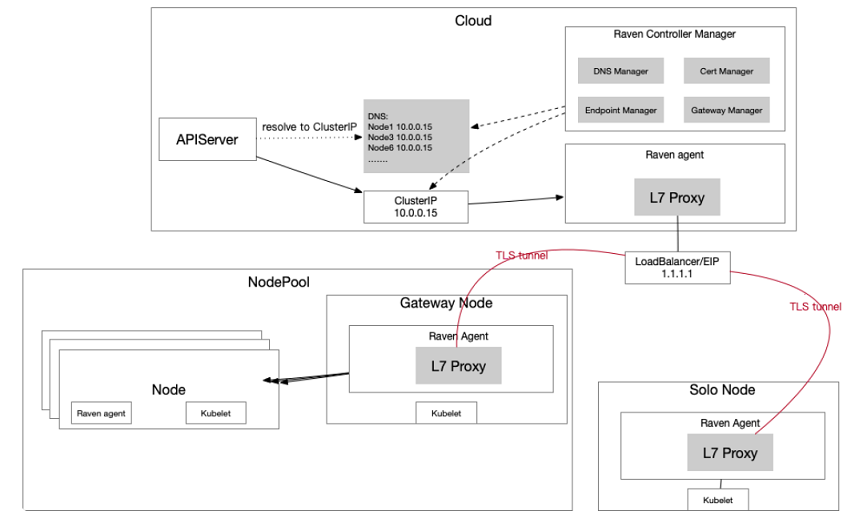

# Unify cloud edge comms solution for OpenYurt

## Table of Contents

- [Unify Cloud Edge Comms Solution](#unify-cloud-edge-comms-solution)
  - [Table of Contents](#table-of-contents)
  - [Summary](#summary)
  - [Motivation](#motivation)
    - [Goals](#goals)
    - [Non-Goals/Future Work](#non-goalsfuture-work)
  - [Proposal](#proposal)
    - [User Stories](#user-stories)
      - [Story 1](#story-1)
      - [Story 2](#story-2)
      - [Story 3](#story-3)
      - [Story 4](#story-4)
    - [Implementation Details/Notes/Constraints](#implementation-detailsnotesconstraints)
  - [Implementation History](#implementation-history)

## Summary

Current OpenYurt provides 2 independent solutions in cloud edge comms domain, which are Raven and YurtTunnel.
Although they are implemented to meet different user requirements, they belong to the same domain for users.
They are located in different repos, so it's hard to maintain them from the project management perspective.
What's more important, although related docs are provided to users, it may lead to user confusion on how to
select them for their own usage scenarios.
This proposal aims to fix these issues by integrating YurtTunnel into Raven.

## Motivation

When Raven and YurtTunnel are combined together, the related implementation for cloud edge comms in dataplane
will be refined so that the related source codes organization will be optimized, so it will be much more easier
to maintain in future.
Besides, providing only one entry to users for their cloud edge comms usage scenarios will definitely improve
the user experience.

### Goals

To integrate YurtTunnel into Raven, we want to achieve the following goals:
- Move YurtTunnel implementation from openyurt repo to raven repo.
- Optimize YurtTunnel implementation which include ANP upgrade, iptables manager removement and etc.
- Fuse Raven and YurtTunnel into one unified cloud edge comms solution.

### Non-Goals/Future Work

At current stage, we mainly focus on fusing Raven and YurtTunnel into one solution, we will not try to
extend new features for them.

## Proposal

We know that YurtTunnel is a layer-7 DevOps traffic tunnel from cloud to edge, while Raven is a layer-3 data
traffic channel between cloud-edge or edge-edge. When we think to unify these 2 solutions, we prefer to
integrate YurtTunnel into Raven to extend Raven scope to cover YurtTunnel features.
About how to achieve the target in a graceful way, we thought about several solution alternatives.

- YurtTunnel Architecture:

- Raven Architecture:

### Raven & YurtTunnel fusion
 The related solution alternatives are described below in details:

1). Solution 1:	Integrate yurttunnel-server and yurttunnel-agent into raven-agent on cloud and edge node
- This solution aims to integrate YurtTunnel logic into raven-agent pod and hide its details to users completely,
    so when users deploy Raven into the cluster, YurtTunnel is enabled by default, we can call it "deep fusion".

					        -----------------------------------------
					        | Cloud Node                            |
					        |      ---------------------------      |
					        |      | raven-agent             |      |
						|      |  ---------------------  |      |
						|      |  | yurttunnel-server |  |      |
					        |      |  ---------------------  |      |
						|      ---------------------------      |
						--------------------|--------------------
					Cloud                       |
					----------------------------|---------------------------
					Edge                        |
					        --------------------|--------------------
					        | Edge Node                             |
						|      ---------------------------      |
					        |      | raven-agent             |      |
						|      |  ---------------------  |      |
						|      |  | yurttunnel-agent  |  |      |
					        |      |  ---------------------  |      |
						|      ---------------------------      |
					        -----------------------------------------

To achieve it, we mainly need to solve 2 problems:
- On Edge side, integrate yurttunnel-agent logic into raven-agent pod, no matter the edge node acts as
    gateway or ordinary role.
- On Cloud side, Integrate yurttunnel-server logic into raven-agent pod.

On Edge side, since both raven-agent and yurttunnel-agent are deployed by daemonset to edge nodes, it seems applicable to combine them together.
But on Cloud side we found several tricky issues:
- The raven-agent is deployed as daemonset on every cloud node, but yurttunnel-server is deployed as deployment with several replicas
  for HA scenario, how to judge which cloud nodes to host the yurttunnel-server?
- If we select the gateway cloud node to host the yurttunnel-server, there would be another issue:
  The gateway role will not be elected until user creates a "gateway" CR, so it will lead to yurttunnel-server function depends on gateway CR
  creation, which is obviously not reasonable.
- Even we have ways to find some cloud nodes to host yurttunnel-server, how to expose the yurttunnel-server service since the yurttunnel-server
  is integrated into some of the raven-agent pods?

By the analysis above, we can see that this "deep fusion" design is too ideal to be implemented, it doesn't make sense to
hide all the YurtTunnel details and integrate it deeply into raven-agent.

2). Solution 2: Integrate yurttunnel-agent into raven-agent while deploying yurttunnel-server independently on cloud side
- Since we met several tricky problems while integrating yurttunnel-server into raven-agent on cloud side, how about to
  deploy yurttunnel-server independently on cloud side? To reduce the confusions to users, we can rename yurttunnel-server
  to "raven-l7-server".

					        -------------------------------------------
					        | Cloud Node                              |
					        | ---------------     ------------------- |
					        | | raven-agent |     | raven-l7-server | |
						| ---------------     ------------------- |
						----------|-------------------|------------
					Cloud             |                   |
					------------------|-------------------|-----------------
					Edge              |                   |
					        ----------|-------------------|------------
					        | Edge Node                               |
						|       ---------------------------       |
					        |       | raven-agent             |       |
						|       |  ---------------------  |       |
						|       |  | yurttunnel-agent  |  |       |
					        |       |  ---------------------  |       |
						|      ----------------------------       |
					        -------------------------------------------

This solution is feasible theoretically，however we know that users don't have to enable Raven and YurtTunnel
features simultaneously, how to handle the condition that users only want to enable one of them?
Besides, this solution aims to fuse Raven and YurtTunnel on Edge side, but leave it alone on Cloud side, which seems not
a consistent design.

Any other solutions for it? Let's continue to go forward...

3). Solution 3: Implement a new CRD as a wrapper layer for users
- From the user experience point of view, how about to define a new CRD as the main entry for users to
  configure Cloud Edge communication? For example, we abstract 3 types of comms usage: nodeName, podIP and nodeIP.

						------------------------------------------------------
					        | Cloud Node 					     |
						|             ----------------------                 |
						|             | new CRD controller |                 |
						|             ----------------------                 |
						|   ----------------------------                     |
						|   | raven-controller-manager |                     |
						|   ----------------------------                     |
					        |   ---------------        -----------------------   |
					        |   | raven-agent |        |  yurttunnel-server  |   |
						|   ---------------        -----------------------   |
						-------------|--------------------------|-------------
					Cloud                |                          |
					---------------------|--------------------------|------------------
					Edge                 |                          |
					        -------------|--------------------------|-------------
					        | Edge Node                                          |
					        |   ---------------         ----------------------   |
					        |   | raven-agent |         |  yurttunnel-agent  |   |
						|   ---------------         ----------------------   |
						------------------------------------------------------

This solution aims to add an abstraction layer to hide the technical details of current Raven and YurtTunnel, the new
CRD operator is responsible for deploying the corresponding components to the cluster, but it may introduce new issues:
- It needs to implement a new operator, which improves the complexity.
- When users select podIP comms method, they need to create gateway CR as well for further configuration, while for
  the nodeName method, users don't need to create other CRs, so the user experience is not consistent.
- If we want to integrate gateway CRD into the new CRD, it also seems tricky because the new CRD is a cluster level
  singleton CRD, while users can create many gateway CRs for their usage scenarios.

It seems we need to think more about it...

4). Solution 4: Divide Raven into 2 subdomains: layer-7 traffic and layer-3 traffic
- When we thought why it's so hard to integrate YurtTunnel into Raven in a deep fusion way, we found the reason is
  they are totally 2 different solutions for different user requirements, they don't depend on each other and there
  are almost nothing in common from design to implementation between them. From the users perspective, they can select
  none/one/both of them according to their usage scenarios. Therefore, comparing to the "deep fusion", how about to implement
  it in a "shallow fusion" way?
- It means that we take YurtTunnel into Raven scope as well, but not merge YurtTunnel components logic into Raven
  components, as a result, the extended Raven includes 2 independent subdomains: Cloud to Edge layer-7 DevOps traffic and
  Cloud-Edge or Edge-Edge layer-3 traffic, they are not coupled to each other, users can select them conveniently by
  deploying the related components into their cluster.

Of course, to make alignment for the whole design, current Raven and YurtTunnel components need to be renamed to
keep a common style. For example:
- `yurttunnel-agent`  -->  `raven-l7-agent`
- `yurttunnel-server` -->  `raven-l7-server`
- `raven-agent`       -->  `raven-l3-agent`
- `raven-controller-manager`  -->  `raven-l3-controller`

					        ------------------------------------------------------
					        | Cloud Node 					     |
						|    -----------------------                         |
						|    | raven-l3-controller |                         |
						|    -----------------------                         |
					        |    ------------------       -------------------    |
					        |    | raven-l3-agent |       | raven-l7-server |    |
						|    ------------------       -------------------    |
						-------------|--------------------------|-------------
					Cloud                |                          |
					---------------------|--------------------------|------------------
					Edge                 |                          |
					        -------------|--------------------------|-------------
					        | Edge Node                                          |
					        |    ------------------       --------------------   |
					        |    | raven-l3-agent |       |  raven-l7-agent  |   |
						|    ------------------       --------------------   |
						------------------------------------------------------

This "shallow fusion" solution has several advantages:
- The layer-7 traffic is separated from the layer-3 traffic, so they will not affect each other.
- The architecture is clear and it's convenient for users to select for their usage scenarios.
- It keeps the core logic of current Raven and YurtTunnel unchanged, so it can be implemented without much effort.

This solution aims to integrate YurtTunnel into Raven in a "shallow fusion" way, which is actually a tradeoff solution
under the limitation of current Raven and YurtTunnel design, but if we assume YurtTunnel doesn't exist, how will we extend
the layer-7 DevOps feature basing on Raven architecture? Let's start the brain storming...

5). Solution 5: Break the shackle and redesign & reimplement the layer-7 tunnel solution basing on Raven architecture
- Since it's hard to integrate YurtTunnel into Raven in a "deep fusion" way, we can try to break it and open up a new idea:
  redesign & reimplement layer-7 tunnel solution basing on Raven architecture.

					        -------------------------------------------
					        | Cloud Node                              |
						|       ---------------------------       |
						|       | raven-controller-manager|       |
						|       ---------------------------       |
					        |       ---------------------------       |
					        |       | raven-agent             |       |
						|       |   ------       ------   |       |
						|       |   | L3 |       | L7 |   |       |
					        |       |   ------       ------   |       |
						|       ---------------------------       |
						---------------------|---------------------
					Cloud                        |
					-----------------------------|--------------------------
					Edge                         |
					        ---------------------|---------------------
					        | Edge Node                               |
					        |       ---------------------------       |
					        |       | raven-agent             |       |
						|       |   ------       ------   |       |
						|       |   | L3 |       | L7 |   |       |
					        |       |   ------       ------   |       |
						|       ---------------------------       |
						-------------------------------------------

This solution is the best solution till now from the design perspective, it provides a more consistent and unified solution to users gracefully.
@BSWANG has worked out the initial design about this solution, which includes 2 design alternatives:

5.1). L7 proxy depends on the enablement of L3 pod communication

- It requires users to adopt the container network in their production environment
- Raven controller is responsible to udpate CoreDNS configmap and manage the map between nodename and IP address
- Adapt to most of the popular CNIs such as flannel/calico
- No extra L7 proxy

5.2). L7 proxy decouple with Raven L3 logic

- If any nodepool is created, assume all nodes in the nodepool are interconnected
- If no nodepool is created on cloud side, assume all the cloud nodes are interconnected
- If no nodepool is created on edge side, assume every node as a nodepool
- The gateway node acts as the package forward node
- Gateway node in edge nodepool keeps long connection with gateway node in cloud nodepool, gateway maintains the connections to it
- When the cloud components access nodename, the dns service parses the nodename to the internal service clusterIP
- Cloud gateway node is responsible to forward the request of nodename to the corresponding edge nodepool gateway node
- Edge gateway node is responsible to forward the request of nodename to the corresponding kubelet port

Components responsibility:
- raven-controller-manager:
	- Cert manager for connection certificate management
	- Gateway Manager selects some nodes as L7 proxy startup gateways according to gateway CR definition
	- Dynamically update the L7 proxy service endpoints according to L7 proxy status
	- Update the CoreDNS configmap to map the hostname to clusterIP
	- Record and generate the Loadbalancer/EIP for external connection
- raven-agent as gateway:
	- Connect the Loadbalancer/EIP exposed by cloud side and establish a tunnel connection to it
	- Forward the user request to the corresponding L7 proxy according to hostname map
	- If the node with the nodename lies in the current nodepool, hijack to the corresponding kubelet port directly
- raven-agent as normal node:
	- None

Extended thinking:
- We can treat the goal of solution 5 is not only to reimplement YurtTunnel's features basing on Raven, actually it aims to restructure
  cross network domain communication for OpenYurt data plane, we can even take the service mesh features into account to work out a more unified
  and sustainable solution in future.

Conclusion:
- By evaluating all the alternatives above, and after discussing with the community members, we achieved an initial agreement:
	- In the short run, solution 4 is a tradeoff transition solution in order to keep the core logic of current Raven and YurtTunnel unchanged.
	- In the long run, solution 5 is the best solution to provide a deeply unified and consistent solution to users although it needs more effort.
	- To save time, we can start to dive into solution 5 directly, considering that some users may only adopt host network in their environment,
          which 5.1) can not meet their requirements, we decide to select 5.2) as our final solution to unify cross network domain communication.
          And we have achieved the agreement after 2 rounds of discussion at the community meeting.

### User Stories

#### Story 1
As an end user, I want to make some DevOps from Cloud to Edge, such as kubectl logs/exec.
#### Story 2
As an end user, I want to get the edge nodes metrics status through Prometheus/Metrics server from Cloud.
#### Story 3
As an end user, I want to access another business pod data from one NodePool to another NodePool.
#### Story 4
As an end user, I want to send some AI data from Edge NodePool to Cloud for next-step processing or storage.

### Implementation Details/Notes/Constraints

## Implementation History

- [ ] 09/30/2022: Draft proposal created
- [ ] 10/12/2022: Present proposal at the community meeting
- [ ] 10/19/2022: Second round discussion at the community meeting
