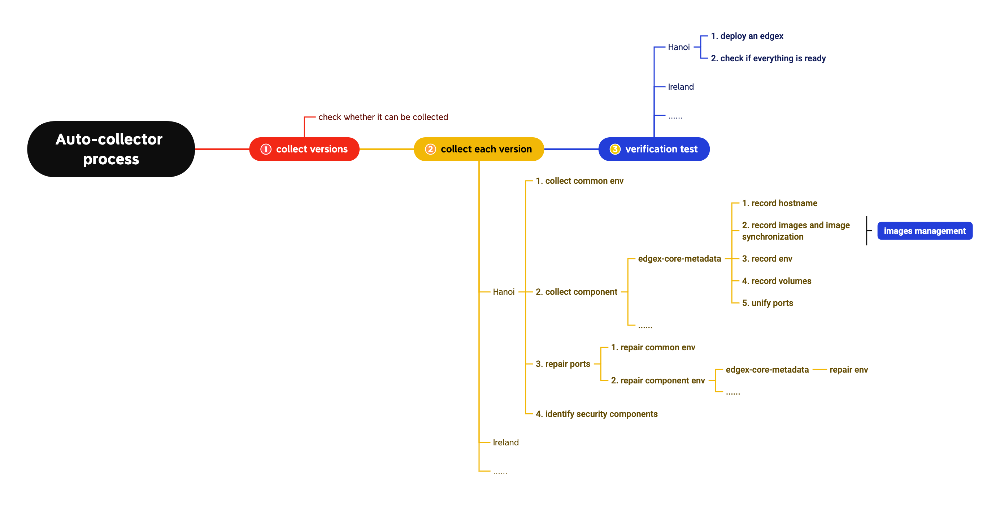
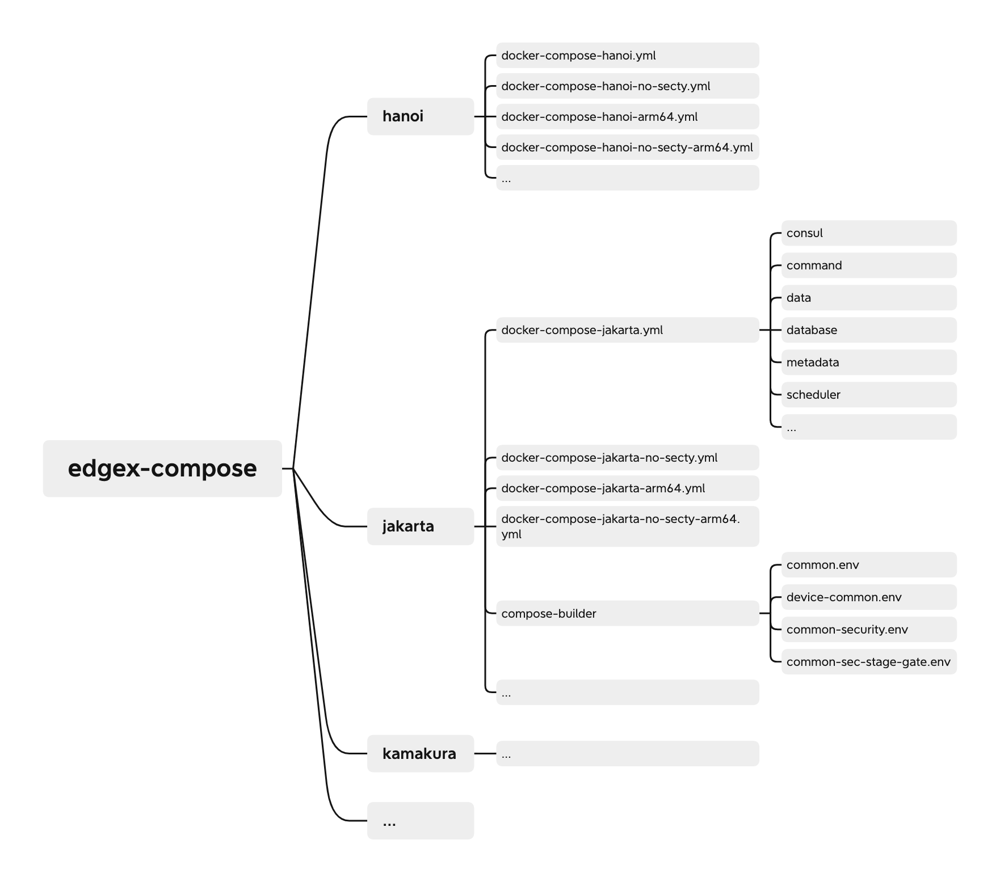
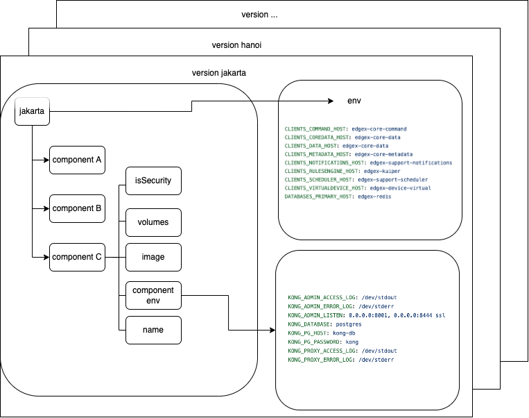
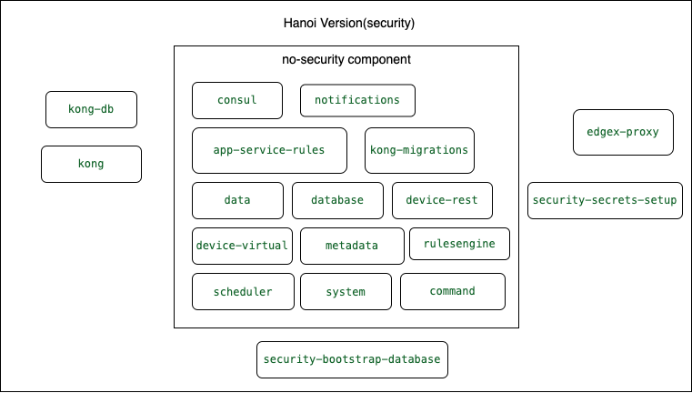
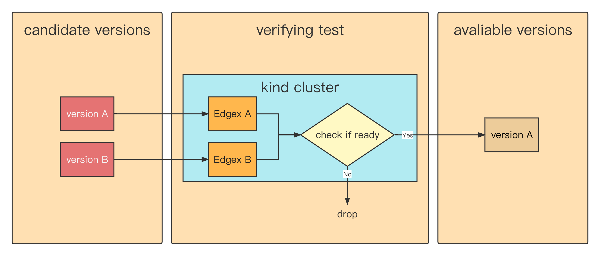

# Edgex Auto-collector Proposal

## Table of Contents

- [Edgex Auto-collector Proposal](#edgex-auto-collector-proposal)
  - [Table of Contents](#table-of-contents)
  - [Glossary](#glossary)
  - [Summary](#summary)
    - [Goals](#goals)
    - [Non-Goals/Future Work](#non-goalsfuture-work)
  - [Proposal](#proposal)
    - [User Stories](#user-stories)
    - [Flow Chart](#flow-chart)
    - [Catching edgex-compose](#catching-edgex-compose)
    - [Design Configuration yaml](#design-configuration-yaml)
    - [Images Management](#images-management)
    - [Unify Ports](#unify-ports)
    - [Repair Environment](#repair-environment)
    - [Add Security Switch](#add-a-security-switch)
    - [Automatically Audit Versions](#automatically-audit-versions)
    - [The Change of CRD](#the-change-of-crd)
    - [Rewrite Controller Part](#rewrite-controller-part)
    - [Supplement](#supplement)

## Glossary

Refer to the [OpenYurt Glossary](https://github.com/openyurtio/openyurt/blob/master/docs/proposals/00_openyurt-glossary.md) and the [EdgeX Foundry Glossary](https://docs.edgexfoundry.org/1.3/general/Definitions/)

## Background

yurt-edgex-manager will be combined with yurt-device-controller and renamed yurt-iot-manager. yurt-iot-manager will define some interfaces and plans to support more different iot frameworks. The objective of this proposal is to improve the adaptation capability of yurt-edgex-manager, which is an improvement of yurt-edgex-manager.

## Summary

This proposal describes a method for automatically collecting and synchronizing information about edgex components into a standardized yaml file. The yurt-edgex-manager will read the standardized yaml file and deploy the edgex component from the yaml file. When a new version of edgex appears, openyurt automatically synchronizes to it, reducing the labor consumption for adapting to the new version frequently. In addition, the proposal also needs to handle the images of components in edgex, automatically pull them and push them to the repository in openyurt. Finally, we'll consider providing some user customization permission to modify the configuration of some edgex components.

## Motivation

Currently, yurt-edgex-manager supports only hanoi and jarkata version of edgex, which are manually written. Considering that the yurt-edgex-manager needs to synchronize the new version of edgex in the future, it will be very troublesome to manually arrange it every time, and the image management and version management will also bring more burdens.

### Goals

- To design a standardized yaml structure for configuration of edgex components
- To design a tool to automatically collect edgex information, periodically synchronize edgex component configurations and update yaml
- To design a tool to collect the edgex version and image information then push it to the repository of openyurt
- Gives the user some permissions to customize edgex configurations
- Add a security switch in edgex field
- Automatically collect configurations for the arm architecture

### Non-Goals/Future Work

Non-goals are limited to the scope of this proposal. These features may evolve in the future.

- Customized edgex configuration for the user
- Upgrade yurt-edgex-manager to yurt-iot-manager
- To design new edgex API, The edge additional components config is too complex.

## Proposal

### User Stories

1. As a developer, I would like Openyurt to automatically collect the edgex configuration instead of me writing it manually,
2. As a user, I want permission to customize edgex components.

### Flow chart


### Catching edgex-compose

Edgex docker compose contains the docker compose files for EdgeX releases. Each release is now on it's own branch.

Since the hanoi version, edgex-compose repository files follow the following specification. First, different versions are differentiated through the github branch. Each version has four yml files: insecure amd64, secure amd64, insecure arm64, and secure arm64. Each yml file describes the components required for that type of edgex and the configuration information for each component, which is one of our sources of information. In addition, each edgex release will have a compose-builder folder with env files for building public environment variables, which we'll discuss later.



### Design configuration yaml

**One of the components in edgex-compose is as follows:**

```yaml
metadata:
    container_name: edgex-core-metadata
    depends_on:
    - consul
    - database
    - notifications
    - security-bootstrap-database
    - vault-worker
    environment:
      CLIENTS_COMMAND_HOST: edgex-core-command
      CLIENTS_COREDATA_HOST: edgex-core-data
      CLIENTS_DATA_HOST: edgex-core-data
      CLIENTS_METADATA_HOST: edgex-core-metadata
      CLIENTS_NOTIFICATIONS_HOST: edgex-support-notifications
      CLIENTS_RULESENGINE_HOST: edgex-kuiper
      CLIENTS_SCHEDULER_HOST: edgex-support-scheduler
      CLIENTS_VIRTUALDEVICE_HOST: edgex-device-virtual
      DATABASES_PRIMARY_HOST: edgex-redis
      EDGEX_SECURITY_SECRET_STORE: "true"
      NOTIFICATIONS_SENDER: edgex-core-metadata
      REGISTRY_HOST: edgex-core-consul
      SECRETSTORE_HOST: edgex-vault
      SECRETSTORE_ROOTCACERTPATH: /tmp/edgex/secrets/ca/ca.pem
      SECRETSTORE_SERVERNAME: edgex-vault
      SECRETSTORE_TOKENFILE: /tmp/edgex/secrets/edgex-core-metadata/secrets-token.json
      SERVICE_HOST: edgex-core-metadata
    hostname: edgex-core-metadata
    image: edgexfoundry/docker-core-metadata-go:1.3.1
    networks:
      edgex-network: {}
    ports:
    - 127.0.0.1:48081:48081/tcp
    read_only: true
    volumes:
    - /tmp/edgex/secrets/ca:/tmp/edgex/secrets/ca:ro,z
    - /tmp/edgex/secrets/edgex-core-metadata:/tmp/edgex/secrets/edgex-core-metadata:ro,z
```

This is the metadata component in edgex hanoi. As you can see, there are a lot of fields in it. We don't need all the information. The information we need is component names, images, environment, volumes, and so on. For environment fields, we need to distinguish between common and individual environment variables, and then set common environment variables to Version level data and individual environment variables to Component level data.

**The following configuration is collected by the automatic collector:**

```yaml
- versionName: hanoi
  env:
    CLIENTS_COMMAND_HOST: edgex-core-command
    CLIENTS_COMMAND_PORT: "2000"
    CLIENTS_COREDATA_HOST: edgex-core-data
    CLIENTS_COREDATA_PORT: "2000"
    CLIENTS_DATA_HOST: edgex-core-data
    CLIENTS_DATA_PORT: "2000"
    CLIENTS_METADATA_HOST: edgex-core-metadata
    CLIENTS_METADATA_PORT: "2000"
    CLIENTS_NOTIFICATIONS_HOST: edgex-support-notifications
    CLIENTS_NOTIFICATIONS_PORT: "2000"
    CLIENTS_RULESENGINE_HOST: edgex-kuiper
    CLIENTS_RULESENGINE_PORT: "2000"
    CLIENTS_SCHEDULER_HOST: edgex-support-scheduler
    CLIENTS_SCHEDULER_PORT: "2000"
    CLIENTS_VIRTUALDEVICE_HOST: edgex-device-virtual
    CLIENTS_VIRTUALDEVICE_PORT: "2000"
    DATABASES_PRIMARY_HOST: edgex-redis
    DATABASES_PRIMARY_PORT: "2000"
    EDGEX_SECURITY_SECRET_STORE: "true"
    REGISTRY_HOST: edgex-core-consul
    REGISTRY_PORT: "2000"
    SECRETSTORE_HOST: edgex-vault
    SECRETSTORE_PORT: "2000"
    SECRETSTORE_ROOTCACERTPATH: /tmp/edgex/secrets/ca/ca.pem
    SECRETSTORE_SERVERNAME: edgex-vault
  components:
    - name: edgex-core-metadata
      image: edgexfoundry/docker-core-metadata-go:1.3.1
      componentEnv:
        NOTIFICATIONS_SENDER: edgex-core-metadata
        SECRETSTORE_TOKENFILE: /tmp/edgex/secrets/edgex-core-metadata/secrets-token.json
        SERVICE_HOST: edgex-core-metadata
        SERVICE_PORT: "2000"
      isSecurity: true
      volumes:
      - /tmp/edgex/secrets/ca:/tmp/edgex/secrets/ca
      - /tmp/edgex/secrets/edgex-core-metadata:/tmp/edgex/secrets/edgex-core-metadata
```

**The following picture is the structure of the yaml file:**



Here are the definitions of the Version and Component structures in the code:

```go
type Versions []Version

type Version struct {
	logger     logr.Logger
	Name       string            `yaml:"versionName"`
	Env        map[string]string `yaml:"env,omitempty"`
	Components []Component       `yaml:"components,omitempty"`
}

type Component struct {
	Name         string            `yaml:"name"`
	Image        string            `yaml:"image"`
	Volumes      []string          `yaml:"volumns,omitempty"`
	ComponentEnv map[string]string `yaml:"componentEnv,omitempty"`
	IsSecurity bool `yaml:"isSecurity"`
  // A pointer to the Env of the previous level
	envRef     *map[string]string
}
```

### Images management

When we collect the edgex configuration, we need to pull the image according to the image field of each component and push it to the repo of openyurt.

### Unify port

The ports field is important for edgex. Configuring ports in the edgex component is controlled using environment variables (except consul and redis components), so you can change the port configuration just by changing the component's environment variables. Since we're starting in a container, we chose to unify the ports for each component (this is not a problem because k8s uses clusterIP internally). So for the environment variables that indicate the port, we change them all to the same value.

In the environment variable of the edgex component, the variable ending in "PORT" is the port used by the specified component, so we only need to detect the environment variable ending in "PORT".

### Repair environment

For components that are not written in the yml file, such as the port control for some containers, the default values of the toml file in edgex-go are used for values that do not pass environment variables. For example, this is the configuration of the core-data component in the main branch: [https://github.com/edgexfoundry/edgex-go/blob/main/cmd/core-data/res/configuration.toml](https://github.com/edgexfoundry/edgex-go/blob/main/cmd/core-data/res/configuration.toml). All we need to do is find all the variables ending in `HOST` and then check them for any corresponding variables ending in `PORT` and complete them if they don't.

This is the yaml before repairment:

```yaml
CLIENTS_CORE_COMMAND_HOST: edgex-core-command
CLIENTS_CORE_DATA_HOST: edgex-core-data
CLIENTS_CORE_METADATA_HOST: edgex-core-metadata
CLIENTS_SUPPORT_NOTIFICATIONS_HOST: edgex-support-notifications
CLIENTS_SUPPORT_SCHEDULER_HOST: edgex-support-scheduler
```

This is the yaml after the repairment:

```yaml
CLIENTS_CORE_COMMAND_HOST: edgex-core-command
CLIENTS_CORE_COMMAND_PORT: "2000"
CLIENTS_CORE_DATA_HOST: edgex-core-data
CLIENTS_CORE_DATA_PORT: "2000"
CLIENTS_CORE_METADATA_HOST: edgex-core-metadata
CLIENTS_CORE_METADATA_PORT: "2000"
CLIENTS_SUPPORT_NOTIFICATIONS_HOST: edgex-support-notifications
CLIENTS_SUPPORT_NOTIFICATIONS_PORT: "2000"
CLIENTS_SUPPORT_SCHEDULER_HOST: edgex-support-scheduler
CLIENTS_SUPPORT_SCHEDULER_PORT: "2000"
```

### Add a security switch

By looking at the structure of EdGex-Compose, we can find that each edgex version above hanoi is divided into safe and unsafe versions. The insecure version of edgex is a subset of the secure version. In other words, the secure version of edgex will add some components and configurations on the basis of the insecure version. For the added components, we can scan the component information by grabbing the `docker-compose-<version>-no-secty.yml` file to see which components are secure. For the added configuration, since the added environment variables do not have any effect on the running of the insecure version, we can ignore them.



### Automatically audit versions

Because the collection of edgex configuration information is automated, we need a process to verify its reliability. This program behaves like a simple e2e test. By launching this simple test we can ensure that the user is using the correct edgex configuration.



### The change of CRD

Below is the current structure of edgex's spec.

```go
// EdgeXSpec defines the desired state of EdgeX
type EdgeXSpec struct {
	Version string `json:"version,omitempty"`

	ImageRegistry string `json:"imageRegistry,omitempty"`

	PoolName string `json:"poolName,omitempty"`

	ServiceType corev1.ServiceType `json:"serviceType,omitempty"`
	// +optional
	AdditionalService []ServiceTemplateSpec `json:"additionalServices,omitempty"`

	// +optional
	AdditionalDeployment []DeploymentTemplateSpec `json:"additionalDeployments,omitempty"`
}
```

We will modify the spec of yurt-edgex-manager at this stage. The previous `additionalServices` and `additionalDeployments` fields are not user-friendly. We need to change them to the `components` field and in the next step give the user an easier way to configure them.

```go
// EdgeXSpec defines the desired state of EdgeX
type EdgeXSpec struct {
	Version string `json:"version,omitempty"`

	ImageRegistry string `json:"imageRegistry,omitempty"`

	PoolName string `json:"poolName,omitempty"`

	ServiceType corev1.ServiceType `json:"serviceType,omitempty"`

  Components []Component `json:"components,omitempty"`

	// deprecated
	// +optional
	AdditionalService []ServiceTemplateSpec `json:"additionalServices,omitempty"`

	// deprecated
	// +optional
	AdditionalDeployment []DeploymentTemplateSpec `json:"additionalDeployments,omitempty"`
}
```

We'll add a warning to `kubebuilder` .

```go
// +kubebuilder:deprecatedversion:warning="device.openyurt.io/v1alpha1 edgex.spec.additionalServices and edgex.spec.additionalDeployments are deprecated in v0.3.0+; use device.openyurt.io/v1alpha1 edgex.spec.components"
```

### Rewrite controller part

We need to change the controller to read yaml. The controller reads each version and creates the component that the user needs.

### Supplement

- The automatic collector is separate from the main program and does not affect the current user's use
- Automatic collection is triggered periodically, such as periodically executing github actions