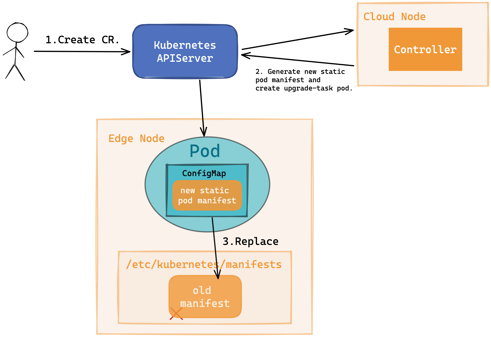
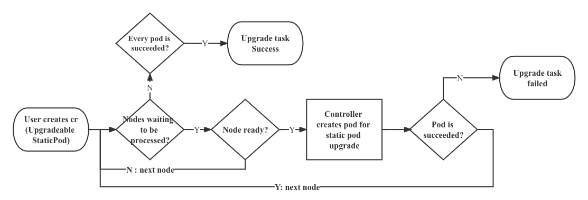

# Static Pod Upgrade Model

## Table of Contents

A table of contents is helpful for quickly jumping to sections of a proposal and for highlighting
any additional information provided beyond the standard proposal template.
[Tools for generating](https://github.com/ekalinin/github-markdown-toc) a table of contents from markdown are available.

- [Title](#title)
  - [Table of Contents](#table-of-contents)
  - [Glossary](#glossary)
  - [Summary](#summary)
  - [Motivation](#motivation)
    - [Goals](#goals)
    - [Non-Goals/Future Work](#non-goalsfuture-work)
  - [Proposal](#proposal)
    - [User Stories](#user-stories)
      - [Story 1](#story-1)
      - [Story 2](#story-2)
    - [Requirements (Optional)](#requirements-optional)
      - [Functional Requirements](#functional-requirements)
        - [FR1](#fr1)
        - [FR2](#fr2)
      - [Non-Functional Requirements](#non-functional-requirements)
        - [NFR1](#nfr1)
        - [NFR2](#nfr2)
    - [Implementation Details/Notes/Constraints](#implementation-detailsnotesconstraints)
    - [Risks and Mitigations](#risks-and-mitigations)
  - [Alternatives](#alternatives)
  - [Upgrade Strategy](#upgrade-strategy)
  - [Additional Details](#additional-details)
    - [Test Plan [optional]](#test-plan-optional)
  - [Implementation History](#implementation-history)

## Glossary

Refer to the [Cluster API Book Glossary](https://cluster-api.sigs.k8s.io/reference/glossary.html).

If this proposal adds new terms, or defines some, make the changes to the book's glossary when in PR stage.

## Summary

In this proposal, we hope to put forward a new method to control the upgrade of static pods automatically, so we add a new CRD(StaticPod) to control the upgrade of static pods. Meanwhile, we provide two upgrade strategy for static pod: AdvancedRollingUpdate and OTA.

## Motivation

We all know that static pods are managed directly by the kubelet daemon on a specific node, without the API server observing them. Generally speaking, if we want to upgrade static pods, we may modify or replace the manifests under `staticPodPath`(Usually it's `/etc/kubernetes/manifests`) on a specific node. When the number of edge static pods becomes very large, this can be a truly tedious and painful task. Therefore, in cloud-edge collaboration scenario, it is very necessary to provide a proper static pod upgrade model like other workloads, such as DaemonSet.

### Goals

1. Provide common upgrade model for upgrading static pod.
2. Provide AdvancedRollingUpdate upgrade model for static pod in order to get rid of blocking upgrade by notReady nodes.
3. Provide OTA upgrade model for static pod when end user hope to control the time of upgrade.

### Non Goals

1. Systemd service(like kubelet) upgrade will not be covered.
2. Do not consider the details of the static pod installation.

## Proposal

### Implementation Details

#### New CRD
```go
// StaticPodUpgradeStrategy defines a strategy to upgrade a static pod.
type StaticPodUpgradeStrategy struct {
	// Type of Static Pod upgrade. Can be "AdvancedRollingUpdate" or "OTA".
	// +optional
	Type StaticPodUpgradeStrategyType

	// AdvancedRollingUpdate upgrade config params. Present only if type = "AdvancedRollingUpdate".
	MaxUnavailable intstr.IntOrString
}

// StaticPodUpgradeStrategyType is a strategy according to which a static pod gets upgraded.
type StaticPodUpgradeStrategyType string

const (
	// AdvancedRollingUpdateStaticPodUpgradeStrategyType - Replace the old static pod by new ones using AdvancedRollingUpdate upgrade i.e. replace them on each node one after the other.
    AdvancedRollingUpdateStaticPodUpgradeStrategyType StaticPodUpgradeStrategyType = "AdvancedRollingUpdate"

	// OTAStaticPodUpgradeStrategyType - Replace the old static pod only when it's killed
	OTAStaticPodUpgradeStrategyType StaticPodUpgradeStrategyType = "OTA"
)

// StaticPodSpec defines the desired state of StaticPod
type StaticPodSpec struct {
	// INSERT ADDITIONAL SPEC FIELDS - desired state of cluster
	// Important: Run "make" to regenerate code after modifying this file

	// StaticPodName indicates the static pod desired to be upgraded.
    StaticPodName string `json:"staticPodName`

	// StaticPodManifest indicates the Static Pod desired to be upgraded. The corresponding
	// manifest file name is `ManifestName.yaml`.
	StaticPodManifest string `json:"staticPodManifest"`

	// An upgrade strategy to replace existing static pods with new ones.
	// +optional
	UpgradeStrategy StaticPodUpgradeStrategy `json:"upgradeStrategy"`

	// An object that describes the desired upgrade static pod.
	Template v1.PodTemplateSpec `json:"template"`
}

type StaticPodConditionType string

const (
	// StaticPodUpgradeSuccess means static pods on all nodes have been upgraded to the latest version
    StaticPodUpgradeSuccess StaticPodConditionType = "Success"

	// StaticPodUpgradeExecuting means static pods upgrade task is in progress
    StaticPodUpgradeExecuting StaticPodConditionType = "Upgrading"

	// StaticPodUpgradeFailed means that exist pods failed to upgrade during the upgrade process
    StaticPodUpgradeFailed StaticPodConditionType = "Failed"
)

// StaticPodCondition describes the state of a StaticPodCondition at a certain point.
type StaticPodCondition struct {
	// Type of StaticPod condition.
	Type StaticPodConditionType `json:"type,omitempty"`

	// Status of the condition, one of True, False, Unknown.
	Status v1.ConditionStatus `json:"status,omitempty"`

	// Last time the condition transitioned from one status to another.
	LastTransitionTime metav1.Time `json:"lastTransitionTime,omitempty"`

	// The reason for the condition's last transition.
	Reason string `json:"reason,omitempty"`

	// A human-readable message indicating details about the transition.
	Message string `json:"message,omitempty"`
}

// StaticPodStatus defines the observed state of StaticPod
type StaticPodStatus struct {
	// INSERT ADDITIONAL STATUS FIELD - define observed state of cluster
	// Important: Run "make" to regenerate code after modifying this file

	// The number of static pods that should be upgraded.
	DesiredNumber int32

	// The number of static pods that have been upgraded.
	UpgradedNumber int32

	// Represents the latest available observations of StaticPod's current state.
	Conditions []StaticPodCondition
}
```

#### Workflow

<div align="center">
  
</div>

#### Upgrade Task Pod (static-pod-upgrade)

- Check the existence of static pod manifest.
- Replace static pod manifest.
- Verify the new static pod status.

#### New Static Pod Manifest (ConfigMap)

1. Controller generate new static pod manifest from CR.
2. Controller creates a ConfigMap to store the new manifest.
3. Controller creates an upgrade-task pod which refers to the ConfigMap.

#### AdvancedRollingUpdate Upgrade

AdvancedRollingUpdate Upgrade is the default static pod upgrade strategy we want to provide. The core capability of AdvancedRollingUpdate Upgrade is to automate the upgrade process for all selected static pods on ready nodes after user submits an upgrade request. This strategy ensures that ready nodes can be upgraded smoothly even when some edge nodes are disconnected from the cloud.
<div align="center">
  
</div>

- AdvancedRollingUpdate Upgrade strategy supports rolling update and the configuration method is the same with native K8s workload.
- `Not-ready` nodes will be ignored during upgrade tasks in AdvancedRollingUpdate Upgrade strategy. However, the controller will monitor the status of the `not-ready` node and automatically performs upgrade operation once the node turn ready.

#### OTA Upgrade

OTA upgrade strategy focuses on scenarios where edge side users need to autonomously control the upgrade of static pods. The strategy is accomplished by controller together with YurtHub component. The overall implementation process is the same as [`daemonPodUpdater`](https://openyurt.io/docs/next/user-manuals/workload/daemon-pod-updater).

##### Controller

- Controller will set the static pod condition `PodNeedUpgrade` to true when user submits a new upgrade request.
- If the node is `ready`, controller will create an upgrade-task pod to store the static pod manifest in advance, with file name `xxx.yaml.upgrade`.

##### YurtHub

YurtHub will provide two REST APIs for upgrade, just the same as DaemonSet.

1. `GET /pods`
This API allows you to get information about the pods on the node.
2. `POST /openyurt.io/v1/namespaces/{ns}/pods/{podname}/upgrade`
This API will replace the old static pod manifest with the new one, if it exists. And if the new manifest(`xxx.yaml.upgrade`) doesn't exist, OpenYurt will request the latest version from the cloud.

#### Other
When we adopt this upgrade model, we will record the latest version of static pod in the cluster. So when joining nodes to the cluster we can get the required static pod manifest directly from the cloud. Currently, OpenYurt provides command `yurtadm join` to join nodes. Perhaps we need to adapt this command to support automatically deploying a static pod when joining nodes.


