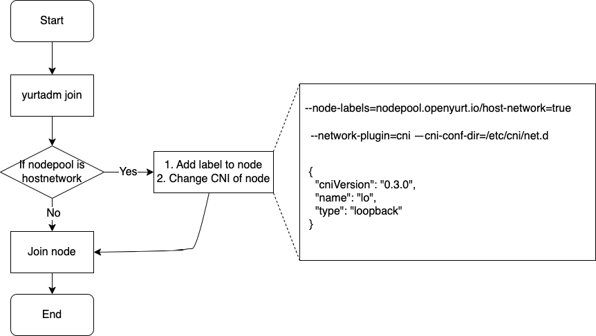
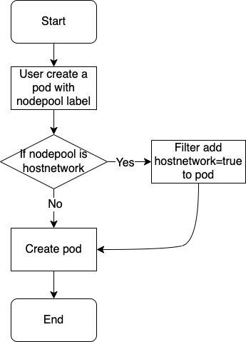

# Support nodepool with host network mode
<!-- END Remove before PR -->

## Table of Contents

* [Support nodepool with host network mode](#support-nodepool-with-host-network-mode)
  * [Table of Contents](#table-of-contents)
  * [Summary](#summary)
  * [Motivation](#motivation)
    * [Goals](#goals)
    * [Non-Goals/Future Work](#non-goalsfuture-work)
  * [Proposal](#proposal)
    * [Definition](#definition)
    * [Architecture](#architecture)
    * [User Stories](#user-stories)
  * [Implementation History](#implementation-history)

<!-- Created by https://github.com/ekalinin/github-markdown-toc -->
## Summary

We need a new type of node pool that uses host network mode, and components corresponding to non-host networks (such as kube-proxy, flannel, coredns) will not be installed on these nodes. By adding a field `node-network-mode`=true to describe the host network mode NodePool, modifying the nodepool controller to implement label distribution to the corresponding nodepool nodes, and adding a Pod webhook to modify the Pod network, we can improve the performance and efficiency of edge nodes.

## Motivation

In the cloud edge architecture, some edge nodes are only used to install simple applications that do not need to access other Pods through services or DNS. At the same time, these Pods only need to use the host network. Installing kube-proxy/flannel/coredns components on these nodes is a waste of resources because these components are not needed in this scenario. Kube-proxy is responsible for implementing load balancing and traffic forwarding for services, flannel is responsible for implementing network communication between Pods across hosts, and coredns is responsible for implementing domain name resolution between Pods. If Pods on edge nodes only need to use the host network, these components are not necessary. On the contrary, these components will occupy the limited CPU, memory, and network resources of edge nodes, reducing the performance and efficiency of edge nodes. Therefore, they should be avoided or optimized.

It can be seen below that kube-proxy/flannel/coredns components are occupying a significant amount of CPU and memory.

```
$ k top po -A --sort-by=memory
NAMESPACE      NAME                                       CPU(cores)   MEMORY(bytes)
kube-system    kube-apiserver-master1                     127m         350Mi
kube-system    etcd-master1                               29m          81Mi
kube-system    kube-controller-manager-master1            43m          49Mi
cert-manager   cert-manager-cainjector-74bfccdfdf-4kvf7   3m           30Mi
kube-system    kube-proxy-fttg6                           1m           22Mi
kube-flannel   kube-flannel-ds-cd9f6                      7m           21Mi
cert-manager   cert-manager-b4d6fd99b-bj9jm               2m           17Mi
kube-system    coredns-7d89d9b6b8-vhqj7                   4m           16Mi
kube-system    coredns-7d89d9b6b8-fn9c4                   3m           16Mi
kube-system    kube-scheduler-master1                     6m           16Mi
kube-system    metrics-server-66dd897cc4-zl2sq            8m           14Mi
kube-system    metrics-server-59d8dc4bc-54v59             6m           13Mi
kube-flannel   kube-flannel-ds-cs9dp                      9m           11Mi
cert-manager   cert-manager-webhook-65b766b5f8-z9k6c      5m           11Mi
kube-system    kube-proxy-x2v2r                           3m           10Mi
default        nginx-pod                                  0m           3Mi
```

### Goals

Implement a new type of NodePool that enables Pods on the nodes to use the host network while not using services, CoreDNS, and other components.

### Non-Goals/Future Work

Refactor `yurtadm join` and so on.

## Proposal

### Definition

* NodePool with host network mode
  * A new NodePool type where Pods will only use host networking mode, suitable for lightweight and minimally demanding edge nodes.

### Architecture

Here is a example for NodePool in host network mode:

```
apiVersion: apps.openyurt.io/v1beta1
kind: NodePool
metadata:
  name: beijing
spec:
  type: Cloud
  hostNetwork: true
```

The work we need to do is as follows:

We should add nodepool.openyurt.io/host-network=true label to node in the yurtadm join when node is joined into the cluster. Because flannel/kube-proxy/coredns daemon pod will be run on the node before the NodePool controller add this label on the node.

* Step1: Design a new field for NodePool called hostNetwork=true/false. True indicates that this is a NodePool of hostNetwork mode type.
* Step2: Add the label to node: After yurtadm join must specify nodepool, when executing yurtadm join, first check the specified nodepool type, if it is `hostnetwork=true`, we can use yurtadm to add a parameter `--node-labels=nodepool` to `kubeadm-flags.env` .openyurt.io/host-network=true`
* Step3: change CNI of node: Same as the previous step, we can add a parameter `--cni-conf-dir=/etc/cni/net.d` to `kubeadm-flags.env` when yurtadm joins to `hostnetwork=true` node pool , and create `/etc/cni/net.d/0-loopback.conf` file on the node, the content is as follows:
```
{
  "cniVersion": "0.3.0",
  "name": "lo",
  "type": "loopback"
}
```
Set the network plugin to loopback.
```
systemctl daemon-reload & systemctl restart kubelet
```

* Step4: Add the hostNetwork=true to pod: Create a filter named podhostnetwork in the filter framework of yurthub to modify the pod of the node pool Label with hostnetwork
* Step5: Add webhook to make sure the hostNetwork attribute of nodepool cannot be modified during the nodePool life cycle; the hostNetwork attribute of node cannot be modified during the nodePool life cycle

Note: Just as the kubernetes pod does not allow midway modification of the hostnetwork, we do not support midway modification of the hostnetwork of the node pool.

`yurtadm join node` do as follow:
<div align="center">
  
</div>

`podhostnet filter` do as follow:
<div align="center">
  
</div>

* Step 6: Before installing openyurt, it is required that users add node anti-affinity to components such as kube-proxy(daemonset)/coredns(deployment) of the cluster, and do not schedule nodes without the `nodepool.openyurt.io/host-network`=`true` label.

```
affinity:
  nodeAffinity:
    requiredDuringSchedulingIgnoredDuringExecution:
      nodeSelectorTerms:
      - matchExpressions:
        - key: nodepool.openyurt.io/host-network
          operator: NotIn
          values:
            - true
```

Users can configure according to their needs

### User Stories

As a user, I hope my edge nodes are as lightweight as possible, consume minimal resources, and have a simple network model.

## Implementation History


