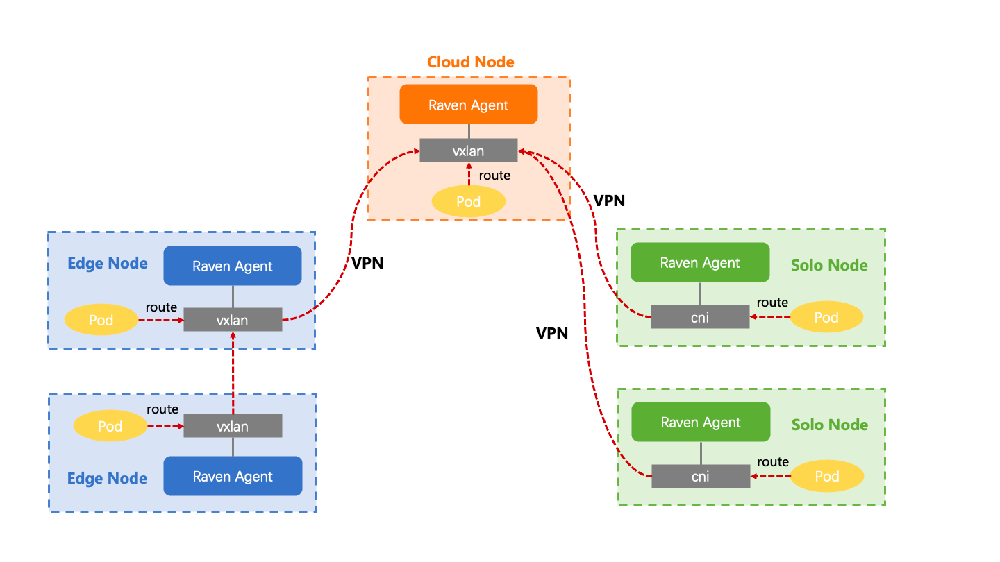
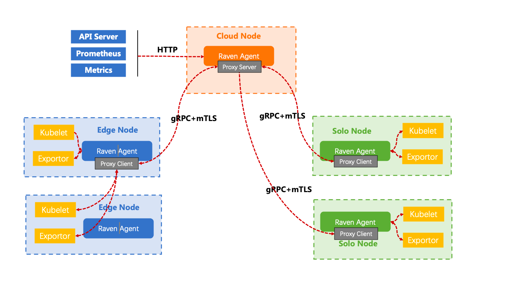
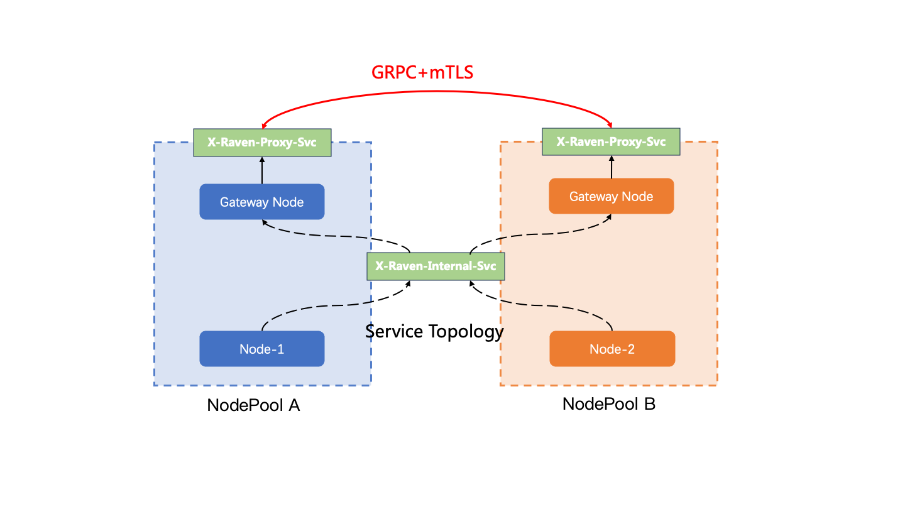
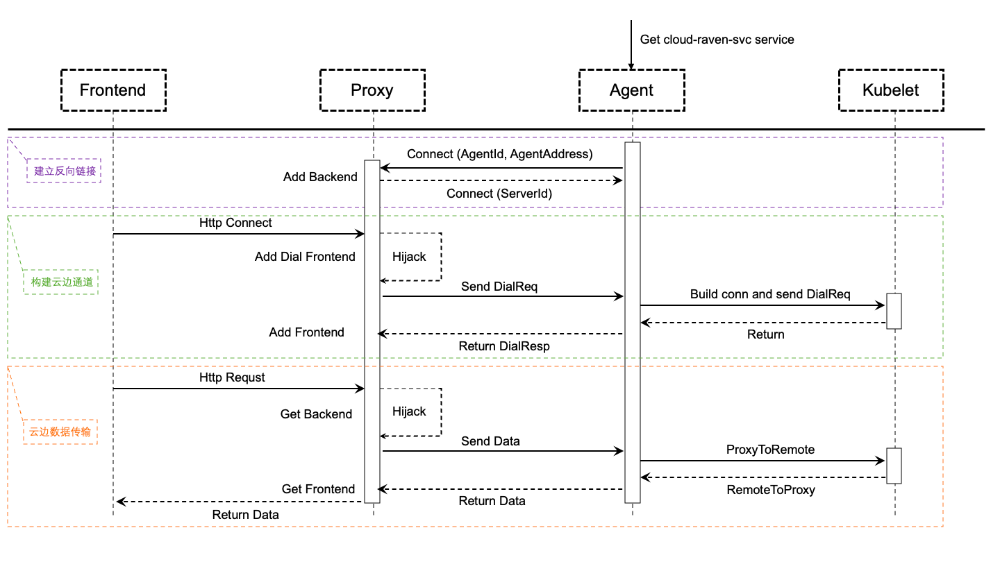

# Support raven l7 proxy for cross-domain service proxy

## Table of Contents
- [support raven l7 proxy](#support raven l7 proxy)
  - [Table of Contents](#table-of-contents)
  - [Summary](#summary)
  - [Motivation](#motivation)
    - [Goals](#goals)
    - [Non-Goals/Future Work](#non-goalsfuture-work)
  - [Proposal](#proposal)
    - [Raven L3 Architecture](#raven-l3-architecture)
    - [Raven L7 Architecture](#raven-l7-architecture)
    - [Gateway API](#gateway-api)
    - [Config Controller/Webhook](#config-controllerwebhook)
    - [Service Controller](#service-controller)
    - [DNS Controller](#dns-controller)
    - [Cert Manager](#certmanager)
    - [Raven L7 Proxy](#raven-l7-proxy-logic)
  - [Further optimization](#proposal)
    - [User Stories](#user-stories)
      - [Story 1](#story-1)
      - [Story 2](#story-2)
      - [Story 3](#story-3)
    - [Implementation Details/Notes/Constraints](#implementation-detailsnotesconstraints)
  - [Implementation History](#implementation-history)

## Summary
In the edge scenario, the cloud and the edge are usually on different network domain, so the host and container networks across the network domain are not interconnected. raven-l3 can solve cross-domain communication in the absence of IP address conflict, raven still needs to be enhanced to support cross-domain access to host services in the case of IP conflict. This proposal aims to enhance raven network capabilities and replace yurt-tunnel.

## Motivation
Enhance raven network capability to support cross-domain access to host services in the case of IP conflict

### Goals
Enhanced Raven networking to replace Yurt-Tunnel, we want to achieve the following goals:
- Implement 7 layer proxy in the Raven project
- Maintain uniform architecture and design with Raven L3
- Do not rely too heavily on the control plane

### Non-Goals/Future Work
- Re-implement the reverse proxy tunnel packages into Raven repo instead of using ANP

## Proposal
### Raven L3 Architecture:


- RavenAgent is deployed on each node of the cluster in DaemonSet mode, and the container is deployed in host network mode
- The container network within the network domain can communicate with each other, and cross-domain requests are forwarded to the Gateway node for forwarding
- RavenAgent on each node determines the routing configuration based on the CR configuration information of Gateway
- Raven Agent on the Gateway node establishes a VPN channel with the Gateway exposed on the public network.

### Raven L7 Architecture


- RavenAgent is deployed on each node of the cluster in DaemonSet mode, and the container is deployed in host network mode
- The container network within the network domain can communicate with each other, and cross-domain requests are forwarded to the gateway node for forwarding
- RavenAgent will start service according to its identity: ProxyClient will enable if it is not exposed to the public, ProxyServer will be started, if it is exposed to the public network
- ProxyClient obtains the address of the exposed ProxyServer through the Gateway CR and actively establishes link
- Requests across network domains are forwarded by ProxyServer proxy to ProxyClient in other network domains.

### Gateway API
1. The Endpoint property adds the port
2. Spec add attributes: ProxyConfig and TunnelConfig
3. ExposeType support two mode: LoadBalancer、PublicIP
4. Support elect multi active endpoints for l7 proxy
5. Proxy server need listen port 10262, tunnel server need listen port 4500

```go
// Gateway is the Schema for the gateways API
type Gateway struct {
    metav1.TypeMeta   `json:",inline"`
    metav1.ObjectMeta `json:"metadata,omitempty"`

    Spec   GatewaySpec   `json:"spec,omitempty"`
    Status GatewayStatus `json:"status,omitempty"`
}

// ProxyConfiguration is the configuration for raven l7 proxy
type ProxyConfiguration struct {
    // Replicas is the number of gateway active endpoints that enabled proxy
    Replicas int `json:"Replicas,omitempty"`
    // ProxyHTTPPort is the proxy http port of the cross-domain request
    ProxyHTTPPort string `json:"proxyHTTPPort,omitempty"`
    // ProxyHTTPSPort is the proxy https port of the cross-domain request
    ProxyHTTPSPort string `json:"proxyHTTPSPort,omitempty"`
    // ProxyLocalHostPort is the proxy localhost port of the cross-domain request
    ProxyLocalHostPort string `json:"proxyLocalHostPort,omitempty"`
    // ProxyServerPort is the proxy service port of the exposed gateway
    ProxyServerPort string `json:"proxyServerPort,omitempty"`
}

// TunnelConfiguration is the configuration for raven l3 tunnel
type TunnelConfiguration struct {
    // Replicas is the number of gateway active endpoints that enabled tunnel
    Replicas int `json:"Replicas,omitempty"`
    // VPNServerPort is the tunnel service port of the exposed gateway
    VPNServerPort string `json:"VPNServerPort,omitempty"`
}

// GatewaySpec defines the desired state of Gateway
type GatewaySpec struct {
    // NodeSelector is a label query over nodes that managed by the gateway.
    // The nodes in the same gateway should share same layer 3 network.
    NodeSelector *metav1.LabelSelector `json:"nodeSelector,omitempty"`
    // ProxyConfig determine the l7 proxy configuration
    ProxyConfig ProxyConfiguration `json:"proxyConfig,omitempty"`
	// TunnelConfig determine the l3 tunnel configuration
    TunnelConfig TunnelConfiguration `json:"tunnelConfig,omitempty"`
    // Endpoints are a list of available Endpoint.
    Endpoints []Endpoint `json:"endpoints,omitempty"`
    // ExposeType determines how the Gateway is exposed.
    ExposeType string `json:"exposeType,omitempty"`
}

// Endpoint stores all essential data for establishing the VPN tunnel and Proxy
type Endpoint struct {
    // NodeName is the Node hosting this endpoint.
    NodeName string `json:"nodeName"`
    // Type is the service type of the node, proxy or tunnel
    Type     string            `json:"type"`
    Port     string            `json:"port,omitempty"`
    PublicIP string            `json:"publicIP,omitempty"`
    Config   map[string]string `json:"config,omitempty"`
    UnderNAT bool              `json:"underNAT,omitempty"`
}

// NodeInfo stores information of node managed by Gateway.
type NodeInfo struct {
    NodeName  string   `json:"nodeName"`
    PrivateIP string   `json:"privateIP"`
    Subnets   []string `json:"subnets"`
}

// GatewayStatus defines the observed state of Gateway
type GatewayStatus struct {
    // Nodes contains all information of nodes managed by Gateway.
    Nodes []NodeInfo `json:"nodes,omitempty"`
    // ActiveEndpoints is the reference of the active endpoint.
    ActiveEndpoints []*Endpoint `json:"activeEndpoints,omitempty"`
}
```
Global Config
```yaml
apiVersion: v1
kind: ConfigMap
metadata:
  name: raven-cfg
  namespace: kube-system
  labels:
    app: raven
data:
  enable-l7-proxy: true
  enable-l3-tunnel: false

```
### GatewayPickup Controller/Webhook
1. Select nodes to provide tunnel or proxy service based on Spec.Endpoints
2. Update the configuration of each ActiveEndpoint according to the global configmap raven-cfg, Spec.ProxyConfig, and Spec.TunnelConfig
3. Traverse the nodes in the local network domain and update the node information to the Status of the Gateway

### GatewayPublicService Controller
1. If Gateway Spec.ExposedType == LoadBalancer and L3 Tunnel is enabled, manage an LB Service: x-raven-tunnel-svc -${GatewayName}$
2. If Gateway Spec.ExposedType == LoadBalancer and L7 Proxy is enabled, manage an LB Service: x-raven-proxy-svc -${GatewayName}$
3. Create/Update/Delete Endpoints by Gateway.Status
4. Each service is labeled ```raven.openyurt.io/gateway=${GatewayName}```

### GatewayInternalService Controller
1. Manage a Cluster Service : x-raven-internal-svc for all Gateway that Spec.ExposedType != ""
2. Create/Update/Delete Endpoints for x-raven-internal-svc



### DNS Controller
1. Update the configmap edge-tunnel-nodes to record dns for coredns
2. All requests that using NodeName+Port are forwarded to x-raven-internal-svc

### CertManager
1. A certificate is generated for each ProxyServer and approved by the csrapprover
2. A certificate is generated for each ProxyClient and approved by the csrapprover
3. A certificate is generated for each ProxyServer to establishes a tls link with kubelet and approved by csrapprover

### Proxy principle


- ProxyClient obtains the public IP address of the ProxyServer and initiates a gRPC link request through the watch gateway
- ProxyServer receive requests and registers these ProxyClients as backend
- The Http request that across the network domain will be hijacked by the Interceptor and the header will be modified
- The Interceptor establishes a socket link with the Proxy and forwards the request to the Proxy
- The Proxy sends a dial request to the destination services in other network domains to establish tunnels
- In this case, the cross-domain tunnel is smooth, start data transmission
### Raven L7 proxy logic


- Gateway,DNS,CrossDomainProxyService,IntraDomainProxyService and webhook are unified management by yurt-manager
- Raven-cfg and raven-agent are created when raven agent is deployed
- Each node should be labeled ```raven.openyurt.io/gateway=${GatewayName}``` to divide network domains and create a gateway CR for each network domain. We expect each node pool to be a network domain, but currently there is no mandatory limit for node pools
- Gateway controller elect gateway node and update gateway status
- DNS Controller maintains the configmap edge-tunnel-nodes for coredns
- CrossDomainProxyService and IntraDomainProxyService manage service and endpoints
- Raven agent watch gateway and identify themselves to enable service
  1. The Raven Agent on the Gateway node exposed to the public network starts the ProxyServer
  2. The Raven Agent on the Gateway node not exposed to the public network starts the ProxyClient
  3. The Raven Agent on the node that is not belong to any gateway or has an exclusive Gateway starts the ProxyClient
- Cert manager request three certificates

## Further optimization
- Re-implement a reverse tunnel scheme as a Raven project package to replace ANP
- Optimize network links and remove Interceptor
- Support raven l7 proxy for edge-edge commutation

### User Stories

#### Story 1
As an end user, I want to make some DevOps from Cloud to Edge, such as kubectl logs/exec.
#### Story 2
As an end user, I want to get the edge nodes metrics status through Prometheus/Metrics server from Cloud.
#### Story 3
As an end user, I want to access another business pod data from one NodePool to another NodePool.

## Implementation History

- [ ] 06/12/2023: Draft proposal created
- [ ] 06/14/2023: Present proposal at the community meeting
- [ ] 07/4/2023: Update proposal

