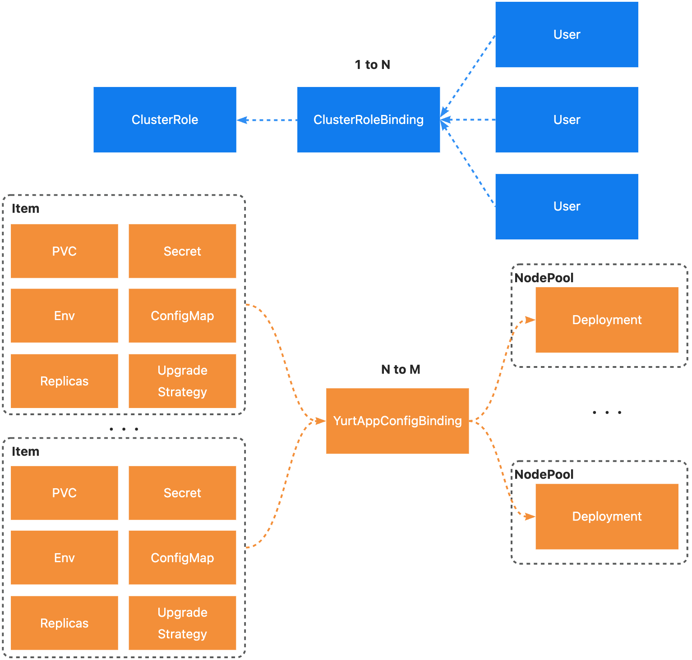

# Proposal about YurtAppConfigBinding
- [Proposal about YurtAppConfigBinding](#proposal-about-yurtappconfigbinding)
	- [Glossary](#glossary)
		- [YurtAppConfigBinding](#yurtappconfigbinding)
	- [Summary](#summary)
	- [Motivation](#motivation)
		- [Goals](#goals)
		- [Non-Goals/Future Work](#non-goalsfuture-work)
	- [Proposal](#proposal)
		- [Inspiration](#inspiration)
		- [YurtAppConfigBinding API](#yurtappconfigbinding-api)
		- [Architecture](#architecture)
		- [Deployment Mutating Webhook](#deployment-mutating-webhook)
			- [Prerequisites for webhook (Resolving circular dependency)](#prerequisites-for-webhook-resolving-circular-dependency)
			- [Workflow of mutating webhook](#workflow-of-mutating-webhook)
		- [YurtAppConfigBinding Validating Webhook](#yurtappconfigbinding-validating-webhook)
		- [YurtAppConfigBinding Controller](#yurtappconfigbinding-controller)
	- [Implementation History](#implementation-history)

## Glossary
### YurtAppConfigBinding
YurtAppConfigBinding is a new CRD used to personalize the configuration of the workloads managed by YurtAppSet/YurtAppDaemon. It provides an simple and straightforward way to configure every field of the workload under each nodepool. 
## Summary
Due to the objective existence of heterogeneous environments such as resource configurations and network topologies in each geographic region, the configuration is always different in each region. The workloads(deployment/statefulset) of nodepools in different regions can be rendered through simple configuration by using YurtAppConfigBinding which also supports multiple resources. 
## Motivation
YurtAppDaemon is proposed for homogeneous workloads. Yurtappset is not user-friendly and scalable, although it can be used for workload configuration by patch field. Therefore, we expect to render different configurations for each workload easily, including replicas, images, configmap, secret, pvc, etc. In addition, it is essential to support rendering of existing resources, like YurtAppSet and YurtAppDaemon, and future resources. 
### Goals
- Define the API of YurtAppConfigBinding
- Provide YurtAppConfigBinding controller
- Provide Deployment mutating webhook
- Provide YurtAppConfigBinding validating webhook
### Non-Goals/Future Work
- Optimize YurtAppSet(about patch)
## Proposal
### Inspiration
Reference to the design of clusterrole and clusterrolebinding. 

1. Considering the simplicity of personalized rendering configuration, an incremental-like approach is used to implement injection, i.e., only the parts that need to be modified need to be declared. They are essentially either some existing resources, such as ConfigMap, Secret, etc., or some custom fields such as Replicas, Env, etc. Therefore, it is reasonable to abstract these configurable fields into an Item. The design of Item refers to the design of VolumeSource in kubernetes. 
2. In order to inject item into the workloads, we should create a new CRD, which works as below. 


### YurtAppConfigBinding API
1. YurtAppConfigBinding needs to be bound to YurtAppSet/YurtAppDaemon.
Considering that there are multiple Deployment/StatefulSet per nodepool, as shown below, it must be bound to YurtAppSet/YurtAppDaemon for injection. We use subject field to bind it to YurtAppSet/YurtAppDaemon. 


1. YurtAppConfigBinding is only responsible for injection of an Item, which means for each node pool that we want to personalize, we need to create a new YurtAppConfigBinding resource. 

```go
// ImageItem specifies the corresponding container and the claimed image.
type ImageItem struct {
	ContainerName string `json:"containerName"`
	// ImageClaim represents the image name which is used by container above.
	ImageClaim string `json:"imageClaim"`
}

// EnvItem specifies the corresponding container and
type EnvItem struct {
	ContainerName string `json:"containerName"`
	// EnvClaim represents the detailed enviroment variables that container contains.
	EnvClaim map[string]string `json:"envClaim"`
}

type PersistentVolumeClaimItem struct {
	ContainerName string `json:"containerName"`
	// PVCSource represents volume name.
	PVCSource     string `json:"pvcSource"`
	// PVCTarget represents the PVC corresponding to the volume above.
	PVCTarget     string `json:"pvcTarget"`
}

type ConfigMapItem struct {
	// ContainerName represents name of the container.
	ContainerName string `json:"containerName"`
	// ConfigMapSource represents volume name.
	ConfigMapSource string `json:"configMapClaim"`
	// ConfigMapTarget represents the ConfigMap corresponding to the volume above.
	ConfigMapTarget string `json:"configMapTarget"`
}

// Item represents configuration to be injected.
// Only one of its members may be specified.
type Item struct {
	Image                 *ImageItem                 `json:"image"`
	ConfigMap             *ConfigMapItem             `configMap:"configMap"`
	Env                   *EnvItem                   `json:"env"`
	PersistentVolumeClaim *PersistentVolumeClaimItem `json:"persistentVolumeClaim"`
	Replicas              *int                       `json:"replicas"`
	UpgradeStrategy       *string                    `json:"upgradeStrategy"`
}

type Subject struct {
	metav1.TypeMeta `json:",inline"`
	// Name is the name of YurtAppSet or YurtAppDaemon
	Name string `json:"name"`
	// Pools represent names of nodepool that items will be injected into.
	Pools []string `json:"pools"`
}

type YurtAppConfigBinding struct {
	metav1.TypeMeta `json:",inline"`

	// Standard object's metadata
	metav1.ObjectMeta `json:"metadata,omitempty"`

	// Describe the object to which this binding belongs
	Subject Subject `json:"subject"`
	// Describe detailed configuration to be injected of the subject above.
	Items []Item `json:"items"`
}
```
### Architecture
The whole architecture is shown below. 


### Deployment Mutating Webhook
#### Prerequisites for webhook (Resolving circular dependency)
Since yurtmanager is deployed as a deployment, the deployment webhook and yurt manager create a circular dependency. 

Solution
1. Change yurtmanager deployment method, like static pod
2. Yurtmanager is in charge of managing the webhook, we can modify the internal implementation of yurtmanager
3. Controller is responsible for both creating and updating  However, there will be a period of unavailability(wrong configuration information)
4. FailurePolicy set to ignore(difficult to detect in the case of malfunction)
#### Workflow of mutating webhook
1. If the intercepted deployment's ownerReferences field is empty, filter it directly
2. Find the corresponding YurtAppConfigBinding resource by ownerReferences, if not, filter directly
3. Find the items involved, get the corresponding configuration, and inject them into workloads
### YurtAppConfigBinding Validating Webhook
1. Verify that only one field of item is selected
2. verify that replicas and upgradeStrategy are selected only once
### YurtAppConfigBinding Controller
1. Get update events by watching the YurtAppConfigBinding resource
2. Trigger the deployment mutating webhook by modifying an annotation or label
## Implementation History
- [ ] : YurtAppConfigBinding API CRD
- [ ] : Deployment Mutating Webhook
- [ ] : YurtAppConfigBinding controller
- [ ] : Resolve circular dependency
- [ ] : YurtAppConfigBinding validating webhook


