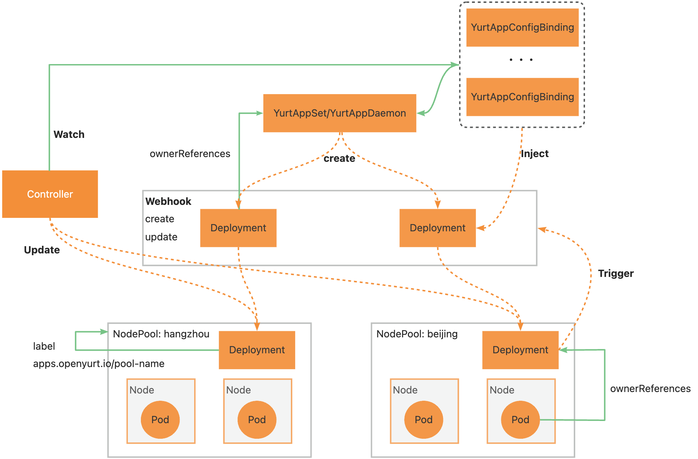

# Proposal about YurtAppConfigBinding
- [Proposal about YurtAppConfigBinding](#proposal-about-yurtappconfigbinding)
  - [Glossary](#glossary)
  - [Summary](#summary)
  - [Motivation](#motivation)
    - [Goals](#goals)
    - [Non-Goals/Future Work](#non-goalsfuture-work)
  - [Proposal](#proposal)
    - [Inspiration](#inspiration)
    - [YurtAppConfigBinding API](#yurtappconfigbinding-api)
    - [Architecture](#architecture)
    - [Deployment Mutating Webhook](#deployment-mutating-webhook)
      - [Prerequisites for webhook (Resolving circular dependency)](#prerequisites-for-webhook-resolving-circular-dependency)
    - [YurtAppConfigBinding Validating Webhook](#yurtappconfigbinding-validating-webhook)
    - [YurtAppConfigBinding Controller](#yurtappconfigbinding-controller)
  - [Implementation History](#implementation-history)

## Glossary
A YurtAppConfigBinding ensures that all when creating deployment/statefulset 
## Summary
Due to the objective existence of heterogeneous environments such as resource configurations and network topologies in each geographic region, the configuration is always different in each region. We expect to render different configurations for each geographical workload easily and support rendering for YurtAppset and YurtAppDaemon, including replicas, images, configmap, secret, pvc, etc. 
## Motivation
The workload(deployment/statefulset) of nodepools in different regions can be rendered through simple configuration. 
### Goals
- Define the API of YurtAppConfigBinding
- Provide YurtAppConfigBinding controller
- Provide Deployment mutating webhook
- Provide YurtAppConfigBinding validating webhook
### Non-Goals/Future Work
- StatefulSet webhook
## Proposal

### Inspiration
Reference to the design of clusterrole and clusterrolebinding. 

1. Considering the simplicity of personalized rendering configuration injection, an incremental-like approach is used to implement the injection, i.e., only the parts that need to be modified need to be declared. The elements that need to be modified are essentially some existing resources, such as ConfigMap, Secret, etc., or some custom fields such as Replicas, Env, etc. Therefore, it is reasonable to abstract these configurable fields into an Item.
2. In order to inject item into the deployment, we should create a new CRD, which is shown below. 


### YurtAppConfigBinding API
1. YurtAppConfigBinding needs to be bound to YurtAppSet/YurtAppDaemon.
Considering that there are multiple Deployment/StatefulSet per nodepool, as shown below, it must be bound to YurtAppSet/YurtAppDaemon for injection. We use subject field to bind it to YurtAppSet/YurtAppDaemon. 


2. YurtAppConfigBinding is only responsible for the injection of an Item. The design of Item refers to the design of VolumeSource in kubernetes. 

```go
// ImageItem specifies the corresponding container and the claimed image.
type ImageItem struct {
	ContainerName string `json:"containerName"`
	// ImageClaim represents the image name which is used by container above.
	ImageClaim string `json:"imageClaim"`
}

// EnvItem specifies the corresponding container and
type EnvItem struct {
	ContainerName string `json:"containerName"`
	// EnvClaim represents the detailed enviroment variables that container contains.
	EnvClaim map[string]string `json:"envClaim"`
}

type PersistentVolumeClaimItem struct {
	ContainerName string `json:"containerName"`
	PVCSource     string `json:"pvcSource"`
	PVCTarget     string `json:"pvcTarget"`
}

type ConfigMapItem struct {
	// ContainerName represents name of the container.
	ContainerName string `json:"containerName"`
	// ConfigMapSource represents volume name.
	ConfigMapSource string `json:"configMapClaim"`
	// ConfigMapTarget represents the ConfigMap corresponding to the volume above.
	ConfigMapTarget string `json:"configMapTarget"`
}

// Item represents configuration to be injected.
// Only one of its members may be specified.
type Item struct {
	Image                 *ImageItem                 `json:"image"`
	ConfigMap             *ConfigMapItem             `configMap:"configMap"`
	Env                   *EnvItem                   `json:"env"`
	PersistentVolumeClaim *PersistentVolumeClaimItem `json:"persistentVolumeClaim"`
	Replicas              *int                       `json:"replicas"`
	UpgradeStrategy       *string                    `json:"upgradeStrategy"`
}

type Subject struct {
	metav1.TypeMeta `json:",inline"`
	// Name is the name of YurtAppSet or YurtAppDaemon
	Name string `json:"name"`
	// Pools represent names of nodepool that items will be injected into.
	Pools []string `json:"pools"`
}

type YurtAppConfigBinding struct {
	metav1.TypeMeta `json:",inline"`

	// Standard object's metadata
	metav1.ObjectMeta `json:"metadata,omitempty"`

	// Describe the object to which this binding belongs
	Subject Subject `json:"subject"`
	// Describe detailed configuration to be injected of the subject above.
	Items []Item `json:"items"`
}
```
### Architecture
The whole architecture is shown below. 


### Deployment Mutating Webhook
#### Prerequisites for webhook (Resolving circular dependency)
Since yurtmanager is deployed as a deployment, the deployment webhook and yurt manager create a circular dependency. 

Solution
1. Change yurtmanager deployment method
2. Yurtmanager is in charge of managing the webhook, we can modify yurtmanager
3. Controller all do, but there will be a period of unavailability, wrong configuration information
4. FailurePolicy set to ignore

Workflow of mutating webhook
To intercept a deployment
1. If the intercepted deployment's ownerReferences field is empty, filter it directly
2. find the corresponding YurtAppConfigBinding configuration file by ownerReferences, if not, filter directly
3. find the configuration file, get the corresponding configuration according to the Item included, and achieve injection
### YurtAppConfigBinding Validating Webhook
1. Verify that only one field of item is selected
2. verify that replicas and upgradeStrategy are selected only once
### YurtAppConfigBinding Controller
Workflow
1. Get update events by watching the YurtAppConfigBinding resource
2. Trigger the deployment mutating webhook by modifying an annotation or label

## Implementation History
- [ ] : YurtAppConfigBinding API CRD
- [ ] : Deployment Mutating Webhook
- [ ] : YurtAppConfigBinding controller
- [ ] : Resolve circular dependency
- [ ] : YurtAppConfigBinding validating webhook


