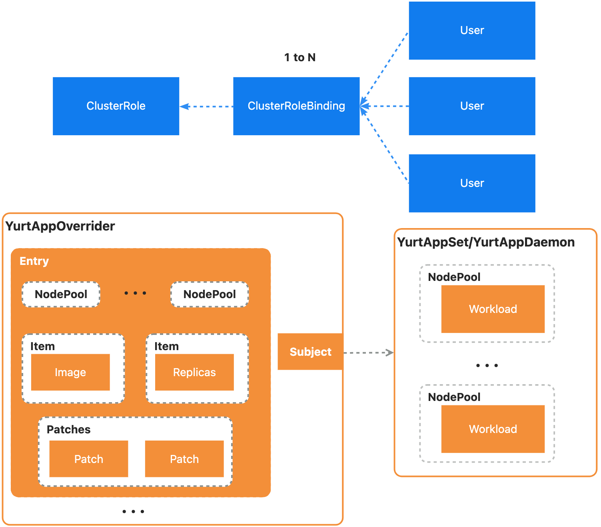
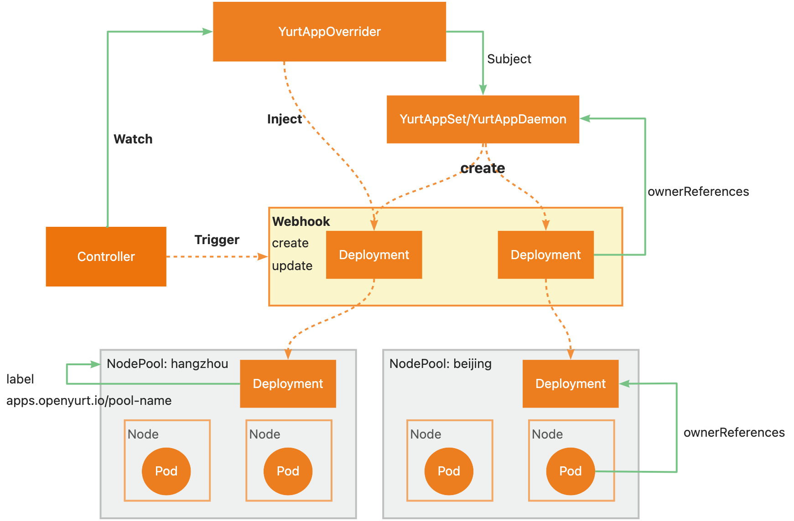

# Proposal for Multi-region workloads configuration rendering engine
<!-- TOC -->
* [Proposal for Multi-region workloads configuration rendering engine](#proposal-for-multi-region-workloads-configuration-rendering-engine)
  * [Glossary](#glossary)
    * [YurtAppOverrider](#yurtappoverrider)
  * [Summary](#summary)
  * [Motivation](#motivation)
    * [Goals](#goals)
    * [Non-Goals/Future Work](#non-goalsfuture-work)
  * [Proposal](#proposal)
    * [Inspiration](#inspiration)
    * [YurtAppOverrider API](#yurtappoverrider-api)
    * [Architecture](#architecture)
    * [Implementation Details](#implementation-details)
      * [Deployment Mutating Webhook](#deployment-mutating-webhook)
        * [Prerequisites for webhook (Resolving circular dependency)](#prerequisites-for-webhook-resolving-circular-dependency)
        * [Workflow of mutating webhook](#workflow-of-mutating-webhook)
      * [YurtAppOverrider Validating Webhook](#yurtappoverrider-validating-webhook)
      * [YurtAppOverrider Controller](#yurtappoverrider-controller)
        * [Task 1](#task-1)
        * [Task 2](#task-2)
    * [User Stories](#user-stories)
      * [Story 1 (General)](#story-1-general)
      * [Story 2 (Specific)](#story-2-specific)
      * [Story 3 (Gray Release)](#story-3-gray-release)
      * [Story 4 (Specify Registry)](#story-4-specify-registry)
      * [Story 5 (Customize hostPath)](#story-5-customize-hostpath)
    * [Comparison with existing open source projects](#comparison-with-existing-open-source-projects)
      * [Open Cluster Management](#open-cluster-management)
      * [KubeVela](#kubevela)
  * [Implementation History](#implementation-history)
<!-- TOC -->
## Glossary
### YurtAppOverrider
YurtAppOverrider is a new CRD used to customize the configuration of the workloads managed by YurtAppSet/YurtAppDaemon. It provides a simple and straightforward way to configure every field of the workload under each nodepool. It is fundamental component of multi-region workloads configuration rendering engine.
## Summary
Due to the objective existence of heterogeneous environments such as resource configurations and network topologies in each geographic region, the workload configuration is always different in each region. We design a multi-region workloads configuration rendering engine by introducing YurtAppOverrider CRD, relevant controller, and webhooks. The workloads(Deployment/StatefulSet) of nodepools in different regions can be rendered through simple configuration by using YurtAppOverrider which also supports multiple resources(YurtAppSet/YurtAppDaemon).
## Motivation
YurtAppSet is proposed for homogeneous workloads. YurtAppSet is not user-friendly and scalable, although it can be used for workload configuration by patch field. Therefore, we expect a rendering engine to configure workloads in different regions easily, including replicas, images, configmap, secret, pvc, etc. In addition, it is essential to support rendering of existing resources, like YurtAppSet and YurtAppDaemon, and future resources.
### Goals
1. Customize the workloads in different regions
2. Implement GrayRelease through this
3. Specify the registry of the image to adapt the edge network
### Non-Goals/Future Work
1. Optimize YurtAppSet(about status, patch, and replicas)
2. Optimize YurtAppDaemon(about status)
## Proposal
### Inspiration
Reference to the design of ClusterRole and ClusterRoleBinding.

1. Considering the simplicity of customized rendering configuration, an incremental-like approach is used to implement injection, i.e., only the parts that need to be modified need to be declared, including image and replicas. Therefore, it is reasonable to abstract these configurable fields into an Item. The design of Item refers to the design of VolumeSource in kubernetes.
2. In order to inject item into the workloads, we should create a new CRD named YurtAppOverrider, which consist of items and patches. Items replace a set of configuration for matching nodepools.

3. Patch supports more advanced add, delete and replace operations, similar to kubectl's json patch. We can convert a patch struct into an API interface call.

   ```shell
   kubectl patch deployment xxx --type='json' --patch='[{"op": "replace", "path": "/spec/template/spec/containers/0/image", "value":"tomcat"}]'
   ```
### YurtAppOverrider API
1. YurtAppOverrider needs to be bound to YurtAppSet/YurtAppDaemon.
Considering that there are multiple Deployment/StatefulSet per nodepool, as shown below, it must be bound to YurtAppSet/YurtAppDaemon for injection. We use subject field to bind it to YurtAppSet/YurtAppDaemon.
2. YurtAppOverrider is responsible for injection of entries. We only need to create a new YurtAppOverrider resource for all nodepools under a YurtAppSet/YurtAppDaemon resource.

```go
// ImageItem specifies the corresponding container and the claimed image
type ImageItem struct {
    // ContainerName represents name of the container
    // in which the Image will be replaced
    ContainerName string `json:"containerName"`
    // ImageClaim represents the claimed image name
    //which is injected into the container above
    ImageClaim string `json:"imageClaim"`
}

// Item represents configuration to be injected.
// Only one of its members may be specified.
type Item struct {
    // +optional
    Image *ImageItem `json:"image,omitempty"`
    // +optional
    Replicas *int32 `json:"replicas,omitempty"`
}

type Operation string

const (
    ADD     Operation = "add"     // json patch
    REMOVE  Operation = "remove"  // json patch
    REPLACE Operation = "replace" // json patch
)

type Patch struct {
    // Path represents the path in the json patch
    Path string `json:"path"`
    // type represents the operation
    // +kubebuilder:validation:Enum=add;remove;replace
    Operation Operation `json:"operation"`
    // Indicates the patch for the template
    // +optional
    Value apiextensionsv1.JSON `json:"value,omitempty"`
}

// Describe detailed multi-region configuration of the subject
// Entry describe a set of nodepools and their shared or identical configurations
type Entry struct {
    Pools []string `json:"pools"`
    // +optional
    Items []Item `json:"items,omitempty"`
    // Convert Patch struct into json patch operation
    // +optional
    Patches []Patch `json:"patches,omitempty"`
}

// Describe the object Entries belongs
type Subject struct {
    metav1.TypeMeta `json:",inline"`
    // Name is the name of YurtAppSet or YurtAppDaemon
    Name string `json:"name"`
}

// +genclient
// +kubebuilder:object:root=true
// +kubebuilder:subresource:status
// +kubebuilder:resource:shortName=yacr
// +kubebuilder:printcolumn:name="Subject_Kind",type="string",JSONPath=".subject.kind",description="The subject kind of this overrider."
// +kubebuilder:printcolumn:name="Subject_Name",type="string",JSONPath=".subject.Name",description="The subject name of this overrider."
// +kubebuilder:printcolumn:name="AGE",type="date",JSONPath=".metadata.creationTimestamp",description="CreationTimestamp is a timestamp representing the server time when this object was created. It is not guaranteed to be set in happens-before order across separate operations. Clients may not set this value. It is represented in RFC3339 form and is in UTC."

type YurtAppOverrider struct {
    metav1.TypeMeta   `json:",inline"`
    metav1.ObjectMeta `json:"metadata,omitempty"`
    Subject           Subject `json:"subject"`
    Entries           []Entry `json:"entries"`
}
```
### Architecture
The whole architecture is shown below.

### Implementation Details
#### Deployment Mutating Webhook
##### Prerequisites for webhook (Resolving circular dependency)
Since YurtManager is deployed as a Deployment, the Deployment webhook and YurtManager create a circular dependency.

Solutions:
1. Change YurtManager deploying method, like static pod
2. Controller is responsible for both creating and updating. However, there will be a period of unavailability(wrong configuration information)
3. Webhook's failurePolicy set to ignore(difficult to detect in the case of malfunction)
4. YurtManager is in charge of managing the webohok, we can modify the internal implementation of YurtManager(Recommended)
##### Workflow of mutating webhook
1. If the intercepted Deployment's ownerReferences field is empty, filter it directly
2. Find the corresponding YurtAppOverrider resource by ownerReferences, if not, filter directly
3. Find the entries involved, get the corresponding configuration, and inject them into workloads.

Attention Points:
1. Note that injection is implemented by recalculating the final configuration according to the YurtAppSet workload template and the watching YurtAppOverrider
2. The latter configuration always relpace the former. So the last configuration will really work
#### YurtAppOverrider Validating Webhook
1. Verify that only one YurtAppOverrider can be bound to YurtAppSet/YurtAppDaemon
2. Verify that value is empty when operation is REMOVE
#### YurtAppOverrider Controller
##### Task 1
1. Get update events by watching the YurtAppOverrider resource
2. Trigger the Deployment mutating webhook by modifying an annotation or label
##### Task 2
1. Get delete events(delete members of pools) by watching the YurtAppOverrider resource
2. Render the configuration according to the YurtAppSet workload template and the watching YurtAppOverrider
### User Stories
#### Story 1 (General)
Use YurtAppSet with YurtAppOverrider for customized configuration of each region. Create YurtAppOverrider first and then create YurtAppSet. If update is needed, modify YurtAppSet resource directly. For YurtAppDaemon, the usage is similar. Users only need to do some  configurations in YurtAppOverrider and our rendering engine will inject all configurations into target workloads.
#### Story 2 (Specific)
For example, if there are three locations, Beijing and Hangzhou have the similar configuration, and Shanghai is not the same. They have different image version, replicas. We can configure it as follows:
```yaml
apiVersion: apps.openyurt.io/v1alpha1
kind: YurtAppOverrider
metadata:
  namespace: default
  name: demo1
subject:
  apiVersion: apps.openyurt.io/v1alpha1
  kind: YurtAppSet
  nameSpace: default
  name: yurtappset-demo
entries:
- pools:
    beijing
    hangzhou
  items:
  - image:
      containerName: nginx
      imageClaim: nginx:1.14.2
  - replicas: 3
- pools:
    shanghai
  items:
  - image:
      containerName: nginx
      imageClaim: nginx:1.13.2
  - replicas: 5
```
#### Story 3 (Gray Release)
Do Gray Release in hangzhou.
```yaml
apiVersion: apps.openyurt.io/v1alpha1
kind: YurtAppOverrider
metadata:
  namespace: default
  name: demo1
subject:
  apiVersion: apps.openyurt.io/v1alpha1
  kind: YurtAppSet
  nameSpace: default
  name: yurtappset-demo
entries:
- pools:
    hangzhou
  items:
  - image:
      containerName: demo
      imageClaim: xxx:latest
```
#### Story 4 (Specify Registry)
Specify detailed registry to solve the problem of edge network unreachability.
```yaml
apiVersion: apps.openyurt.io/v1alpha1
kind: YurtAppOverrider
metadata:
  namespace: default
  name: demo1
subject:
  apiVersion: apps.openyurt.io/v1alpha1
  kind: YurtAppSet
  nameSpace: default
  name: yurtappset-demo
entries:
- pools:
    hangzhou
  items:
  - image:
      containerName: demo
      imageClaim: <registry_ip>:<registry_port>/<image_name>:<image_tag>
```
#### Story 5 (Customize hostPath)
Use different hostPath in different regions.
```yaml
apiVersion: apps.openyurt.io/v1alpha1
kind: YurtAppOverrider
metadata:
  namespace: default
  name: demo1
subject:
  apiVersion: apps.openyurt.io/v1alpha1
  kind: YurtAppSet
  nameSpace: default
  name: yurtappset-demo
entries:
- pools:
    beijing
  items:
  - image:
      containerName: nginx
      imageClaim: nginx:1.14.2
- pools:
    hangzhou
  patches:
  - operation: add
    path: /spec/template/spec/volumes/-
    value:
      name: test-volume
      hostPath:
        path: /var/lib/docker
        type: Directory
  - operation: replace
    path: /spec/template/spec/containers/0/volumeMounts/-
    value:
      name: shared-dir
      mountPath: /var/lib/docker
- pools:
    beijing
  patches:
  - operation: add
    path: /spec/template/spec/volumes/-
    value:
      name: test-volume
      hostPath:
        path: /data/logs
        type: Directory
  - operation: replace
    path: /spec/template/spec/containers/0/volumeMounts/-
    value:
      name: shared-dir
      mountPath: /data/logs
```
### Comparison with existing open source projects
#### Open Cluster Management
Multicluster and multicloud management systems, such as Open Cluster Management(OCM), mainly focus unified management of multiple clusters. It provides ManifestWork and Placement.
ManifestWork provides the ability to send workloads down to the target cluster.
Placement is used to dynamically select a set of managedClusters in one or multiple ManagedClusterSet so that higher level users can either replicate Kubernetes resources to the member clusters or run their advanced workload i.e. multi-cluster scheduling.

Advantages:
1. OCM uses ManifestWorkReplicaSet(aggregator of Manifestwork and Placement) for this, focusing more on schedule's strategy, predicates and priority.
2. OCM provides much information on status and supports fine-grained field values tracking.

Disadvantages:
1. For workloads with different configurations, it requires multiple Manifestwork to deploy.
2. It does not work with current components, including yurtapp, yurtappdaemon.
#### KubeVela
KubeVela is a modern software delivery platform that makes deploying and operating applications across today's hybrid, multi-cloud environments easier, faster and more reliable.

Advantages:
- KubeVela can achieve the distribution and deployment of workloads,
Utilizing component replication function and json-patch trait, users and operators can realize the customized configuration of nodepools.

Disadvantages:
- It cannot accomplish dynamic deployment for each new nodepool, while yurtappdaemon can make it.
## Implementation History
- [ ] YurtAppOverrider API CRD
- [ ] Deployment Mutating Webhook
- [ ] YurtAppOverrider controller
- [ ] Resolve circular dependency
- [ ] YurtAppOverrider validating webhook