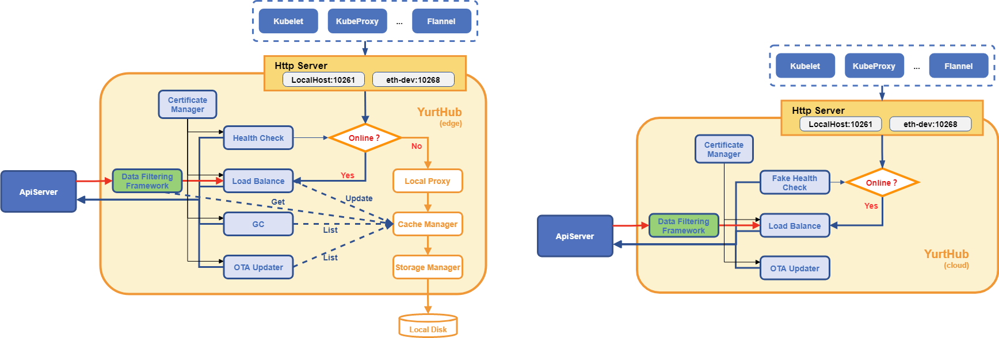
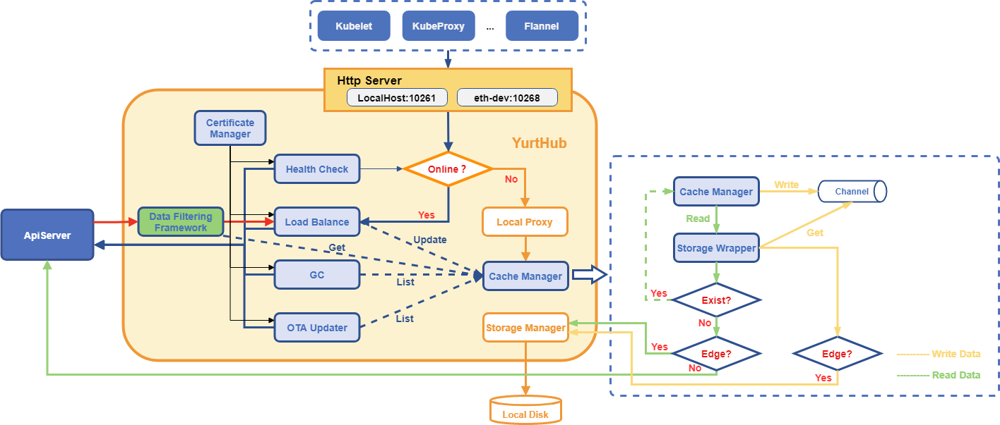

# Improve yurthub caching ability
<!-- END Remove before PR -->

## Table of Contents

- [Improve yurthub caching ability](#Improve yurthub caching ability)
  - [Table of Contents](#table-of-contents)
  - [Summary](#summary)
  - [Motivation](#motivation)
    - [Goals](#goals)
  - [Proposal](#proposal)
    - [Problem Solutions](#problem-solutions)
      - [Architecture Improvements](#architecture-improvements)
      - [Deployment Program](#deployment-program)
      - [Disk Storage Adjustment](#disk-storage-adjustment)
    - [HF Resource Caching](#HF-resource-caching)
    - [Interface Definition Implementation](#interface-definition-implementation)
    - [Analysis of impact of changes](#analysis-of-impact-of-changes)
    - [Comparison of before and after changes](#comparison-of-before-and-after-changes)
  - [Implementation History](#implementation-history)

<!-- Created by https://github.com/ekalinin/github-markdown-toc -->
## Motivation


- YurtHub is divided into two modes: Cloud and Edge. Regarding data query acquisition, there are a lot of if/else branches in the code to differentiate between the cloud's connection to the ApiServer and the edge's query to the Cache Manager, which is not a good reading experience because of the large number of if/else in the code on one hand, and on the other hand, it is necessary to connect to the APiServer, which generates a certain amount of load pressure on the APiServer.
- StorageManager encapsulates a layer of interfaces for calling local storage, and CacheManager eventually reads and writes to the local disk through StorageManager, while StorageManager uses mutex locks when calling specific local storage reads and writes, and when the amount of reads and writes is large, a conflict occurs, which results in an error report back to the The caller is informed of the read/write failure. There is no retry mechanism for error reporting here, the program will skip the execution directly when it encounters the error, which will cause the local data to be inaccurate, and in the case of disconnected autonomy, the data will be inconsistent.
- The following information query and other operations are directly called under the CacheManager StorageWrapper operation, and LoadBalance is operated through the CacheManager, the call method is not unified, there is a certain degree of difficulty in reading.

| component          | code                                                     | description                                                         |
| ------------- | ------------------------------------------------------------ | ------------------------------------------------------------ |
| otaupdate     | store cachemanager.StorageWrapper<br/>podsKey, err := store.KeyFunc(storage.KeyBuildInfo{<br/>&emsp;&emsp;Component: "kubelet",<br/>&emsp;&emsp;Resources: "pods",<br/>&emsp;&emsp;Version:   "v1",<br/>&emsp;&emsp;Group:     "",<br/>})<br/>objs, err := store.List(podsKey) | list kubelet pods                                            |
| healthchecker | sw cachemanager.StorageWrapper<br/>leaseKey, err := hc.sw.KeyFunc(storage.KeyBuildInfo{<br/>&emsp;&emsp;Component: "kubelet",<br/>&emsp;&emsp;Namespace: lease.Namespace,<br/>&emsp;&emsp;Name:      lease.Name,<br/>&emsp;&emsp;Resources: "leases",<br/>&emsp;&emsp;Group:     "coordination.k8s.io",<br/>&emsp;&emsp;Version:   "v1",<br/>})<br/>hc.sw.Update(leaseKey, lease, rv)<br/>hc.sw.Create(leaseKey, lease) | update/create kubelet lease                                  |
| gc            | store cachemanager.StorageWrapper<br/>gcPodsWhenRestart():<br/>&emsp;&emsp;localPodKeys, err := m.store.ListResourceKeysOfComponent("kubelet", schema.GroupVersionResource{<br/>&emsp;&emsp;&emsp;&emsp;Group:    "",<br/>&emsp;&emsp;&emsp;&emsp;Version:  "v1",<br/>&emsp;&emsp;&emsp;&emsp;Resource: "pods",<br/>&emsp;&emsp;})<br/>&emsp;&emsp;m.store.Delete(key)<br/>gcEvents():<br/>&emsp;&emsp;localEventKeys, err := m.store.ListResourceKeysOfComponent(component, schema.GroupVersionResource{<br/>&emsp;&emsp;&emsp;&emsp;Group:    "events.k8s.io",<br/>&emsp;&emsp;&emsp;&emsp;Version:  "v1",<br/>&emsp;&emsp;&emsp;&emsp;Resource: "events",<br/>&emsp;&emsp;})<br/>&emsp;&emsp;m.store.Delete(key) | list kubelet pods<br/>delete kubelet pods<br/>list kubelet/kube-proxy events<br/>delete kubelet/kube-proxy events |
| filter        | s cachemanager.StorageWrapper<br/>nodeKey, err := s.KeyFunc(storage.KeyBuildInfo{<br/>&emsp;&emsp;Component: "kubelet",<br/>&emsp;&emsp;Name:      ssf.nodeName,<br/>&emsp;&emsp;Resources: "nodes",<br/>&emsp;&emsp;Group:     "",<br/>&emsp;&emsp;Version:   "v1",<br/>})<br/>obj, err := s.Get(nodeKey) | get kubelet node                                             |
| proxy         | 1. localProxy uses QueryCache to query data when processing get/list/update requests offline, first check the cache, if it doesn't exist, then get it through Storage<br/>2. poolProxy/loadbalanceProxy tries to query data from QueryCache if there is an error in the cloud response to a request when performing reverse proxy. |                                                              |

- YurtHub yaml file because there are two modes of cloud side, so there are two kinds of files, only a small inconsistency in the input parameter, the rest are the same, it is easy to not see the problem without a detailed comparison, and it is easy to make mistakes when upgrading.
- In the original schema, the storage of list data generated by different invocations of path or selector on the same component and the same resource is anomalously conflicting, as an example:

```shell
request1: http://{ip/port}/api/v1/pods?fieldSelector=spec.nodeName=foo
request2: http://{ip/port}/api/v1/default/pods?fieldSelector=spec.nodeName=foo
request3: http://{ip:port}/api/v1/default/pods?labelSelector=foo2=bar2

The three requests above:
1 and 2 belong to the same resource pod under the same selector list query request, but the difference is that the path is different, that is, the query namespace is different
2 and 3 belong to the same resource pod under the same path list query request, but the difference is that the selector is different, that is, the query conditions are different

If the same component, such as kubelet, has multiple modules, each module needs to access ApiServer to perform list queries for pod resources, and then store the returned results to local disk. However, the list conditions of each module are different, the original yurthub practice is to store only the first list data locally, and retain the relevant list conditions in memory, and then come back to the list request, if the conditions are not consistent, will not be stored!
```

### Goals

- Sorting out the original architecture logic, identifying problems and proposing solutions
- Optimized architectural design, weakened YurtHub cloud-side two patterns code design

## Proposal

### Problem Solutions

#### Architecture Improvements



**Note: The above image, in its entirety, represents YurtHub running components in side-by-side mode; YurtHub running in cloud mode does not contain the component information in the yellow box.。**

The above 1~3 problems (inconsistency of cloud-side data query, reading and writing conflict anomalies in the calling interface, and inconsistency of external calling methods) are solved by adjusting the architectural scheme as follows：

- Regardless of the cloud-side model, the CacheManager needs to be started to ensure the logical unity of data operations, which are retrieved from the CacheManager (StorageWrapper).
- If the CacheManager cannot be queried, then according to the two cloud-edge scenarios, the edge side query the local data from the StorageManager interface to return (and update it to the StorageWrapper at the same time), and the cloud mode connects to the APiServer to query the data
- After the data of each component accessing the requested ApiServer is returned through LoadBalance, it is necessary to asynchronously update the Cache, and the local storage.
- Asynchronous operation, according to the different types of resources, concurrent requests will be executed serially, the use of goroutine to write disk operations, to ensure that the data will eventually be processed and will not be lost, **each resource is written sequentially using a concurrent program** can not be processed without locking, and at the same time to provide a function that allows only read, directly from the Map to read the relevant content to the data read at that time shall prevail, the same does not need to lock
- Between CacheManager and StorageWrapper, the write data is communicated through channels. After CacheManager receives the data information returned from the reverse proxy, it **drops the data to the channel where the corresponding resource is located for processing**, which is equivalent to the fact that StorageWrapper needs to start multiple concurrent programs to get data from each resource channel and update the Cache and call the Storage interface to update the disk in real time. In other words, StorageWrapper needs to start several concurrent processes to get data from each resource channel and update the Cache and call the Storage interface to update the disk in real time; at the same time, StorageWrapper only provides read-only function interfaces, such as Get/List, etc., which are convenient for querying the Cache data.
- As the local storage data directory is: component/resource/namespace, according to the resource to write operations, even if there are more than one concurrent coprocessing, there will be no write conflict operation, so there is no need to lock processing, but also to improve the efficiency of writing disk

#### Deployment Program

- Unify YurtHub deployment YAML files, instead of specifying whether to run in cloud mode or edge mode by entering a parameter, determine the YurtHub operation mode based on which node group the current node belongs to, and based on the type of node group. This way, YurtHub's final YAML file format will remain unified, and the yurt-static-set upgrade templates will be unified, making it easier to upgrade.

#### Disk Storage Adjustment

Problem 5 (list data storage conflict problem) is solved by adjusting the program interface as follows：

- Regarding list data storage, in the case of not changing the storage path, the use of concatenated storage, that is, the same resource for a variety of list results to seek a concatenation, and then stored, need to be processed, such as data query, and then based on the contents of the selector or the path, the program to do a good job of filtering and then return to the client
- Regarding each re-list request, you need to use the same list conditions to get the data from the local area, and then compare it with the data returned from the cloud: 1. if the cloud has it, but the side doesn't have it, create it; 2. if the cloud doesn't have it, but the side has it, delete it; 3. if the cloud and the side both have it, update it.

### HF Resource Caching

Considering the resource limitations of the edge device, the caching function inside the CacheManager should only cache the necessary high-frequency resources to reduce memory consumption. According to the conditions of the above query, we can conclude that the current YurtHub high-frequency query resources, so the current cache only caches the following resources, and will add them later if necessary.

| component    | verb | resource  |
| ------- | ---- | ----- |
| kubelet | get | leases  |
|         | get  | nodes |

### Interface Definition Implementation

#### diskStorage

##### Interface

```go
// Store is an interface for caching data into store
type Store interface {
	// Name will return the name of this store.
	Name() string

	// Get will get the content of key from the store.
	// The key must indicate a specific resource.
	// If key is empty, ErrKeyIsEmpty will be returned.
	// If this key does not exist in this store, ErrStorageNotFound will be returned.
	Get(key Key) ([]byte, error)

	// List will retrieve all contents whose keys have the prefix of rootKey.
	// If key is empty, ErrKeyIsEmpty will be returned.
	// If the key does not exist in the store, ErrStorageNotFound will be returned.
	// If the key exists in the store but no other keys having it as prefix, an empty slice
	// of content will be returned.
	List(key Key) ([][]byte, error)

	// Create will create content of key in the store.
	// The key must indicate a specific resource.
	// If key is empty, ErrKeyIsEmpty will be returned.
	// If content is empty, either nil or []byte{}, ErrKeyHasNoContent will be returned.
	// If this key has already existed in this store, ErrKeyExists will be returned.
	Create(key Key, content []byte) error

	// Update will try to update key in store with passed-in contents. Only when
	// the rv of passed-in contents is fresher than what is in the store, the Update will happen.
	// The content of key after Update is completed will be returned.
	// The key must indicate a specific resource.
	// If key is empty, ErrKeyIsEmpty will be returned.
	// If the key does not exist in the store, ErrStorageNotFound will be returned.
	// If rv is staler than what is in the store, ErrUpdateConflict will be returned.
	Update(key Key, contents []byte, rv uint64) ([]byte, error)

	// Delete will delete the content of key in the store.
	// The key must indicate a specific resource.
	// If key is empty, ErrKeyIsEmpty will be returned.
	Delete(key Key) error

    // KeyFunc will generate the key used by this store.
	// info contains necessary info to generate the key for the object. How to use this info
	// to generate the key depends on the implementation of storage.
	KeyFunc(info KeyBuildInfo) (Key, error)
}
```

#### storageWrapper

##### Structure Definition

```go
type storageWrapper struct {
    mode              string                          // Yurthub mode
	store             storage.Store                   // Data Storage Interface
	backendSerializer runtime.Serializer              // Serialized data processing
	workQueueMap      map[string]chan keyOperatorInfo // Channels that need to update their data are handled individually by resource type
}

type keyOperatorInfo struct {
	key             storage.Key    // Stored key information
	object          runtime.Object // Stored objects
	verb            string         // Storage operations: create, update, delete
	resourceVersion uint64         // Object version information
}
```

##### Method Definition

```go
func (sw *storageWrapper) addToWorkQueue(keyOperatorInfo keyOperatorInfo) {}
func (sw *storageWrapper) create(key storage.Key, obj runtime.Object) {}
func (sw *storageWrapper) delete(key storage.Key) {}
func (sw *storageWrapper) update(key storage.Key, obj runtime.Object, rv uint64) {}
func (sw *storageWrapper) replaceComponentList(key storage.Key, obj runtime.Object) error {}
func (sw *storageWrapper) deleteComponentResources(key storage.Key) error {}
func (sw *storageWrapper) get(key storage.Key) (runtime.Object, error) {}
func (sw *storageWrapper) list(key storage.Key) ([]runtime.Object, error) {}
func (sw *storageWrapper) keyFunc(info storage.KeyBuildInfo) (storage.Key, error) {}
func (sw *storageWrapper) getStorage() storage.Store {}
func (sw *storageWrapper) saveClusterInfo(clusterInfoType, path string, content []byte) error {}
func (sw *storageWrapper) getClusterInfo(clusterInfoType, path string) ([]byte, error) {}
func (sw *storageWrapper) addToWorkQueue(keyOperatorInfo KeyOperatorInfo) {}
func (sw *storageWrapper) dealStorageInfo(keyOperatorInfo keyOperatorInfo) error {}
func (sw *storageWrapper) register(resource string, stop <-chan struct{}) {}
func (sw *storageWrapper) channelFunc(resource string, stop <-chan struct{}) {}
```

##### addToWorkQueue

```go
// The producer of the data channel, called by a write operation in the CacheManager, simply drops the data into the Channel
func (sw *storageWrapper) addToWorkQueue(keyOperatorInfo keyOperatorInfo) {
    resource := keyOperatorInfo.key.GetResource()
	sw.workQueueMap[resource] <- keyOperatorInfo
}
```

##### create

```go
func (sw *storageWrapper) create(key storage.Key, obj runtime.Object) {
	sw.addToWorkQueue(keyOperatorInfo{
		key:    key,
		object: obj,
		verb:   "create",
	})
}
```

##### delete

```go
func (sw *storageWrapper) delete(key storage.Key) {
	sw.addToWorkQueue(keyOperatorInfo{
		key:  key,
		verb: "delete",
	})
}
```

##### update

```go
func (sw *storageWrapper) update(key storage.Key, obj runtime.Object, rv uint64) {
	sw.addToWorkQueue(keyOperatorInfo{
		key:             key,
		object:          obj,
		verb:            "update",
		resourceVersion: rv,
	})
}
```

##### get

```go
func (sw *storageWrapper) get(key storage.Key) (runtime.Object, error) {
	if sw.mode == "cloud" {
		// query for apiserver if mode is cloud
		// get the obj and return
		return obj, err
	}

	// query for local storage if mode is edge
	return sw.store.Get(key)
}
```

##### list

```go
func (sw *storageWrapper) list(key storage.Key) ([]runtime.Object, error) {
	if sw.mode == "cloud" {
		// query for apiserver if mode is cloud
		// get the obj and return
		return obj, err
	}

	// query for local storage if mode is edge
	return sw.store.List(key)
}
```

##### replaceComponentList

```go
// re-list data processing logic, need to ensure idempotency of interfaces
func (sw *storageWrapper) replaceComponentList(key storage.Key, obj runtime.Object) error {
	// First, based on the key information, List the local data.
	oldData, err := sw.list(key)

	// Old local data is compared with the data to be updated
	delete, create, update := sw.compareData(oldData, obj)

	// Sends data to the channel according to the type of operation
	for k, _ := range delete {
        sw.delete(k)
	}
	for k, v := range create {
		sw.Create(k, v)
	}
	for k, v := range update {
		sw.Update(k, v, v.rv)
	}
    return nil
}
```

##### deleteComponentResources

```go
func (sw *storageWrapper) deleteComponentResources(key storage.Key) error {
	keys, err := sw.list(key)
	if err != ErrKeyIsEmpty {
		return err
	}

	for k := range keys {
		sw.delete(k)
	}
	return nil
}
```

##### dealStorageInfo

```go
// Consumers of the data channel, depending on the type of operation on the data, store it the local storage interface for data write operations to the local disk
func (sw *storageWrapper) dealStorageInfo(keyOperatorInfo keyOperatorInfo) error {
	var buf bytes.Buffer
	if keyOperatorInfo.object != nil {
		if err := sw.backendSerializer.Encode(keyOperatorInfo.object, &buf); err != nil {
			klog.Errorf("failed to encode object in %s for %s, %v", keyOperatorInfo.verb, keyOperatorInfo.key.Key(), err)
			return err
		}
	}

	// update for storage
	switch keyOperatorInfo.verb {
	case "create":
		return sw.store.Create(keyOperatorInfo.key, buf.Bytes())
	case "update":
		return sw.store.Update(keyOperatorInfo.key, buf.Bytes(), keyOperatorInfo.resourceVersion)
	case "delete":
		return sw.store.Delete(keyOperatorInfo.key)
	default:
		return nil
	}
}
```

##### register

```go
// When a new resource is added, the resource is registered and a coprocess is started for the write operation
func (sw *storageWrapper) register(resource string, stop <-chan struct{}) {
	if ok, _ := sw.workQueueMap[resource]; ok {
		return
	}
	sw.workQueueMap[resource] = make(chan keyOperatorInfo, 1000)
	go sw.channelFunc(resource, stop)
}
```

##### channelFunc

```go
func (sw *storageWrapper) channelFunc(resource string, stop <-chan struct{}) {
	for {
		select {
		case info := <-sw.workQueueMap[resource]:
			err := sw.dealStorageInfo(info)
			if err != nil {
				sw.addToWorkQueue(info)
			}
		case <-stop:
			return
		}
	}
}
```

#### CacheManager

##### Interface Definition

```go
// CacheManager is an adaptor to cache runtime object data into backend storage
type CacheManager interface {
    // Functions that process the data returned by an http request
    CacheResponse(req *http.Request, prc io.ReadCloser, stopCh <-chan struct{}) error
    QueryCache(req *http.Request) (runtime.Object, error)
    CanCacheFor(req *http.Request) bool
    DeleteKindFor(gvr schema.GroupVersionResource) error
}

CreateReqWithContext(verb, path string) *http.Request
SaveClusterInfo(clusterInfoType, path string, content []byte) error
GetClusterInfo(clusterInfoType, path string) ([]byte, error)
```

### Analysis of impact of changes

This change mainly focuses on optimizing the local cache module, so the impact of the change is limited to modules that interact with local storage.

| functional module           | Impact of changes                                                     |
| ------------------ | ------------------------------------------------------------ |
| Local Cache Module       | Verify that the local data store can be saved properly without data storage failures caused by abnormal conflicts |
| Queries for data requests from modules | 1. ServiceTopology data filtering function can normally filter the endpoints data information related to the current node pool, and will not cause data confusion<br> 2. When YurtHub ota update is performed, the data is queried on each side of the cloud without errors and the query is successful<br> 3. The GC module performs event resource reclamation without error<br> 4. YurtHub can properly handle connection requests from built-in components and return data information in case of offline autonomy. |
| YurtHub deployment        | Do not show the specified operation mode in the entry parameter, you need to make a judgment based on the node pool information to ensure that the cloud edge mode is functioning properly |

This optimization change will not modify the directory structure and data format of the local disk storage data, so there will be no additional impact on the upgrade.

### Comparison of before and after changes

1. Harmonized data query portal
2. Reduce request access to ApiServer by utilizing data caching
3. Asynchronous data write operations to avoid data update conflicts
4. Unified YurtHub deployment templates for easy upgrades