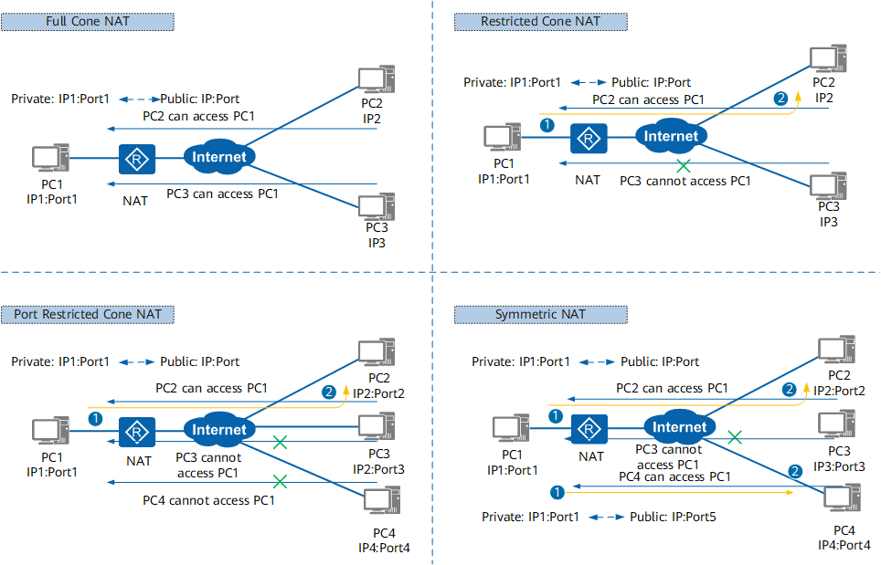
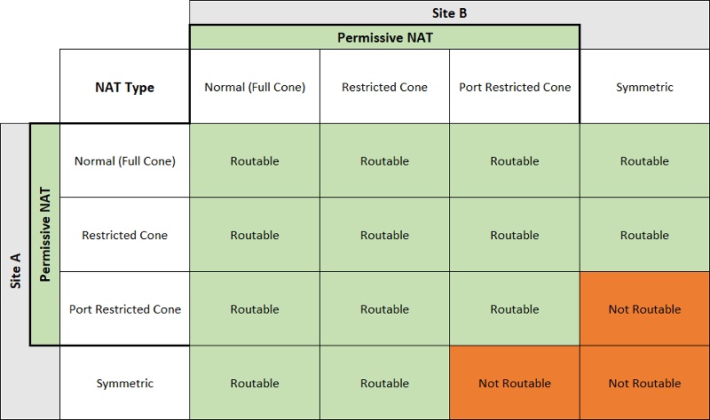

# Support raven NAT traversal

## Table of Contents

- [Support raven NAT traversal](#Support raven NAT traversal)
  - [Table of Contents](#table-of-contents)
  - [Summary](#summary)
  - [Motivation](#motivation)
    - [Goals](#goals)
    - [Non-Goals/Future Work](#non-goalsfuture-work)
  - [Proposal](#proposal)
    - [Prerequisite Knowledge](#prerequisite-knowledge)
    - [Implementation Summary](#implementation-summary)
    - [Implementation Details](#implementation-details)
      - [Retrieve Hole Punching Information](#retrieve-hole-punching-information)
      - [Gateway API](#gateway-api)
      - [Create Edge-To-Edge Tunnel Operation](#create-edge-to-edge-tunnel-operation)
    - [Hole Punching Effect](#hole-punching effect)

## Summary

In edge computing, edge-to-edge and edge-to-cloud communication are common networking scenarios. In the current implementation of Raven, for edge-to-edge communication, all cross-edge traffic is still forwarded through the cloud-based central end, which brings higher communication latency and bandwidth consumption. Therefore, Raven needs to enhance the processing of cross-edge traffic, make full use of the network capabilities of the edge itself, and create edge-to-edge VPN tunnels as much as possible. This proposal aims to present a solution, to create edge-to-edge VPN tunnels as much as possible through NAT traversal.

## Motivation

By constructing edge-to-edge VPN tunnels, it can help avoid the high latency and high bandwidth consumption caused by cloud-based forwarding.

### Goals

To enhance the handling of cross-edge traffic, we need to achieve the following goals:

- The two currently supported VPN backends (WireGuard and Libreswan) should be able to automatically establish edge-to-edge VPN tunnels.
- If an edge-to-edge tunnel cannot be established, forwarding through the cloud-based central end should still be possible.

### Non-Goals/Future Work

- Optimize the network topology by shortest path calculation.

## Proposal

### Prerequisite Knowledge

In the STUN (Session Traversal Utilities for NAT) protocol, based on the mapping method from private IP addresses and port numbers to public IP addresses and port numbers, NAT is divided into four types, as shown in the figure below.





### Implementation Summary

1. The Gateway Nodes of each Gateway send requests to the public STUN Server to determine their own NAT type and then synchronize this information to the Gateway CR
2. The relay network is established according to the existing code logic. After the relay network is set up, the relay nodes can obtain the information (ip:port) of the "holes" punched out by each edge node, and this is then synchronized to the Gateway Custom Resource (CR).
3. Each edge node then, based on its own and the remote node's NAT type, determines whether an edge-to-edge tunnel can be created and uses the "hole" punched out on the remote node to establish the actual connection.

### Implementation Details

#### Retrieve Hole Punching Information

wireguard：execute `wg show` on the relay node.

```
interface: raven-wg0
  public key: EdZ6TFZMuQ7zk0Cz8U8yKdpotwiiTVcFzYEHGgb8smw=
  private key: (hidden)
  listening port: 4500

peer: aX97MGTV6tzLFl40JXkt6gW1LTaPyb3CpERJTaNKIHU=
  preshared key: (hidden)
  endpoint: xxx.xxx.xx.xx:21005
  allowed ips: 10.244.13.0/24
  latest handshake: 35 seconds ago
  transfer: 180 B received, 612 B sent
  persistent keepalive: every 5 seconds

peer: 9bpg1yii/dxo+0mGHDaEroqpoC0EyN01oD06VypXb28=
  preshared key: (hidden)
  endpoint: xxx.xxx.xx.xx:65353
  allowed ips: 10.244.1.0/24
  latest handshake: 35 seconds ago
  transfer: 180 B received, 644 B sent
  persistent keepalive: every 5 seconds

peer: Wau0C5r6psS3VYjnjVQPMTABi2Ljy3kmMs4DFoCgols=
  preshared key: (hidden)
  endpoint: xxx.xxx.xx.xx:4500
  allowed ips: 10.244.9.0/24
  latest handshake: 40 seconds ago
  transfer: 180 B received, 496 B sent
  persistent keepalive: every 5 seconds

peer: nZNAS5sGBzdAz/PIhfLIxsgYKFblmG5WKAdwxHzL+Dg=
  preshared key: (hidden)
  endpoint: xxx.xxx.xx.xx:4500
  allowed ips: 10.244.12.0/24
  latest handshake: 40 seconds ago
  transfer: 180 B received, 496 B sent
  persistent keepalive: every 5 seconds
```

libreswan：Retrieve information about the punched holes by parsing the output of `/usr/libexec/ipsec/whack --showstates`

```
tencent-centos-node:/# /usr/libexec/ipsec/whack --showstates
000 #25: "10.0.16.6-10.10.104.84-10.244.0.0/24-10.244.9.0/24"[1] 60.191.89.26:4500 STATE_V2_ESTABLISHED_IKE_SA (established IKE SA); REKEY in 28448s; REPLACE in 28718s; newest; idle;
000 #27: "10.0.16.6-10.10.104.84-10.244.0.0/24-10.244.9.0/24"[1] 60.191.89.26:4500 STATE_V2_ESTABLISHED_CHILD_SA (established Child SA); REKEY in 28448s; REPLACE in 28718s; newest; eroute owner; IKE SA #25; idle;
000 #27: "10.0.16.6-10.10.104.84-10.244.0.0/24-10.244.9.0/24"[1] 60.191.89.26 esp.8be5db37@60.191.89.26 esp.d7b50df@10.0.16.6 tun.0@60.191.89.26 tun.0@10.0.16.6 Traffic: ESPin=0B ESPout=0B ESPmax=2^63B
```

#### Gateway API

Add `NATType` and `PublicPort` fields to the Endpoint type, used to save NAT type and hole-punching information.

```go
// Gateway is the Schema for the gateways API
type Gateway struct {
	metav1.TypeMeta   `json:",inline"`
	metav1.ObjectMeta `json:"metadata,omitempty"`

	Spec   GatewaySpec   `json:"spec,omitempty"`
	Status GatewayStatus `json:"status,omitempty"`
}

// GatewaySpec defines the desired state of Gateway
type GatewaySpec struct {
	// NodeSelector is a label query over nodes that managed by the gateway.
	// The nodes in the same gateway should share same layer 3 network.
	NodeSelector *metav1.LabelSelector `json:"nodeSelector,omitempty"`
	// TODO add a field to configure using vxlan or host-gw for inner gateway communication?
	// Endpoints is a list of available Endpoint.
	Endpoints []Endpoint `json:"endpoints"`
	// ExposeType determines how the Gateway is exposed.
	ExposeType ExposeType `json:"exposeType,omitempty"`
}

// Endpoint stores all essential data for establishing the VPN tunnel.
// TODO add priority field?
type Endpoint struct {
	// NodeName is the Node hosting this endpoint.
	NodeName   string            `json:"nodeName"`
	UnderNAT   bool              `json:"underNAT,omitempty"`
	NATType    string            `json:"natType,omitempty"`
	PublicIP   string            `json:"publicIP,omitempty"`
	PublicPort string            `json:"publicPort,omitempty"`
	Config     map[string]string `json:"config,omitempty"`
}
```

#### Create Edge-To-Edge Tunnel Operation

For WireGuard, once the edge node has retrieved the relevant information from the Gateway Custom Resource (CR), it can establish an edge-to-edge tunnel by following these steps:

nodeA:

```
wg set raven-wg0 peer <nodeB peer public key> allowed-ips <nodeB pod cidr> endpoint <nodeB publicIP>:<nodeB publicPort> persistent-keepalive 5
```

nodeB:

```
wg set raven-wg0 peer <nodeA peer public key> allowed-ips <nodeA pod cidr> endpoint <nodeA publicIP>:<nodeA publicPort> persistent-keepalive 5
```

For libreswan, once the edge node has retrieved the relevant information from the Gateway Custom Resource (CR), it can establish an edge-to-edge tunnel by following these steps:

nodeA:

```
/usr/libexec/ipsec/whack --delete --name <nodeA privateIP>-<nodeB privateIP>-<nodeA pod cidr>-<nodeB pod cidr>

/usr/libexec/ipsec/whack --psk --encrypt --forceencaps --name <nodeA privateIP>-<nodeB privateIP>-<nodeA pod cidr>-<nodeB pod cidr> --id @<nodeA privateIP>-<nodeA pod cidr>-<nodeB pod cidr> --host <nodeA privateIP> --client <nodeA pod cidr> --to --id @<nodeB privateIP>-<nodeB pod cidr>-<nodeA pod cidr> --host <nodeB publicIP> --client <nodeB pod cidr> --ikeport <nodeB publicPort>

/usr/libexec/ipsec/whack --route --name <nodeA privateIP>-<nodeB privateIP>-<nodeA pod cidr>-<nodeB pod cidr>

/usr/libexec/ipsec/whack --initiate --asynchronous --name <nodeA privateIP>-<nodeB privateIP>-<nodeA pod cidr>-<nodeB pod cidr>
```

nodeB:

```
/usr/libexec/ipsec/whack --delete --name <nodeB privateIP>-<nodeA privateIP>-<nodeB pod cidr>-<nodeA pod cidr>

/usr/libexec/ipsec/whack --psk --encrypt --forceencaps --name <nodeB privateIP>-<nodeA privateIP>-<nodeB pod cidr>-<nodeA pod cidr> --id @<nodeB privateIP>-<nodeB pod cidr>-<nodeA pod cidr> --host <nodeB privateIP> --client <nodeB pod cidr> --to --id @<nodeA privateIP>-<nodeA pod cidr>-<nodeB pod cidr> --host <nodeA publicIP> --client <nodeA pod cidr> --ikeport <nodeA publicPort>

/usr/libexec/ipsec/whack --route --name <nodeB privateIP>-<nodeA privateIP>-<nodeB pod cidr>-<nodeA pod cidr>

/usr/libexec/ipsec/whack --initiate --asynchronous --name <nodeB privateIP>-<nodeA privateIP>-<nodeB pod cidr>-<nodeA pod cidr>
```

### Hole Punching Effect

For example, nodeA (located in Hangzhou, Zhejiang) and nodeB (located in Heyuan, Guangdong), with the relay node in Shanghai.

During relay forwarding:

```
[root@fedora-1 /]# ping 10.244.12.4 -c 10
PING 10.244.12.4 (10.244.12.4) 56(84) bytes of data.
64 bytes from 10.244.12.4: icmp_seq=1 ttl=61 time=54.7 ms
64 bytes from 10.244.12.4: icmp_seq=2 ttl=61 time=54.7 ms
64 bytes from 10.244.12.4: icmp_seq=3 ttl=61 time=54.7 ms
64 bytes from 10.244.12.4: icmp_seq=4 ttl=61 time=54.6 ms
64 bytes from 10.244.12.4: icmp_seq=5 ttl=61 time=54.6 ms
64 bytes from 10.244.12.4: icmp_seq=6 ttl=61 time=54.6 ms
64 bytes from 10.244.12.4: icmp_seq=7 ttl=61 time=54.7 ms
64 bytes from 10.244.12.4: icmp_seq=8 ttl=61 time=54.6 ms
64 bytes from 10.244.12.4: icmp_seq=9 ttl=61 time=55.4 ms
64 bytes from 10.244.12.4: icmp_seq=10 ttl=61 time=54.7 ms

--- 10.244.12.4 ping statistics ---
10 packets transmitted, 10 received, 0% packet loss, time 9012ms
rtt min/avg/max/mdev = 54.574/54.722/55.427/0.237 ms
```

Direct edge-to-edge communication：

```
[root@fedora-1 /]# ping 10.244.12.4 -c 10
PING 10.244.12.4 (10.244.12.4) 56(84) bytes of data.
64 bytes from 10.244.12.4: icmp_seq=1 ttl=62 time=37.4 ms
64 bytes from 10.244.12.4: icmp_seq=2 ttl=62 time=37.4 ms
64 bytes from 10.244.12.4: icmp_seq=3 ttl=62 time=37.4 ms
64 bytes from 10.244.12.4: icmp_seq=4 ttl=62 time=37.4 ms
64 bytes from 10.244.12.4: icmp_seq=5 ttl=62 time=37.3 ms
64 bytes from 10.244.12.4: icmp_seq=6 ttl=62 time=37.4 ms
64 bytes from 10.244.12.4: icmp_seq=7 ttl=62 time=37.4 ms
64 bytes from 10.244.12.4: icmp_seq=8 ttl=62 time=37.3 ms
64 bytes from 10.244.12.4: icmp_seq=9 ttl=62 time=37.5 ms
64 bytes from 10.244.12.4: icmp_seq=10 ttl=62 time=37.3 ms

--- 10.244.12.4 ping statistics ---
10 packets transmitted, 10 received, 0% packet loss, time 9009ms
rtt min/avg/max/mdev = 37.333/37.372/37.488/0.042 ms
```