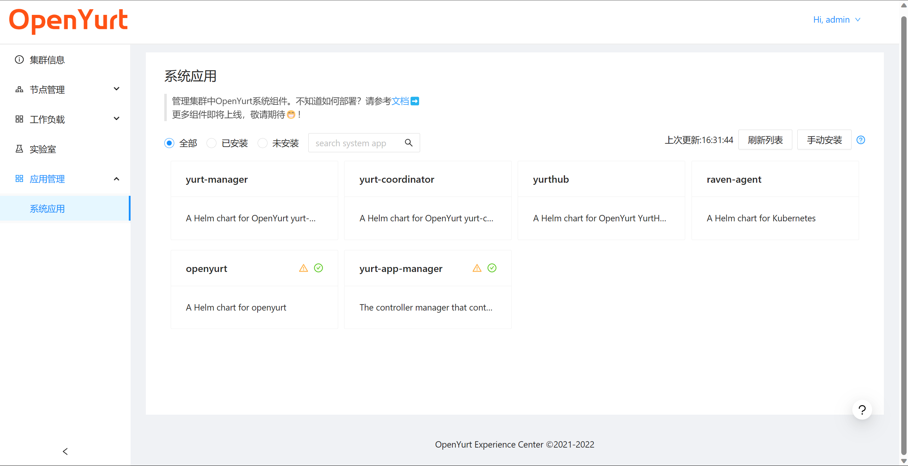
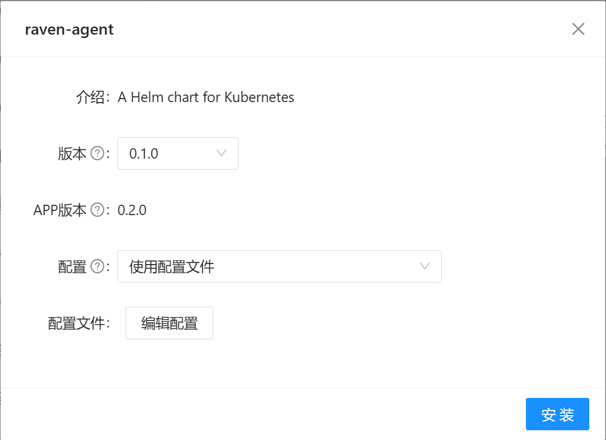
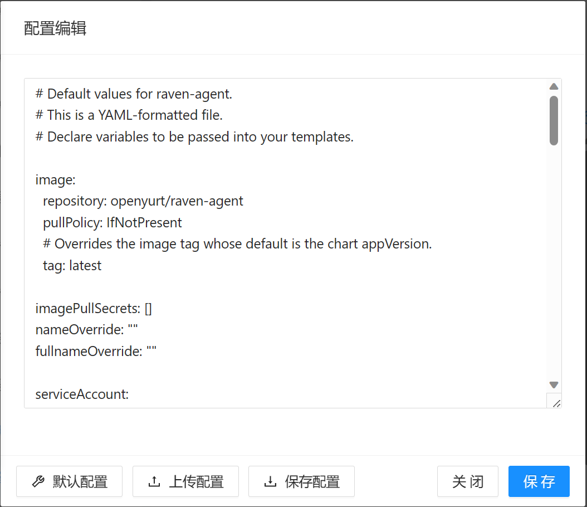
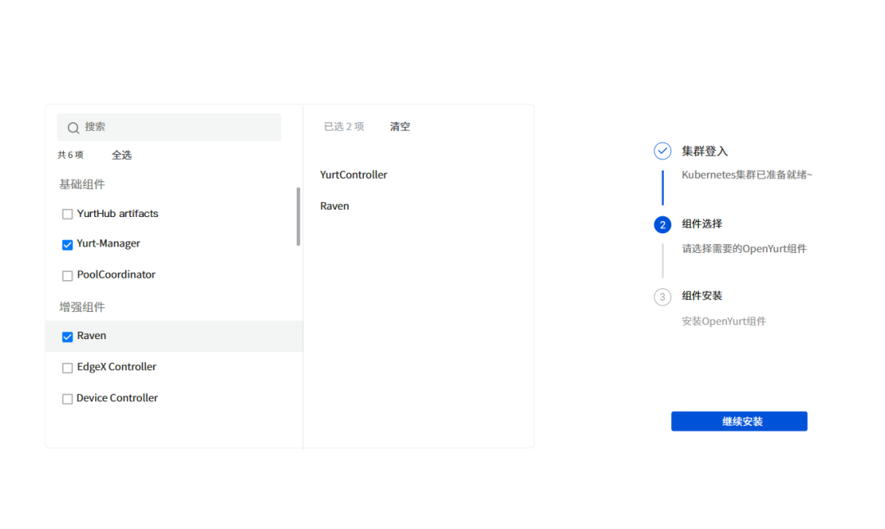

# Install openyurt components using dashboard

## Table of Contents

- [Install openyurt components using dashboard](#install-openyurt-components-using-dashboard)
  - [Table of Contents](#table-of-contents)
  - [Summary](#summary)
  - [Motivation](#motivation)
    - [Goals](#goals)
    - [Non-Goals/Future Work](#non-goalsfuture-work)
  - [Proposal](#proposal)
    - [User Stories](#user-stories)
    - [Requirements (Optional)](#requirements-optional)
    - [Implementation Details](#implementation-details)

## Summary

In this proposal, we will provide a way to install and deploy OpenYurt components based on dashboard. We will implement a module based on the API of helm in the dashboard, which can realize functions such as installation and uninstallation of the chart package like the helm command on the command line. In addition, we will design a guide page and component management page to make it easier for users to manage OpenYurt components.

## Motivation

The installation and deployment of OpenYurt is still challenging for non-professionals at present. The installation method based on the shell command needs to enter long text, which is still quite troublesome. Therefore, it is very necessary to provide a component installation method with a graphical interface.

### Goals

- Implement a module based on helm's API.
- Provide the OpenYurt component management interface, and provide the function of installing and uninstalling components.
- Provide a boot page, which is displayed when the user enters for the first time after installing the dashboard.

### Non-Goals/Future Work

- Upgrade of OpenYurt components based on dashboard.

## Proposal

### User Stories

- As a user, I wanted to try out the features of OpenYurt. I can preview all available components of the current version and choose to install them according to the brief description.

### Implementation Details

#### Helm Client

##### Version

Helm V3. Because Helm V3 removes the Tiller component and interacts directly with the cluster without additional component installation.

##### Configuration and data storage

- The backend storage uses the default method, `HELM_DRIVER=secret`. Keep Helm's standard storage method, users can easily switch between the dashboard and the command line without losing the chart package installation information.
- The root directory of the client is set to the `/openyurt/helm/` in the container.
  - `HELM_DATA_HOME` is set to `/openyurt/helm/data`.
  - `HELM_CONFIG_HOME` is set to `/openyurt/helm/config`.
  - `HELM_CACHE_HOME` is set to `/openyurt/helm/cache`.
- The cluster configuration file used is the same as that of the dashboard, located in `/openyurt/config/kubeconfig.conf`.

##### Implemented commands

- Which commands need to be implemented:
  - helm repo add
  - helm search repo
  - helm list
  - helm install
  - helm uninstall
  - helm show values

#### Management for OpenYurt components

##### Components acquisition

Use `https://openyurtio.github.io/openyurt-helm` as the source address for component acquisition. Add openyurt repo using Helm module.

##### Management Page

- The fully supported components are as follows:
  - yurt-manager
  - yurt-coordinator
  - yurthub
  - raven-agent
- The following components provide uninstall functionality only:
  - pool-coordinator
  - yurt-app-manager
  - yurt-controller-manager
  - raven-controler-manager

  

##### Installation Page

Version selection and configuration file editing are provided for a more flexible installation process.

  

  

##### The first login screen for users

When visit the page for the first time after installing the dashboard, a guide page will be displayed. Check the components and click Next to complete the installation of the component.

  

