# Use message-bus instead of REST to communicate with EdgeX
<!-- END Remove before PR -->

## Table of Contents

* [User message-bus instead of REST to communicate with EdgeX](# use-message-bus-instead-of-rest-to-communicate-with-edgex)
  * [Table of Contents](#table-of-contents)
  * [Summary](#summary)
  * [Motivation](#motivation)
    * [Goals](#goals)
    * [Non-Goals/Future Work](#non-goalsfuture-work)
  * [Proposal](#proposal) 
    * [Backgrounds](#backgrounds)
    * [Experiments](#experiments)
      * [EdgeX Side](#edgex-side)
      * [Device Side](#device-side)
    * [Partial Realization](#partial-realization)
    * [User Stories](#user-stories)
  * [Implementation History](#implementation-history)

## Summary

In the iot scenario, OpenYurt is using EdgeX to accomplish the management of edge-side devices. EdgeX is essentially some microservices running in docker, and EdgeX itself contains related management of Device, DeviceService, and DeviceProfile. OpenYurt's current synchronization method is to traverse the device in EdgeX every five seconds, DeviceService, and DeviceProfile every five seconds, and then synchronize them to OpenYurt's CRD in Kubernetes.

The disadvantage of this approach is that if the number of devices increases, you need to spend a lot of resources on http requests every five seconds, which adds a lot of network bandwidth and puts an upper limit on scalability and the number of supported devices.

For this reason this Proposal aims to solve this problem through MessageBus.

## Motivation

Here's an example for an existing implementation.

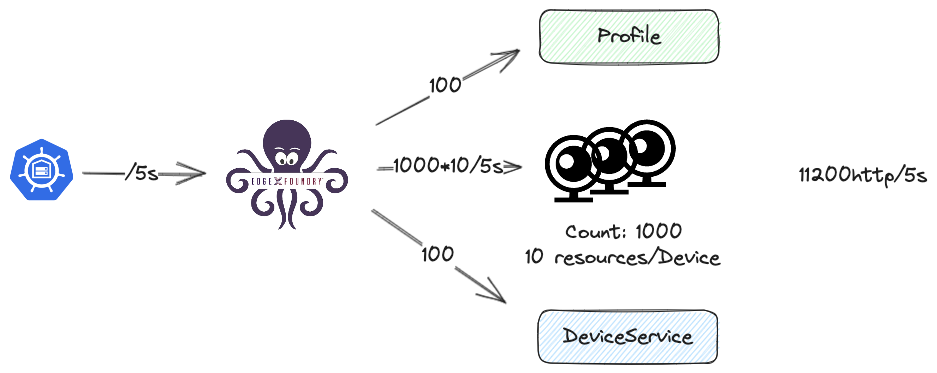

As you can see, OpenYurt (Kubernetes side) sends HTTP requests to the internal EdgeX microservice to synchronize Devices, DeviceService, DeviceProfile every five seconds that passes. if we have 1000 camera devices and a hundred DeviceServices at this point in time If we have 1000 camera devices, one hundred DeviceServices, and one hundred DeviceProfiles at this time, and if each camera has at least 10 device resources. So every five seconds, we need to send 100 + 100 + 1000 + 1000 * 10 HTTP requests, that is to say, every five seconds, we need to send 11200 HTTP requests. Then this amount of access is unacceptable for the user. In other words, the existing implementation puts an upper limit on the number of devices we can use.

### Goals

Use messageBus to complete the synchronization instead of Rest requests, extending the synchronization time of the synchronizer.

### Non-Goals/Future Work

1、Disregarding 2.x support for now

2、Disregard messagebus other than redis for now

3、Strong metadata consistency is ignored for now, and only modified by subscription

## Proposal

### Backgrounds


We can see this image from the EdgeX website that sends to MessageBus the following four main types of content.

- Events: Events mainly includes some automatic events, when adding, publishing events will open a concurrent program to send a message. It is not used in EdgeX main services and Device Services for the time being, but may be used in some App Servcie.
- Metrics:Metrics are mainly some of the metrics generated by this process, such as the last connection time of the device and so on. This piece of content is not subscribed to in the EdgeX core component. It may be mainly used for App Service and given to App Service to handle.
- System Events:System Events mainly include the addition, deletion and update operations of the metadata of Device, DeviceService and DeviceProfile.
- Commands:Commands mainly include some get, set requests to the device. There are two ways to request a device, rest and messagebus are both supported. However, the only external messagebus supported by core-command is MQTT.

In the above figure, we can see that if Device, DeviceService, DeviceProfile changes (on the EdgeX side), then a message will be sent to messageBus, if we listen to this message at this time, so that in the future we can consider to extend the synchronization time of the synchronizer, and in this way we can carry out the timely updating of the Device, DeviceServcie, DeviceProfile.

### Experiments

[more details](https://www.yuque.com/wawlian/axggn3/pq2egg205leub8o0)

#### EdgeX Side

On the EdgeX side, we are mainly concerned with the content of edgex-core-matedata, and all metadata-related content is related to edgex-core-matedata.

Below is an example of adding, updating, and deleting devices for all metadata. More examples can be found in the more details section above.

**AddDevice**

```go
func AddDevice(d models.Device, ctx context.Context, dic *di.Container) (id string, edgeXerr errors.EdgeX) {
	...
	// 添加device
	addedDevice, err := dbClient.AddDevice(d)
	...

	deviceDTO := dtos.FromDeviceModelToDTO(addedDevice)
    // 开一个协程，发布这个add的系统事件
	go publishSystemEvent(common.DeviceSystemEventType, common.SystemEventActionAdd, d.ServiceName, deviceDTO, ctx, dic)

	return addedDevice.Id, nil
}
```

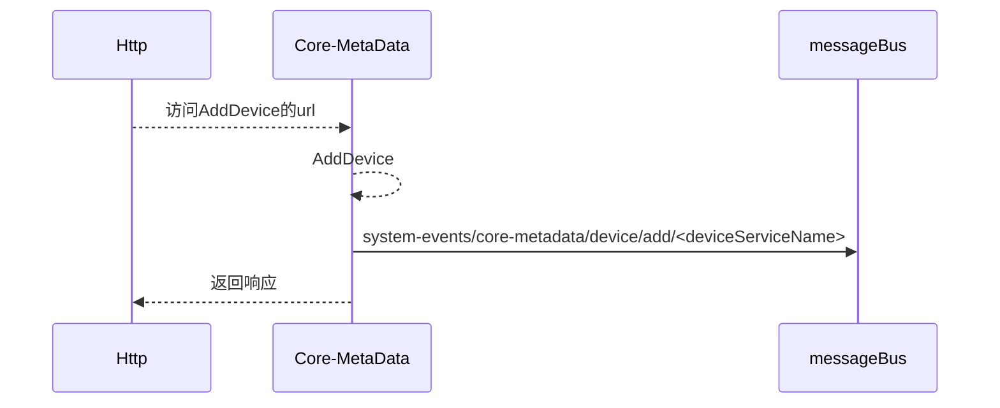

Add a device with deviceServiceName as device-virtual and deviceName as Random-Integer-Device.

Then the subscribed topic is `edgex.system-events.core-metadata.device.add.device-virtual.Random-Integer-Device`.

Add this device to the EdgeX UI and take a look at the messages we subscribed to.

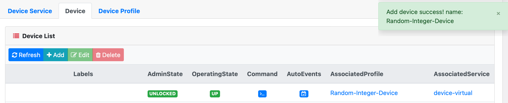

The following is a successful subscription to this message.

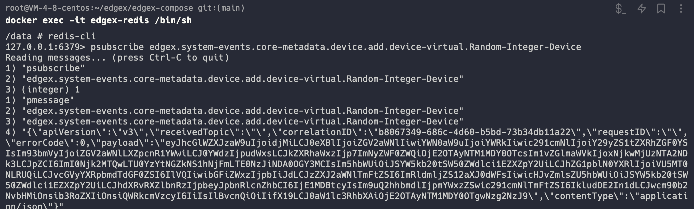

**DeleteDeviceByName**

```go
// DeleteDeviceByName deletes the device by name
func DeleteDeviceByName(name string, ctx context.Context, dic *di.Container) errors.EdgeX {
	...
    // 删除这个设备
	err = dbClient.DeleteDeviceByName(name)
	...
	deviceDTO := dtos.FromDeviceModelToDTO(device)
    // 开一个协程发送发布这个消息
	go publishSystemEvent(common.DeviceSystemEventType, common.SystemEventActionDelete, device.ServiceName, deviceDTO, ctx, dic)

	return nil
}
```

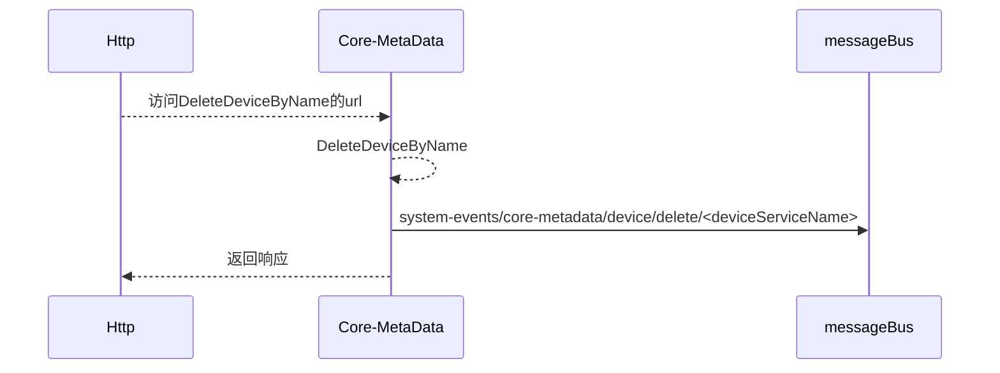

Delete Device Random-Integer-Device

Then the subscribed topic is `edgex.system-events.core-metadata.device.delete.device-virtual.Random-Integer-Device`.

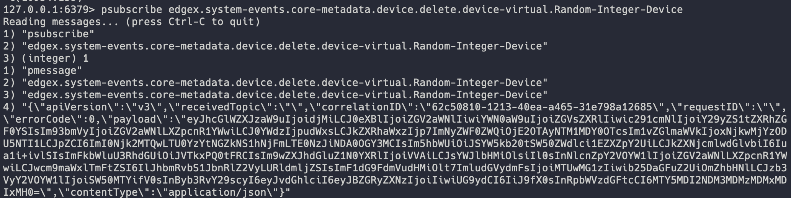

**PatchDevice**

```go
// PatchDevice executes the PATCH operation with the device DTO to replace the old data
func PatchDevice(dto dtos.UpdateDevice, ctx context.Context, dic *di.Container) errors.EdgeX {
	// Old service name is used for invoking callback
	var oldServiceName string
	if dto.ServiceName != nil && *dto.ServiceName != device.ServiceName {
		oldServiceName = device.ServiceName
	}
    ...
	// 更新device
	err = dbClient.UpdateDevice(device)
    ...
	
    // 如果修改了deviceService
	if oldServiceName != "" {
		go publishSystemEvent(common.DeviceSystemEventType, common.SystemEventActionUpdate, oldServiceName, deviceDTO, ctx, dic)
	}

	go publishSystemEvent(common.DeviceSystemEventType, common.SystemEventActionUpdate, device.ServiceName, deviceDTO, ctx, dic)

	return nil
}
```

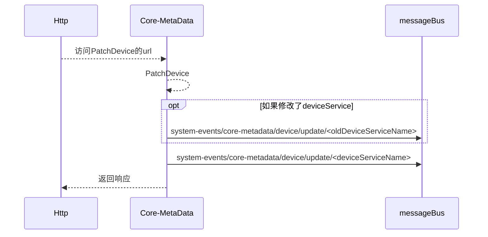

Modify a device with deviceServiceName as device-virtual and deviceName as Random-Integer-Device.

**Unmodified deviceService**

Then the subscribed topic is `edgex.system-events.core-metadata.device.update.device-virtual.Random-Integer-Device`.

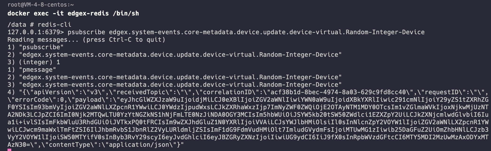

**Modified deviceService**

Then the subscribed topic is `edgex.system-events.core-metadata.device.update.device-rest.Random-Integer-Device`.

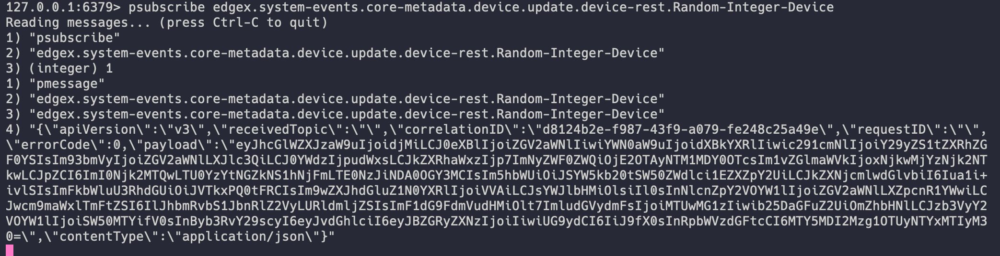

Then the subscribed topic is`edgex.system-events.core-metadata.device.update.device-virutal.Random-Integer-Device`.

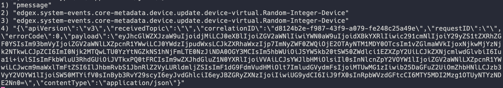

#### Device Side

There are 8 main handlers on the device side and their brief functions are as follows.

- httpServer.BootstrapHandler is mainly responsible for registering TimeoutHandler, RequestLimitMiddleware, ProcessCORS handlers.
- The messageBusBootstrapHandler does the following:
  - Create a messageBus client
  - Perform subscription to asynchronously process command requests (this is handled by the internal application for getcommand and setcommand)
  - The processing of metasystemevent is done for deviceSystemEventAction, deviceProfileSystemEventAction, provisionWatcherSystemEventAction, deviceServiceSystemEventAction. core-metadata is subscribed here. (Although it's implemented here, it seems that it's not in use yet, because this line is yellow on the edgex official website, it's used during FUTURE)
  - Use messagebus to subscribe to the device's inspection.
- Handlers.NewServiceMetrics(ds.ServiceName).BootstrapHandler: register the metrics reporter and manager, according to the configured interval, the reporter will report the data periodically. But here there is no registration of metrics (in the following handler to register), just the manager run up, the reporter's report is sent to the messageBus.
- handlers.NewClientsBootstrap().BootstrapHandler creates clients for various and other services. Included:
  - CoreData related -> EventClient (Rest only)
  - CoreMetaData related -> DeviceClient (Rest only), DeviceServiceClient (Rest only), DeviceProfileClient (Rest only), ProvisionWatcherClient (Rest only)
  - CoreCommand related -> CommandClient (Rest and messageBus)
  - SupportNotifications related -> NotificationClient (Rest only), SubscriptionClient (Rest only)
  - SupportScheduler related -> IntervalClient (Rest only), IntervalActionClient (Rest only)
- autoevent.BootstrapHandler defines the manager of the autoEvent, the send of the event is sent to the messageBus (which is not activated here, and is reserved for use by a later handler)
- NewBootstrap(router).BootstrapHandler does the final initialization, loading, and running of what was prepared earlier (autoevent's manager and registering the metrics that need to be reported)
  - Initialization routes: common, secret, discovery, validate, device command, callback related url.
  - Initialize cache: device, profile, provision watcher.
  - processAsyncResults asynchronous reads, process data before passing to core-data, some to do conversion. asyncBufferSize > 1 disordered, AsyncBufferSize = 1, order.
  - processAsyncFilterAndAdd handle the addition of dynamic devices.
  - Initialize, own as deviceservice, load profile, load device, load provisionWatcher.
  - Start the manager of the previously set autoevent.
  - Register two metrics for the previously set up metricmanager (Event / Reading sent)
- autodiscovery.BootstrapHandler: auto device discovery related launcher that calls the Discover() method implemented by the driver.
- handlers.NewStartMessage(serviceName, serviceVersion).BootstrapHandler: prints the startup hint message of the whole driver, indicating that the driver is up.

### Partial Realization

The overall implementation logic is as follows:

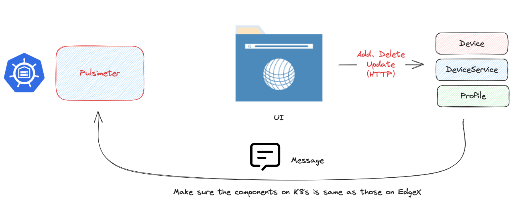

The whole logic is like this, first of all the user can add, delete and update metadata through the UI (mainly by means of HTTP requests). The metadata includes Device, DeviceService, DeviceProfile. Each time a change (addition, deletion, update) is made, the EdgeX segment opens a go routine to send a message to MessageBus. Our Pulsimeter component is a go routine that is always running, it subscribes to the topic "edgex.system-events.core-meteadata.#" and gets a system event that we send to the MessageBus according to the Then we get a system event, and we synchronize our operations in OpenYurt (kubernetes) based on the type and action of the system event. This will allow us to modify the content in OpenYurt in time when the modification occurs on the EdgeX side, thus we don't need to execute the synchronizer every 5 seconds, and the synchronization frequency of the synchronizer can be extended.

```go
/*
Copyright 2023 The OpenYurt Authors.

Licensed under the Apache License, Version 2.0 (the "License");
you may not use this file except in compliance with the License.
You may obtain a copy of the License at

    http://www.apache.org/licenses/LICENSE-2.0

Unless required by applicable law or agreed to in writing, software
distributed under the License is distributed on an "AS IS" BASIS,
WITHOUT WARRANTIES OR CONDITIONS OF ANY KIND, either express or implied.
See the License for the specific language governing permissions and
limitations under the License.
*/

package controllers

import (
	"context"
	"encoding/json"
	"strings"

	"github.com/edgexfoundry/go-mod-core-contracts/v3/common"
	"github.com/edgexfoundry/go-mod-core-contracts/v3/dtos"
	"github.com/edgexfoundry/go-mod-messaging/v3/messaging"
	"github.com/edgexfoundry/go-mod-messaging/v3/pkg/types"
	"github.com/openyurtio/openyurt/cmd/yurt-iot-dock/app/options"
	"k8s.io/klog/v2"
	"sigs.k8s.io/controller-runtime/pkg/client"
	ctrlmgr "sigs.k8s.io/controller-runtime/pkg/manager"

	iotv1alpha1 "github.com/openyurtio/openyurt/pkg/apis/iot/v1alpha1"
	metav1 "k8s.io/apimachinery/pkg/apis/meta/v1"
)

type Pulsimeter struct {
	// kubernetes client
	client.Client
	// which nodePool Plusimeter is deployed in
	NodePool string
	// which namespace Plusimeter is deployed in
	Namespace string
	// messageBus
	MessgaeBus messaging.MessageClient
}

func NewPulsimeter(client client.Client, opts *options.YurtIoTDockOptions) (Pulsimeter, error) {

	// init messagebus
	messagebus, err := messaging.NewMessageClient(types.MessageBusConfig{
		Broker: types.HostInfo{
			Host:     opts.RedisAddr,
			Port:     int(opts.RedisPort),
			Protocol: "redis",
		},
		Type: "redis"})

	if err != nil {
		return Pulsimeter{}, err
	}

	return Pulsimeter{
		Client:     client,
		NodePool:   opts.Nodepool,
		Namespace:  opts.Namespace,
		MessgaeBus: messagebus,
	}, nil

}

func (pm *Pulsimeter) NewPulsimeterRunnable() ctrlmgr.RunnableFunc {
	return func(ctx context.Context) error {
		pm.Run(ctx.Done())
		return nil
	}
}

func (pm *Pulsimeter) Run(stop <-chan struct{}) {
	klog.V(1).Info("[Pulsimeter] Starting watch...")
	// prepare the topic and channel for subscribe

	// topic is like edgex/system-events/core-metadata/#
	topic := common.BuildTopic(common.DefaultBaseTopic, common.SystemEventPublishTopic, common.CoreMetaDataServiceKey, "#")
	messages := make(chan types.MessageEnvelope, 1)
	messageErrors := make(chan error, 1)
	topics := []types.TopicChannel{
		{
			Topic:    topic,
			Messages: messages,
		},
	}
	err := pm.MessgaeBus.Subscribe(topics, messageErrors)
	if err != nil {
		klog.V(3).ErrorS(err, "fail to subscribe the topic")
	}

	klog.V(1).Info("[Pulsimeter] Start waiting for messages")
	go func() {
		for {
			select {
			case err = <-messageErrors:
				klog.V(3).ErrorS(err, "fail to get the message")
			case msgEnvelope := <-messages:
				var systemEvent dtos.SystemEvent
				err := json.Unmarshal(msgEnvelope.Payload, &systemEvent)
				if err != nil {
					klog.V(3).ErrorS(err, "fail to JSON decoding system event")
					continue
				}

				switch systemEvent.Type {
				case common.DeviceSystemEventType:
					if err := pm.dealWithDevice(systemEvent); err != nil {
						klog.V(3).ErrorS(err, "fail to deal with device system event")
					}
				}
			}
		}
	}()

	<-stop
	klog.V(1).Info("[Pulsimeter] Stopping watch")
}

func (pm *Pulsimeter) dealWithDevice(systemEvent dtos.SystemEvent) error {
	dto := dtos.Device{}
	err := systemEvent.DecodeDetails(&dto)
	if err != nil {
		klog.V(3).ErrorS(err, "fail to decode device system event details")
	}

	switch systemEvent.Action {
	case common.SystemEventActionAdd:
		newDevice := toKubeDevice(dto, pm.Namespace)
		if err := pm.Client.Create(context.TODO(), &newDevice); err != nil {
			klog.V(5).ErrorS(err, "fail to create device on OpenYurt", "DeviceName", strings.ToLower(newDevice.Name))
			return err
		}
	}

	return nil
}

// toKubeDevice serialize the EdgeX Device to the corresponding Kubernetes Device
func toKubeDevice(ed dtos.Device, namespace string) iotv1alpha1.Device {
	var loc string
	if ed.Location != nil {
		loc = ed.Location.(string)
	}
	return iotv1alpha1.Device{
		ObjectMeta: metav1.ObjectMeta{
			Name:      toKubeName(ed.Name),
			Namespace: namespace,
			Labels: map[string]string{
				EdgeXObjectName: ed.Name,
			},
		},
		Spec: iotv1alpha1.DeviceSpec{
			Description:    ed.Description,
			AdminState:     iotv1alpha1.AdminState(ed.AdminState),
			OperatingState: iotv1alpha1.OperatingState(ed.OperatingState),
			// Protocols:      toKubeProtocols(ed.Protocols),
			Labels:   ed.Labels,
			Location: loc,
			Service:  ed.ServiceName,
			Profile:  ed.ProfileName,
			// TODO: Notify
		},
		Status: iotv1alpha1.DeviceStatus{
			Synced:         true,
			EdgeId:         ed.Id,
			AdminState:     iotv1alpha1.AdminState(ed.AdminState),
			OperatingState: iotv1alpha1.OperatingState(ed.OperatingState),
		},
	}
}

func toKubeName(edgexName string) string {
	return strings.ReplaceAll(strings.ToLower(edgexName), "_", "-")
}

```

Here is the logic to turn on Pulsimeter in `core.go`:

```go
	setupLog.Info("[NewPulsimeter] run the pulsimeter")
	pm, err := controllers.NewPulsimeter(mgr.GetClient(), opts)
	if err != nil {
		setupLog.Error(err, "unable to create plusimeter", "controller", "Device")
		os.Exit(1)
	}
	err = mgr.Add(pm.NewPulsimeterRunnable())
	if err != nil {
		setupLog.Error(err, "unable to create plusimeter runnable", "syncer", "Device")
		os.Exit(1)
	}
```

### User Stories

As an end user, I want to support more devices.

## Implementation History

- [x] 08/23/2023: Draft proposal created
- [ ] 