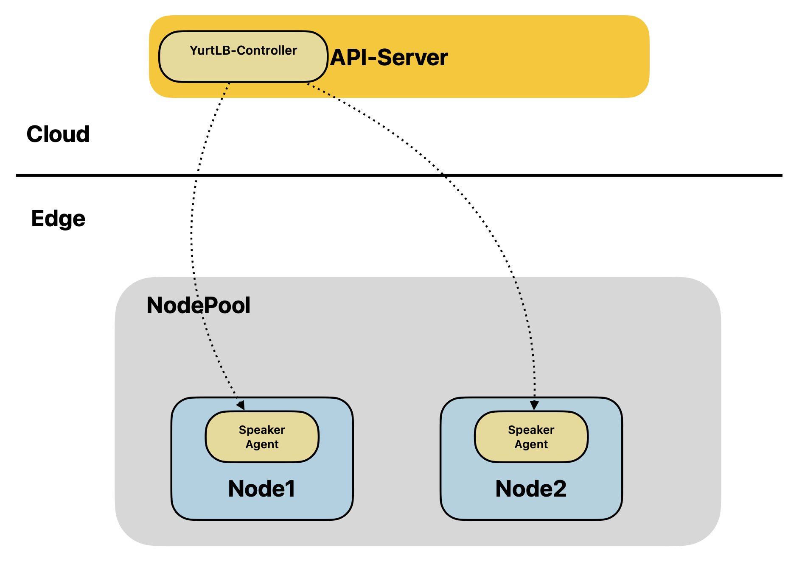
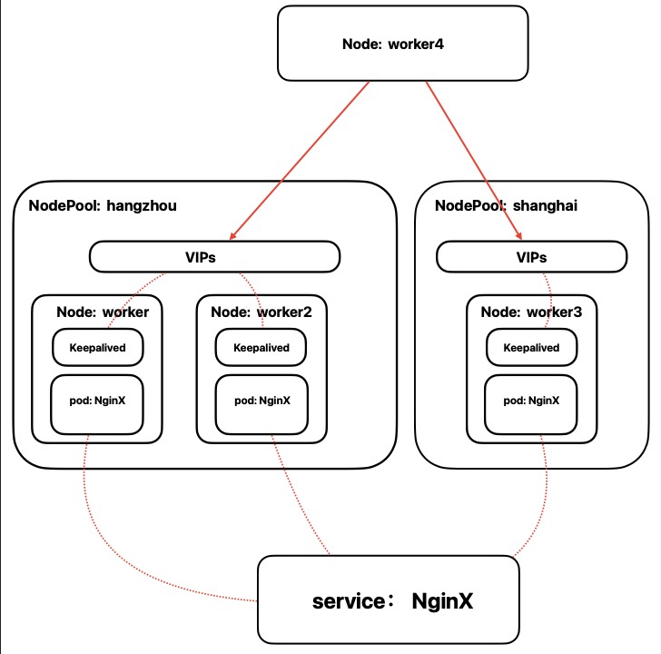

|               title               | authors | reviewers | creation-date | last-updated | status      |
| :-------------------------------: | ------- | --------- | ------------- | ------------ | ----------- |
| High Availability of Edge Services | @Rui-Gan @wangxye   |       | 2023-11-21 |    |  |

# High Availability of Edge Services

## Table of Contents

- High Availability of Edge Services
  - [Table of Contents](#table-of-contents)
  - [Summary](#summary)
  - [Motivation](#motivation)
    - [Goals](#goals)
    - [Non-Goals/Future Work](#non-goalsfuture-work)
  - [Proposal](#proposal)
    - [Architecture](#architecture)
    - [Implementation Details](#implementation-details)
      - [YurtLB Controller](#yurtlb-controller)
      - [Speaker Agent](#speaker-agent)
      - [Supplement](#supplement)
    - [User Stories](#user-stories)
      - [Story 1](#story-1)
      - [Story 2](#story-2)
  - [Implementation History](#implementation-history)

## Summary

In the context of cloud-edge collaboration, Openyurt employs nodepools to uniformly manage and maintain hosts under different edge regions. This setup enables users to access applications on edge nodes via NodePort. However, this architecture is susceptible to single-point failures —— when an edge application service becomes unavailable, the entire service is compromised. To address this concern, it is crucial to implement load balance (LB) services.

With the IngressIP of the LB service, external clients can still access edge applications even when some are unavailable. In this scenario, if an edge application fails, the LB service can automatically reroute traffic to other operational edge applications to ensure service availability. This decentralization enhances system resiliency and fault tolerance. Even if a Node fails, the LB service can continue providing access to edge applications in other operational Nodes, ensuring the stability and reliability of the entire system.

## Motivation

In cloud environments, Kubernetes (k8s) leverages Service VIP (Virtual IP) technology, coupled with the support of kube-proxy, to achieve service-level load balance. This provides users with reliable and efficient access to applications deployed in the cluster. In edge scenarios, OpenYurt extends Kubernetes' capabilities to edge nodes through the concept of node pooling, enabling each nodepool to run a set of edge applications.

However, due to the unique characteristics of edge environments, edge nodes may encounter issues such as unstable networks, limited resources, and dynamic changes. In addition, yurt-hub provides capabilities such as node autonomy as well as traffic closure. Service access across node pool levels is currently not supported for services between edge node pools. As such, it's necessary to implement effective load balancing measures at the edge to guarantee continuous availability of edge node services.

### Goals

- Design edge load balance controllers to monitor and distribute VIPs.
- Enable VIP management from the level of the nodepool.
- Design and implement VIP generation and service high availability based on Keepalived.
- Design round rotation based ipvs module for traffic forwarding strategy.

### Non-Goals/Future Work

- While efficient load balancing is provided, users need to carefully plan the VIP for each nodepool. Especially in a LAN, if there are two nodepools, and both are bound to the same VIP, this could cause conflicts and errors. These issues arise from erroneous VIP planning, for which the LB is not responsible.
- Provide more traffic forwarding policies, such as least connection, random, hash and so on.

## Proposal

### Architecture

<div align="center">
  
</div>

### Implementation Details

#### YurtLB Controller

The YurtLB Controller monitors changes in the service and the nodepool, implementing service load balancing for the edge nodes via Virtual IPs (VIPs).

YurtLB controller can be described as:

##### Reconcile

1. YurtLB Controller will list/monitor NodePool CRs. User-specified VIP information will be uniformly added to the properties of the NodePool, irrespective of how (and if) the IP is advertised.

```go
// NodePoolSpec defines the desired state of NodePool
type NodePoolSpec struct {
	//...
  Addresses []string `json:"addresses"`
}
```

Here is a example for Edge NodePool in load balance mode:

```yaml
apiVersion: apps.openyurt.io/v1beta1
kind: NodePool
metadata:
  name: beijing
spec:
  type: Edge
  addresses:
    - 2002:2:2::1-2002:2:2::100
    - 172.20.0.100-172.20.0.200
```

2. When a load balanced service is created, an event triggers the YurtLB controller to assign a VIP to the service from a pre-defined range for the nodepool.

- YurtLB Controller selects the appropriate VIP for the load-balanced service using customized assignment policies (round robin, random, etc.). It's important that the VIP chosen from the nodepool's VIP set isn't selected repeatedly. In cases of repeated allocation, YurtLB controller will retain only the first successful allocation.
- YurtLB Controller will deliver the selected VIP information to the nodes where the load balancer service is located, including the nodes where the pods reside.

```yaml
apiVersion: v1
kind: Service
metadata:
  name: nginx
  namespace: default
  annotations:
    service.openyurt.io/nodepool-labelselector: key1=val1,key2=val2
spec:
  type: LoadBalancer
  loadBalancerClass: service.openyurt.io/vip
...

status:
  loadBalancer:
      ingress:
      - hostname: hangzhou
        ip: 172.18.0.20
      - hostname: shanghai
        ip: 172.18.0.30
```

- The Speaker agent in the edge node can list/watch VIP changes to facilitate subsequent VIP binding and traffic forwarding.
- Note:
  - When the above configuration is applied to create a service of type LoadBalancer, not every nodepool that hosts the associated pods will generate a LoadBalancer instance. Only those nodepools that are tagged with both key1:val1 and key2:val2 labels will proceed to create a LB instance.
  - VIPs can be specified directly through annotation, e.g., `service.openyurt.io/loadBalancerIP-{Nodepool Name}: 192.168.10.234`. This method bypasses the load balancer's VIP assignment logic, and the specified VIP can be outside the node pool's VIP range. However, VIPs specified in this manner will eventually be synchronized to the VIP range of the node pool.
  - When creating a service of type "LoadBalancer", you need to specify "service.openyurt.io/vip" in the loadBalancerClass field. Only services explicitly using YurtLB in the loadBalancerClass field will be managed by the YurtLB Controller and Speaker Agent.
  - For the case where a node is unavailable but the nodepool is available, the YurtLB controller triggers the remaining nodes on the specified nodepool and lets the Speaker agent on those nodes take care of the binding of the remaining nodes to the VIP, but for the rest of the cases, the YurtLB controller will not perform any action.

#### Speaker Agent

The speaker agent will be deployed on each node to modify the Keepalived configuration and establish a connection from the node to the pod using the IPVS module.

For a service's VIP, only nodes with the corresponding pods will participate in the election for this VIP. Nodes without the pod will not compete for this VIP.

For the IPVS module, if the VIP is bound to node A, then when traffic is routed to node A, IPVS will distribute the traffic amongst the different pods of this node.

Here is a demonstration that explains the principle of the speaker agent:

##### DEMO：

<div align="center">
  
</div>

Consider the diagram above where we have two nodepools, hangzhou and shanghai. The hangzhou nodepool contains two nodes, worker and worker2, and the shanghai nodepool has a single node, worker3. The Nginx service has pods in worker, worker2, and worker3, and it functions as a load balancer type service.

Let's assume that the YurtLB controller assigns a VIP of 172.18.0.20 to the hangzhou nodepool and a VIP of 172.18.0.30 to the shanghai nodepool. In the hangzhou nodepool, the priorities of Keepalived are set to 150 for worker and 100 for worker2.

Given this information, the virtual_ipaddress field of Keepalived on different nodes is configured as follows:

```
worker:
    virtual_ipaddress {
        172.18.0.20
    }

worker2:
	    virtual_ipaddress {
        172.18.0.20
    }

worker3:
    virtual_ipaddress {
        172.18.0.30
    }
```

Here is the information for the Nginx pods:

```
NAME          READY   STATUS    RESTARTS   AGE   IP           NODE                        NOMINATED NODE   READINESS GATES
nginx-2qtm4   1/1     Running   0          17h   10.244.3.8   openyurt-e2e-test-worker    <none>           <none>
nginx-sk8hg   1/1     Running   0          17h   10.244.4.7   openyurt-e2e-test-worker2   <none>           <none>
nginx-xkcmz   1/1     Running   0          17h   10.244.1.7   openyurt-e2e-test-worker3   <none>           <none>
```

Execute the following commands in the worker node to route the packet with the destination address 172.18.0.20 to the Nginx pod:

```
ipvsadm -A -t 172.18.0.20:80 -s rr

ipvsadm -a -t 172.18.0.20:80 -r 10.244.3.8 -m

iptables -t nat -A POSTROUTING -m ipvs --vaddr 172.18.0.20 --vport 80 -j MASQUERADE
```

The other two nodes execute similar commands. Now, with a node outside the cluster on a LAN, execute the curl command:

```
curl 172.18.0.20:80
```

You will get the following result:

```
<title>openyurt-e2e-test-worker</title>
```

This is because the worker node has a higher priority than worker2, so 172.18.0.20 is bound to the worker node. Thus, when a request is made to 172.18.0.20, traffic is routed to the pod on the worker node.

```
curl 172.18.0.30:80
```

You will get the following result:

```
<title>openyurt-e2e-test-worker3</title>
```

Since the shanghai nodepool only has worker3, 172.18.0.30 is bound to worker3.

#### Supplement

- The Speaker Agent needs to modify the kernel parameters of the node to set the value of net.ipv4.vs.conntrack parameter to 1.
- Instead of running keepalived directly as a binary on each node, we use a keepalived container. The osixia/keepalived image is executed as a pod within each node.
- While we allow users to modify the keepalived configuration without enforcing synchronization to avoid disrupting custom configurations, it's important to note that during the initial phase, users are unable to change the VIP by modifying the keepalived configuration.

### User Stories

#### Story 1（General）

As a user, you have two methods to create a LoadBalancer (LB) type service.

If you want to explicitly specify the Virtual IP (VIP), you can directly create a service of type LoadBalancer and add the desired VIP in the annotation according to the specified format.

On the other hand, for automatic VIP assignment, you need to configure the Addresses field when creating the NodePool. Based on this configuration, when you create a LoadBalancer type service, the VIP will be automatically assigned.

#### Story 2（Specific）

For instance, if you want to specify the VIP of the Nginx service associated with the Hangzhou NodePool as 172.18.0.20, you can create a service with the following configuration.

**Explicitly specify the Virtual IP (VIP) for the service**

```
apiVersion: v1
kind: Service
metadata:
  name: nginx
  annotations:
    service.openyurt.io/nodepool-labelselector: service:nginx
    service.openyurt.io/loadBalancerIP-hangzhou: 172.18.0.20
spec:
  selector:
    app: nginx
  ports:
    - name: tcp-80
      protocol: TCP
      port: 80
      targetPort: 80
  type: LoadBalancer
  loadBalancerClass: service.openyurt.io/vip
```

**Automatically assign the Virtual IP (VIP) for the service**

If you aim to have VIPs assigned automatically, you need to specify Addresses when creating the NodePool, as shown below.

```
apiVersion: apps.openyurt.io/v1beta1
kind: NodePool
metadata:
  name: hangzhou
  labels:
    service: nginx
spec:
  type: Edge
  Addresses:
  - 172.18.0.20-172.18.0.30
```

When a service is created with the following configuration, the YurtLB automatically allocates the VIP.

```
apiVersion: v1
kind: Service
metadata:
  name: nginx
  annotations:
    service.openyurt.io/nodepool-labelselector: service:nginx
spec:
  selector:
    app: nginx
  ports:
    - name: tcp-80
      protocol: TCP
      port: 80
      targetPort: 80
  type: LoadBalancer
  loadBalancerClass: service.openyurt.io/vip
```

## Implementation History

- [ ]  11/21/2023: Draft proposal created;