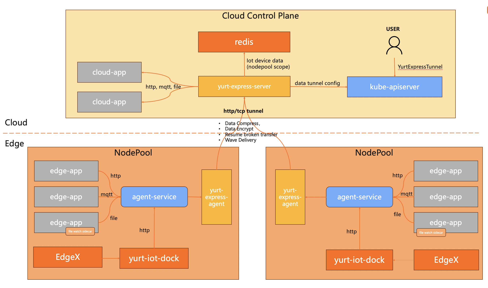
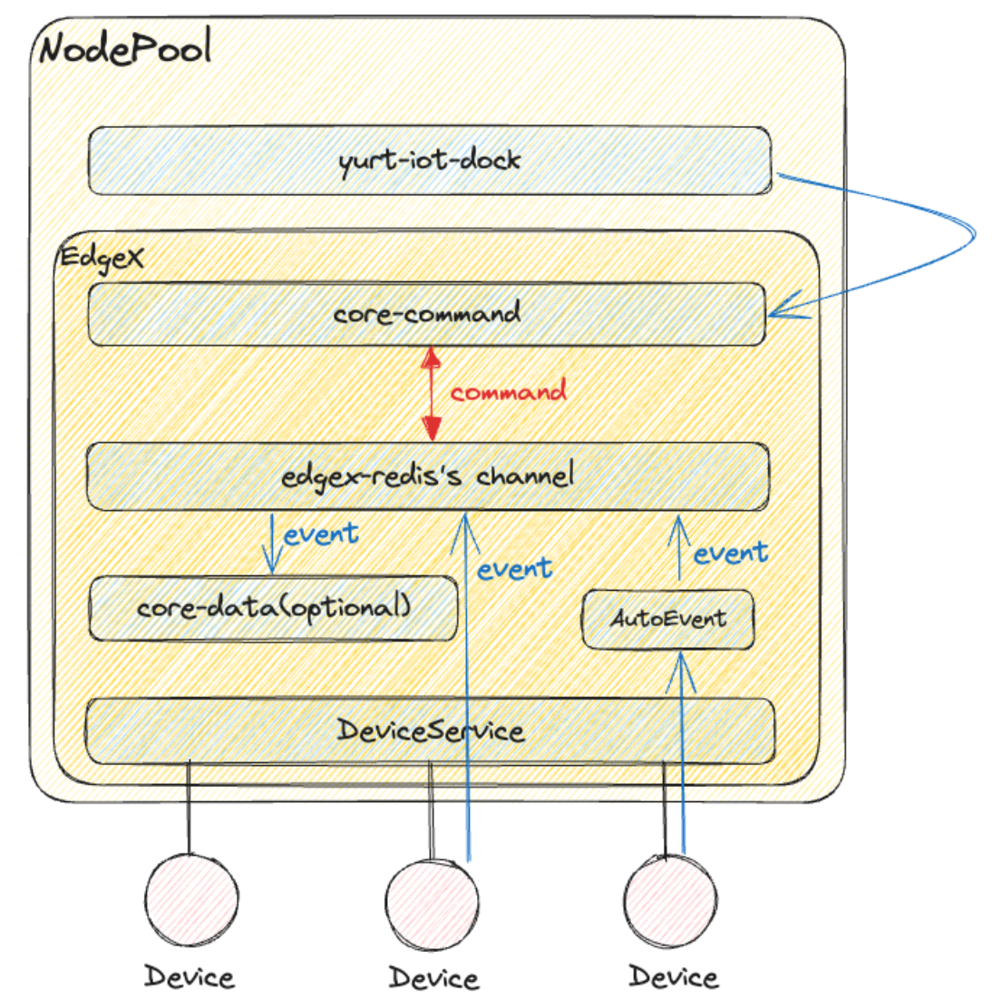

# Yurt-Express: OpenYurt data transmission system

## Table of Contents

- [Yurt-Express: OpenYurt data transmission system](#yurt-express--openyurt-data-transmission-system)
  - [Table of Contents](#table-of-contents)
  - [Glossary](#glossary)
  - [Summary](#summary)
    - [Goals](#goals)
    - [Non-Goals/Future Work](#non-goalsfuture-work)
  - [Proposal](#proposal)
    - [User Stories](#user-stories)
    - [Overview](#overview)
    - [Yurt-Express Proposal](#yurtexpress-proposal)
      - [1. Data Message Definition](#1-data-message-definition)
      - [2. Yurt Express Channel](#2-yurt-express-channel)
      - [3. Data Tunnel Definition](#3-data-tunnel-definition)
      - [4. Data Receiver Definition](#4-data-receiver-definition)
      - [5. Data Deliver Definition](#5-data-deliver-definition)
      - [6. Wave Delivery Manager](#6-wave-delivery-manager)
      - [7. Data Compress](#7-data-compress)
    - [Yurt-iot-dock integration](#yurt-iot-dock-integration)

## Glossary

Refer to the [OpenYurt Glossary](https://github.com/openyurtio/openyurt/blob/master/docs/proposals/00_openyurt-glossary.md)

### EdgeDataUpload
Based on user configurations, data is collected from edge and sent to the cloud center, and then delivered to the cloud app required by the user.

### DataTunnel
DataTunnel is an abstract concept that regards the entire platform as a black box and a set of input and output information as a tunnel, where the business system submits the data to the input side, and the data output side returns the data to the cloud business system.

## Summary
This Proposal solves the problem of sending data from the edge to the cloud with k8s and openyurt environment. In particular, in the scenario of：
- Weak network and unidirectional network on the edge side
- Central service is difficult to connect
- Network traffic is too large
- Number of connections is too large.

### Goals
- Implement a data tunnel system to sending data from edge to cloud.
- Data tunnel offers:
  - Data encryption.
  - Wave delivery.
  - Data compression.
  - Resume broken transfer.
- Support edge device data edge-cloud upload together with yurt-iot-dock

### Non-Goals/Future Work
Non-goals are limited to the scope of this proposal. These features may evolve in the future.
- Cloud-Edge data transfer.
- Edge-Edge data transfer.
- Container image preheat.

## Proposal

### User Stories

1. As an end-user, I would like to send edge data to cloud through http, mqtt protocols.
2. As an end-user, I would like to send edge files to cloud, including log files, AI training data etc.
3. As an end-user, I dont't want to change any code to adapt edge scenario.

### Overview

We define a new edge data tunnel system to implement edge data upload from edge to cloud, which contains:
- yurt-express-agent: deployed per node pool using YurtAppSet
- yurt-express-server: deployed in cloud using k8s Deployment
- redis: Optional, deployed in cloud, yurt-iot-dock sync edge device data to cloud redis through yurt-express



### YurtExpress Proposal

#### 1. Data Message Definition
 Schema used for data tunnel agent-server communication
```go
const (
    HttpTopicHeader = "topic"
)

type MessageMeta struct {
    Id    string `json:"id,omitempty"`
    Topic string `json:"topic,omitempty"`
    // message protocol, automatic recognize message protocol
    Protocol channel.Protocol `json:"protocol,omitempty"`
    // message method, automatic recognize message method
    Method string    `json:"method,omitempty"`
    Time   time.Time `json:"time,omitempty"`
    Length int64     `json:"length,omitempty"`
}

type Message struct {
    MessageMeta
    BodyReader func() (io.ReadCloser, error)
}

```

#### 2. Yurt Express Channel
  CRD used for yurt express channel definition, for simplicity of use configuration and extension for future cloud-edge, edge-edge data transition implementation
```go

type YurtExpressChannel struct {
    metav1.TypeMeta   `json:",inline"`
    metav1.ObjectMeta `json:"metadata,omitempty"`

    Spec   YurtExpressChannelSpec   `json:"spec,omitempty"`
    Status YurtExpressChannelStatus `json:"status,omitempty"`
}

type YurtExpressChannelSpec struct {
	// INSERT ADDITIONAL SPEC FIELDS - desired state of cluster
	// Important: Run "make" to regenerate code after modifying this file

	// Yurt express http channel
	Http YurtExpressHttpChannel `json:"http,omitempty"`

	Https YurtExpressHttpsChannel `json:"https,omitempty"`

	// unit Second
	Timeliness int `json:"timeliness"`
}

type YurtExpressHttpChannel struct {
    Url string `json:"url,omitempty"`
}

type YurtExpressHttpsChannel struct {
    Url          string             `json:"url,omitempty"`
    TlsSecretRef v1.ObjectReference `json:"tlsSecretRef,omitempty"`
}

```

#### 3. Data Tunnel Definition
  Support http&tcp tunnel, use for edge-cloud communication
```go
type Tunnel interface {
    // Send send data to server side
    Send(id string, reader common.Reader) error
    // Start start receive
    Start(stopCh <-chan struct{}) error
    // Register regiter a function to receive data
    Register(handler func(id string, reader common.Reader))
}

type httpTunnel struct {
    port     int
    host     string
    handlers []func(id string, reader common.Reader)
}
```

#### 4. Data Receiver Definition
  yurt-express-agent receiver receive message from edge-app, and sent it to data-agent-server through data tunnel
```go
type Receiver interface {
    RegisterHandler(func(message *common.Message) error)
    Run(stopCh <-chan struct{}) error
}

type httpReceiver struct {
    port     int
    handlers []func(message *common.Message) error
}
```

#### 5. Data Deliver Definition
  yurt-express-server receives message from yurt-express-agent and deliver it to cloud app according to message configuration.
```go
type Deliver interface {
	Deliver(message *common.Message)
}

type httpDeliver struct {
    params map[string]string
}
```

#### 6. Wave delivery manager
 wave delivery manager delivers according to  message channel timeliness
```go
type WaveManager struct {
    tunnel       tunnel.Tunnel
    chRepo       meta.ChannelRepository
    waves        map[string]string
    caches       map[int]cache.MessageCache
    cacheFactory func(string) cache.MessageCache
    stop         <-chan struct{}
    compressor   compress.Compressor
}

```

#### 7. Data Compress
  compress at edge-tunnel-agent and decompress at edge-tunnel-server
```go
type Compressor interface {
    // Compress generat an Compressed package and return package key
    Compress([]*common.Message) (string, error)
    // GetCompressed get compressed package Reader with giving package key
    GetCompressed(string) (common.Reader, error)
    // Clear delete compressed package with giving package key
    Clear(string) error
}

type Decompressor interface {
    // DeCompress from an reader, return every message key []string
    DeCompress(common.Reader) ([]string, error)
    // GetDecompressed get an decompressed Message with giving message key
    GetDecompressed(string) (*common.Message, error)
    // Clear delete decompressed Message whit giving message key
    Clear(string) error
}
```

### Yurt-iot-dock integration

#### Challenges
- IOT device messages are now stored in etcd, which may influences k8s cluster performance.
- Edge device messages could be very large, but edge-cloud bandwidth is limited
- Protocol adaptation maybe needed. For example, video streaming uses rtsp protocol.

#### Proposal
- middleware like redis or mqtt should be deployed on cloud to store iot device messages
- yurt-iot-dock deployed per node pool, receive and transfer iot messages from edge to cloud through yurt-express and stores in cloud middleware(redis)
