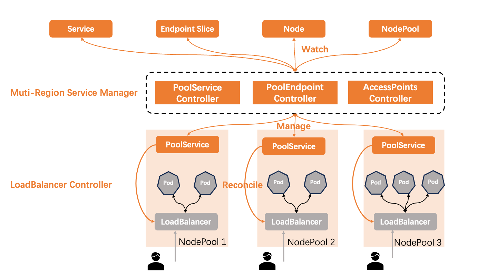

# Mutli-region loadbalancer control architecture

## Table of Contents
- [mutli-region loadbalancer control architecture](#mutli-region-loadbalancer-control-architecture)
  - [Table of Contents](#table-of-contents)
  - [Summary](#summary)
  - [Motivation](#motivation)
    - [Goals](#goals)
    - [Non-Goals/Future Work](#non-goalsfuture-work)
  - [Proposal](#proposal)
    - [Architecture](#architecture)
    - [Multi-Region Service Manager](#The first layer of control is the MultiRegion Service Manager)
    - [LoadBalancer Controller](#The second layer of control is the LoadBalancer Controller)
    - [PoolService](#the-definition-of-PoolService)
  - [User Stories](#user-stories)
    - [Story 1](#story-1)
    - [Story 2](#story-2)
    - [Implementation Details/Notes/Constraints](#implementation-detailsnotesconstraints)
  - [Implementation History](#implementation-history)

## Summary
OpenYurt is designed to incorporate multiple regional IDCs (Internet Data Centers) and devices under a Kubernetes cluster, delivering unified management and control services. A typical requirement in this setup is the exposure of business services across different regions.

The LoadBalancer type Service is a standardized resource within the cluster that facilitates service exposure. It creates a single service access point for users, distributing incoming traffic evenly across backend servers for optimal load balancing.

Nevertheless, in a distributed cloud environment, IDCs situated in various regions operate on distinct network planes. This separation presents a challenge: there is no single traffic entry point capable of routing and balancing the load to backend servers situated across these multiple regions. Consequently, there is a clear need for a multi-regional load balancing management solution that can adeptly handle such complex networking scenarios.

## Motivation
Provide a multi-regional LoadBalancer service exposure management solution, compatible with various load balancing implementations.

### Goals
Provide a multi-regional load balancing management architecture that decouples multi-regional service exposure into two layers. The first layer of control is responsible for multi-regional management, while the second layer of control handles load balancing management. Load balancing management can be custom-developed according to the load balancer type.

### Non-Goals/Future Work
- Do not provide an implementation of the load balancer controller.

## Proposal
### Architecture:
In this scheme, a two-layer control architecture is designed and a new CRD PoolService is defined to decouple multi-region management and load balancing management. The control flow is as follows



### The first layer of control is the MultiRegion Service Manager
The PoolService Controller is responsible for refreshing the full set of PoolServices corresponding to a Service.
- Watches cluster resources: Service.
- Adds a Finalizer to each Service, tying the lifecycle of the Service's Finalizer to that of the PoolService.
- Manages the lifecycle of a PoolService for each region by leveraging the above resources, dynamically adjusting actions like creation, updating, and deletion of PoolServices in certain regions based on the specific configuration of the Service:
  - Upon detecting the creation of a Service, it decides in which regions to create PoolServices based on node pool selectors defined in the Service's Annotations.
  - Upon detecting the deletion of a Service, it ensures that all related PoolServices are also deleted.
  - Monitor updates to Services and updates the PoolServices of certain node pools accordingly.
- Serializes the latest Service information and updates PoolService Annotations, refreshing PoolService.Spec.renewTime.

The PoolEndpoints Controller is tasked with refreshing only the backend and node pools corresponding to a PoolService.
- Watches cluster resources: EndpointSlice, Node, and NodePool.
- Manages the lifecycle of the region's PoolService through these resources:
  - Tracks the creation, updates, and deletions of Endpoints and Nodes to manage the PoolService within a specified region, covering its creation, updates, and deletions.
  - Monitors the creation, updates, and deletions of NodePools, managing the lifecycle of the region's PoolService accordingly.
- Serializes the latest Service information and updates the PoolService Annotations, refreshing PoolService.Spec.renewTime.

The AccessPoints Controller is responsible for writing back crucial information into the Service. Here's an English summary of its key tasks:
Watches cluster resources: PoolService/Status.
- Writes back the access endpoints of various regions into Service.Status.
- Records essential markers or tags in the Service's Labels or Annotations.

### The second layer of control is the LoadBalancer Controller

There are many types of load balancing implementations with different creation, configuration, and management schemes. Therefore, users can develop customized load balancing controllers based on different types of load balancer. The main control process is as follows:
- Watch cluster resource: PoolService
- If PoolService is created, create a load balancer based on the configuration and configure attributes, listener, and back-end service group for it.
- If PoolService is updated, update the load balancer based on the configuration, and configure its properties, listener, and back-end service group.
- If PoolService is deleted, the load balancing function is deleted.
- Update the load balancing access point to PoolService status.
- Update the required Condition and Event to PoolService.

### The definition of PoolService
```go
type PoolService struct {
	metav1.TypeMeta
	metav1.ObjectMeta
	Spec   *PoolServiceSpec
	Status *PoolServiceStatus
}

type PoolServiceSpec struct {
	NodepoolName      string
	RenewTime         *metav1.MicroTime
	LoadBalancerClass string
}

type PoolServiceStatus struct {
	LoadBalancer *v1.LoadBalancerStatus
	Conditions   []metav1.Condition
}
```

### User Stories

#### Story 1
As an end user, I want to expose my services to users outside the cluster using a load balancing Service on the edge.
#### Story 2
As an end user,  I want to deploy one type of service across multiple geographies and expose the service.

## Implementation History

- [ ] 02/27/2024: Draft proposal created
- [ ] 02/28/2024: Present proposal at the community meeting
- [ ] xx/xx/2024: Update proposal

