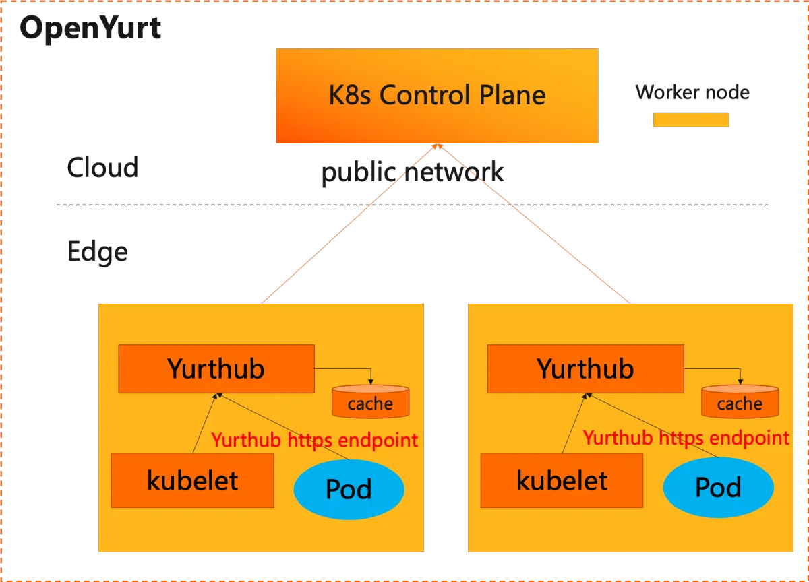

|                            title                            | authors     | reviewers | creation-date | last-updated | status      |
|:-----------------------------------------------------------:|-------------| --------- |---------------| ------------ | ----------- |
| Enhancing transparent management mechanism for control traffic from edge to cloud | @rambohe-ch |       | 2024-03-12    |    |  |

# Enhancing transparent management mechanism for control traffic from edge to cloud

## Summary
In the OpenYurt cluster environment, the current transparent management mechanism for cloud-edge control traffic has certain limitations and cannot effectively support direct requests to the default/kubernetes service. This article proposes a new transparent management mechanism for cloud-edge control traffic, aimed at enhancing the stability and versatility of the communication link to better meet the needs of cloud-edge collaboration.

## Motivation
In the cloud-edge computing architecture of OpenYurt, the cloud and edge are located on different physical networks. Control plane components like kube-apiserver run in the cloud, while worker nodes are deployed on-site in production environments, typically connecting to the cloud via the public internet. As a result, Pods on edge nodes cannot directly use InClusterConfig to access the kube-apiserver in the cloud. To address this issue and ensure that Pods can restart and resume business operations even when the network connection between the cloud and edge is disrupted, Pods need to utilize the capabilities of YurtHub to access locally cached data.Here is the detailed architectural outline:

The YurtHub component, through its masterservice filter feature, ingeniously rewrites the ClusterIP and port information obtained by the kubelet from the default/kubernetes service to the HTTPS endpoint listening address of YurtHub (defaulting to 169.254.2.1:10268). This alteration means that when kubelet creates a Pod, the KUBERNETES_SERVICE_HOST and KUBERNETES_SERVICE_PORT values injected into the container's environment variables will point to YurtHub's listening address. Consequently, edge Pods using InClusterConfig will transparently access the kube-apiserver via YurtHub, without being aware of any underlying network changes.

However, the current solution faces the following issue.

- It only facilitates pods that use InClusterConfig to access the kube-apiserver. But it fails to support pods that attempt to access the kube-apiserver directly via the default/kubernetes service ClusterIP and Port.

### Goals

- Enable Pods using InClusterConfig or the default/kubernetes service name to access the kube-apiserver via YurtHub without needing to be aware of the details of the public network connection between the cloud and edge.
- The default/kubernetes service environment variables injected into containers will remain unchanged.
- The existing transparent management mechanism and this new mechanism can coexist and work together.

### Non-Goals/Future Work

- The solution does not cover the details on how to enable the caching functionality of YurtHub.
- Pods that access the kube-apiserver through a public internet endpoint are not included in the scope of this proposal.

## Proposal

### Solution Introduction
To address the issues mentioned above, we have explored a non-invasive solution. When Pods attempt to access the kube-apiserver via the default/kubernetes service's ClusterIP and port, local iptables/ipvs rules perform destination network address translation (DNAT) to redirect the traffic to YurtHub's listening address instead of the actual address of the cloud-based kube-apiserver. The specific process is illustrated in the diagram below:

- A new built-in filter named `forwardkubesvctraffic` has been added to YurtHub, which intercepts kube-proxy's list/watch endpointslice requests and modifies the information in the `default/kubernetes` endpointslice to YurtHub's listening address. Consequently, regardless of a Pod accesses the kube-apiserver using the default/kubernetes service, its traffic will be DNATed to YurtHub via iptables/ipvs.

- Since kube-proxy by default accesses the kube-apiserver directly through the kubeconfig file and not via YurtHub, YurtHub is unable to intercept kube-proxy's list/watch endpointslice requests. To address this issue, we adjusted the `inclusterconfig` filter within YurtHub (which originally intercepted kubelet's list/watch configmap requests). Instead of modifying the `kube-system/kube-proxy` configmap, we now change the server address in the kubeconfig to YurtHub's listening address, ensuring that kube-proxy accesses the kube-apiserver via YurtHub.

- Under the default settings, Pods using InClusterConfig will access the kube-apiserver through updated environment variables (pointing to YurtHub's listening address), instead of the native method via the default/kubernetes service's ClusterIP and port. This design ensures that even on nodes without kube-proxy installed, these Pods can still maintain smooth communication with the kube-apiserver via YurtHub.

- If users ensure that kube-proxy is already deployed on the node, they can disable the automatic modification of environment variables by setting the YurtHub startup parameter `--disable-resource-filters=masterservice`, thereby unifying the transparent management mechanism for control traffic. This means that Pods configured with InClusterConfig, as well as those accessing the kube-apiserver through the default/kubernetes service, will be able to connect seamlessly to the kube-apiserver via YurtHub using the iptables/ipvs DNAT rules configured by kube-proxy.

### User Stories

1. Within the OpenYurt cluster, we expect Pods that access the kube-apiserver via InClusterConfig to run directly without any modifications and to operate without needing to be aware of any network differences between the cloud and the edge.
2. Similarly, within the OpenYurt cluster, we expect Pods that access the kube-apiserver via the default/kubernetes service to be able to run directly without any modifications, oblivious to any potential network differences between the cloud and the edge.

## Implementation History

- [ ] 03/12/2024: Draft proposal created;
