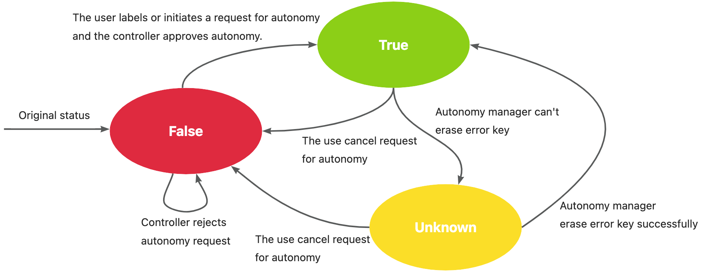

|           title           | authors                                | reviewers   | creation-date | last-updated | status |
|:-------------------------:|----------------------------------------|-------------|---------------|--------------|--------|
| Edge-autonomy-enhancement | @vie-serendipity @rambohe-ch @JameKeal | @rambohe-ch | 2024-03-26    | 2024-04-07   |        |
# Edge-autonomy-enhancement
## Table of Contents
<!-- TOC -->
* [Edge-autonomy-enhancement](#edge-autonomy-enhancement)
  * [Table of Contents](#table-of-contents)
  * [Summary](#summary)
  * [Motivation](#motivation)
    * [Goals](#goals)
    * [Non-Goals/Future Work](#non-goalsfuture-work)
  * [Proposal](#proposal)
    * [Implementation Details/Notes/Constraints](#implementation-detailsnotesconstraints)
      * [Error key](#error-key)
      * [Erase error key on each request](#erase-error-key-on-each-request)
      * [Autonomy manager](#autonomy-manager)
    * [Controller](#controller)
  * [Implementation History](#implementation-history)
<!-- TOC -->
## Summary
This proposal aims to enhance autonomy ability of yurthub. Based on [improve yurthub cache](https://github.com/openyurtio/openyurt/blob/224082855310f4a60d74301d935d1c316340a72b/docs/proposals/20230715-improve-yurthub-cache.md),
which will optimize the cache mechanism, this proposal will asynchronously enable node autonomy and incorporate a new module for
status report.
## Motivation
Currently, users can enable autonomy for a node by annotating "node.beta.openyurt.io/autonomy". With this annotation, the control plane does not evict the pods on the node.
but the node itself is not directly aware of the annotation, 
which means that the node will only start interacting with the local data when it is disconnected from the network and actually turn on the autonomy. 
Therefore, the current control plane does not validate the autonomy status of nodes and does not report any problems on the node's side. 
This is not consistent with real-world scenarios. For example, deploying new pods may cause a disk cache write to fail, 
which in turn affects the autonomy state of the node.
### Goals
- Asynchronously enable node autonomy
- Add a new module for status report
- Enhance the ability of cache
### Non-Goals/Future Work
## Proposal
The annotation operation of the user and the approval operation of the control plane should be asynchronous.
So it is necessary to add a new controller in control plane to approve or reject the annotation operation of users.
The node side have to report its own status to the condition so that controller can list&watch nodes to get real status of nodes.
### Implementation Details/Notes/Constraints
#### Error key
The hub proxies the local request and connects to api server, then writes all the objects responded to the node to disk.
It is logical to save all the keys that failed to be written, saves them in the error key, the error key is stored in memory as a hash, and then persists to disk.
Notably it is very important to record fail reasons of error key so that they can be reported in the node condition.
#### Erase error key on each request
Every time get&lis&... check if there is any in the error key, write it if there is, and remove it from the error key when it succeeds.
#### Autonomy manager
Incorporate a new module mainly responsible for updating node autonomy status and re-fetching objects according to error key.
- Every fixed period of time, retrieve the content of the object from the api server according to the error key, and then brush off the corresponding error key.
- Check the error key periodically, if the error key is not empty for three consecutive times, set the node condition AutonomyState to Unknown. 

Unknown state: at the moment of user annotation, the node is successfully autonomous, and then due to disk write burst and other reasons, the node's autonomy state is affected, so it is changed to Unknown.
`const AutonomyState v1.NodeConditionType = "AutonomyState"`
### Controller
The user annotates the node to request for node autonomy, and the controller goes to the list&watch edge node and labels the node with `node.autonomy.openyurt.io/status=true/false` based on the condition of the node AutonomyState, 
thus indicating that the control plane approves or denies node autonomy request.
- node's condition state change(finite state machine)

## Implementation History
- [ ] 04/11/2024: Draft proposal created
- [ ] 04/17/2023: Present proposal at the community meeting
