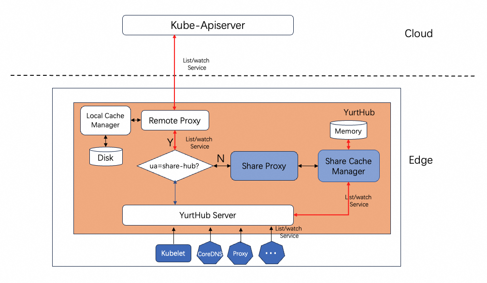

# Node-level Traffic Reuse Capability

|              title              | authors       | reviewers | creation-date | last-updated | status |
| :-----------------------------: |---------------| --------- |---------------| ------------ | ------ |
| Separate yurt-manager clients | @zyjhtangtang |   @rambohe-ch        | 2024-05-29    |              |        |

---


<!-- TOC -->
* [Node-level Traffic Reuse Capability](#Node-level Traffic Reuse Capability)
  * [Summary](#summary)
  * [Motivation](#motivation)
    * [Goals](#goals)
    * [Non-Goals/Future Work](#non-goals)
  * [Proposal](#proposal)
  * [User Stories](#user-stories)
<!-- TOC -->

## Summary

&nbsp;&nbsp;In an OpenYurt cluster, control components are deployed in the cloud, and edge nodes usually interact with the cloud through the public internet, which can lead to significant consumption of cloud-edge traffic. This problem is more pronounced in large-scale clusters, mainly due to the edge-side components performing full-scale list/watch operations on resources. This not only consumes a large amount of cloud-edge traffic but also places considerable pressure on the apiserver due to the high volume of list operations. This proposal presents a solution to optimize this issue.


## Motivation
&nbsp;&nbsp;As illustrated, within an OpenYurt cluster, components such as kubelet, flannel, kube-proxy, coredns, etc., are deployed on each node. YurtHub on the node proxies the component's requests to the apiserver, handling each component's requests independently, which means for every component's list/watch connection, YurtHub maintains a corresponding list/watch connection. When multiple components list/watch the same resource, it leads to data redundancy.


&nbsp;&nbsp;Taking the system components kubelet, coredns, and kubeproxy in OpenYurt as examples, assuming the current scale of the cluster is: 1000 nodes, 10,000 services (each service 0.5KB), and 10,000 endpointslices (each endpointslice 2KB). The traffic generated by these three components for requesting services and endpointslices would be as follows:

- Service traffic: `1000 nodes * 3 components * 10,000 services * 0.5KB/service = 15GB`
- Endpointslice traffic: `1000 nodes * 2 components * 10,000 endpointslices * 2KB/endpointslice = 40GB`
### Goals

&nbsp;&nbsp;The optimization described involves reducing the traffic from each node's components to the apiserver. By consolidating the traffic from kubelet, coredns, and proxy, the new service and endpointslice traffic would be:

- Service traffic reduced to: `1000 nodes * 1 consolidated request * 10,000 services * 0.5KB/service = 5GB`
- Endpointslice traffic reduced to: `1000 nodes * 1 consolidated request * 10,000 endpointslices * 2KB/endpointslice = 20GB`

### Non-Goals/Future Work

- The optimization only involves the reuse of requests on a single node and does not pertain to traffic optimization at the node pool level;
- The optimization only pertains to list/watch requests for resources and does not involve other requests.

## Proposal

&nbsp;&nbsp; To reduce the cloud-edge traffic on individual nodes, we propose incorporating a resource caching module within YurtHub. This module, tailored to specific shared resources, proactively fetches and caches data of those resources from the `apiserver`. Concurrently, an additional shared proxy functionality should be implemented, with this shared proxy retrieving data from the shared cache module and providing list/watch services for the shared resources. Upon receiving list/watch requests for shared resources, YurtHub will forward these requests to the shared proxy for handling. This approach enables multiple clients requesting the same resource to obtain data from YurtHub's shared cache, eliminating the need to query the `apiserver`, thereby achieving resource data reuse and reducing cloud-edge request traffic. Moreover, YurtHub can offer configuration parameters to support customization of resources to be shared and provide a metrics querying interface within YurtHub to retrieve status information about shared requests.

&nbsp;&nbsp; The diagram below illustrates the request forwarding process among various modules after enabling sharing for the 'services' resource. Red lines depict the data path where the shared cache module requests the apiserver to build the shared cache for services, while black lines represent the data path for client requests to YurtHub for list/watch the 'services' resource.


&nbsp;&nbsp; The implementation of the shared resource cache module should refer to the caching mechanism in the API server，the can be found in the Kubernetes GitHub repository within the k8s.io/apiserver package, specifically in the storage interfaces section.

```
// Interface offers a common interface for object marshaling/unmarshaling operations and
// hides all the storage-related operations behind it.
type Interface interface {

	// Create adds a new object at a key unless it already exists. 'ttl' is time-to-live
	// in seconds (0 means forever). If no error is returned and out is not nil, out will be
	// set to the read value from database.

	Watch(ctx context.Context, key string, opts ListOptions) (watch.Interface, error)


	// GetList unmarshalls objects found at key into a *List api object (an object
	// that satisfies runtime.IsList definition).
	// If 'opts.Recursive' is false, 'key' is used as an exact match. If `opts.Recursive'
	// is true, 'key' is used as a prefix.
	// The returned contents may be delayed, but it is guaranteed that they will
	// match 'opts.ResourceVersion' according 'opts.ResourceVersionMatch'.
	GetList(ctx context.Context, key string, opts ListOptions, listObj runtime.Object) error
}
```

### User Stories
- In AI and big data scenarios, where there's often a need to dynamically create a large number of services and pods, the intent to reduce cloud-edge traffic costs due to frequent changes in services and pods is understandable.
- In large-scale clusters, there is a desire to alleviate the pressure on the apiserver and to increase the number of edge nodes that a single cluster can manage effectively.


## Implementation History

- [ ] 05/29/2024: Proposed idea in an issue or [community meeting]
- [ ] 08/27/2024: Update the design

