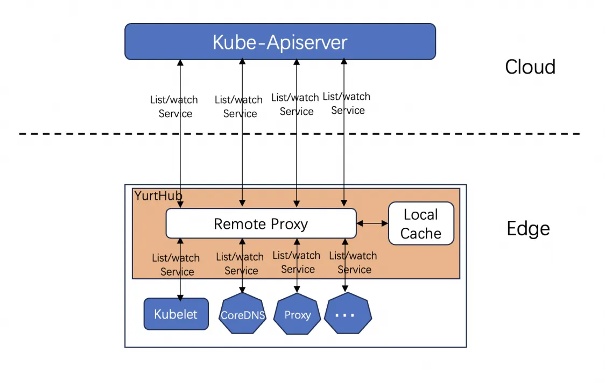
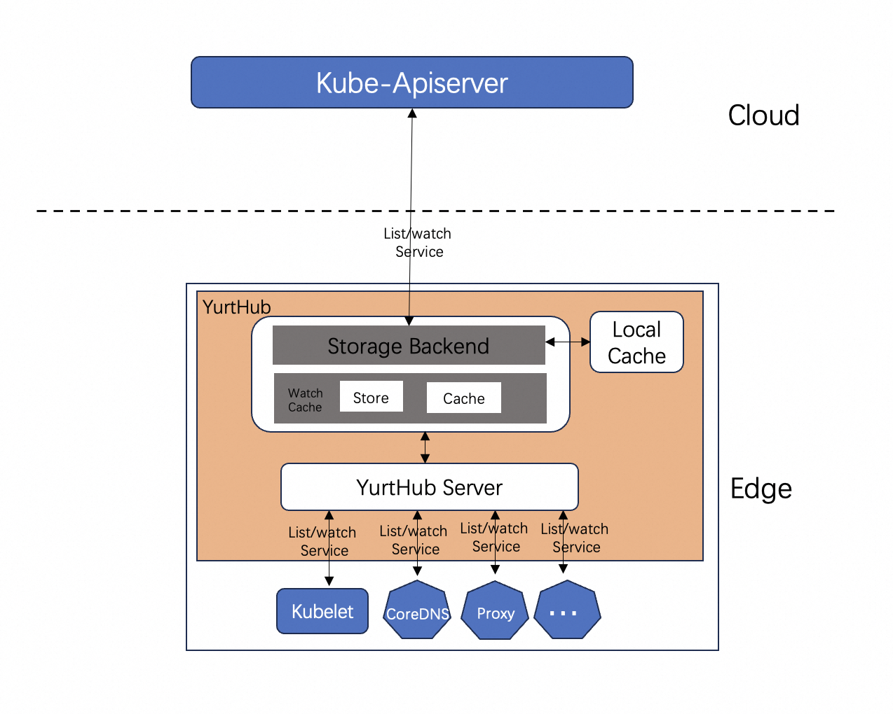

# Node-level Traffic Reuse Capability

|              title              | authors       | reviewers | creation-date | last-updated | status |
| :-----------------------------: |---------------| --------- |---------------| ------------ | ------ |
| Separate yurt-manager clients | @zyjhtangtang |   @rambohe-ch        | 2024-05-29    |              |        |

---


<!-- TOC -->
* [Node-level Traffic Reuse Capability](#Node-level Traffic Reuse Capability)
  * [Summary](#summary)
  * [Motivation](#motivation)
    * [Goals](#goals)
    * [Non-Goals/Future Work](#non-goals)
  * [Proposal](#proposal)
  * [User Stories](#user-stories)
<!-- TOC -->

## Summary

&nbsp;&nbsp;In an OpenYurt cluster, control components are deployed in the cloud, and edge nodes usually interact with the cloud through the public internet, which can lead to significant consumption of cloud-edge traffic. This problem is more pronounced in large-scale clusters, mainly due to the edge-side components performing full-scale list/watch operations on resources. This not only consumes a large amount of cloud-edge traffic but also places considerable pressure on the apiserver due to the high volume of list operations. This proposal presents a solution to optimize this issue.


## Motivation
&nbsp;&nbsp;As illustrated, within an OpenYurt cluster, components such as kubelet, flannel, kube-proxy, coredns, etc., are deployed on each node. YurtHub on the node proxies the component's requests to the apiserver, handling each component's requests independently, which means for every component's list/watch connection, YurtHub maintains a corresponding list/watch connection. When multiple components list/watch the same resource, it leads to data redundancy.


&nbsp;&nbsp;Taking the system components kubelet, coredns, and kubeproxy in OpenYurt as examples, assuming the current scale of the cluster is: 1000 nodes, 10,000 services (each service 0.5KB), and 10,000 endpointslices (each endpointslice 2KB). The traffic generated by these three components for requesting services and endpointslices would be as follows:

- Service traffic: `1000 nodes * 3 components * 10,000 services * 0.5KB/service = 15GB`
- Endpointslice traffic: `1000 nodes * 2 components * 10,000 endpointslices * 2KB/endpointslice = 40GB`
### Goals

&nbsp;&nbsp;The optimization described involves reducing the traffic from each node's components to the apiserver. By consolidating the traffic from kubelet, coredns, and proxy, the new service and endpointslice traffic would be:

- Service traffic reduced to: `1000 nodes * 1 consolidated request * 10,000 services * 0.5KB/service = 5GB`
- Endpointslice traffic reduced to: `1000 nodes * 1 consolidated request * 10,000 endpointslices * 2KB/endpointslice = 20GB`

### Non-Goals/Future Work

- The optimization only involves the reuse of requests on a single node and does not pertain to traffic optimization at the node pool level;
- The optimization only pertains to full-scale list/watch requests for resources and does not involve requests with filtering conditions.

## Proposal

&nbsp;&nbsp;To reduce the cloud-edge traffic on a single node, we recommend consolidating the full List/Watch requests for the same resource so that all components can reuse the data from this single request. The main idea is to add a full-list resource caching module within YurtHub, modeled after the cache implementation of the ApiServer. Within this module, using the apiserver as the Storage Backend, the Storage Backend actively initiates list/watch requests to the apiserver, and caches the content of the requests in the WatchCache. Consequently, the full list/watch requests for resources from the components on the node are directly served by the WatchCache.



&nbsp;&nbsp;When using the apiserver as a Storage Backend, the main reference can be found in the Kubernetes GitHub repository within the k8s.io/apiserver package, specifically in the storage interfaces section.

```
// Interface offers a common interface for object marshaling/unmarshaling operations and
// hides all the storage-related operations behind it.
type Interface interface {
    // Returns Versioner associated with this interface.
    Versioner() Versioner

	// Create adds a new object at a key unless it already exists. 'ttl' is time-to-live
	// in seconds (0 means forever). If no error is returned and out is not nil, out will be
	// set to the read value from database.

	Watch(ctx context.Context, key string, opts ListOptions) (watch.Interface, error)

	// Get unmarshals object found at key into objPtr. On a not found error, will either
	// return a zero object of the requested type, or an error, depending on 'opts.ignoreNotFound'.
	// Treats empty responses and nil response nodes exactly like a not found error.
	// The returned contents may be delayed, but it is guaranteed that they will
	// match 'opts.ResourceVersion' according 'opts.ResourceVersionMatch'.
	Get(ctx context.Context, key string, opts GetOptions, objPtr runtime.Object) error

	// GetList unmarshalls objects found at key into a *List api object (an object
	// that satisfies runtime.IsList definition).
	// If 'opts.Recursive' is false, 'key' is used as an exact match. If `opts.Recursive'
	// is true, 'key' is used as a prefix.
	// The returned contents may be delayed, but it is guaranteed that they will
	// match 'opts.ResourceVersion' according 'opts.ResourceVersionMatch'.
	GetList(ctx context.Context, key string, opts ListOptions, listObj runtime.Object) error

	// RequestWatchProgress requests the a watch stream progress status be sent in the
	// watch response stream as soon as possible.
	// Used for monitor watch progress even if watching resources with no changes.
	//
	// If watch is lagging, progress status might:
	// * be pointing to stale resource version. Use etcd KV request to get linearizable resource version.
	// * not be delivered at all. It's recommended to poll request progress periodically.
	//
	// Note: Only watches with matching context grpc metadata will be notified.
	// https://github.com/kubernetes/kubernetes/blob/9325a57125e8502941d1b0c7379c4bb80a678d5c/vendor/go.etcd.io/etcd/client/v3/watch.go#L1037-L1042
	//
	// TODO: Remove when storage.Interface will be separate from etc3.store.
	// Deprecated: Added temporarily to simplify exposing RequestProgress for watch cache.
	RequestWatchProgress(ctx context.Context) error
}
```

&nbsp;&nbsp;The Watch Cache is an in-memory cache that stores watch events and allows quick access to the current state of a resource, combined with a stream of watch events. [reference](https://github.com/kubernetes/kubernetes/blob/master/staging/src/k8s.io/apiserver/pkg/storage/cacher/watch_cache.go#L140)

### User Stories
- In AI and big data scenarios, where there's often a need to dynamically create a large number of services and pods, the intent to reduce cloud-edge traffic costs due to frequent changes in services and pods is understandable.
- In large-scale clusters, there is a desire to alleviate the pressure on the apiserver and to increase the number of edge nodes that a single cluster can manage effectively.


## Implementation History

- [ ] 05/29/2024: Proposed idea in an issue or [community meeting]

