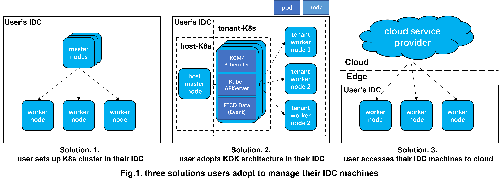
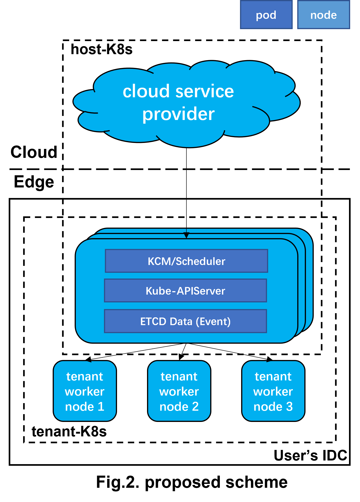
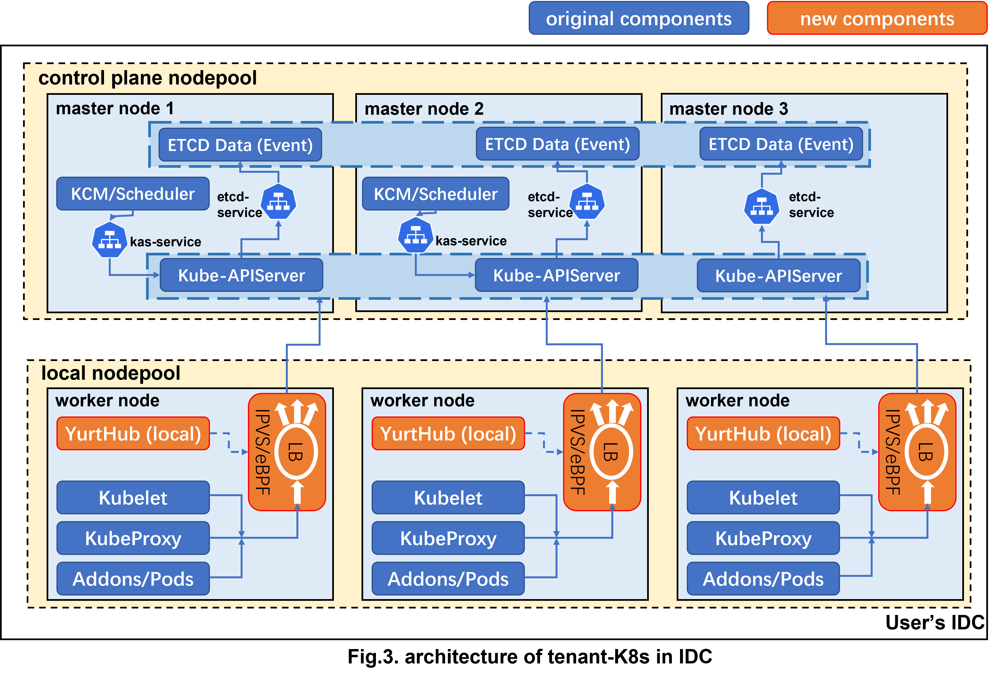
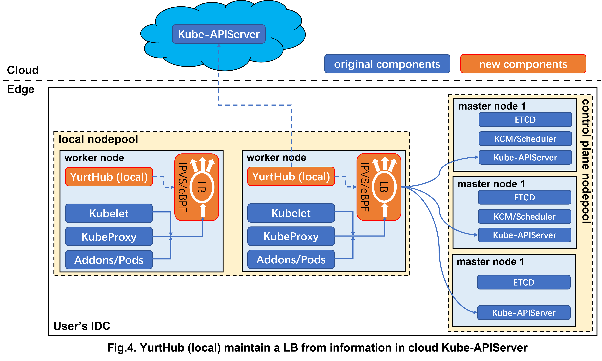

# Enhance operational efficiency of K8s cluster in user's IDC

## Table of Contents

- [Enhance operational efficiency of K8s cluster in user's IDC](#enhance-operational-efficiency-of-K8s-cluster-in-user's-IDC)
  - [Table of Contents](#table-of-contents)
  - [Glossary](#glossary)
  - [Summary](#summary)
  - [Motivation](#motivation)
    - [Goals](#goals)
    - [Non-Goals/Future Work](#non-goalsfuture-work)
  - [Proposal](#proposal)
    - [Overview](#overview)
    - [Architecture](#architecture)
    - [User stories](#user-stories)
      - [Comparison](#comparison)

## Glossary

Refer to the [OpenYurt Glossary](https://github.com/openyurtio/openyurt/blob/master/docs/proposals/00_openyurt-glossary.md)

## Summary

It is difficult for users to operate, manage and upgrade the K8s cluster in their own IDC (Internet Data Center). The proposal aims to enhance the operational efficiency of K8s cluster in user's IDC by adopting KOK (Kubernetes-On-Kubernetes) architecture, where there are host-K8s and tenant-K8s. Host-K8s is located at cloud, provided by cloud service providers and can manage control plane of tenant-K8s in IDC.

## Motivation

For K8s clutesrs in user's IDC, it is difficult to operate, manage and upgrade the control plane components. Users typically adopt the following three solutions to manage K8s clusters in their IDC. 

- Some users only set up a single K8s cluster in IDC for tenant. In this case, when K8s have version upgrades and changes, about three major releases per year, users will suffer from complex operations to upgrade those components. Meanwhile, there is no resource elasticity capability in K8s clutesrs in user's IDC, such as scaling control plane components, which is a costly operation for user.

- Some users adopt the KOK architecture in their own IDC to manages tenant-K8s's control plane components. Both host-K8s and tenant-K8s are in user's IDC. In this case, operating and updating control plane components of tenant-K8s will be easy, however, it is still hard to operate and upgrade the control plane components in host-K8s.

- More and more users only access their IDC machines to cloud service providers as worker nodes, utilizing the abilities of cloud-edge collaboration provided by OpenYurt. But there are some users needs continuous deployment for offline tasks, depending on strong stability of cloud-edge communication, in this case, they tend to maintain a K8s cluster in their IDC.

We conclude above three solutions in Fig.1. The first and the second solution both face the challenge of operating and upgrading the control plane components, the difference is that the former is difficult to manage the control plane of K8s cluster in IDC, while the latter is difficult to manage the control plane of host-K8s. The third solution is the most popular, users adopt the abilities of cloud-edge collaboration afforded by OpenYurt, easily achieve large-scale application operation, and management on massive edge resources, however, some users prefer to maintain a K8s in their IDC for their needs.

This proposal solves the pain points mentioned above, which automates the operation and maintenance of control plane components of tenant-K8s to replace manual user operations, and affords users who needs continuous deployment for offline tasks a efficient operation scheme to manage their IDC K8s cluster.
### Goals

- Reduce the complexity of management and operation, and improve operational efficiency for users.

- Optimize the architecture of the IDC K8s cluster to enhance stability, reliability and security.
  1. KCM (kube-controller-manager) and Scheduler are deployed as `deployment`, ETCD is deployed as `statefulset`. KubeAPIServer is deployed as `daemonset` on worker nodes of host-K8s, once a new machine are accessed to host-K8s, KubeAPIServer will be autoscaling.
  2. KCM and Scheduler access KubeAPIServer by the service of KubeAPIServer, KubeAPIServer access ETCD by the service of ETCD. All the service are support in host-K8s, so there is no need to introduce CoreDNS.
  3. Worker nodes of tenant-K8s implement load balancing access to KubeAPIServer, dynamically sensing the changes of KubeAPIServer, so there is no need to introduce loadbalancer in front of KubeAPIServer.
  4. Business `pod` and control plane components are naturally separated by deploying control plane components in form of `pod` in host-K8s, which affords higher security for users.

### Non-Goals/Future Work

- The proposal is not intended to replace the cloud-edge architecture of OpenYurt, it affords a new scheme for users who needs continuous deployment for offline tasks.

- In future, we plan to afford the admin node for users to use tools like kubectl to access and operate tenant-K8s.

## Proposal

### Overview

This proposal provides a new scheme based on KOK architecture shown as Fig.2, where host-K8s is located at cloud and tenant-K8s is located at user's IDC. In this scheme, OpenYurt affords the abilities of cloud-edge collaboration in host-K8s and we develop new abilities in tenant-K8s to enhance operational efficiency for users. Users can adopt proposed scheme in following steps:
1. Create host-K8s in cloud service provider, utilizing the abilities of cloud service provider and cloud-edge collaboration of OpenYurt.
2. Access three machines in user's IDC to host-K8s as worker nodes.
3. Deploy control plane components of tenant-K8s on worker nodes of host-K8s. All components are deployed in form of `pod` and in `HostNetwork` mode.
4. Access the remaining machines in user's IDC to tenant-K8s, as worker nodes of tenant-K8s.

### Architecture

We demonstrate the design of tenant-K8s in Fig.3.

In tenant-K8s, the designed details are as follows:
- In control plane nodepool, we will afford users the template of control plane components:
  1. KCM and Scheduler are deployed as `deployment`, which both have two replicas. KCM and Scheduler access KubeAPIServer by it's service.
  2. KubeAPIServer is deployed as `daemonset`. KubeAPIServer access ETCD by service of ETCD.
  3. There are two type of ETCD: data and event, which are both deployed as `statefulset`.

- In local nodepool:
  1. We add a new `local` mode in YurtHub. In `local` mode, YurtHub will maintain a loadbalance rule, allowing components like Kubelet to load balancing access to the KubeAPIServer.
  2. yurtadm join affords users to access nodes in their own IDCs to tenant-K8s in `local` mode.

`local` mode YurtHub gets pod's ip in host-K8s's apiserver, and maintains the loadbalance rule to afford load balancing access to APIServer-pods, which is shown in Fig.4.

### User stories

#### Comparison
We compare above mentioned solutions and proposed scheme, shown in the table:
|  | Solution1 | Solution2 | Solution3 | Proposed |
| --- | --- | --- | --- | --- |
| Architecture |  |  |  |  |
| Operational Efficiency | poor | moderate | good | good |
| Security | poor | poor | good | good |
| Support Multi-tenant | poor | moderate | poor | moderate |
| Installation Difficulty | poor | poor | good | moderate |

We can conclude that both solution 3 and our proposed scheme are suitable for users. Besides, our proposed scheme also meet the needs of users who want to maintain a K8s cluster in their IDC because they deploy continuous deployment for offline tasks and depend on strong stability of cloud-edge communication.

- Users want:
  1. Automatic update and management for control plane components of K8s, instead of cumbersome manual user operation and maintenance.
  2. Convenient resource elasticity capability in their IDC's K8s cluster.
  3. Deploying continuous deployment for offline tasks, which depend on strong stability of cloud-edge communication, so they prefer to maintain a K8s cluster in their IDC.
  4. Security. Business pod and control plane components can be separated.
  5. Multi-tenant edge computing resource isolation in IDC.

Given the advantages outlined above, we recommend these users to adopt the proposed scheme to efficiently manage their K8s cluster in IDC.