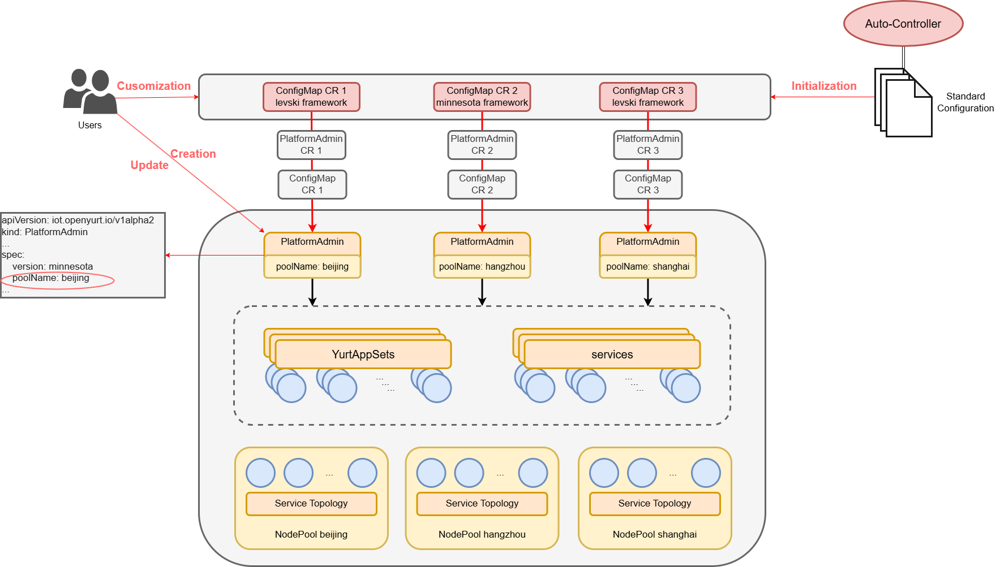
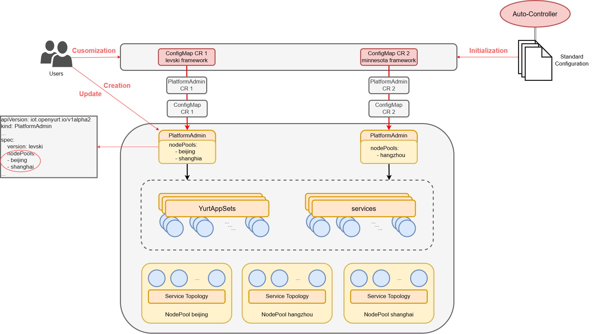
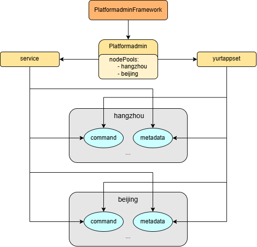

|                        title                         | authors           | reviewers    | creation-date | last-updated | status |
| :--------------------------------------------------: | ----------------- | ------------ | ------------- | ------------ | ------ |
| Build-iot-system-configuration-isolation-on-nodepool | @WoShiZhangmingyu | @LavenderQAQ | 2024-08-19    | 2024-09-16   |        |

# Build-iot-system-configuration-isolation-on-nodepool

## Table of Contents

- [Build-iot-system-configuration-isolation-on-nodepool](#build-iot-system-configuration-isolation-on-nodepool)
  - [Table of Contents](#table-of-contents)
  - [Summary](#summary)
  - [Motivation](#motivation)
    - [Goals](#goals)
  - [Proposal](#proposal)
    - [User Stories](#user-stories)
    - [Implementation Details](#implementation-details)
    - [Test Plan](#test-plan)
  - [Implementation History](#implementation-history)

## Summary

Openyurt gave users the ability to customize iot systems, but it's currently not isolated enough for nodepool.
This proposal aims to provide multiple PlatformAdmin deployments within the same namespace, and to allow users the ability to customize the configuration of a nodepool.

## Motivation

Suppose now you need to expand several nodepools with the same configuration, the current plan is to create several new Platformadmins with the same configuration.Obviously, the operability and reusability of this solution is poor.
One potential enhancement involves modifying the mapping between Platformadmin and nodepools to a one-to-many relationship, that is, changing the poolName in PlatformadminSpec to pools to correspond to multiple nodepools.
In this proposal, users can deploy multiple node pools with the same configuration by creating a single PlatformAdmin.

### Goals

- Provide multiple PlatformAdmin deployments within the same namespace

- Allow users the ability to customize the configuration of a nodepool

- Add unit test for platform\_ admin_controller and modify corresponding e2e test

## Proposal

### User Stories

- As a user,I wanted to customize configurations based on the nodepool dimension, thereby achieving the reuse of both custom configurations and Platformadmin.

### Implementation Details

PlatformAdmin has evolved from the previous version of the EdgeX CRD and serves as an abstraction for the edge device management platform. Users simply input the platform settings, the name of the NodePool to be deployed, the version to be deployed, and so on, to deploy a complete edge device management platform within the node pool.

The platformadmin-controller, integrated within yurt-manager, is responsible for parsing the PlatformAdmin CR into the corresponding configmap, service, and yurtappset, thereby realizing the deployment of the edge device management platform.

Users have the capability to customize a PlatformAdminFramework that is initialized with a standard configuration, followed by the creation of a PlatformAdmin. After this step, the platformadmin-controller will automatically initiate the reconciliation process to handle services and YurtAppSets.

However, a notable drawback of this process is that, even when multiple nodepools share identical configurations, it necessitates the creation of multiple PlatformAdmins. This redundancy can lead to unnecessary administrative overhead and complexity.



- Old Platformadmin Setup(A Platformadmin is responsible for reconciling a nodepool)


In scenarios where expansion of a nodepool with identical configuration is required, the current approach involves creating a new Platformadmin with the same configuration. This method, however, lacks operational efficiency and reusability.

A potential enhancement would be to modify the relationship between Platformadmin and nodepools from one-to-one to one-to-many. Specifically, altering the "poolName" in PlatformadminSpec to "nodePools" would allow a single Platformadmin to correspond to multiple nodepools and modify the corresponding processing logic.

Therefore, we need to modify the design of PlatformAdmin to allow a single PlatformAdmin to manage multiple nodepools with identical configurations. In the future, when faced with similar situations, we can adopt a configuration scheme as depicted in the following diagram.



- New Platformadmin Setup(One Platformadmin is responsible for reconciling multiple nodepools)



OpenYurt extends the concept of nodepools on top of k8s, so an ideal deployment is that users can configure each nodepool iot system independently. With [#1435](https://github.com/openyurtio/openyurt/issues/1435) we can manipulate yurtappset to configure each nodepool individually. And service topology allows us to separate the traffic from each nodepool. With these two capabilities we can take a step closer to idealizing the current deployment model.

#### Modify CRD

Platformadmin needs to provide deployment for multiple nodepools, so the original **poolName** has been changed to the **nodePools** , as follows:

```
nodepools:
    items:
        type: string
    type: array
```

A simple example:

```
apiVersion: iot.openyurt.io/v1beta1
kind: PlatformAdmin
metadata:
    name: edgex-sample
spec:
    version: minnesota
    nodePools:
    - hangzhou
    - beijing
EOF
```

#### Modify PlatformAdminSpec

Also change PoolName to NodePools:

```
type PlatformAdminSpec struct {
	Version string `json:"version,omitempty"`

	ImageRegistry string `json:"imageRegistry,omitempty"`

	NodePools []string `json:"nodepools,omitempty"`

	ServiceType corev1.ServiceType `json:"serviceType,omitempty"`
	// +optional
	AdditionalService []ServiceTemplateSpec `json:"additionalServices,omitempty"`

	// +optional
	AdditionalDeployment []DeploymentTemplateSpec `json:"additionalDeployments,omitempty"`
}
```

#### Modify Platformadmin

In the update regarding IoT API, we have decided to remove support for version v1alpha1, while retaining support for version v1alpha2. Furthermore, we have added version v1beta1. In version v1beta1, we made modifications to the spec field of the platformadmin resource, renaming the poolName field to nodePools and changing its data type from a single string to [] string. This change aims to support more complex deployment scenarios, allowing users to configure and manage multiple node pools simultaneously, thereby significantly improving deployment scalability.

Enhance the Reconcile logic of the platformadminController to accommodate multiple nodepools, thereby enabling more refined resource management and scheduling.
for example:

```
for _, nodePool := range platformAdmin.Spec.NodePools {
    	exists := false
	for _, pool := range yas.Spec.Pools {
		if pool == nodePool {
			exists = true
			break
		}
	}
	if !exists {
		yas.Spec.Pools = append(yas.Spec.Pools, nodePool)
	}
}
yas.Spec.Workload.WorkloadTweaks = []appsv1beta1.WorkloadTweak{
	{
		Pools: yas.Spec.Pools,
		Tweaks: appsv1beta1.Tweaks{
			Replicas: pointer.Int32(1),
		},
	},
}
```

### Test Plan

#### Unit Test

Create platformadmin_comtroler_test.go as a unit test file to verify if the corresponding service and yurtappset have been generated correctly.

#### E2E Test

Perform E2E testing only after ensuring that the unit test passes. Add test cases specifically to test configurations, such as verifying concurrent processing of multiple PlatformAdmin instances. Test in the local k8s environment simulated by kind to ensure that all parts of the system can work together

## Implementation History

- [ ] 8/19/2024: Draft proposal created
- [ ] 8/26/2024: Update proposal
- [ ] 9/16/2024: Updated the version and version description of IoT API
