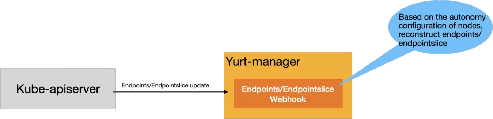

# Enhancing Edge Autonomy In OpenYurt

|          title          | authors     | reviewers | creation-date | last-updated | status |
|:-----------------------:|-------------| --------- |---------------| ------------ | ------ |
| Enhancing Edge Autonomy | @rambohe-ch |           | 2024-09-29    |              |        |

<!-- TOC -->
* [Separate yurt-manager clients](#Separate-yurt-manager-clients)
    * [Summary](#summary)
    * [Motivation](#motivation)
        * [Goals](#goals)
        * [Non-Goals/Future Work](#non-goals)
    * [Proposal](#proposal)
    * [Implementation History](#implementation-history)
<!-- TOC -->

## Summary

OpenYurt already offers robust edge autonomy capabilities, ensuring that applications on edge nodes can continue to operate even when the cloud-edge network is disconnected. However, there are several areas where the current edge autonomy capabilities can still be improved. For instance, once nodes are annotated with autonomy annotations, the cloud controller does not automatically evict Pods, regardless of whether the disconnection is due to cloud-edge network issues or node failures, yet users expect automatic Pod eviction during node failures. Additionally, the current edge autonomy capabilities cannot be directly used in managed Kubernetes environments because users cannot disable the NodeLifeCycle controller within the Kube-Controller-Manager component of managed Kubernetes. This proposal aims to address these issues and continuously enhance edge autonomy capabilities.

## Motivation

OpenYurt primarily addresses challenges in cloud-edge collaboration scenarios, with edge autonomy being one of the fundamental capabilities. The ideal edge autonomy capability should meet the following requirements:
1. In cases of cloud-edge network disconnection, if a node restarts, it should be able to quickly resume operations on that node, enabling independent operation of the edge nodes.
2. If a cloud-edge network disconnection causes node heartbeats to be lost, the system should not evict Pods on that node to avoid unnecessary Pod evictions due to temporary network issues.
3. If node failures result in lost heartbeats, the system should automatically evict Pods on that node to ensure ongoing service availability. Currently, the system cannot perform this automatically, requiring users to manually delete Pods.
4. If all nodes within a region lose their heartbeats, all Pods in that region should remain unchanged, as there are no resources available to run new Pods.

Moreover, we aim to implement these capabilities in a non-intrusive manner, even allowing the functionality to operate in managed Kubernetes environments without needing any adjustments to native Kubernetes components, such as shutting down the NodeLifeCycle controller in the Kube-Controller-Manager component.

### Goals

This proposal aims to enhance the following capabilities:
1. When a node fails to report its heartbeat due to its own faults, the system should automatically evict the Pods on that node to ensure continuous service availability.
2. Enable the autonomy capabilities to function in managed Kubernetes environments without the need to shut down the NodeLifeCycle controller in the Kube-Controller-Manager component.
3. When data caching on an edge node encounters failures, the system should notify users via events.

### Non-Goals/Future Work

1. When all nodes within a region fail to report their heartbeats, regardless of the cause, all Pods in that region should remain unchanged.
2. Support modifications to the configurations of Pods on nodes (such as resources) during cloud-edge network disconnections, ensuring that once the cloud-edge network is reconnected, the modified Pod configurations align with those on the cloud.

## Proposal

### Executing Pod Eviction During Node Failures

When a node fails to report its heartbeat, it could be due to a disconnection in the cloud-edge network or a fault within the node itself. Therefore, the system needs to implement appropriate Pod eviction strategies based on the different causes. The combination of specific eviction strategies is shown in the table below:

| Status | Cloud-Edge Network Disconnected | Cloud-Edge Network Connected |
| --- | --- | --- |
| Node Normal | 1. Node is NotReady, no new Pods are scheduled. 2. No eviction of existing Pods, and they are not removed from the Service backend. | Node is Ready, normal scheduling of Pods. |
| Node Abnormal | 1. Node is NotReady, no new Pods are scheduled. 2. Existing Pods are evicted, new Pods are scheduled on normal nodes, and the Service backend endpoints are updated. | 1. Node is NotReady, no new Pods are scheduled. 2. Existing Pods are evicted, new Pods are scheduled on normal nodes, and the Service backend endpoints are updated. |

1. Pod eviction is handled by the NodeLifeCycle controller within the kube-controller-manager. When a node does not update its heartbeat within a specified time, the NodeLifeCycle controller initiates Pod eviction. However, this controller cannot differentiate the specific reasons for heartbeat loss, and different causes require different eviction approaches. Identifying the cause of the heartbeat loss is crucial for implementing the appropriate eviction strategy.
2. In cloud-edge collaboration scenarios, the inability of an edge node to report its heartbeat could be due to either a network failure or a node fault. The OpenYurt community previously attempted to address this issue with the assistance of the Yurt-coordinator, but the results were not satisfactory. Therefore, we have decided to allow users to determine the cause based on their own experience and set a autonomy duration to differentiate these scenarios.
3. We will add an new annotation(node.openyurt.io/autonomy-duration) to the nodes, which allows users to specify the autonomy duration for the node. If the time without a heartbeat report is less than this specified duration, the system assumes it is due to network disconnection and will not evict the Pod. If the time exceeds this duration, the system will consider it a node failure and will execute Pod eviction.
4. The NodeLifeCycle controller determines the timing of Pod eviction based on the tolerationSeconds in the Pod. In practice, the node.openyurt.io/autonomy-duration annotation will map to the tolerationSeconds field in the Pod.
5. To maintain backward compatibility, setting node.openyurt.io/autonomy-duration to 0 indicates that Pods will never be evicted.

### Full Compatibility of Edge Autonomy Capabilities with Kubernetes

Currently, the main impact of edge autonomy capabilities on the Kubernetes system is the need to shut down the NodeLifeCycle controller within the Kube-controller-manager and implement an enhanced version of the NodeLifeCycle controller in the Yurt-Manager component. Its key enhancements include:
1. For nodes with autonomy annotations, even if the node is NotReady, the pods will not be marked as NotReady, ensuring they are not removed from the backend of the Service.

Our goal is to keep pods from being removed from the backend of the Service during the autonomy period, which means maintaining the associated Endpoints/EndpointSlice unchanged without shutting down the NodeLifeCycle controller. Therefore, we can achieve this by adding an Endpoints/EndpointSlice Webhook. As shown in the figure below:

Another approach is to add a Pod Webhook that directly intercepts and modifies the status of pods, ensuring that pods on nodes in autonomy status are not modified. However, the issue with this approach is that pods are one of the core resources in the Kubernetes system, and there are numerous pod change events (such as updates by Kubelet), thus the Pod Webhook would face significant request pressure. Additionally, if the Pod Webhook fails, it could impact core business processes such as application deployment and updates. Since Endpoints/EndpointSlice are only modified by controllers in the cloud, and not all pods are associated with a Service, this means that changes to Endpoints/EndpointSlice are fewer compared to changes to pods in the Kubernetes system. Therefore, from the perspective of system stability and availability, adding an Endpoints/EndpointSlice Webhook is a more rational choice.
In conclusion, by adding an Endpoints/EndpointSlice Webhook, edge autonomy capabilities will be fully compatible with the Kubernetes system and will run smoothly in managed Kubernetes environments.

### Optimization of Node Data Cache Exception Handling

During cloud-edge network disconnections, if a node needs to reboot to ensure that the Pods on the node can quickly resume operation, each edge node runs a YurtHub component. YurtHub acts as the Kube-apiserver in the absence of network connectivity, allowing various components to access necessary data from YurtHub's local cache.
When an failure occurs in YurtHub's local cache, the following procedures are implemented:
1. At the point of transition from normal to abnormal data caching, YurtHub reports an event to notify that the node's cache data is either experiencing issues or has returned to normal.
2. When the data cache is abnormal, the system will refuse to configure the Annotation: node.openyurt.io/autonomy-duration on the node.
   
### API Changes for Edge Autonomy

The current Annotation used to enable autonomy, node.beta.openyurt.io/autonomy, will be deprecated and eventually removed in future versions. Users will need to configure the new node Annotation: node.openyurt.io/autonomy-duration to enable autonomy.
   
## Implementation History
   [ ] 09/26/2024: Proposed idea in an issue or [community meeting]