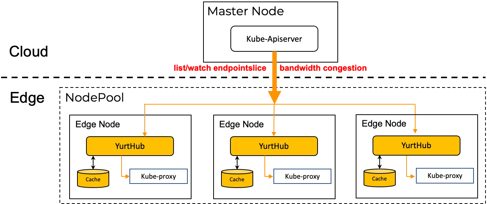
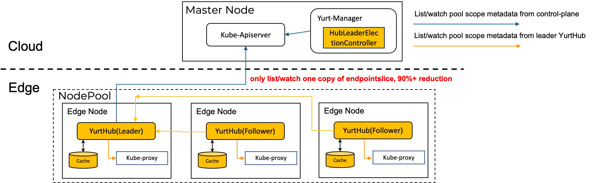

# Reusing list/watch requests in the nodepool

|               title                | authors     | reviewers | creation-date | last-updated | status |
|:----------------------------------:|-------------| --------- |---------------| ------------ | ------ |
| reuse nodepool list/watch requests | @rambohe-ch |           | 2024-12-11    |              |        |

## Summary
In the cloud-edge architecture, The cost of network traffic between cloud and edge is a heavy burden for end users. On the other hand, sometimes there is only limited network bandwidth can be provided  for cloud-edge connection. In the proposal [Node-level Traffic Reuse Capability](https://github.com/openyurtio/openyurt/blob/master/docs/proposals/20240529-node-level-traffic-reuse-capability.md), we have proposed a solution to reduce the cloud-edge traffic based on the node level which can get the traffic down 50%. But in our proposal, we propose a new solution that reuses list/watch requests in the nodepool level will reduce cloud-edge traffic up to 90%.

## Motivation
OpenYurt is using the classic cloud-edge architecture to manage scattered edge worker nodes from a unified control-plane on the cloud. this means that edge worker nodes and pods on edge nodes connect cloud control-plane through public network.

Our tests revealed that during application upgrades, the outbound bandwidth of cloud have a spike point, and easily reach its maximum capacity. This is primarily due to large-scale creation and deletion of applications, which lead to frequent changes in EndpointSlice resources. at the same time, every change in EndpointSlice must be distributed to each edge node, inevitably increasing the demand for the bandwidth. Assuming a DaemonSet upgrade in the cluster with 1000 nodes and one EndpointSlice is 50KB in size , the total traffic can be calculated as follows:

```
1000 (updates) * 1000 (nodes) * 50KB (size per update) = 50GB
```

Such a large-scale traffic will affect the stability of control-plane and other requests between cloud and edge.

By the way, We have proposed a solution for reducing cloud-edge traffic based on yurt-coordinator component, but it is hard to import this component into production environment. the related proposal is here: [multiplexing cloud-edge traffic](https://github.com/openyurtio/openyurt/blob/master/docs/proposals/20220414-multiplexing-cloud-edge-traffic.md)

### Goals
1. Reduce network traffic between cloud and edge caused by workloads upgrade.
2. Replace the old solution for resuing list/watch requests that providered by yurt-coordinator component. this means we will deprecate yurt-coordinator component.
3. The new solution can integrate with current node-level traffic reuse solution seamlessly.

### Non-Goals/Future Work
1. The new solution can only take effect when nodes can access each other in nodepool.
2. Don't support resuing CRD list/watch requests in this proposal. we will support this feature in the future version.
3. Support high availability of Leader Yurthub in the future version.

## Proposal
### Metadata Types
In the following figure, we can see that kube-proxy on every node list/watch endpointslice resource from cloud control-plane.



we can separate the metadata that components or pods on worker node list/watch from control-plane into the following two types:

+ Pool Scope Metadata:

Each node list/watch the same copy of metadata from the control-plane, such as entire endpointslice metadata. This type of metadata is the main cause for bandwidth congestion because each change of metadata should be distributed to all nodes.

+ Node Scope Metadata:

Each node only list/watch metadata resource related to the node, such as kubelet list/watch pods that assigned to the node. Each change of this type of metadata is only distributed the corresponding node.

So we should focus on the Pool Scope Metadata. If only one copy of metadata change should be distributed to one NodePool, and nodes in NodePool share this copy of metadata, the network traffic between cloud-edge would be reduced a lot obviously.

### Reuse List/Watch Requests In NodePool
The solution is demonstrated in the following figure:



1. A new controller named HubLeaderElection is added in yurt-manager component. This controller will select one Yurthub as leader for each NodePool. The status of node for Leader Yurthub must be ready, if the node status becomes not ready, the controller should renew the Leader Yurthub with ready node.
2. Different leader election strategies can be supported, such as random, mark, etc.
    - random: controller select one ready node as leader at random.
    - mark: controller select one ready node as leader from nodes that are specified by labelselector.
3. Leader Yurthub will start to list/watch pool scope metadata from control-plane and store on local memory for sharing.
4. The Follower Yurthub intercept list/watch pool scope metadata from components, and forward the list/watch requests to Leader Yurthub.

So there is only one copy of pool scope metadata will be distributed between cloud and edge, and pool scope metadata will be shared in the nodepool.

### API Changes
we need to add the following fields into NodePool CRD and NodeBucket CRD. this means we need to upgrade version for these two CRDs.

+ Spec.InterConnectivity: bool [Not allowed to change]

Specify that all nodes in the NodePool can access with each other through Layer 2 or Layer 3 network or not. If the field is true, nodepool-level list/watch requests reuse can be applied for this nodepool. otherwise, only node-level list/watch requests reuse can be applied for the nodepool.

+ Spec.LeaderElectionStrategy: string [Allowed to change]
    - random: controller select one ready node as leader at random.
    - mark: controller select one ready node as leader from nodes that are specified by labelselector.

More strategies will be supported in terms of user's new requirements.

+ Spec.LeaderNodeLabelSelector: map[string]string [Allowed to change]

This field is used only when LeaderElectionStrategy is mark. controller will elect leader from nodes that filtered by this label selector.

+ Spec.PoolScopeMetadata: []schema.GroupVersionKind [Allowed to change]

Pool scope metadata specified in this field will be shared in the nodepool. This field is supported to modify dynamically. and the default value is v1.Service and v1.Endpointslice.

+ Status.LeaderEndpoints: []string

This filed is used for storing the address of Lead Yurthub. each Follower Yurthub will use address in this field to access Leader Yurthub.

+ Status.Conditions: []NodePoolCondition

This filed represents the latest available observations of a NodePool's current state that includes LeaderHubElection status.

```
type NodePoolCondition struct {
  Type NodePoolConditionType
  Status v1.ConditionStatus
  LastTransitionTime metav1.Time
  Reason string
  Message string
}

type NodePoolConditionType string

const (
  // LeaderReady means the status of leader yurthub election. If it's true, a Leader Yurthub is elected, otherwise no leader is elected.
  LeaderHubReady NodePoolConditionType = "LeaderReady"
)
```

### Yurt-Coordinator Deprecation

The following code related Yurt-Coordinator should be removed, and OpenYurt can become more simple and powerful.

- yurt-coordinator charts
- yurt-manager
  - yurt-coordinator-cert controller
  - delegate-lease controller
- yurthub
  - code related yurt-coordinator

## Implementation History
- [ ] 12/11/2024: Proposed idea as a proposal