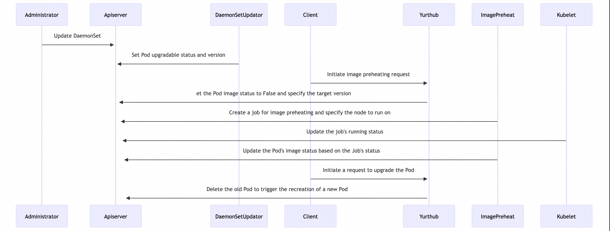

# OTA upgrade supports image preheating

|          title          | authors     | reviewers | creation-date | last-updated | status |
|:-----------------------:|-------------| --------- |---------------| ------------ | ------ |
| OTA upgrade supports image preheating | @zyjhtangtang |  @rambohe-ch @luc99hen  | 2025-11-04    |              |        |

<!-- TOC -->
* [OTA upgrade supports image preheating](#OTA-upgrade-supports-image-preheating)
    * [Summary](#summary)
    * [Motivation](#motivation)
        * [Goals](#goals)
        * [Non-Goals/Future Work](#non-goals)
    * [Proposal](#proposal)
    * [Implementation History](#implementation-history)
<!-- TOC -->

## Summary
OpenYurt already provides [over-the-air (OTA)](https://github.com/openyurtio/openyurt/blob/master/docs/proposals/20220718-workload-update-model.md) upgrade capabilities for edge workloads through its enhanced DaemonSet controller. However, one major challenge remains: during an OTA upgrade, if the new container image is large or network bandwidth is limited, pulling the image on the node can take a significant amount of time-leading to prolonged service disruption and degraded user experience.

Currently, image pulling occurs synchronously during the Pod restart phase of the upgrade, making it a critical path operation that directly impacts downtime. This becomes especially problematic in edge environments where network connectivity is unstable.

This proposal introduces image preheating as an integrated enhancement to OpenYurt’s existing OTA upgrade workflow. With image preheating, updated container images are proactively downloaded onto edge nodes before the actual rollout begins—decoupling image distribution from the cutover process, ensuring minimal interruption when the upgrade is triggered.

By adding image preheating support, OpenYurt will significantly reduce OTA upgrade latency, improve deployment reliability, and enhance overall operational efficiency in edge computing scenarios.

## Motivation

Over-the-air (OTA) upgrades are a critical operation in edge computing environments, where applications must be updated frequently to deliver new features, security patches, and bug fixes. OpenYurt already provides robust OTA upgrade capabilities through its enhanced DaemonSet controller. However, as application images grow larger—especially in AI inference, video processing, and edge middleware scenarios—the time required to pull these images during an upgrade has become a major bottleneck.

In many edge deployments, network bandwidth is limited, unstable. When an OTA upgrade is triggered, the current model pulls the new container image synchronously during the Pod restart phase. This means that image download time directly contributes to service downtime. For example, if a 2GB image takes 5–10 minutes to download on a node with constrained connectivity, the corresponding service will remain unavailable for that entire period—leading to unacceptable disruption for latency-sensitive workloads.

Moreover, users often have maintenance windows or off-peak periods (e.g., at night) when network utilization is low and pre-downloading large images would be most efficient. However, OpenYurt currently lacks the ability to decouple image distribution from the actual rollout.

Therefore, there is a strong need to introduce image preheating as a core enhancement to the OTA upgrade workflow. By allowing container images to be proactively downloaded onto edge nodes before the upgrade begins, we can:

- Minimize service downtime by eliminating image pull delays during the cutover phase.
- Improve user experience by enabling predictable and fast rollouts, regardless of image size.
- Optimize network usage by scheduling preheating during off-peak hours or based on network conditions.
- Enhance reliability in low-connectivity environments, where synchronous image pulling may fail or timeout.

### Goals

This proposal aims to enhance OpenYurt’s OTA upgrade capabilities with native image preheating support, addressing the long service downtime caused by large image downloads during rollouts. The primary objectives are:

Decouple image pulling from the upgrade process by enabling proactive pre-downloading of updated container images to edge nodes before the actual rollout begins, significantly reducing cutover time.

### Non-Goals

1. Auto Image preheating is not supported in this proposal.

## Proposal

### Add Pod states related to image preheating

During the image preheating process, we need to obtain the target version and status information of the image. We can use the Pod's status to record this information, including:

- Pod upgrade status, indicating whether the new version is ready for upgrade
```
corev1.PodCondition{
		Type:    PodNeedUpgrade,
		Status:  True,
		Message: controllerrevision: 74fbcc88b5
	}
```
Among these, a status of "True" indicates that a new version is available for upgrade, and the target controllerRevision is stored in the Message field.

- The Ready status of the target image indicates whether the image for the target version has been successfully preheated.
```
corev1.PodCondition{
		Type:    PodImageReady,
		Status:  True,
		Message: controllerrevision: 74fbcc88b5,
	}
```
Among these, a status of "True" indicates that the image for the target version has been successfully preheated, with the specific version information recorded in the Message field; if the status is "False", it indicates that image preheating has failed, and the failure details are recorded in the Message field.

### Add a new ImagePreHeat Controller responsible for dispatching image preheating Jobs. 
The workflow is as follows:



### Add a new API for image preheating
```
POST /openyurt.io/v1/namespaces/{ns}/pods/{podname}/imagepull
```

## Implementation History
   [ ] 11/04/2025: Proposed idea in an issue or [community meeting]