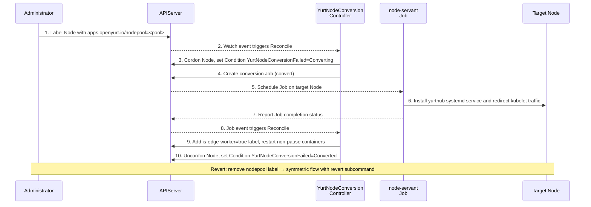

# Label-Driven YurtHub Installation and Uninstallation

|          title          | authors     | reviewers | creation-date | last-updated | status |
|:-----------------------:|-------------| --------- |---------------| ------------ | ------ |
| Label-Driven YurtHub Installation and Uninstallation | @Vacantlot-07734 |           | 2026-03-03    |              | Draft  |

<!-- TOC -->
* [Label-Driven YurtHub Installation and Uninstallation](#label-driven-yurthub-installation-and-uninstallation)
    * [Summary](#summary)
    * [Motivation](#motivation)
        * [Goals](#goals)
        * [Non-Goals/Future Work](#non-goalsfuture-work)
    * [Proposal](#proposal)
      * [Overall Architecture Design](#overall-architecture-design)
      * [Controller Surface](#controller-surface)
      * [High-level Workflow](#high-level-workflow)
      * [Conversion Steps (node-servant convert)](#conversion-steps-node-servant-convert)
      * [Revert Steps (node-servant revert)](#revert-steps-node-servant-revert)
      * [Configuration and State Model](#configuration-and-state-model)
      * [Examples](#examples)
      * [Compatibility and Risks](#compatibility-and-risks)
    * [Alternatives](#alternatives)
    * [Implementation History](#implementation-history)
<!-- TOC -->

## Summary
This proposal introduces a **Label-Driven** declarative mechanism for automated YurtHub deployment. Users simply apply a NodePool label (`apps.openyurt.io/nodepool=<pool-name>`) on a Kubernetes Node to trigger conversion. The `YurtNodeConversionController` watches this label, orchestrates a privileged `node-servant` Job to install YurtHub as a host-level systemd service, and upon success sets `openyurt.io/is-edge-worker=true` as the source of truth for the node's OpenYurt membership.

## Motivation

Currently, YurtHub operates as a transparent proxy between all edge node system components (such as kubelet, CNI, CoreDNS, kube-proxy) and the Kubernetes API Server. However, in practical applications, users often expect to smoothly and seamlessly integrate their existing standard Kubernetes nodes into the OpenYurt control plane. Relying on manual intervention to configure the node environment (like writing StaticPod configurations or configuring systemd) not only significantly increases O&M costs but also easily leads to service disruptions due to misconfigurations.

To improve user experience, reduce integration costs, and enhance the framework's flexibility, the community wishes to support on-demand automated conversion and reversion driven by Labels:
1. **Automated Conversion**: When any Node in the cluster is assigned a NodePool label (`apps.openyurt.io/nodepool=<pool-name>`), the YurtHub system components should be automatically installed and started on that node, and the node should be marked as an OpenYurt-managed edge worker.
2. **Graceful Reversion**: When the NodePool label is removed, YurtHub should be safely and orderly stopped, disabled, and its related dependency configurations cleaned up. The edge-worker label is removed accordingly.

This feature will greatly simplify the difficulty of migrating Kubernetes nodes in edge environments into the OpenYurt ecosystem.

### Goals
1. **Design Controller**: Design and implement an Operator/Controller (namely `YurtNodeConversionController`) that watches Node Labels, triggering and managing the YurtHub lifecycle on target edge nodes.
2. **Implement Privileged Conversion and Reversion Operations**:
   - Relying on the existing `node-servant` component, add and complete conversion and reversion capabilities for the Systemd-based YurtHub binary installation and uninstallation.
   - Implement the takeover and rollback of Kubelet traffic proxy configurations before and after deployment.
   - Ensure the conversion process possesses Idempotency, as well as automatic retry and graceful exit capabilities in case of errors.
3. **Transparent Traffic Interception**: Transparently intercept existing Pod traffic to the API Server. The primary approach for this in the current scope is to restart non-pause containers on the node after a successful conversion.

### Non-Goals/Future Work
1. This proposal currently focuses solely on **YurtHub component deployment and lifecycle management**. It does not currently involve transforming the dispatch and deployment logic of other OpenYurt core system components (like raven-agent, yurt-manager, etc.).
2. This proposal does not introduce controller-side token lifecycle management. The current install path reuses kubelet certificate bootstrap mode (`--bootstrap-mode=kubeletcertificate`) and does not add additional Bootstrap Token issuance/rotation logic.

## Proposal

### Overall Architecture Design
This proposal adopts a **Controller + Job** approach to implement a task dispatch mechanism triggered by Labels.

- **Control Plane (YurtManager)**: a new `YurtNodeConversionController` watches Node and Job events. It determines whether a node should be converted or reverted based on the presence of the NodePool label, and creates the corresponding `node-servant` Job in `kube-system`.
- **Target Node (Node)**: the Job is pinned to the target node and runs a privileged `node-servant` container. It mounts host rootfs, installs or removes the `yurthub` binary and systemd files, and updates kubelet traffic redirection on the host.
- **Execution Primitive (`node-servant`)**: `node-servant` is the node-side executor for privileged lifecycle actions. In this proposal it is responsible for the host-level `systemd + binary` installation path rather than Static Pod deployment.

**High-level End-to-End Flow:**



### Controller Surface

The controller surface introduced by this proposal is intentionally small:

- Watched objects: `Node` and `Job`
- Trigger label: `apps.openyurt.io/nodepool=<pool-name>` (user-managed, add-only or remove-only, no in-place modification)
- Source-of-truth label: `openyurt.io/is-edge-worker=true` (controller-managed; only `YurtNodeConversionController` and the node certificate process are allowed to modify this label)
- Node status: reported via a Node Condition `YurtNodeConversionFailed` (type), with `reason` indicating the current phase
- Required control-plane permissions: `Node` `get/list/watch/update/patch`; `Job` `get/list/watch/create/update/patch/delete`; `Pod` `list/delete` (for container restart)
- Convergence principle: desired state comes from the NodePool label, observed progress comes from the Node Condition plus Job status, and each reconcile round drives at most one conversion Job for a given node

### High-level Workflow

1. The controller watches Node events (NodePool label changes) and Job events belonging to node conversion.
2. **Desired state** is derived from the NodePool label: present → the node should be converted; absent → the node should be reverted.
3. **Conversion flow**:
   - The controller cordons the node (sets `spec.unschedulable=true`) to prevent new pods from being scheduled during conversion.
   - It sets a Node Condition: `type=YurtNodeConversionFailed, status=False, reason=Converting`.
   - It creates a conversion Job (`node-servant-conversion-<node>` with subcommand `convert`).
   - When the Job succeeds, the controller adds the `openyurt.io/is-edge-worker=true` label, restarts non-pause containers on the node (so that the new `KUBERNETES_SERVICE_HOST` env is injected by kubelet through YurtHub), uncordons the node, and sets the Condition reason to `Converted`.
   - When the Job fails (exceeds `backoffLimit`), the controller uncordons the node and sets the Condition reason to `ConvertFailed`. Manual intervention is required.
4. **Revert flow**:
   - The controller cordons the node.
   - It sets the Condition reason to `Reverting` with `status=False`.
   - It creates the same-named Job with subcommand `revert`.
   - When the Job succeeds, the controller removes the `openyurt.io/is-edge-worker=true` label, restarts non-pause containers on the node (to restore original InClusterConfig env pointing to the real API Server), uncordons the node, and sets the Condition status/reason to `False/Reverted`.
   - When the Job fails, the controller uncordons the node and sets the Condition reason to `RevertFailed`. Manual intervention is required.

### Conversion Steps (node-servant convert)

The conversion Job mounts the host root filesystem (`/`) into the container at `/openyurt`. The entrypoint script copies `node-servant` to the host and executes it via `chroot /openyurt`, so all file writes and `systemctl` commands act directly on the host.

1. **Download yurthub binary** — fetch the binary for the specified version from the default OSS URL or a custom URL provided by `--yurthub-binary-url`. Place it at `/usr/local/bin/yurthub` on the host.
2. **Write systemd unit file** — render and write `yurthub.service` to `/etc/systemd/system/`.
3. **Write systemd drop-in** — render `10-yurthub.conf` into `/etc/systemd/system/yurthub.service.d/`, injecting runtime parameters including:
   - `--server-addr=https://<apiserver-addr>` (auto-discovered from kubelet config)
   - `--bootstrap-mode=kubeletcertificate`
   - `--working-mode=edge`
   - `--nodepool-name=<pool>`
4. **Enable and start the service** — execute `systemctl daemon-reload`, `systemctl enable yurthub.service`, and `systemctl start yurthub.service` on the host.
5. **Redirect kubelet traffic and restart containers** — modify the kubelet configuration so that API requests are redirected to YurtHub at `127.0.0.1:10261`, making YurtHub the transparent proxy between kubelet and the real API server. Then restart all non-pause containers on the node.

### Revert Steps (node-servant revert)

The revert Job uses the same host-mount and `chroot` approach as the conversion Job.

1. **Restore kubelet traffic** — revert the kubelet configuration to point directly at the original API server address, removing the YurtHub proxy redirect. This is done first to minimize disruption.
2. **Stop and disable the service** — execute `systemctl stop yurthub.service` and `systemctl disable yurthub.service`. If the service is already `not loaded` or `not found`, the error is ignored (idempotent).
3. **Remove systemd files** — delete the unit file and drop-in directory, then run `systemctl daemon-reload`.
4. **Remove binary and bootstrap config** — delete `/usr/local/bin/yurthub` and related bootstrap configuration files.
5. **Optional data cleanup and restart containers** — remove the YurtHub data and cache directory. Then restart all non-pause containers on the node.

### Configuration and State Model

**User-facing trigger**

- Add NodePool label: `apps.openyurt.io/nodepool=<pool-name>` → triggers conversion
- Remove NodePool label → triggers reversion
- Users must not modify the NodePool label value in-place; they should remove and re-add if a change is needed

**Controller-managed labels**

- `openyurt.io/is-edge-worker=true`: added by the controller after successful conversion, removed after successful reversion. This label serves as the **source of truth** for whether a node is under OpenYurt management. Write access to this label is restricted to `YurtNodeConversionController` and the node certificate process.

**Node Condition**

The conversion lifecycle is reported via a standard Kubernetes Node Condition:

| Condition Type | Status | Reason        | Meaning |
| -------------- | -----: | ------------- | ------- |
| YurtNodeConversionFailed |  False | Converting    | Conversion Job is running |
| YurtNodeConversionFailed |  False | Converted     | Conversion succeeded, node is an edge worker |
| YurtNodeConversionFailed |  False | Reverting     | Revert Job is running |
| YurtNodeConversionFailed |  False | Reverted      | Revert succeeded, node is a plain K8s node |
| YurtNodeConversionFailed |  True  | ConvertFailed | Convert Job failed, manual intervention required |
| YurtNodeConversionFailed |  True  | RevertFailed  | Revert Job failed, manual intervention required |

**Node scheduling**

- During conversion or reversion, the node is **cordoned** (`spec.unschedulable=true`).
- Upon reaching any terminal state (success or failure), the node is automatically **uncordoned**.

**Container restart for transparent traffic proxy**

After a successful conversion or reversion, the controller restarts all non-pause containers on the node, this allows them to be recreated so that their environment variables are updated (`KUBERNETES_SERVICE_HOST` either pointing to YurtHub after conversion, or restored to the real API Server after reversion).

**Job configuration**

- Unified Job name: `node-servant-conversion-<node>` (same name for both directions)
- Subcommand: `convert` or `revert`
- Job label: `openyurt.io/conversion-node=<NodeName>`
- Retry: handled by Job's built-in `backoffLimit` (default: 3).
- Finished Jobs use `ttlSecondsAfterFinished: 7200`

**Optional yurt-manager flags**

- `--yurthub-version`
- `--yurthub-binary-url`

### Examples

**Example 1: trigger conversion by adding a NodePool label**

```bash
kubectl label node node-1 apps.openyurt.io/nodepool=edge-pool
```

After controller reconciliation completes, the node will have:

```yaml
apiVersion: v1
kind: Node
metadata:
  name: node-1
  labels:
    apps.openyurt.io/nodepool: edge-pool
    openyurt.io/is-edge-worker: "true"        # added by controller
status:
  conditions:
    - type: YurtNodeConversionFailed
      status: "False"
      reason: Converted
      message: "YurtHub installed and node converted successfully"
```

**Example 2: trigger reversion by removing the NodePool label**

```bash
kubectl label node node-1 apps.openyurt.io/nodepool-
```

**Example 3: key part of the conversion Job command**

```yaml
args:
  - "/usr/local/bin/entry.sh convert --yurthub-version=v1.6.1 --working-mode=edge --node-name=node-1 --namespace=kube-system --nodepool-name=edge-pool"
```

> Note: `--server-addr` is omitted from the Job command. `node-servant` discovers the API server address at runtime by parsing the kubelet configuration on the host.
> For reversion, the same Job name is used with subcommand `revert` instead.

**Example 4: yurt-manager flags**

```bash
yurt-manager \
  --controllers=*,yurtnodeconversion \
  --yurthub-version=v1.6.1
```

If a custom binary source is needed, `--yurthub-binary-url=http://<server>/yurthub` can be provided as well.

### Compatibility and Risks

> [!WARNING]
> **Operational Impact on User Workloads during Conversion:**
> 1. **Node Cordoning**: The node is cordoned (`spec.unschedulable=true`) throughout the conversion/reversion process. New pods cannot be scheduled to this node during this time.
> 2. **Container Restart**: To update the `KUBERNETES_SERVICE_HOST` environment variable for existing workloads (pointing to YurtHub during conversion, or restoring it during reversion), the controller will explicitly restart all non-pause containers on the node upon success.

- **Stateful Workloads**: Workloads with strict scheduling requirements (e.g., single-replica StatefulSets without PodDisruptionBudgets) should be reviewed before conversion, as the forceful pod deletion might cause service downtime.
- **Bare Pods**: Pods without an owning controller (bare Pods created directly) will be permanently deleted and **not** automatically recreated. Users must ensure no critical bare pods exist on the target node before applying the NodePool label.
- **Installation Path**: This proposal targets the `systemd + host binary` installation path as the primary and preferred workflow. Static Pod templates and legacy compatibility paths still exist, but automatic migration from a Static Pod deployment to a systemd deployment is out of scope.
- **Node Requirements**: The conversion Job requires privileged execution, host rootfs access, and a usable host systemd environment. Nodes that do not satisfy these assumptions are not supported by this mechanism.
- **Protected Status Label**: The `openyurt.io/is-edge-worker` label is treated as a protected label. Only the `YurtNodeConversionController` and the node certificate process should write to it. Admission webhooks or RBAC policies should be configured to enforce this restriction.

## Alternatives

1. Continue using manual node-side installation. This keeps the implementation simple but does not provide a declarative or scalable lifecycle for existing-node migration.
2. Continue centering YurtHub installation on Static Pod deployment. Static Pod assets are still available, but the current OpenYurt mainline and new controller-driven lifecycle both target systemd host services, so this proposal follows that direction instead.

## Implementation History
