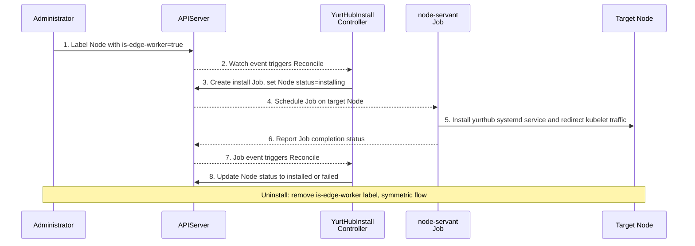

# Label-Driven YurtHub Installation and Uninstallation

|          title          | authors     | reviewers | creation-date | last-updated | status |
|:-----------------------:|-------------| --------- |---------------| ------------ | ------ |
| Label-Driven YurtHub Installation and Uninstallation | @Vacantlot-07734 |           | 2026-03-03    |              | Draft  |

<!-- TOC -->
* [Label-Driven YurtHub Installation and Uninstallation](#label-driven-yurthub-installation-and-uninstallation)
    * [Summary](#summary)
    * [Motivation](#motivation)
        * [Goals](#goals)
        * [Non-Goals/Future Work](#non-goalsfuture-work)
    * [Proposal](#proposal)
      * [Overall Architecture Design](#overall-architecture-design)
      * [Controller Surface](#controller-surface)
      * [High-level Workflow](#high-level-workflow)
      * [Installation Steps (node-servant install)](#installation-steps-node-servant-install)
      * [Uninstallation Steps (node-servant uninstall)](#uninstallation-steps-node-servant-uninstall)
      * [Configuration and State Model](#configuration-and-state-model)
      * [Examples](#examples)
      * [Compatibility and Risks](#compatibility-and-risks)
    * [Alternatives](#alternatives)
    * [Implementation History](#implementation-history)
<!-- TOC -->

## Summary
This proposal aims to introduce a **Label-Driven** declarative automated deployment mechanism aligned with the current systemd-based direction. Users simply need to apply a specific label (e.g., `openyurt.io/is-edge-worker=true` along with a valid NodePool label) on the corresponding Kubernetes Node. The OpenYurt control plane (via a newly added Controller) will automatically listen for these changes and dispatch a privileged Job to schedule `node-servant`, automatically installing YurtHub as a host-level systemd service on the corresponding Node. Conversely, when the label is removed, it automatically performs resource cleanup and uninstalls YurtHub.

## Motivation

Currently, YurtHub operates as a transparent proxy between all edge node system components (such as kubelet, CNI, CoreDNS, kube-proxy) and the Kubernetes API Server. However, in practical applications, users often expect to smoothly and seamlessly integrate their existing standard Kubernetes nodes into the OpenYurt control plane. Relying on manual intervention to configure the node environment (like writing StaticPod configurations or configuring systemd) not only significantly increases O&M costs but also easily leads to service disruptions due to misconfigurations.

To improve user experience, reduce integration costs, and enhance the framework's flexibility, the community wishes to support on-demand automated installation and uninstallation driven by Labels:
1. **Automated Installation**: When any Node in the cluster is assigned an edge attribute label (e.g., `openyurt.io/is-edge-worker=true`), the YurtHub system components should be automatically pulled up and started on that node.
2. **Graceful Uninstallation**: When the label is removed, YurtHub should be safely and orderly stopped, disabled, and its related dependency configurations cleaned up to avoid environmental pollution.

This feature will greatly simplify the difficulty of migrating Kubernetes nodes in edge environments into the OpenYurt ecosystem.

### Goals
1. **Design Controller**: Design and implement an Operator/Controller (namely `YurtHubInstallController`) that watches Node Labels, triggering and managing the YurtHub lifecycle on target edge nodes.
2. **Implement Privileged Installation and Uninstallation Operations**:
   - Relying on the existing `node-servant` component, add and complete installation and uninstallation capabilities for the Systemd-based YurtHub binary.
   - Implement the takeover and rollback of Kubelet traffic proxy configurations before and after deployment.
   - Ensure the installation process possesses Idempotency, as well as automatic retry and graceful exit capabilities in case of errors.

### Non-Goals/Future Work
1. This proposal currently focuses solely on **YurtHub component deployment and lifecycle management**. It does not currently involve transforming the dispatch and deployment logic of other OpenYurt core system components (like raven-agent, yurt-manager, etc.).
2. This proposal does not introduce controller-side token lifecycle management. The current install path reuses kubelet certificate bootstrap mode (`--bootstrap-mode=kubeletcertificate`) and does not add additional Bootstrap Token issuance/rotation logic.

## Proposal

### Overall Architecture Design
This proposal adopts a **Controller + Job** approach to implement a task dispatch mechanism triggered by Labels.

- **Control Plane (YurtManager)**: a new `YurtHubInstallController` watches Node and Job events. It determines whether a node should have YurtHub installed or uninstalled, and creates the corresponding `node-servant` Job in `kube-system`.
- **Target Node (Node)**: the Job is pinned to the target node and runs a privileged `node-servant` container. It mounts host rootfs, installs or removes the `yurthub` binary and systemd files, and updates kubelet traffic redirection on the host.
- **Execution Primitive (`node-servant`)**: `node-servant` is the node-side executor for privileged lifecycle actions. In this proposal it is responsible for the host-level `systemd + binary` installation path rather than Static Pod deployment.

**High-level End-to-End Flow:**



### Controller Surface

The controller surface introduced by this proposal is intentionally small:

- Watched objects: `Node` and `Job`
- Node-side state: `openyurt.io/yurthub-install-status`, `openyurt.io/yurthub-install-job`, and `openyurt.io/yurthub-install-retry-count`
- Required control-plane permissions: `Node` `get/list/watch/update/patch`; `Job` `get/list/watch/create/update/patch/delete`
- Convergence principle: desired state comes from Node labels, observed progress comes from Node annotations plus Job status, and each reconcile round drives at most one install or uninstall Job for a given node

### High-level Workflow

1. The controller watches Node events relevant to YurtHub lifecycle and Job events belonging to YurtHub installation.
2. Desired state is derived from Node labels, while current lifecycle state is recorded in Node annotations.
3. If installation is needed, the controller validates prerequisites such as API server address and NodePool label, then creates an install Job and marks the Node as `installing`.
4. If uninstallation is needed, the controller creates an uninstall Job and marks the Node as `uninstalling`.
5. The Job runs `node-servant` on the target node, and `node-servant` performs host-level operations such as downloading `yurthub`, writing/removing systemd unit files, and switching kubelet traffic redirection.
6. When the Job succeeds, the controller updates the Node to `installed` or `uninstalled`. When the Job fails, the controller enters a bounded retry flow with backoff, or leaves the Node in `failed` state for manual intervention after the retry limit is reached.

### Installation Steps (node-servant install)

The install Job mounts the host root filesystem (`/`) into the container at `/openyurt`. The entrypoint script copies `node-servant` to the host and executes it via `chroot /openyurt`, so all file writes and `systemctl` commands act directly on the host.

1. **Download yurthub binary** — fetch the binary for the specified version from the default OSS URL or a custom URL provided by `--yurthub-install-binary-url`. Place it at `/usr/local/bin/yurthub` on the host.
2. **Write systemd unit file** — render and write `yurthub.service` to `/etc/systemd/system/`.
3. **Write systemd drop-in** — render `10-yurthub.conf` into `/etc/systemd/system/yurthub.service.d/`, injecting runtime parameters including:
   - `--server-addr=https://<apiserver-addr>`
   - `--bootstrap-mode=kubeletcertificate`
   - `--working-mode=edge`
   - `--nodepool-name=<pool>`
4. **Enable and start the service** — execute `systemctl daemon-reload`, `systemctl enable yurthub.service`, and `systemctl start yurthub.service` on the host.
5. **Redirect kubelet traffic** — modify the kubelet configuration so that API requests are redirected to YurtHub at `127.0.0.1:10261`, making YurtHub the transparent proxy between kubelet and the real API server.

### Uninstallation Steps (node-servant uninstall)

The uninstall Job uses the same host-mount and `chroot` approach as the install Job.

1. **Restore kubelet traffic** — revert the kubelet configuration to point directly at the original API server address, removing the YurtHub proxy redirect. This is done first to minimize disruption.
2. **Stop and disable the service** — execute `systemctl stop yurthub.service` and `systemctl disable yurthub.service`. If the service is already `not loaded` or `not found`, the error is ignored (idempotent).
3. **Remove systemd files** — delete the unit file and drop-in directory, then run `systemctl daemon-reload`.
4. **Remove binary and bootstrap config** — delete `/usr/local/bin/yurthub` and related bootstrap configuration files.
5. **Optional data cleanup** — if the `--clean-data` flag is set, also remove the YurtHub data and cache directory.

### Configuration and State Model

**Required inputs**

- Edge label: `openyurt.io/is-edge-worker=true`
- NodePool label: `apps.openyurt.io/nodepool=<pool-name>`
- Controller flag: `--yurthub-install-server-addr`

**Optional inputs**

- `--yurthub-install-version`
- `--yurthub-install-binary-url`
- `--yurthub-install-node-servant-image`

**Node annotations**

- `openyurt.io/yurthub-install-status`: `installing`, `installed`, `uninstalling`, `uninstalled`, `failed`
- `openyurt.io/yurthub-install-job`: current Job name, for example `node-servant-install-<node>`
- `openyurt.io/yurthub-install-retry-count`: consecutive failure retry counter

**Job identity**

- Install Job name: `node-servant-install-<node>`
- Uninstall Job name: `node-servant-uninstall-<node>`
- Shared Job label: `openyurt.io/yurthub-install-node=<NodeName>`
- Finished Jobs use `ttlSecondsAfterFinished: 7200`

### Examples

**Example 1: label a node for installation**

```yaml
apiVersion: v1
kind: Node
metadata:
  name: node-1
  labels:
    openyurt.io/is-edge-worker: "true"
    apps.openyurt.io/nodepool: edge-pool
```

**Example 2: key part of the install Job command**

```yaml
args:
  - "/usr/local/bin/entry.sh install --server-addr=10.0.0.1:6443 --yurthub-version=v1.6.1 --working-mode=edge --node-name=node-1 --namespace=kube-system --nodepool-name=edge-pool"
```

**Example 3: yurt-manager flags**

```bash
yurt-manager \
  --controllers=*,yurthubinstall \
  --yurthub-install-server-addr=10.0.0.1:6443 \
  --yurthub-install-version=v1.6.1 \
  --yurthub-install-node-servant-image=openyurt/node-servant:latest
```

If a custom binary source is needed, `--yurthub-install-binary-url=http://<server>/yurthub` can be provided as well.

### Compatibility and Risks

- This proposal targets the `systemd + host binary` installation path as the primary and preferred workflow.
- Static Pod templates, YurtStaticSet assets, and legacy compatibility paths still exist in the repository, but automatic migration from a Static Pod deployment to a systemd deployment is out of scope for this proposal.
- The install/uninstall Job requires privileged execution, host rootfs access, and a usable host systemd environment. Nodes that do not satisfy these assumptions are not supported by this mechanism.
- Retry is intentionally bounded. After the retry limit is reached, manual intervention is required to resolve the node-side issue.

## Alternatives

1. Continue using manual node-side installation. This keeps the implementation simple but does not provide a declarative or scalable lifecycle for existing-node migration.
2. Continue centering YurtHub installation on Static Pod deployment. Static Pod assets are still available, but the current OpenYurt mainline and new controller-driven lifecycle both target systemd host services, so this proposal follows that direction instead.

## Implementation History
