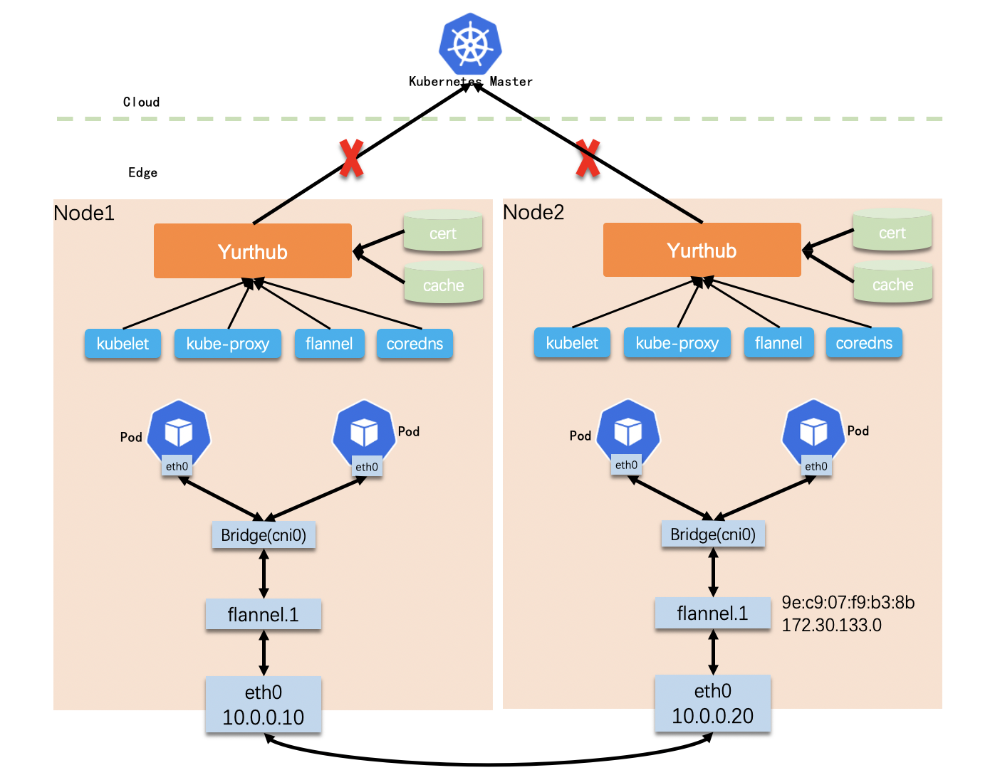

In edge scenario, edge node can be offline since the network between edge and cloud is unstable,
thanks to node autonomy feature provided by yurt-hub, pods can still be working,
however there are some cases we need to take care.

# Flannel: keep Vtep mac address
**Background**

If we use flannel as CNI plugin, in VXLAN mode, a Vtep device (usually named as "flannel.1") is created on each host,
and the VNI, VtepMAC info are recorded in kube node annotation, consumed by other nodes to be aware and apply
the corresponding routes and forwarding rules.

<div align="center">
  
</div>

The flannel architecture is shown in above pic, we take the two nodes as example:
- node2 created flannel.1 device with mac address "9e:c9:07:f9:b3:8b" and ip address "172.30.133.0", and update it in annotation.
```yaml
# node2 annotation with vtep info.
flannel.alpha.coreos.com/backend-data: '{"VtepMAC":"9e:c9:07:f9:b3:8b"}'
flannel.alpha.coreos.com/public-ip: 10.0.0.20
```
- node1 will then set the fdb, arp, route entry in its host network namespace to form a L2 overlay tunnel.
```shell script
# node1 host network namespace.
fdb:   9e:c9:07:f9:b3:8b dev flannel.1 dst 10.0.0.20 self permanent
arp:   ? (172.30.133.0) at 9e:c9:07:f9:b3:8b [ether] PERM on flannel.1
route: 172.30.133.0/26 via 172.30.133.0 dev flannel.1 onlink
```

Each time node2 restarted, flannel will create new Vtep device with new mac address, and update the info in node2's annotation.

However, if node2 is offline and lose connection to cloud, the update cannot be truly done, node1 will not be aware of the mac address change,
this will cause pod connectivity issues between the edge nodes.

**Solution: Keep Vtep mac address in flannel**

For each time flannel restarted and try to create new Vtep device, it reads the mac address from node annotation,
either from kube-apiserver or yurt-hub local cache, and use it for Vtep device if exists.

For this solution, there is minor code change in flannel, you can refer to the patch:
```shell script
git clone https://github.com/flannel-io/flannel.git ;
cd flannel;
git reset --hard e634dabe0af446b765db3b729085b32f97ff6fe6;
wget https://raw.githubusercontent.com/openyurtio/openyurt/master/docs/tutorial/0001-flannel-keep-vtep-mac.patch;
git am 0001-flannel-keep-vtep-mac.patch;
```

# IPAM: keep pod ip address
**Background**

In most cases, host-local IPAM is used for CNI plugin. It works by assigning free ip address for each new pod from node's CIDR range,
and recording the assigned ips in local data directory, to denote them occupied.

For example, if IPAM dataDir is configured as "/var/lib/cni/networks/cbr0", it looks like below,
```shell script
$ ls /var/lib/cni/networks/cbr0
172.30.132.194  172.30.132.198  172.30.132.201
```
For some edge application, static pod ip is required, which means pod ip address cannot be changed when it's recreated.

**Solution: Keep ip address in IPAM**

To support this, we need to adjust the IPAM plugin to record {ip}-{pod namespace}-{pod name} binding info, instead of single ips.
For incoming ip allocation request, IPAM plugin will use the binded ip if same pod already exists in data directory.

The record for each pod can be like:
```shell script
$ ls /var/lib/cni/networks/cbr0
172.30.132.194_kube-system_coredns-vstxh  172.30.132.198_kube-system_nginx-76df748b9-4cz95  172.30.132.201_kube-system_nginx-76df748b9-nf5l9
```
For this solution, there is minor code change in host-local IPAM plugin, you can refer to the patch:
```shell script
git clone https://github.com/containernetworking/plugins.git ;
cd plugins;
git reset --hard 9ebe139e77e82afb122e335328007bca86905ae4;
wget https://raw.githubusercontent.com/openyurtio/openyurt/master/docs/tutorial/0002-ipam-keep-pod-ip.patch;
git am 0002-ipam-keep-pod-ip.patch;
```
